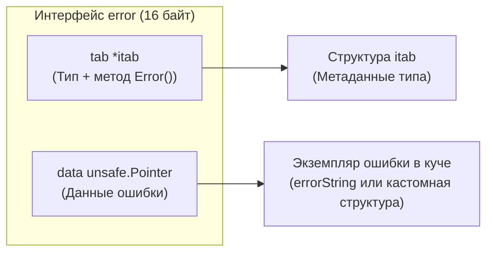
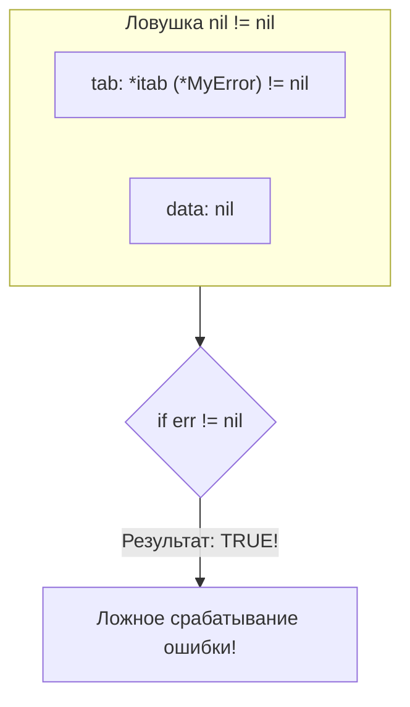
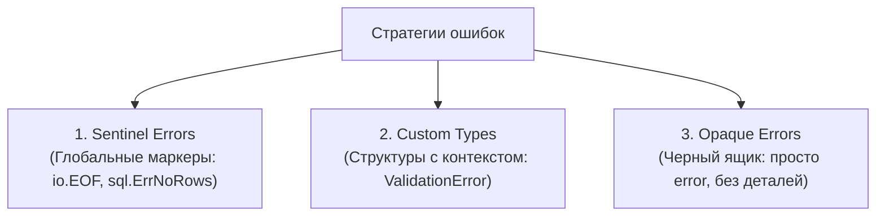
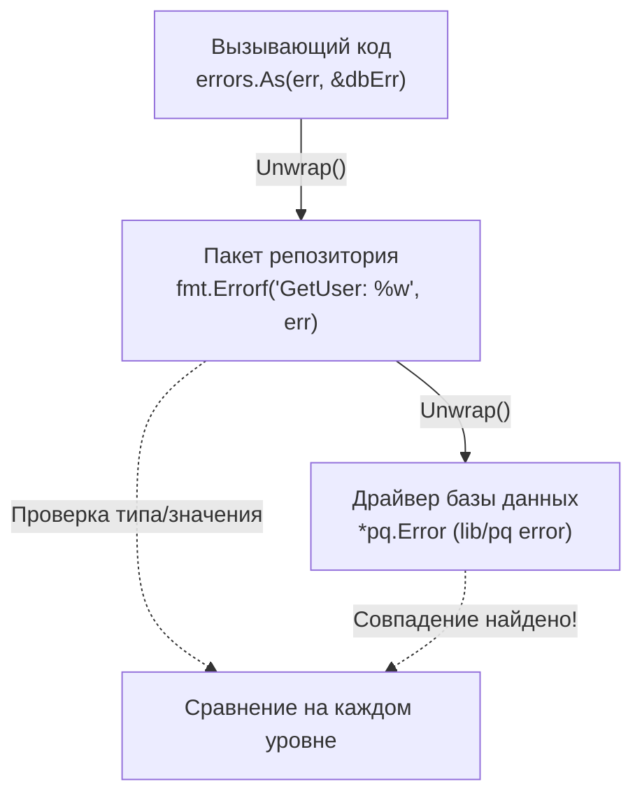

# 3. errors. Создание, оборачивание и сравнение ошибок

> *«Ошибки — это обычные значения. Программы работают со значениями, и решения принимаются именно на их основе».*    
> — Роб Пайк

## Философия обработки ошибок в Go

В отличие от языков с исключениями (Java, C#, Python, PHP), где нормальный контроль потока выполнения может быть внезапно разорван скрытым выбросом `throw` в любой точке стека вызовов, Go использует фундаментально иную, предельно честную модель: **ошибки — это обычные значения**. Они возвращаются функциями как штатный результат работы, передаются как аргументы и проверяются явным `if err != nil`.

Это не просто эстетическое предпочтение создателей языка, а глубокий архитектурный выбор:
* **Предсказуемость:** Каждый потенциальный сбой обязан быть обработан прямо на уровне вызывающего кода. Нет скрытых прыжков через 20 уровней стека в неизвестный блок `catch`.
* **Mechanical Sympathy:** Компилятор и процессор могут агрессивно оптимизировать машинный код. Отсутствие механизма раскрутки стека (Stack Unwinding) и громоздких таблиц исключений (DWARF Exception Tables) делает счастливым предсказатель ветвлений процессора (Branch Predictor).
* **Контроль:** Разработчик полностью контролирует контекст ошибки, трассировку и стратегию восстановления на каждом этапе.

Однако написание надежного кода требует четкого понимания внутренней механики интерфейсов рантайма, цены аллокаций памяти и строгих правил работы с цепочками ошибок.

> [!info] Под капотом
> Интерфейс `error` в стандартной библиотеке Go — это минимализм, доведенный до абсолюта. В спецификации языка он определен всего одной строчкой:
> ```go
> type error interface {
>     Error() string
> }
> ```
> Несмотря на этот внешний минимализм, передача любого значения через интерфейс запускает в рантайме механизм упаковки типов (`runtime.convT2E`), который упаковывает данные и таблицу методов в двухсловную структуру `runtime.iface`.

---

## 1. Интерфейс error и его устройство в памяти

В оперативной памяти интерфейс `error` физически представлен структурой `iface` (размером 16 байт на 64-битной архитектуре):

```go
type iface struct {
    tab  *itab          // Указатель на таблицу методов и тип
    data unsafe.Pointer // Указатель на конкретные данные в памяти
}
```



Когда функция завершается успешно и не возвращает ошибку, она возвращает `nil`. Для интерфейса это означает, что **оба указателя** (`tab` и `data`) равны `nil`. 

Именно здесь кроется самая коварная и знаменитая ловушка языка Go, на которой регулярно спотыкаются даже опытные инженеры.

### Проблема: nil != nil

Рассмотрим классический баг, ломающий production-системы:

```go
type MyError struct {
    Code int
}

func (e *MyError) Error() string {
    return fmt.Sprintf("error code: %d", e.Code)
}

func doWork() error {
    var p *MyError = nil // Типизированный указатель со значением nil
    // ...какая-то логика без ошибок...
    return p // ВНИМАНИЕ: возвращаем *MyError в сигнатуру error!
}

func main() {
    err := doWork()
    if err != nil {
        fmt.Println("Ошибка есть!", err) // ЭТОТ КОД СРАБОТАЕТ!
    }
}
```

**Почему это происходит?**  
Интерфейс в Go считается равным `nil` **только тогда, когда и `tab`, и `data` равны `nil`**.  
Когда мы вернули переменную `p`, рантайм сконструировал `iface`, где:
* `tab` указывает на валидную таблицу методов типа `*MyError` (`tab != nil`).
* `data` равна `nil`.

Поскольку поле `tab` заполнено, выражение `err != nil` возвращает `true`! Программа считает, что произошла ошибка, хотя внутри лежит пустой указатель. Попытка вызвать `err.Error()` может привести к панике разыменования нулевого указателя (`nil pointer dereference`).



> [!warning] Ловушка / Gotcha: Возврат типизированного nil
> **Никогда не объявляйте локальную переменную конкретного типа ошибки, если функция возвращает интерфейс `error`!**  
> Если функция может завершиться успешно, всегда возвращайте `nil` напрямую:
> ```go
> // ПЛОХО
> var err *MyError = nil
> return err
> 
> // ХОРОШО
> if failed {
>     return &MyError{Code: 500}
> }
> return nil // Явный нетипизированный nil
> ```
> Статический анализатор `staticcheck` (правило `ST1005`) умеет автоматически находить эту проблему на этапе CI/CD.

---

## 2. Три стратегии работы с ошибками

В зависимости от архитектурных требований к обработке сбоев, в Go выделяют три основные стратегии:



### Стратегия 1. Sentinel Errors (Маркерные ошибки)
Глобальные переменные-синглтоны, представляющие конкретное, ожидаемое состояние системы:

```go
var ErrNotFound = errors.New("пользователь не найден")

// Использование
if errors.Is(err, ErrNotFound) {
    return http.StatusNotFound, nil
}
```
* **Плюсы:** Предельная простота, мгновенное сравнение по адресу памяти (pointer comparison), ноль дополнительных аллокаций.
* **Минусы:** Создают жесткую связь между пакетами (coupling), не позволяют передать динамический контекст (например, какой именно `ID` не был найден).

### Стратегия 2. Custom Error Types (Пользовательские типы)
Структуры, реализующие интерфейс `error` и несущие в себе богатый набор метаданных:

```go
type ValidationError struct {
    Field   string
    Message string
}

func (e *ValidationError) Error() string {
    return fmt.Sprintf("validation failed: %s - %s", e.Field, e.Message)
}

// Использование
var valErr *ValidationError
if errors.As(err, &valErr) {
    log.Printf("Invalid field: %s", valErr.Field)
}
```
* **Плюсы:** Передача структурированного контекста (поля валидации, HTTP-статусы, таймстемпы), типобезопасное извлечение через `errors.As`.
* **Минусы:** Требуют больше кода, выставляют внутренние типы пакета наружу.

### Стратегия 3. Opaque Errors (Непрозрачные ошибки)
Функция возвращает просто `error`. Вызывающий код не интересуется деталями: он проверяет только `err != nil` и реагирует одинаково (логирует ошибку и отдает клиенту HTTP 500).
* **Плюсы:** Идеальная инкапсуляция, нулевая связанность модулей.
* **Минусы:** Невозможно дифференцировать обработку сбоев на уровне API.

> [!tip] Собеседование
> **Вопрос:** Когда архитектор должен выбрать Sentinel Error, а когда Custom Error Type?  
> **Ответ:** Sentinel Error выбирается, когда состояние однозначно, глобально, не требует динамических параметров и должно сравниваться по значению (классические примеры: `io.EOF`, `sql.ErrNoRows`, `context.Canceled`). Custom Type необходим, когда вызывающему коду требуются детали для принятия решения (список невалидных полей, код ошибки базы данных, количество повторных попыток).

---

## 3. Цепочки ошибок и механизмы Go 1.13+

Исторически для оборачивания ошибок с сохранением контекста сообщество Go использовало внешнюю библиотеку `github.com/pkg/errors` Дейва Чейни. Начиная с версии Go 1.13, этот механизм был официально стандартизирован: функция `fmt.Errorf` получила поддержку глагола `%w` (wrap).

### Механика Unwrap
Обертка над ошибкой — это любая структура, реализующая метод `Unwrap() error`.  
Функции `errors.Is` и `errors.As` умеют рекурсивно обходить цепочку оберток (матрешку), спускаясь до первопричины (Root Cause).



### Пример идиоматичного оборачивания

```go
func GetUser(ctx context.Context, id int64) (*User, error) {
    row := db.QueryRowContext(ctx, "SELECT name, email FROM users WHERE id = ?", id)
    var u User
    if err := row.Scan(&u.Name, &u.Email); err != nil {
        // Оборачиваем, добавляя контекст, но сохраняя оригинал для errors.Is/As
        return nil, fmt.Errorf("repository.GetUser id=%d: %w", id, err)
    }
    return &u, nil
}
```

### Go 1.20: errors.Join и множественная распаковка

В Go 1.20 появился метод `errors.Join`, решающий давнюю проблему объединения нескольких независимых ошибок в одну (например, при валидации сложных форм или закрытии нескольких ресурсов через `Close()` в блоке `defer`):

```go
var errs []error
// ... накопление ошибок в цикле ...
if len(errs) > 0 {
    return errors.Join(errs...)
}
```

Внутри `errors.Join` создает структуру, реализующую метод `Unwrap() []error`. Функции `errors.Is` и `errors.As` умеют обходить дерево ошибок, проверяя каждую ветку.

---

## 4. Mechanical Sympathy и цена аллокаций

Каждая созданная ошибка — это выделение памяти. В высоконагруженных бэкенд-сервисах (10k–100k RPS) неосторожное создание ошибок в горячих путях приводит к взрывному росту нагрузки на Garbage Collector и деградации задержек (`GC Assist Time`).

### Внутренние аллокации
1. `errors.New("текст")`: Возвращает указатель на структуру `*errors.errorString`. Строковый литерал лежит в read-only сегменте бинарника, аллоцируется лишь крошечная оболочка (16–24 байта в куче).
2. `fmt.Errorf("текст %w", err)`: Парсит строку формата, выделяет память под результирующую строку и создает новую структуру `wrapError`. Это **в разы дороже**, чем `errors.New`.

### Оптимизация для Hot Paths

Если ошибка в цикле является ожидаемым сигналом (например, признак окончания данных), никогда не используйте `fmt.Errorf`:

```go
// ❌ Плохо: создает новую аллокацию и рефлексию на каждой итерации
for {
    if err := read(); err != nil {
        return fmt.Errorf("read chunk %d: %w", i, err)
    }
}

// ✅ Хорошо: используем готовый sentinel-синглтон
if errors.Is(err, io.EOF) {
    break // io.EOF — глобальный синглетон, проверка за доли наносекунды
}
```

> [!info] Под капотом
> **Сравнение с исключениями C++/Java:**  
> Выброс исключения (`throw`) в C++ или Java требует аварийной раскрутки стека (Stack Unwinding), поиска подходящего блока `catch` и сброса регистров. Это занимает сотни и тысячи наносекунд, полностью разрушая конвейер инструкций CPU.  
> В Go проверка `if err != nil` — это обычное сравнение регистра с нулем (инструкция `TESTQ` / `JNE` в x86-64). Если ошибки происходят редко, предсказатель ветвлений процессора отрабатывает эту инструкцию с нулевыми задержками.

---

## 5. Ловушки и хардкорные вопросы с собеседований

| Ловушка | В чем опасность | Как исправить |
|---|---|---|
| `errors.As` без указателя | `errors.As(err, e)` успешно скомпилируется, но вызовет панику в рантайме. | Второй аргумент **всегда** обязан быть указателем: `errors.As(err, &target)`. |
| Сравнение через `==` | Работает только для простых sentinel-ошибок. Если ошибка была обернута через `%w`, оператор `==` вернет `false`. | Всегда используйте `errors.Is(err, target)`. |
| Потеря контекста | Вызов `err.Error()` и возврат новой ошибки `errors.New(err.Error())`. | Цепочка разрывается, `errors.Is` и `errors.As` больше не смогут найти исходную причину. Передавайте `error` как есть. |
| Дублирование сообщений | `fmt.Errorf("failed: %w", err)` + логирование того же текста в двух местах. | Логируйте на границе обработки. Возвращайте ошибки чистыми: ровно один раз на границе системы (в middleware HTTP-хэндлера или фоновом воркере). |

> [!tip] Собеседование
> **Вопрос:** Почему `errors.As` требует указатель на цель, а `errors.Is` принимает значение?  
> **Ответ:** `errors.Is` выполняет операцию проверки на равенство: он сравнивает значения указателей или вызывает метод `Is(error) bool`. Ему не нужно модифицировать переданную переменную.  
> `errors.As` выполняет операцию **извлечения**: при нахождении ошибки нужного типа он должен перезаписать значение целевой переменной, чтобы вызывающий код получил к ней типизированный доступ. В Go передача параметров происходит по значению (копированием), поэтому без указателя записать результат в переменную вызывающего кода технически невозможно.

---

## 6. Сравнение с экосистемами других языков

| Аспект | Java / C# / Python | Go |
|---|---|---|
| **Механизм** | `try-catch-finally`, исключения как объекты классов | Явный возврат значений, `error` как интерфейс |
| **Стоимость** | Высокая: раскрутка стека, аллокация объекта исключения, сброс branch prediction | Минимальная: проверка указателя в регистре CPU, линейный поток инструкций |
| **Стек вызовов (Stack Trace)** | Генерируется автоматически JVM/CLR при создании исключения | Отсутствует в `stdlib`. Для продакшена используют `runtime/debug.Stack()`, `runtime.Callers` или внешние либы, но это дорого. |
| **Игнорирование** | Легко «заглушить» пустым блоком `catch (Exception e) {}` | Компилятор запрещает неиспользуемые переменные; игнорирование через `_` сразу видно на код-ревью и подсвечивается линтерами. |

---

## Итог

1. **Ошибки в Go — это данные.** С ними работают так же, как с числами или строками: передают через `return` и проверяют явно.
2. **Помните про `iface != nil`.** Возвращайте `nil`, а не `&MyError{}` со значением `nil`.
3. **Используйте стандартные инструменты Go 1.13+:** Оборачивайте ошибки через `fmt.Errorf("%w", err)`, сравнивайте через `errors.Is`, извлекайте типы через `errors.As`.
4. **Объединяйте ошибки через `errors.Join` (Go 1.20+):** Идеально подходит для batch-операций и обработки ошибок закрытия ресурсов в `defer`.
5. **Помните о цене аллокаций:** В горячих циклах не генерируйте строки через `fmt.Errorf`, а используйте готовые sentinel-ошибки (`io.EOF`).

Понимание работы с ошибками закладывает прочный фундамент для потоковой обработки данных. В следующей статье мы перейдем к сердцу всей подсистемы ввода-вывода в Go и разберем два величайших интерфейса стандартной библиотеки: [[4. io. Reader, Writer и философия потоков в Go]].