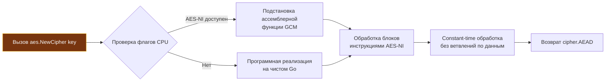

## Философия безопасности и постоянной сложности

Криптография — одна из тех редких инженерных дисциплин, где малейшая небрежность в коде оборачивается не просто падением процесса, а катастрофической компрометацией всей системы. Ошибка на один байт в буфере или лишняя миллисекунда в ветвлении алгоритма могут открыть злоумышленнику доступ к закрытым ключам и базам данных.

Пакет `crypto` и его подпакеты в стандартной библиотеке Go спроектированы вокруг жесткого прагматичного принципа: **безопасность не должна зависеть от осторожности разработчика**. 

Во многих классических библиотеках (например, OpenSSL прошлых лет) устаревшие, криптографически взломанные алгоритмы десятилетиями оставались доступными ради обратной совместимости. Разработчик мог по ошибке выбрать `DES` или `MD5`, и компилятор молча одобрял это решение. Стандартная библиотека Go действует иначе: она скрывает или вытесняет сломанные примитивы (`MD5`, `SHA1`, `DES`) и навязывает строгие современные стандарты по умолчанию.

Ключевая архитектурная особенность стандартной библиотеки — **гарантия постоянной сложности выполнения** (constant-time execution). Представьте взломщика сейфов, который прикладывает медицинский стетоскоп к дверце и слушает щелчки диска: чем ближе он к правильной цифре, тем раньше раздается щелчок. Точно так же работает атака по сторонним каналам (side-channel attacks, в частности timing attacks): измеряя наносекунды отклика сервера при проверке подписи, злоумышленник байт за байтом восстанавливает секретный ключ. Операции сравнения, расшифровки и проверки подписи в Go реализованы так, что время их выполнения строго инвариантно относительно секретных данных.

> [!info] Под капотом
> В Go криптография — это не набор абстрактных математических формул, а прямая интеграция с инструкциями процессора и строгими интерфейсами. Пакеты `crypto/sha256`, `crypto/aes`, `crypto/hmac` реализуют базовые контракты `hash.Hash`, `cipher.Block`, `cipher.AEAD`. Компилятор линкует их с высокооптимизированными ассемблерными реализациями, которые используют аппаратные расширения CPU, не требуя от разработчика ручного управления буферами или выравниванием памяти.

---

## Under the hood. Ассемблер, аппаратное ускорение и защита от атак

Инженеры Go не полагаются на наивные интерпретируемые алгоритмы или обобщенный высокоуровневый код там, где критична скорость и безопасность. Все ключевые криптографические подпакеты содержат специализированные ассемблерные реализации для архитектур `x86_64` (AMD64) и `ARM64`.

При инициализации `sha256.New()` или `aes.NewCipher(key)` рантайм Go проверяет аппаратные возможности процессора через внутренние механизмы пакета `runtime`. Если процессор поддерживает специализированные инструкции `AES-NI`, `SHA Extensions` (на x86) или `Crypto Extensions` (на ARM), рантайм на лету подставляет указатели на оптимизированные ассемблерные функции вместо программной реализации на чистом Go:



### Гарантии Constant-Time и пакет `crypto/subtle`

Почему обычные операторы сравнения (`==` или `bytes.Equal`) категорически непригодны для секретных данных? 

Взгляните на реализацию стандартного сравнения байтовых срезов:
```go
// Так работает bytes.Equal:
for i := 0; i < len(a); i++ {
    if a[i] != b[i] {
        return false // Выход при первом же несовпадении!
    }
}
```
Если первый байт неверен, функция завершится за 1 итерацию. Если верны первые 15 байт из 16, функция совершит 15 итераций, прежде чем вернуть `false`. Разница составляет десятки процессорных тактов. Сетевой джиттер частично сглаживает задержки, но миллион статистических запросов через локальную сеть надежно выявляет эту разницу.

Для защиты от тайминг-атак Go предоставляет пакет `crypto/subtle`. Функция `subtle.ConstantTimeCompare` выполняет побитовое XOR-сравнение **всех** байтов среза независимо от того, совпали ли они в самом начале:
```go
// Принцип работы subtle.ConstantTimeCompare:
var v byte
for i := 0; i < n; i++ {
    v |= x[i] ^ y[i]
}
return int((uint32(v)-1) >> 31)
```
Здесь нет ранних выходов (`return false`), нет условных переходов (`if`), зависящих от значений байт. Процессор не сбрасывает конвейер из-за `branch misprediction`, не меняет характер обращений к кэшу L1/L2, и время выполнения остается строго константным.

---

## Хеширование и HMAC. Верификация без утечек времени

Пакеты `crypto/sha256`, `crypto/sha512` и `crypto/hmac` предоставляют унифицированный потоковый интерфейс `hash.Hash`, являющийся расширением `io.Writer`. Это означает, что вы можете хешировать сколь угодно большие объемы данных (например, гигабайтные файлы из сети или с диска) без выделения гигантских буферов в куче:

```go
package main

import (
	"crypto/hmac"
	"crypto/sha256"
	"errors"
	"fmt"
)

// computeHMAC вычисляет код аутентификации сообщения HMAC-SHA256
func computeHMAC(secret, data []byte) ([]byte, error) {
	mac := hmac.New(sha256.New, secret)
	if _, err := mac.Write(data); err != nil {
		return nil, fmt.Errorf("write hmac: %w", err)
	}
	// Sum добавляет текущий хеш к переданному срезу (здесь nil), копирует и возвращает буфер
	return mac.Sum(nil), nil
}

// verifyHMAC безопасно сверяет вычисленную подпись с полученной
func verifyHMAC(secret, data, receivedMAC []byte) error {
	expectedMAC, err := computeHMAC(secret, data)
	if err != nil {
		return err
	}

	// ❌ ОПАСНО: bytes.Equal возвращает false при первом несовпадении!
	// if !bytes.Equal(expectedMAC, receivedMAC) { return errors.New("invalid signature") }

	// ✅ БЕЗОПАСНО: constant-time сравнение через hmac.Equal (обертка над crypto/subtle)
	if !hmac.Equal(expectedMAC, receivedMAC) {
		return errors.New("invalid signature")
	}
	return nil
}
```

> [!warning] Ловушка / Gotcha
> **Парольные хеши отсутствуют в stdlib.**
> Стандартный пакет `crypto` содержит только быстрые криптографические хеши (`SHA256`, `SHA512`). Для безопасного хеширования паролей **никогда** не используйте `SHA256` (даже с солью) напрямую! Быстрые хеши рассчитаны на вычисление сотен мегабайт в секунду — злоумышленник с современной фермой GPU переберет ваш пароль за доли секунды.
> 
> Применяйте внешние стандартные пакеты `golang.org/x/crypto/bcrypt` или `argon2`. Они реализуют алгоритмы с регулируемой сложностью по времени и памяти (memory-hard), создавая непреодолимый барьер для параллельного аппаратного перебора на ASIC и видеокартах.

---

## Симметричное шифрование. AES-GCM и запрет старых режимов

В криптографии симметричных шифров прошлых десятилетий царствовали режимы блочного шифрования `ECB` (Electronic Codebook) и `CBC` (Cipher Block Chaining). Go намеренно исключил небезопасный `ECB` из стандартного API, а использование `CBC` без внешней аутентификации признано антипаттерном.

Современным золотым стандартом является режим **AEAD** (Authenticated Encryption with Associated Data). Он не просто зашифровывает данные, но и создает криптографический тег аутентификации (MAC), гарантируя, что ни один бит шифротекста не был модифицирован в пути. В Go он представлен интерфейсом `cipher.AEAD` и конструктором `crypto/cipher.NewGCM` на базе шифра `aes.NewCipher`:

```go
package main

import (
	"crypto/aes"
	"crypto/cipher"
	"crypto/rand"
	"errors"
	"fmt"
	"io"
)

// encryptAESGCM шифрует открытый текст с помощью AES-GCM
func encryptAESGCM(plaintext, key []byte) ([]byte, error) {
	// Создаем блочный шифр AES (длина ключа 16, 24 или 32 байта для AES-128/192/256)
	block, err := aes.NewCipher(key)
	if err != nil {
		return nil, fmt.Errorf("create cipher: %w", err)
	}

	// Оборачиваем блочный шифр в режим аутентифицированного шифрования GCM
	gcm, err := cipher.NewGCM(block)
	if err != nil {
		return nil, fmt.Errorf("create GCM: %w", err)
	}

	// Nonce (Number used Once) обязан быть уникальным для каждого шифрования с данным ключом!
	nonce := make([]byte, gcm.NonceSize()) // 12 байт (96 бит) по стандарту GCM
	if _, err := io.ReadFull(rand.Reader, nonce); err != nil {
		return nil, fmt.Errorf("generate nonce: %w", err)
	}

	// Seal шифрует и аутентифицирует данные.
	// Первым аргументом передаем буфер-приемник: мы сразу префиксируем nonce к шифротексту.
	ciphertext := gcm.Seal(nonce, nonce, plaintext, nil)
	return ciphertext, nil
}

// decryptAESGCM проверяет целостность и расшифровывает сообщение
func decryptAESGCM(ciphertext, key []byte) ([]byte, error) {
	block, err := aes.NewCipher(key)
	if err != nil {
		return nil, fmt.Errorf("create cipher: %w", err)
	}

	gcm, err := cipher.NewGCM(block)
	if err != nil {
		return nil, fmt.Errorf("create GCM: %w", err)
	}

	nonceSize := gcm.NonceSize()
	if len(ciphertext) < nonceSize {
		return nil, errors.New("ciphertext too short")
	}

	// Извлекаем nonce из начала буфера и отделяем тело шифротекста
	nonce, actualCiphertext := ciphertext[:nonceSize], ciphertext[nonceSize:]
	
	// Open проверяет криптографический тег и расшифровывает открытый текст
	plaintext, err := gcm.Open(nil, nonce, actualCiphertext, nil)
	if err != nil {
		// Ошибка означает либо подделку данных, либо неверный ключ
		return nil, fmt.Errorf("decrypt/authenticate: %w", err)
	}
	return plaintext, nil
}
```

### Почему уникальность `nonce` абсолютна и бескомпромиссна?
В режиме GCM шифрование выполняется гаммированием (счетчик CTR). Если зашифровать два разных сообщения с одним и тем же ключом и одинаковым `nonce`, злоумышленник, вычислив XOR двух шифротекстов, получает XOR открытых текстов:
$$C_1 \oplus C_2 = P_1 \oplus P_2$$
Это позволяет мгновенно вскрыть передаваемую информацию и даже восстановить внутренний ключ аутентификации `H`, после чего атакующий сможет подделывать любые сообщения. Генератор `crypto/rand` обеспечивает криптографическую псевдослучайность, при которой вероятность коллизии 96-битного случайного nonce пренебрежимо мала.

---

## TLS и безопасность канала

Пакет `crypto/tls` реализует транспортную безопасность протоколов TLS 1.2 и 1.3. Начиная с современных версий Go (1.22+), конфигурация по умолчанию бескомпромиссно настроена на безопасность: минимальная поддерживаемая версия — `tls.VersionTLS12`, устаревшие и ненадежные наборы шифров отключены, а для TLS 1.3 активирована максимальная оптимизация.

```go
package main

import (
	"crypto/tls"
	"net/http"
	"time"
)

func createSecureHTTPClient() *http.Client {
	tlsConfig := &tls.Config{
		MinVersion:               tls.VersionTLS12,
		PreferServerCipherSuites: false, // В TLS 1.3 выбор набора шифров сервером не имеет значения
		SessionTicketsDisabled:   false, // Разрешаем сессионные тикеты для быстрого возобновления сессий (0-RTT/1-RTT)
	}

	transport := &http.Transport{
		TLSClientConfig:     tlsConfig,
		TLSHandshakeTimeout: 5 * time.Second,
	}

	return &http.Client{
		Transport: transport,
		Timeout:   10 * time.Second,
	}
}
```

При рукопожатии клиентская функция `tls.Dial` выполняет строгую последовательность шагов:
1. **`ClientHello`:** отправка поддерживаемых версий протокола, наборов шифров (cipher suites) и параметров обмена ключами.
2. **Асинхронное согласование cipher suite:** в TLS 1.3 вся процедура завершается всего за 1 RTT (Round Trip Time).
3. **Верификация сертификатов:** проверка цепочки доверия X.509 через системный пул доверенных корневых центров `x509`.
4. **Генерация мастер-секрета:** создание сессионных симметричных ключей на базе алгоритма Диффи-Хеллмана на эллиптических кривых.

> [!info] Под капотом
> Протокол TLS 1.3 кардинально упростил ландшафт сетевой безопасности: из него были полностью удалены уязвимый `RSA key transport`, блочные режимы `CBC` и статические `DH`. Единственным механизмом согласования ключей остался `ECDHE` (Elliptic Curve Diffie-Hellman Ephemeral), обеспечивающий **Forward Secrecy** (совершенную прямую секретность: даже компрометация закрытого ключа сервера в будущем не позволит расшифровать записанный ранее сетевой трафик). Для шифрования разрешены исключительно `AEAD`-алгоритмы. Это сократило накладные расходы рукопожатия до 1 RTT и навсегда устранило классы атак `POODLE`, `BEAST` и `Lucky13`.

---

## Mechanical Sympathy. Влияние на CPU и память

Криптографические алгоритмы — одни из самых требовательных к вычислительным ресурсам компонентов серверного бэкенда. Понимание того, как математика алгоритмов транслируется в инструкции процессора и структуры в куче, позволяет строить масштабируемые системы без скрытых бутылочных горлышек.

| Фактор | Влияние | Оптимизация |
|---|---|---|
| **Аппаратные инструкции AES-NI** | Ускоряют блочное шифрование в 5–10 раз. Затраты снижаются до ~1–2 тактов CPU на байт. | Убедитесь, что гостевые ОС в облаке или контейнерах имеют доступ к флагам CPU (`grep aes /proc/cpuinfo`). |
| **Cache Timing & Constant-Time** | Constant-time алгоритмы устраняют ветвления, предотвращая утечки через кэш L1/L2. | Алгоритмы в `crypto/subtle` и ассемблерные вставки спроектированы так, чтобы паттерн адресации памяти не зависел от секрета. |
| **Аллокации при TLS Handshake** | Каждое новое TLS-соединение аллоцирует ~10–20 КБ в куче под буферы сессии и парсинг сертификатов. | Повторно используйте соединения через Keep-Alive и пулы `http.Client`. При 10 000+ новых RPS рукопожатия становятся главным bottleneck сервиса. |
| **Нагрузка на Garbage Collector** | Непрерывный поток кратковременных `crypto/tls` сессий перегружает сборщик мусора. | Включайте `tls.Config.SessionTicketsDisabled = false` для reuse сессий, переводя полный handshake в сверхбыстрый session resumption. |

---

## Ловушки и вопросы с собеседований

Криптография в Go изобилует нюансами, которые любят проверять на собеседованиях Senior-инженеров:

| Сценарий | Проблема | Решение |
|---|---|---|
| **Повторный nonce в AES-GCM** | Полная потеря конфиденциальности и целостности. Атака восстановления ключа. | Всегда генерируйте `nonce` через `crypto/rand`. Никогда не инкрементируйте его вручную без строгого контроля счетчика. |
| **`bytes.Equal` вместо `hmac.Equal`** | Тайминг-атака позволяет злоумышленнику подобрать токен байт за байтом по задержке ответа. | Используйте только `hmac.Equal` или `subtle.ConstantTimeCompare`. |
| **TLS 1.0/1.1 в конфигурации** | Уязвимости BEAST, POODLE, отсутствие forward secrecy. | Установите `MinVersion: tls.VersionTLS12`. В современном Go старые версии протокола отключены по умолчанию. |
| **Генерация RSA-2048 в рантайме** | Генерация больших простых чисел занимает секунды CPU и требует высокой энтропии. | Генерируйте ключи при сборке/деплое, храните в Secrets Manager. В runtime для подписей предпочтителен быстрый `ECDSA-P256` или `Ed25519`. |
| **Использование `math/rand` для токенов** | Псевдослучайный генератор предсказуем (уязвимость CWE-330). | Никогда не используйте `math/rand` для безопасности. Всегда импортируйте `crypto/rand` для ключей, nonce, токенов сессий и паролей. |

> [!tip] Собеседование
> **Вопрос:** Почему режим AES-CBC считается небезопасным в современных сетевых протоколах, хотя много лет был отраслевым стандартом?
> **Ответ:** Режим CBC не обеспечивает целостность и аутентичность шифротекста (non-authenticated encryption). Злоумышленник, перехвативший трафик, может изменить биты в одном блоке шифротекста, вызвав предсказуемые изменения в следующем блоке расшифрованного открытого текста (атака bit-flipping). Кроме того, CBC уязвим к атакам типа padding oracle, если сервер возвращает разные коды ошибок или задержки при неверном заполнении блоков (padding) и неверном MAC. Режимы AEAD (AES-GCM, ChaCha20-Poly1305) устраняют обе проблемы, выполняя шифрование и аутентификацию как единую атомарную математическую операцию.
>
> **Вопрос:** Как `crypto/tls` в стандартной библиотеке Go обрабатывает проверку отзыва сертификатов (OCSP / CRL)?
> **Ответ:** По умолчанию стандартная библиотека Go **не выполняет** онлайн-запросы OCSP (Online Certificate Status Protocol) или загрузку списков отзыва CRL во время TLS handshake. Это сделано для предотвращения задержек сетевого ввода-вывода и устранения зависимости от внешних responder-серверов (которые могут стать точкой отказа). Для строгой корпоративной проверки требуется либо реализовать собственный коллбэк `VerifyPeerCertificate` в структуре `tls.Config`, либо вынести TLS-терминацию на внешний reverse-proxy (Nginx, Envoy, Traefik), поддерживающий OCSP stapling.

---

## Сравнение с экосистемами

| Язык / Платформа | Механизм | Особенности в сравнении со стандартной библиотекой Go |
|---|---|---|
| **Java** | JCA / JCE / Bouncy Castle | Плагинная архитектура на базе поставщиков (`Security.addProvider`). Чрезвычайно гибкая, но громоздкая. Требует работы с `KeyStore`. Go использует прямые, детерминированные вызовы без «провайдерной магии». |
| **Python** | `hashlib`, `cryptography` | Пакет `hashlib` быстр (написан на Си), но высокоуровневый `cryptography` требует наличия и компиляции OpenSSL. Global Interpreter Lock (GIL) может блокировать параллельные криптографические операции. Go обходится нулевыми внешними зависимостями. |
| **C++** | OpenSSL / libsodium / BoringSSL | Дает абсолютный контроль над памятью и предельную скорость, но чреват ошибками работы с указателями, переполнениями буфера и частыми CVE. Go сочетает ассемблерную производительность критических секций с безопасностью памяти и встроенным GC. |
| **Go** | `crypto/*` | Нулевые C-зависимости, автоматическое аппаратное ускорение (AES-NI, SHA-NI), лаконичные интерфейсы (`io.Writer`, `cipher.AEAD`), безопасные дефолты и встроенная защита от timing-атак. |

---

## Итог

1. Криптография в Go построена на принципах constant-time алгоритмов и прямого аппаратного ускорения (инструкции `AES-NI`). Безопасность заложена на уровне стандартного API, а не отдана на откуп конфигурационным флагам.
2. Для проверки токенов, HMAC и криптографических хешей всегда используйте `hmac.Equal` или `subtle.ConstantTimeCompare`. Обычные проверки равенства байт подвержены тайминг-атакам.
3. Симметричное шифрование должно использовать исключительно режим AEAD (`AES-GCM` или `ChaCha20-Poly1305`). Случайный `nonce` обязан генерироваться через криптографический генератор `crypto/rand` и никогда не повторяться для одного ключа.
4. Протокол TLS 1.2 — минимальный безопасный стандарт, а TLS 1.3 обеспечивает рукопожатие за 1 RTT и безусловную Forward Secrecy по умолчанию.
5. Стандартная библиотека сознательно не содержит хешеров паролей. Для хранения учетных данных используйте алгоритмы с регулируемой вычислительной сложностью из суб-репозитория: `golang.org/x/crypto/bcrypt` или `argon2`.
6. Криптографические операции создают существенную нагрузку на CPU и память. При проектировании высоконагруженных шлюзов обязательно используйте сессионные тикеты TLS (`SessionTicketsDisabled: false`) и пулы долгоживущих TCP/HTTP-соединений.

Разобрав фундаментальные криптографические примитивы, мы переходим к интеграции с системами хранения данных. Как Go стандартизирует взаимодействие с реляционными базами, управляет пулами соединений и обеспечивает транзакционную целостность? В следующей статье мы изучим стандартный драйверный слой: [[39. database_sql. Универсальный интерфейс к SQL-базам]].