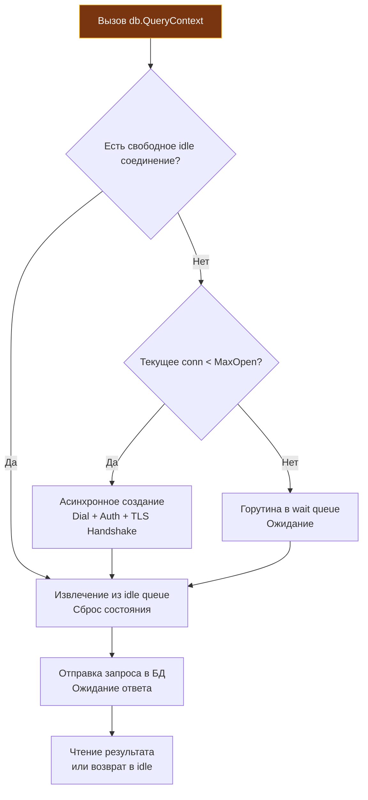

## Философия абстракции и пула соединений

В большинстве языков программирования взаимодействие с реляционными базами данных долгое время напоминало Дикий Запад: каждая СУБД (PostgreSQL, MySQL, Oracle, SQLite) требовала собственной библиотеки с уникальным API, собственными правилами обработки ошибок и причудливыми способами управления сетевыми сокетами. Если проекту требовалось сменить СУБД или добавить поддержку нескольких баз данных, приходилось переписывать существенную часть прикладного кода.

Пакет `database/sql` в Go решает эту задачу с классической элегантностью Bell Labs: он отделяет **интерфейс доступа к данным** от **конкретной реализации сетевого протокола**. 

`database/sql` — это не драйвер для базы данных, а стандартизированная абстракция и высоконадежный менеджер пула соединений. Он предоставляет унифицированный API для выполнения запросов, транзакций и сканирования результатов в структуры Go. Вся специфика конкретной СУБД (бинарные протоколы проводов, кодирование типов, TLS-аутентификация) вынесена во внешние пакеты-драйверы, реализующие интерфейс `database/sql/driver`.

Для профессионального бэкенд-инженера глубокое понимание `database/sql` выходит далеко за рамки тривиальных вызовов `Exec` и `Query`. Это знание того, как устроена координация горутин внутри пула, как база данных реагирует на отмену запросов через `context.Context`, как не исчерпать файловые дескрипторы операционной системы и почему неправильная конфигурация пула способна парализовать высоконагруженный кластер каскадным отказом.

> [!info] Под капотом
> Пакет `database/sql` не содержит ни строчки кода для разбора бинарных пакетов PostgreSQL или MySQL. Он полагается на интерфейс `driver.Driver`, который регистрируется драйвером через побочный эффект в функции `init()` стороннего пакета (например, `_ "github.com/lib/pq"` или `_ "github.com/go-sql-driver/mysql"`). При вызове `sql.Open()` рантайм лишь проверяет, что драйвер с указанным именем зарегистрирован, и валидирует DSN (Data Source Name). Сама структура `sql.DB` **не открывает сетевое соединение сразу**. Подключение происходит лениво (lazy-connect), в момент выполнения первого реального запроса.

---

### 1. Under the hood: `sql.DB` как менеджер пула

Самое распространенное заблуждение новичка — считать `*sql.DB` одним сетевым соединением к базе данных. На самом деле `sql.DB` — это долгоживущий, потокобезопасный **менеджер пула соединений** (`connPool`). Создавать экземпляр `sql.DB` на каждый HTTP-запрос — грубейшая архитектурная ошибка: `sql.DB` создается один раз при старте приложения и разделяется между всеми горутинами.

Внутренне менеджер пула координирует работу через мьютексы и внутренние структуры данных:
1. **Idle Queue**: очередь простаивающих открытых соединений, готовых к мгновенному повторному использованию без накладных расходов на рукопожатие.
2. **Wait Queue**: список ожидающих горутин. Если лимит `MaxOpenConns` исчерпан, горутина не падает с ошибкой, а паркуется в очереди ожидания, пока другое соединение не освободится.
3. **New Conn Channel**: внутренняя логика асинхронного открытия новых TCP-сокетов, если пул еще не достиг максимального лимита.



Когда горутина вызывает метод запроса:
- Менеджер пула проверяет `Idle Queue`. Если свободное соединение найдено, оно извлекается и привязывается к текущей операции.
- Если свободных соединений нет, но общее количество меньше `MaxOpenConns`, инициируется сетевой вызов `Dial`, аутентификация и TLS Handshake.
- Если достигнут предел `MaxOpenConns`, горутина блокируется в `Wait Queue` до освобождения любого соединения или истечения тайм-аута переданного `context.Context`.

---

### 2. Mechanical Sympathy: TCP, FD и давление на GC

Пул соединений с базой данных находится на стыке приложения, операционной системы и сетевой инфраструктуры. Непонимание низкоуровневых механизмов приводит к трудноуловимым сбоям в production:

* **Файловые дескрипторы (File Descriptors, FD):** Каждое TCP-соединение к базе данных занимает один файловый дескриптор в ядре ОС. Значение `MaxOpenConns` должно быть строго сбалансировано с лимитом `ulimit -n` процесса, оставляя достаточный запас для входящих клиентских HTTP-сокетов, файлов конфигураций и пайпов логов.
* **Состояние TCP `TIME_WAIT`:** Если пул настроен некорректно (например, `MaxIdleConns = 0`), Go будет закрывать соединение после каждого запроса. В результате ядро Linux переведет тысячи сокетов в состояние `TIME_WAIT` (которое по стандарту длится 60 секунд), исчерпав диапазон локальных эфемерных портов. Пул соединений решает эту проблему, сохраняя сокеты открытыми.
* **Время жизни соединения (`ConnMaxLifetime`):** Промежуточные сетевые устройства (брандмауэры, NAT-шлюзы, AWS NLB) часто молча сбрасывают неактивные TCP-сессии по таймауту без отправки TCP RST. Приложение пытается отправить запрос в «мертвый» сокет и получает ошибку `broken pipe` или зависает. Настройка `SetConnMaxLifetime` гарантирует, что соединение будет закрыто и переоткрыто приложением до того, как его разорвет сетевое оборудование.
* **Аллокации и нагрузка на GC:** Метод `rows.Next()` последовательно наполняет буферы драйвера данными из сетевого потока. Если сканировать данные в новые переменные на каждой итерации внутри гигантского цикла выборки, сборщик мусора испытает колоссальное давление. Переиспользование структур при вызове `Scan` существенно снижает темп аллокаций.

---

### 3. Идиоматичное использование и обработка ошибок

Рассмотрим классический пример безопасного выполнения SQL-запроса с получением одной строки:

```go
package main

import (
	"context"
	"database/sql"
	"errors"
	"fmt"
	"time"
)

type User struct {
	ID    int64
	Name  string
	Email string
}

func getUserByID(ctx context.Context, db *sql.DB, id int64) (*User, error) {
	// QueryRowContext оптимизирован для запросов, возвращающих ровно одну строку
	row := db.QueryRowContext(ctx, "SELECT name, email FROM users WHERE id = $1", id)
	
	var u User
	u.ID = id

	// Scan копирует колонки из строки в целевые переменные через указатели
	if err := row.Scan(&u.Name, &u.Email); err != nil {
		if errors.Is(err, sql.ErrNoRows) {
			// Отсутствие строки — штатная бизнес-ситуация, а не сбой инфраструктуры
			return nil, nil
		}
		return nil, fmt.Errorf("scan user: %w", err)
	}
	return &u, nil
}
```

А вот так выглядит идиоматичная работа с выборкой произвольного количества строк:

```go
func listActiveUsers(ctx context.Context, db *sql.DB) ([]User, error) {
	// db.Query возвращает итератор *sql.Rows
	rows, err := db.QueryContext(ctx, "SELECT id, name, email FROM users WHERE active = true")
	if err != nil {
		return nil, fmt.Errorf("query active users: %w", err)
	}
	// КРИТИЧЕСКИ ВАЖНО: гарантируем освобождение сетевого соединения обратно в пул
	defer rows.Close()

	var users []User
	for rows.Next() {
		var u User
		if err := rows.Scan(&u.ID, &u.Name, &u.Email); err != nil {
			return nil, fmt.Errorf("scan user row: %w", err)
		}
		users = append(users, u)
	}

	// ОБЯЗАТЕЛЬНО: проверяем, не завершился ли цикл rows.Next() из-за сетевой ошибки
	if err := rows.Err(); err != nil {
		return nil, fmt.Errorf("rows iteration error: %w", err)
	}

	return users, nil
}
```

> [!warning] Ловушка / Gotcha
> **Забытый `rows.Close()` или непрочитанные строки.**
> При вызове `db.Query()` сетевое соединение извлекается из пула и монопольно резервируется за объектом `*sql.Rows` до тех пор, пока весь результирующий набор не будет вычитан до конца или закрыт явно.
> 
> Если вы выйдете из функции из-за ошибки в середине цикла обработки, не вызвав `rows.Close()`, соединение **никогда не вернется в пул**. При регулярном повторении ошибки пул свободных соединений будет исчерпан за считанные минуты, и все последующие запросы к базе намертво повиснут в состоянии deadlock. Всегда ставьте `defer rows.Close()` сразу после успешной проверки `err == nil`!

---

### 4. Контекст и управление временем жизни

Все современные методы `database/sql` принимают `context.Context`: `QueryContext`, `QueryRowContext`, `ExecContext`, `BeginTx`, `PingContext`.

Интеграция с контекстом — ключевой защитный механизм бэкенда. Если пользователь прерывает HTTP-запрос (закрывает браузер или мобильное приложение), HTTP-сервер закрывает контекст запроса. Пакет `database/sql` мгновенно регистрирует сигнал `ctx.Done()`, прерывает ожидание свободного соединения в очереди пула и отправляет драйверу команду на разрыв или отмену запроса на уровне протокола БД. Это спасает сервер БД от «запросов-зомби», сжигающих CPU и блокирующих таблицы ради данных, которые клиенту больше не нужны.

| Сценарий | Проблема | Решение |
|---|---|---|
| **`sql.Open` без `db.Ping()`** | `sql.Open` проверяет только корректность имени драйвера. Если хост БД недоступен или пароль неверен, ошибка всплывет только при первом пользовательском запросе. | Вызывайте `db.PingContext(ctx)` сразу после `sql.Open` для fail-fast инициализации сервиса. |
| **`MaxIdleConns` > `MaxOpenConns`** | Нелогичная конфигурация: если `MaxIdleConns` больше `MaxOpenConns`, библиотека автоматически уменьшит `MaxIdleConns` до лимита открытых сокетов. | Всегда соблюдайте соотношение: `MaxIdleConns <= MaxOpenConns`. Рекомендуется держать их близкими по значению. |
| **Использование `QueryRow` для 0 строк** | `QueryRow` всегда возвращает `*Row` (никогда не возвращает `err` в момент вызова). Ошибка `sql.ErrNoRows` обнаруживается только при последующем вызове `row.Scan()`. | Всегда вызывайте `Scan` и проверяйте `errors.Is(err, sql.ErrNoRows)`. Это штатный маркер отсутствия данных. |
| **Сканирование `NULL` в обычный `string`** | Если в колонке БД находится `NULL`, драйвер вернет ошибку `converting NULL to string is unsupported`. | Используйте обертки `sql.NullString`, `sql.NullInt64`, указатели (`*string`) или драйвер-специфичные типы. |
| **Параметр `SetConnMaxLifetime` не настроен** | Соединения простаивают часами, промежуточные NAT/firewall разрывают их, и первые запросы после простоя падают с `broken pipe`. | Всегда задавайте `SetConnMaxLifetime` (обычно от 1 до 5 минут) в облачных и контейнерных окружениях. |

> [!tip] Собеседование
> **Вопрос:** В чем принципиальная разница между `db.Query()` и `db.QueryRow()` на уровне управления ресурсами?
> **Ответ:** `Query()` возвращает `*Rows` (итератор `*sql.Rows` для выборки от 0 до N строк). Он требует от разработчика явного вызова `defer rows.Close()`, чтобы вернуть сокет в пул. 
> `QueryRow()` оптимизирован для точечных запросов, возвращающих не более одной строки (например, по первичному ключу). Он возвращает `*Row` (`*sql.Row`), который лениво ожидает вызова `.Scan()`. При вызове `Scan()` он считывает единственную строку, немедленно освобождает и закрывает внутренний курсор и возвращает соединение в пул соединений. Под капотом `QueryRow` также использует `*Rows`, но автоматически закрывает его после `Scan`, предотвращая утечки соединений. Если же разработчик вызовет `QueryRow()`, но забудет вызвать `Scan()`, соединение останется заблокированным в пуле до срабатывания финализатора GC.
>
> **Вопрос:** Почему `database/sql` не кеширует подготовленные выражения (prepared statements) автоматически для каждого вызова `Query` или `Exec`?
> **Ответ:** Подготовка выражения на стороне сервера БД требует выделения дескриптора стейтмента в памяти СУБД. В пуле из 50 соединений подготовленный запрос пришлось бы подготавливать на каждом из 50 сокетов отдельно. Автоматическое кеширование всех запросов привело бы к колоссальному расходу оперативной памяти на сервере базы данных и проблемам инвалидации планов выполнения при изменении схемы данных. Go дает разработчику явный контроль: метод `db.Prepare()` создает стейтмент, автоматически пересоздаваемый на нужном соединении при необходимости.

---

### 5. Сравнение с экосистемами других языков

| Язык / Платформа | Механизм | Особенности в сравнении со стандартной библиотекой Go |
|---|---|---|
| **Java** | JDBC + внешний Connection Pool (HikariCP) | Спецификация JDBC определяет драйверы, но не включает пул соединений в стандартную поставку. Требуется внешняя тяжелая библиотека (HikariCP). Go изначально предоставляет эталонный пул прямо в коробке. |
| **Python** | DB-API 2.0 + SQLAlchemy / asyncpg | DB-API 2.0 синхронен и блокирует поток ОС; GIL мешает конкурентности. Для асинхронности требуются отдельные драйверы (`asyncpg`) и сторонние пулы. Go прозрачно мультиплексирует запросы через горутины и единый `sql.DB`. |
| **PHP** | PDO | Из-за модели исполнения PHP (share-nothing per-request) хранить пул соединений в памяти скрипта невозможно. Требуются внешние проксирующие демоны вроде `pgbouncer`. Go держит долгоживущий пул в оперативной памяти серверного процесса. |
| **Go** | `database/sql` | Единый контракт для всех СУБД, встроенный масштабируемый пул соединений, нативная поддержка `context.Context` для отмены запросов, ленивое подключение (`lazy-connect`) и нулевые внешние C-зависимости. |

---

### Итог

1. `database/sql` — это высокоуровневый стандартизированный интерфейс и менеджер пула, а не драйвер. Вся низкоуровневая специфика СУБД реализуется внешними пакетами через интерфейс `driver.Driver`.
2. Функция `sql.Open` не открывает сетевое подключение мгновенно. Соединения открываются лениво по требованию. Для проверки физической доступности БД при старте приложения всегда вызывайте `db.PingContext(ctx)`.
3. Структура `sql.DB` управляет пулом соединений. Грамотная настройка параметров `SetMaxOpenConns`, `SetMaxIdleConns` и `SetConnMaxLifetime` является обязательным условием надежности и предсказуемости бэкенда под нагрузкой.
4. Для всех запросов, возвращающих набор строк (`db.Query`), безусловно используйте `defer rows.Close()` и обязательно проверяйте `rows.Err()` после выхода из цикла `rows.Next()`.
5. Повсеместно используйте методы с поддержкой `context.Context`. Это гарантирует прерывание сетевых операций в БД при отмене клиентских запросов и тайм-аутах.
6. Для работы со значениями `NULL` в реляционных таблицах применяйте типы семейства `sql.Null*` (`sql.NullString`, `sql.NullInt64`) или указатели соответствующих базовых типов.

Понимание высокоуровневого интерфейса `database/sql` открывает путь к глубокой оптимизации взаимодействия с СУБД. Как рантайм управляет пулом, как работают транзакции на уровне протокола и почему подготовленные выражения могут как ускорить, так и замедлить систему? В следующей статье мы разберем механику под капотом: [[40. database_sql под капотом. Pooling, Tx, Prepared Statement]].