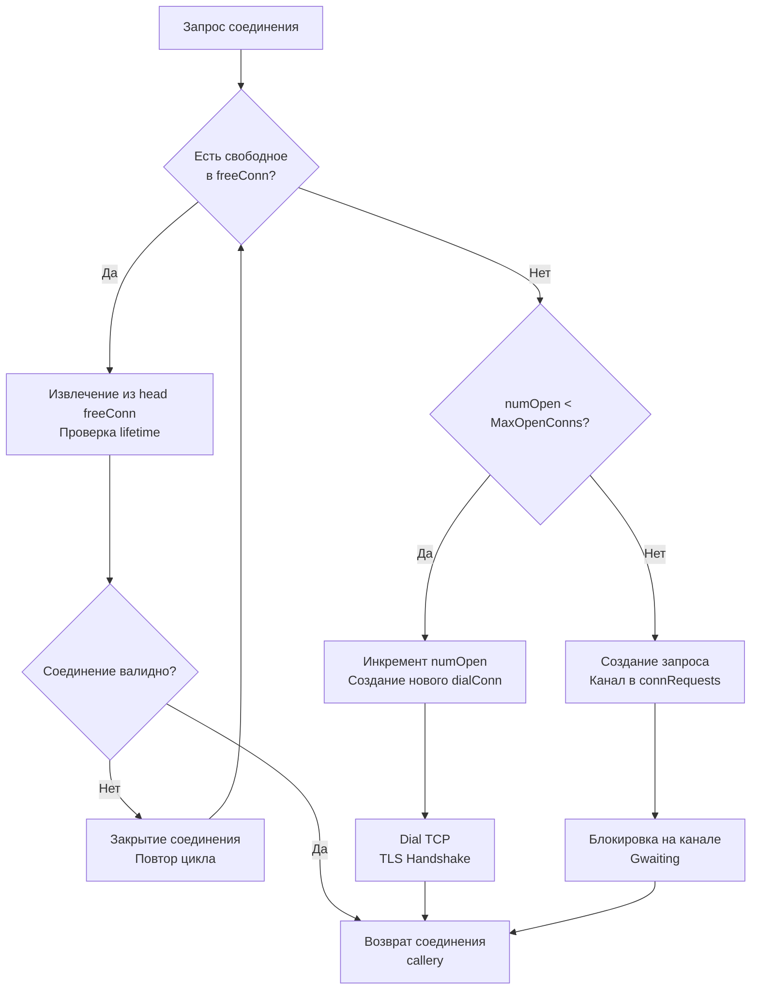

## Внутренняя механика пула и управление состоянием соединений

В большинстве языков программирования и фреймворков (например, в экосистеме Python с `SQLAlchemy` или PHP с внешним `PgBouncer`) разработчик привык делегировать пул соединений либо сторонним библиотекам, либо внешним системным демонам-прокси. В Go создатели стандартной библиотеки пошли по пути максимальной интеграции: масштабируемый, высококонкурентный менеджер пула встроен непосредственно в структуру `*sql.DB`.

Это решение обеспечивает минимальные задержки (latency) и устраняет лишние сетевые хопы, но предъявляет жесткие требования к архитектурной дисциплине инженера. Непонимание того, что происходит под капотом `sql.DB`, превращает элегантный менеджер ресурсов в источник каскадных блокировок. `*sql.DB` — это не просто обертка над сетевыми сокетами, а сложный конечный автомат, управляющий разделяемым состоянием с помощью мьютексов, очередей ожидания и каналов горутин.

> [!info] Под капотом
> Структура `sql.DB` хранит два ключевых поля, определяющих координацию конкурентного доступа:
> 1. `freeConn`: срез свободных (idle) сетевых соединений (`[]*driverConn`), готовых к немедленному повторному использованию.
> 2. `connRequests`: внутренняя очередь каналов ожидания (`map[uint64]chan connRequest`), на которых паркуются горутины, когда лимит `MaxOpenConns` исчерпан.
>
> Когда прикладной код вызывает метод `db.Query()`, рантайм Go пытается мгновенно извлечь свободное соединение из `freeConn`. Если свободных соединений нет, но лимит `MaxOpenConns` еще не достигнут, в фоне инициируется открытие нового TCP-сокета, а горутина переводится в состояние ожидания. Это предотвращает блокировку потоков операционной системы (M в модели планировщика Go), переводя горутину в состояние `Gwaiting` до момента получения сокета через канал.

---

## Under the hood: Стратегия получения соединения

Логика получения физического соединения в методе `DB.conn()` строго детерминирована и спроектирована для минимизации блокировок при тысячах параллельных запросов:



Алгоритм разворачивается в несколько этапов:
1. Под защитой мьютекса менеджер пула проверяет срез `freeConn`. Если доступное соединение найдено, извлекается элемент из головы очереди (`head`), после чего проверяется, не истекло ли максимальное время жизни соединения (`ConnMaxLifetime`).
2. Если свободного соединения нет, проверяется текущий счетчик `numOpen`. Если он строго меньше `MaxOpenConns`, счетчик атомарно инкрементируется, и вызывается метод `dialConn`, открывающий физический сокет (`Dial TCP`, аутентификация и `TLS Handshake`).
3. Если лимит `MaxOpenConns` исчерпан, горутина регистрирует уникальный канал в очереди `connRequests` и засыпает в планировщике Go (`Gwaiting`), не расходуя такты процессора. Как только любая другая горутина возвратит соединение в пул, она передаст его напрямую ожидающей горутине через этот канал.

### Проблема "Driver: bad connection"

Эта распространенная в production ошибка возникает, когда `database/sql` извлекает соединение из пула `freeConn`, но удаленный сервер БД или сетевой экран уже закрыл TCP-сессию (например, по таймауту неактивности или из-за перезагрузки экземпляра СУБД).

Пакет `database/sql` содержит встроенный механизм защиты от транзиентных сбоев: при получении от драйвера ошибки `driver.ErrBadConn` (или внутренней ошибки `bad connection`), он молча закрывает невалидное соединение, удаляет его из пула, декрементирует `numOpen` и выполняет повторную попытку получить рабочее соединение. Это делает кратковременные сетевые сбои прозрачными для прикладного кода, однако добавляет задержку на повторный `dial`.

---

## Механика Транзакций и "Pin" соединения

Транзакция в Go (структура `*sql.Tx`) — это не просто отправка текстовой команды `BEGIN` в базу данных. Это фундаментальный архитектурный контракт: вызов `db.BeginTx()` физически **привязывает (pins)** одно конкретное сетевое соединение из общего пула исключительно к данному объекту транзакции вплоть до вызова `Commit` или `Rollback`.

### Почему это критично для производительности?

Когда вы вызываете `db.BeginTx()`, менеджер пула резервирует соединение и переводит его в состояние `txCtx`. В этот момент соединение становится абсолютно недоступным для всех остальных горутин сервиса, даже если пул переполнен и десятки запросов заблокированы в очереди `connRequests`.

Представьте, что вы арендовали автомобиль в каршеринге и припарковали его возле кафе на два часа, пока обедаете: никто другой не может им воспользоваться, хотя машина просто стоит на месте. Точно так же долгая транзакция удерживает сетевой сокет впустую:

1. **Блокировка ресурсов пула (Starvation):** Выполнение долгой внешней бизнес-логики (например, вызов внешнего HTTP-микросервиса или генерация сложного отчета) внутри активной транзакции намертво захватывает соединение. Если пул рассчитан на 20 соединений, то 20 параллельных медленных запросов полностью парализуют всю базу данных приложения.
2. **Изоляция и консистентность:** Жесткая привязка сокета необходима: все команды внутри транзакции обязаны выполняться в рамках одной и той же серверной сессии СУБД для обеспечения транзакционных гарантий и консистентных снимков в MVCC-базах (PostgreSQL, MySQL).

```go
// ❌ ГРУБЕЙШИЙ АНТИПАТТЕРН: сетевой вызов внутри активной транзакции
func updateUserBad(ctx context.Context, db *sql.DB, userID int64) error {
	tx, err := db.BeginTx(ctx, nil)
	if err != nil {
		return err
	}
	defer tx.Rollback()

	// Соединение физически захвачено ("pinned").
	// Внешний HTTP-запрос занимает 2 секунды — сокет простаивает, пул блокируется!
	data, err := externalService.FetchData(ctx, userID)
	if err != nil {
		return err
	}

	if _, err := tx.Exec("UPDATE users SET profile = $1 WHERE id = $2", data, userID); err != nil {
		return err
	}

	return tx.Commit()
}

// ✅ ИДИОМАТИЧНО: внешняя работа выполняется ДО открытия транзакции
func updateUserGood(ctx context.Context, db *sql.DB, userID int64) error {
	// Сначала получаем данные из внешнего мира (сокет БД не занят)
	data, err := externalService.FetchData(ctx, userID)
	if err != nil {
		return err
	}

	// Открываем транзакцию ровно на время записи в БД
	tx, err := db.BeginTx(ctx, nil)
	if err != nil {
		return err
	}
	defer tx.Rollback()

	if _, err := tx.ExecContext(ctx, "UPDATE users SET profile = $1 WHERE id = $2", data, userID); err != nil {
		return err
	}

	return tx.Commit() // Успешный Commit возвращает сокет в пул, Rollback становится no-op
}
```

> [!warning] Ловушка / Gotcha
> **Утечка соединения при ошибке или панике.**
> Если внутри транзакции происходит паника, непредвиденный `return` или ошибка парсинга, и разработчик забывает вызвать `tx.Rollback()`, соединение навсегда останется в состоянии «занято транзакцией». Оно никогда не вернется в пул `freeConn`!
>
> Со временем все доступные слоты пула будут исчерпаны, и приложение намертво зависнет на очередном запросе к базе.
> **Золотое правило:** Всегда вызывайте `defer tx.Rollback()` немедленно после успешного вызова `BeginTx()`! Если перед выходом из функции успешно сработал `tx.Commit()`, последующий вызов `Rollback()` в `defer` безопасно выполнит no-op (пустую операцию) и не вернет ошибку.

---

## Приготовленные выражения: Кэширование и нюансы

Метод `db.Prepare(query)` компилирует SQL-шаблон и возвращает объект `*sql.Stmt`. Подготовленные выражения (prepared statements) традиционно служат двум целям: защите от SQL-инъекций и повышению производительности за счет однократного парсинга запроса сервером СУБД. Однако в архитектуре с пулом соединений кроется скрытая сложность.

### Проблема привязки к соединению

В большинстве реляционных СУБД подготовленный запрос (`PREPARE stmt FROM ...`) живет исключительно в памяти конкретной клиентской сессии (сетевого сокета). Сервер БД не разделяет подготовленные стейтменты между разными TCP-соединениями!

Пакет `database/sql` решает эту проблему элегантным, но ресурсоемким способом:
1. Объект `*sql.Stmt` внутренне хранит реестр соединений, на которых этот запрос уже был физически скомпилирован через команду `PREPARE`.
2. При вызове метода `Stmt.Exec()` или `Stmt.Query()` пакет пытается получить из пула ровно то соединение, на котором стейтмент уже готов к исполнению.
3. Если подходящего свободного соединения в пуле нет, берется любое доступное соединение, и драйвер прозрачно отправляет команду `PREPARE` на этот новый сокет перед выполнением целевого запроса.

Это означает, что подготовленные выражения вызывают «прилипание» (sticky behavior) запросов к конкретным сокетам пула. Если активно создавать десятки различных `Stmt`, они будут размножаться на каждом физическом соединении, расходуя память как в Go-процессе, так и на стороне сервера базы данных.

### `db.Prepare` vs `db.Query` с параметрами

Многие современные сетевые драйверы (например, высокопроизводительный драйвер PostgreSQL `pgx`) используют расширенный протокол СУБД (Extended Query Protocol) с автоматической параметризацией или implicit preparation.

В таких условиях явный вызов `db.Prepare()` часто оказывается **медленнее**, чем прямой параметризованный вызов `db.Query("SELECT ... WHERE id = $1", id)`:
- `db.Prepare()` требует как минимум двух сетевых roundtrip'ов: один сетевой пакет для создания стейтмента (`PREPARE`), второй — для передачи параметров и выполнения (`EXECUTE`).
- Параметризованный `QueryContext` в современных драйверах отправляет запрос и параметры в рамках одного сетевого пакета, экономя время на сетевой latency.

---

## Mechanical Sympathy: Память, CPU и GC

Взаимодействие с базой данных на высоких оборотах способно существенно нагрузить подсистему памяти и процессор.

### 1. Давление на Garbage Collector

Каждая строка результата в цикле `rows.Next()` требует выделения памяти под сканируемые структуры данных:
- Если вы сканируете текстовые или бинарные колонки в типы `string` или `[]byte`, рантайм Go выделяет память под эти буферы в куче.
- При сканировании выборки из 1 000 000 строк внутри одного HTTP-запроса вы сгенерируете миллион короткоживущих объектов, спровоцировав частые паузы сборщика мусора.

```go
// ✅ Идиоматично: переиспользование переменных в цикле выборки
var name string
var email string
for rows.Next() {
    // Scan перезаписывает память переменных, минимизируя аллокации
    if err := rows.Scan(&name, &email); err != nil {
        return err
    }
    // Обрабатываем данные по месту или сохраняем в предварительно аллоцированный срез
}
```
*Примечание:* Поскольку строки в Go иммутабельны, вызов `rows.Scan` при копировании из байтового буфера драйвера в `string` все равно производит аллокацию строки. Для достижения абсолютно нулевых аллокаций (zero-alloc) в критических путях используют драйвер-специфичные API (например, сырые буферы `pgx.RowScanner`).

### 2. CPU и Парсинг SQL

Передача сырого непараметризованного SQL-текста вынуждает сервер базы данных каждый раз разбирать синтаксис, строить AST (абстрактное синтаксическое дерево) и вычислять план выполнения запроса:
* Команда `PREPARE` выполняет парсинг и оптимизацию плана однократно.
* Последующие вызовы `EXECUTE` лишь подставляют значения параметров в готовый план.

При высокой нагрузке (`>10k RPS`) использование подготовленных стейтментов существенно разгружает ядра CPU базы данных, ценой небольшого расхода оперативной памяти в приложении для поддержания состояния `Stmt`.

---

## Ловушки и вопросы с собеседований

| Сценарий | Проблема | Решение |
|---|---|---|
| **`MaxIdleConns` > `MaxOpenConns`** | Пакет `database/sql` автоматически урезает `MaxIdleConns` до значения `MaxOpenConns`. Логика пула искажается. | Всегда явно задавайте `MaxIdleConns <= MaxOpenConns`. Рекомендуется держать `MaxIdleConns` равным количеству активных воркеров или числу ядер CPU. |
| **Попытка вложенных транзакций** | Стандартный интерфейс `database/sql` не поддерживает вложенность нативно. | Используйте точки сохранения (Savepoints): отправляйте явные команды `SAVEPOINT sp1; ... ROLLBACK TO sp1;` через `db.Exec()` или `tx.Exec()`. |
| **Выход из цикла `rows.Next()` по `break`** | Если цикл прерван досрочно по условию или ошибке, сетевое соединение останется заблокированным за незакрытым `rows`. | Всегда объявляйте `defer rows.Close()` сразу после `Query()`. Досрочный вызов `rows.Close()` мгновенно вернет сокет в пул. |
| **Закрытие соединения с `Stmt`** | При разрыве TCP-сессии все подготовленные на ней стейтменты на сервере БД аннулируются. | Пакет `database/sql` обрабатывает эту ситуацию прозрачно, заново выполняя `PREPARE` на новом сокете при следующем запросе, но это влечет задержку в latency. |
| **Отмена контекста в `ExecContext`** | Контекст прерывает выполнение конкретной команды, но не откатывает транзакцию `*sql.Tx` автоматически. | При получении ошибки проверяйте `ctx.Err()`. Если контекст отменен, немедленно вызывайте `tx.Rollback()`. |

> [!tip] Собеседование
> **Вопрос:** В чем назначение типа `sql.Conn` (появившегося в Go 1.10) и чем он отличается от стандартного использования `db.Query()`?
> **Ответ:** Стандартный вызов `db.Query()` извлекает соединение из пула исключительно на время выполнения одного запроса и возвращает его обратно сразу после закрытия курсора. 
> В отличие от этого, метод `db.Conn(ctx)` извлекает и резервирует физическое соединение `*sql.Conn` **монопольно за текущей горутиной** до тех пор, пока разработчик явно не вызовет `conn.Close()`. Это критически необходимо для последовательностей команд, требующих сохранения состояния на уровне одной сетевой сессии без открытия тяжелой транзакции (например, установка сессионных переменных СУБД `SET TIME ZONE`, работа с временными таблицами `CREATE TEMPORARY TABLE` или блокировка таблиц `LOCK TABLES`).
>
> **Вопрос:** Как `database/sql` реагирует на внезапную перезагрузку сервера базы данных в момент, когда пул заполнен соединениями?
> **Ответ:** Все сокеты, находящиеся в срезе `freeConn`, становятся недействительными («битыми»). При следующей попытке извлечь соединение драйвер попытается отправить ping или запрос и получит ошибку `driver.ErrBadConn` (`bad connection`). Менеджер пула перехватывает этот сигнал, удаляет дефектное соединение из пула, уменьшает счетчик `numOpen` и инициирует прозрачное открытие нового сокета через `dialConn`. Если база данных уже успела подняться, запрос клиента выполнится успешно, хоть и с повышенной latency.

---

## Итог

1. **Пул соединений — это сердце `database/sql`.** Настройте `MaxOpenConns` в зависимости от лимитов БД и `ulimit`. Менеджер `*sql.DB` управляет очередями `freeConn` и `connRequests`, переводя ожидающие горутины в состояние `Gwaiting` без блокировки системных потоков ОС.
2. **Транзакции намертво привязывают соединение к сокету.** Никогда не выполняйте медленные сетевые вызовы к внешним сервисам внутри `*sql.Tx`, чтобы не спровоцировать каскадное исчерпание соединений (pool starvation).
3. **Всегда используйте `defer tx.Rollback()`.** Если транзакция завершается успешным `Commit()`, откат в `defer` безопасно превращается в no-op. При ошибке или панике соединение гарантированно вернется в пул.
4. **Подготовленные выражения (`*sql.Stmt`) кэшируются на уровне сокетов.** Они ускоряют сложные повторяющиеся запросы за счет однократного построения плана в СУБД, но требуют сетевых накладных расходов при перемешивании соединений в пуле.
5. **Всегда закрывайте курсоры `*sql.Rows`.** Непрочитанный или незакрытый курсор блокирует сетевое соединение до финализации GC.
6. **Для сессионных операций используйте `sql.Conn`.** Вызов `db.Conn(ctx)` позволяет удерживать единый сокет для команд вида `LOCK TABLES` или временных таблиц без накладных расходов транзакций.

Освоив работу с базами данных, мы переходим к задачам упаковки и транспортировки файлов. Как эффективно работать с архивами ZIP и TAR, избегая загрузки огромных файлов в память и используя потоковую обработку? В следующей статье: [[41. archive_zip, tar и работа с архивами]].