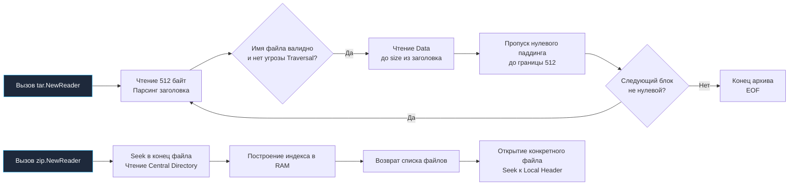

## Философия потоковой обработки и структура архивов

В компьютерных системах упаковка данных — одна из старейших задач. Еще на заре эпохи Unix возникла потребность объединять разрозненные файлы, права доступа и структуру каталогов в единый линейный поток данных для резервного копирования и транспортировки. 

Здесь принципиально важно провести четкую границу между двумя концепциями, которые начинающие программисты нередко смешивают в одно понятие:
- **Архивация (Контейнеризация):** упаковка множества файлов, путей, прав доступа и временных меток в единую структуру данных (форматы TAR, cpio, не сжатый ZIP). За это в стандартной библиотеке Go отвечает ветка пакетов `archive/`.
- **Компрессия (Сжатие данных):** математическое устранение энтропийной избыточности в потоке байтов (алгоритмы `flate` / Deflate, `gzip`, `bzip2`, `zlib`). За это отвечает семейство пакетов `compress/`.

Архив может быть сжатым (как классический `.tar.gz`) или несжатым (простой `.tar` или `.zip` со стратегией Store). Go бескомпромиссно разделяет эти домены: пакеты `archive/zip` и `archive/tar` ничего не знают о сетевых протоколах и низкоуровневых сокетах, они работают исключительно через фундаментальные абстракции `io.Reader` и `io.Writer`.

Для бэкенд-инженера высокого уровня работа с архивами — это прежде всего искусство управления памятью и жесткий контроль безопасности:
1. **Защита от исчерпания памяти (OOM):** Наивная загрузка архива в память через `os.ReadFile` или вызов `zip.Reader.File[i].Open()` без лимитов размера неминуемо приведет к падению сервера при первой же атаке типа ZIP-бомба или распаковке стогигабайтного лога.
2. **Безопасность файловой системы:** Распаковка архива «вслепую» — один из самых частых источников критических уязвимостей типа Path Traversal (Zip Slip) и атак через символические ссылки (Symlink Traversal).

Идиоматичный подход в Go опирается на строгую потоковую обработку, поточные интерфейсы `io.Copy` / `io.CopyN`, ленивый парсинг метаданных и бескомпромиссную санитаризацию путей.

---

## Under the hood: ZIP против TAR

Внутренняя компоновка форматов ZIP и TAR кардинально различается. Это фундаментальное архитектурное различие определяет, как и где вы можете применять каждый из них.

### ZIP: Центральная директория и произвольный доступ

Формат ZIP создавался во времена персональных компьютеров, когда файлы хранились на дискетах и жестких дисках с поддержкой произвольного позиционирования головки (random access).

Его структура состоит из двух ключевых частей:
1. **Local File Header + Data:** блоки файлов, каждый из которых содержит локальный мини-заголовок и тело файла.
2. **Central Directory (Центральная директория):** оглавление архива, которое физически записывается в **самом конце** файла! В ней хранится полный перечень всех файлов, их атрибуты, контрольные суммы CRC32 и байтовые смещения (offsets) к соответствующим `Local Header`.

Именно поэтому конструктор `zip.NewReader` принимает интерфейс `io.ReaderAt` (обычно реализуемый дескриптором `*os.File`), а не обычный `io.Reader`. Чтобы узнать состав архива, `archive/zip` не читает архив с первого байта — он прыгает (seek) в самый конец файла, считывает Central Directory, мгновенно строит легковесный индекс в оперативной памяти и предоставляет доступ к любому файлу за $O(1)$. При вызове `f.Open()` происходит мгновенный seek к смещению нужного файла и начинается потоковая декомпрессия.

### TAR: Последовательный конкатенированный поток

Формат TAR (буквально Tape Archive) проектировался в Bell Labs для стримеров на магнитных лентах. На магнитной ленте нельзя быстро прыгнуть в конец файла: перемотка ленты занимала минуты. Поэтому TAR — это строго линейный, последовательный поток:
1. **Header (512 байт):** структурированный блок метаданных (имя, права `os.FileMode`, владелец, размер в байтах `Size`), строго выровненный по границе 512 байт.
2. **File Data:** содержимое файла, дополненное нулями (zero padding) до ближайшей границы, кратной 512 байтам.
3. **EOF Marker:** в конце архива следуют два последовательных пустых блока по 512 нулевых байт, сигнализирующих о завершении архива (`io.EOF`).

Пакет `archive/tar` читает данные строго последовательно от начала к концу. Ему не нужен произвольный доступ `io.ReaderAt`, он работает с абсолютно любым потоком `io.Reader` — сокетом `net.Conn`, пайпом `io.Pipe` или телом входящего HTTP-запроса `http.Request.Body`.



> [!warning] Ловушка / Gotcha
> **Разница в требованиях к IO и сетевым сокетам.**
> Пакет `archive/zip` **требует** интерфейс `io.ReaderAt` для эффективного чтения архива. Вы принципиально не можете передать входящий сетевой сокет `net.Conn` или `io.Pipe` напрямую в `zip.NewReader`, потому что сетевые соединения не поддерживают операцию перемещения указателя чтения назад (`Seek`). Попытка обойти это через буферизацию в `bytes.Buffer` вызовет OOM, если клиент отправит файл размером в несколько гигабайт.
> 
> **Золотое правило архитектуры:** Если сервис принимает архив по сети «на лету» в потоковом режиме — проектируйте протокол на базе TAR. Если же вам обязательно нужен ZIP, входящий сетевой поток необходимо предварительно сохранить во временный файл на диске (`os.CreateTemp`), и лишь затем передавать дескриптор `*os.File` в `zip.NewReader`.

---

## Mechanical Sympathy: Потоки, выравнивание и защита от OOM

Работа с архивами напрямую упирается в системные вызовы ядра Linux, дисковый ввод-вывод и работу сборщика мусора.

### 1. Аллокации и давление на GC

Каждый файл в архиве TAR или ZIP сопровождается структурой заголовка (`tar.Header`, `zip.FileHeader`). Если архив содержит миллионы небольших файлов (например, дамп репозитория кода или кэш зависимостей), создание объектов на каждый файл генерирует миллионы мелких структур в куче, создавая существенный `GC pressure`.
- **Оптимизация:** Никогда не складывайте заголовки всех файлов архива в гигантский слайс `[]*tar.Header`. Обрабатывайте файлы строго итеративно в цикле, не удерживая ссылки на прочитанные заголовки, чтобы сборщик мог их утилизировать.

### 2. Выравнивание и syscall

В формате TAR все блоки выровнены по 512 байт. Если читать или распаковывать файлы прямыми вызовами `Read()` и `Write()` небольшими порциями без буферизации, приложение будет совершать тысячи мелких syscall `write`. Каждый переход между User Space и Kernel Space стоит процессорных тактов.
- **Решение:** Всегда оборачивайте входящий поток `tar.NewReader` в `bufio.Reader`, а целевые файлы при записи — в `bufio.Writer`. Это амортизирует стоимость переходов в Kernel Space и агрегирует мелкие операции в большие блочные вызовы размером 4–64 КБ, идеально согласующиеся с размером страницы виртуальной памяти и дискового кэша ОС.

### 3. Защита от ZIP-бомб и Path Traversal

- **ZIP/TAR-бомба:** Архив размером всего в пару мегабайт (например, рекурсивно сжатые нули) при декомпрессии может развернуться в терабайты данных (гигантский `UncompressedSize`). Если распаковывать поток через слепой `io.Copy(f, tr)`, сервер моментально исчерпает свободное место на диске или вылетит по OOM. Идиоматичная защита — использование `io.CopyN` с жестким ограничением максимального количества байтов или обертка через `io.LimitReader`.
- **Уязвимость Path Traversal (Zip Slip):** Злоумышленник может поместить в архив файл с именем `../../../etc/passwd` или `../../../../home/app/.ssh/authorized_keys`. Стандартные пакеты Go намеренно низкоуровневые: они **не фильтруют** пути автоматически. Защита от этой уязвимости — прямая обязанность разработчика!

---

## Идиомы производства: Безопасное создание и извлечение

### Безопасное извлечение TAR

Ниже приведен эталонный промышленный паттерн распаковки архива TAR с тройной защитой: от Path Traversal, от подмены символических ссылок и от архивов-бомб:

```go
package main

import (
	"archive/tar"
	"context"
	"errors"
	"fmt"
	"io"
	"os"
	"path/filepath"
	"strings"
)

// extractTar безопасно распаковывает поток TAR в целевую директорию destDir
func extractTar(ctx context.Context, r io.Reader, destDir string) error {
	tr := tar.NewReader(r)
	cleanDestDir := filepath.Clean(destDir)

	for {
		// Проверяем отмену контекста между файлами
		if err := ctx.Err(); err != nil {
			return err
		}

		header, err := tr.Next()
		if errors.Is(err, io.EOF) {
			break // Штатное завершение архива
		}
		if err != nil {
			return fmt.Errorf("tar next: %w", err)
		}

		// 1. Защита от Path Traversal (Zip Slip)
		target := filepath.Join(cleanDestDir, header.Name)
		cleanTarget := filepath.Clean(target)
		if !strings.HasPrefix(cleanTarget, cleanDestDir+string(filepath.Separator)) && cleanTarget != cleanDestDir {
			return errors.New("tar: illegal path traversal detected")
		}

		// 2. Защита от Symlink атак (запрет создания ссылок, ведущих наружу destDir)
		if header.Typeflag == tar.TypeSymlink || header.Typeflag == tar.TypeLink {
			return errors.New("tar: symlinks are not allowed for security reasons")
		}

		switch header.Typeflag {
		case tar.TypeDir:
			// Создаем директорию с маскировкой прав (безопасный umask)
			mode := os.FileMode(header.Mode & 0777)
			if err := os.MkdirAll(cleanTarget, mode); err != nil {
				return fmt.Errorf("mkdir: %w", err)
			}

		case tar.TypeReg:
			// Гарантируем существование родительской папки
			if err := os.MkdirAll(filepath.Dir(cleanTarget), 0755); err != nil {
				return fmt.Errorf("mkdir parent: %w", err)
			}

			// Открываем файл на запись без следования внешним ссылкам
			mode := os.FileMode(header.Mode & 0777)
			f, err := os.OpenFile(cleanTarget, os.O_CREATE|os.O_WRONLY|os.O_TRUNC, mode)
			if err != nil {
				return fmt.Errorf("open file: %w", err)
			}

			// 3. Защита от архивов-бомб: читаем строго header.Size байт через io.CopyN
			if _, err := io.CopyN(f, tr, header.Size); err != nil {
				f.Close()
				return fmt.Errorf("copy file: %w", err)
			}
			f.Close()
		}
	}
	return nil
}
```

### Создание ZIP в память или поток

При создании ZIP-архива критически важно понимать жизненный цикл структуры `zip.Writer`:

```go
package main

import (
	"archive/zip"
	"fmt"
	"io"
)

// createZip упаковывает файлы в переданный io.Writer (сеть, файл или буфер)
func createZip(w io.Writer, files map[string][]byte) error {
	zw := zip.NewWriter(w)
	// defer гарантирует запись финальной оглавляющей секции Central Directory!
	defer zw.Close()

	for name, data := range files {
		// fw возвращает io.Writer для потоковой записи данных файла
		fw, err := zw.Create(name)
		if err != nil {
			return fmt.Errorf("create zip entry: %w", err)
		}

		if _, err := fw.Write(data); err != nil {
			return fmt.Errorf("write data: %w", err)
		}
	}

	// Явный вызов zw.Close() необходим, если мы хотим проверить ошибку записи Central Directory
	if err := zw.Close(); err != nil {
		return fmt.Errorf("close zip writer: %w", err)
	}
	return nil
}
```

---

## Ловушки и вопросы с собеседований

| Сценарий | Проблема | Решение |
|---|---|---|
| **Игнорирование `zw.Close()`** | Файл ZIP оказывается битым: не записывается завершающая структура Central Directory. Утилиты распаковки сообщают о повреждении архива. | Всегда используйте `defer zw.Close()` или вызывайте метод явно перед закрытием целевого `io.Writer`. |
| **Попытка чтения ZIP из `net.Conn`** | Функция `zip.NewReader` требует `io.ReaderAt`. Сокеты не поддерживают произвольное позиционирование (seek). | Сохраняйте входящий сетевой поток во временный файл через `os.CreateTemp` или используйте `io.TeeReader` / `bytes.Buffer` (только для малых гарантированных объемов). |
| **Потеря или порча прав доступа** | Поле `header.Mode` в TAR содержит как права доступа (rwx), так и системные биты типа файла. Слепая передача в `os.Mkdir` может сломать атрибуты. | Обязательно маскируйте биты: `os.FileMode(header.Mode & 0777)` перед вызовами создания файлов и каталогов. |
| **Большие архивы (>4 ГБ)** | Классический 32-битный формат ZIP не поддерживает файлы и архивы размером более 4 ГБ. | Стандартный пакет `archive/zip` в Go автоматически прозрачно переключается на спецификацию Zip64 при превышении лимитов. Убедитесь, что клиентское ПО также поддерживает Zip64. |
| **Ошибки в `tar.Reader.Next()`** | Поток данных оборван или поврежден 512-байтовый заголовок. | Ошибку `io.EOF` обрабатывайте как штатное успешное завершение архива. Любые другие ошибки считайте критическими и немедленно прерывайте распаковку. |

> [!tip] Собеседование
> **Вопрос:** Почему конструктор `zip.NewReader` принимает `io.ReaderAt`, в то время как `tar.NewReader` принимает обычный `io.Reader`?
> **Ответ:** Формат ZIP хранит общее оглавление архива (Central Directory) в самом его конце. Чтобы получить список всех файлов без необходимости декомпрессировать или последовательно считывать гигабайты данных, парсер должен перейти в конец файла, прочитать каталог и вычислить точные смещения нужных файлов. Интерфейс `io.ReaderAt` предоставляет метод `ReadAt(p []byte, off int64)`, позволяющий атомарно и потокобезопасно читать произвольные участки файла без изменения общего состояния смещения потока. В отличие от него, формат TAR строго монотонен и линеен: каждый заголовок предшествует своим данным, поэтому TAR легко обрабатывается через потоковый `io.Reader` без поддержки seek.
>
> **Вопрос:** Как безопасно распаковать архив, если имена файлов внутри были созданы в нестандартной кодировке (например, CP866 или Windows-1251)?
> **Ответ:** Пакеты `archive/tar` и `archive/zip` по спецификации ожидают UTF-8. Если архив создан в устаревших системах, прямая передача невалидной строки в `os.Open` или `filepath.Join` приведет к созданию некорректных имен на диске. Для таких архивов используют внешние библиотеки декодирования (например, `golang.org/x/text/encoding/charmap`), пропуская сырые байты имени через перекодировщик перед валидацией и созданием файла.

---

## Сравнение с экосистемами других языков

| Язык / Среда | Механизм | Особенности в сравнении с Go |
|---|---|---|
| **Python** | `zipfile`, `tarfile` | Модули `zipfile` и `tarfile` высокоуровневые, поддерживают автоопределение компрессии через `tarfile.open(mode='r:*')`. Однако GIL блокирует параллельную распаковку множества файлов. Go разделяет зоны ответственности (`archive/` и `compress/`) и прозрачно масштабируется по ядрам CPU. |
| **Java** | `java.util.zip`, `java.nio.file` | Классы `ZipInputStream` и `ZipFile`. Требуют закрытия каждого элемента `ZipEntry`. Высокий уровень шаблонного кода (boilerplate) и промежуточных объектов-оберток. |
| **C / C++** | `libarchive` | Чрезвычайно мощная библиотека с поддержкой десятков форматов (7z, rar, iso). Однако требует ручного управления динамической памятью, линковки C-библиотек и подвержена уязвимостям переполнения буфера при парсинге некорректных заголовков. |
| **Go** | `archive/zip`, `archive/tar` | 100% чистый Go, нулевые C-зависимости, компиляция в статичный бинарник, строгая потоковая интеграция через интерфейсы `io.Reader`/`io.Writer`. Идеален для облачных сервисов, контейнеров и микросервисов. |

---

## Итог

1. Формат `archive/zip` требует произвольного доступа через `io.ReaderAt` для чтения оглавления Central Directory в хвосте архива. Формат `archive/tar` работает строго потоково через любой `io.Reader`.
2. Никогда не читайте архив целиком в оперативную память. Используйте потоковую обработку через `io.Copy`, `io.CopyN` и итераторы `tar.Reader` / `zip.Reader`.
3. При распаковке в production безусловно проверяйте пути на уязвимость Path Traversal (Zip Slip) с помощью `filepath.Clean` и `filepath.Join`, а также блокируйте подозрительные символические ссылки (`tar.TypeSymlink`).
4. Защищайтесь от архивов-бомб: всегда строго ограничивайте объем вычитываемых байт через `header.Size` или `io.LimitReader`.
5. При формировании ZIP-архива всегда явно закрывайте `zip.Writer` методом `Close()`, чтобы записать финальную секцию Central Directory.
6. Разделяйте концептуальные слои: пакеты `archive/` отвечают за структуру контейнера и метаданные, а пакеты `compress/` — за математическое сжатие байтов.

Разобрав контейнерные форматы, мы переходим к алгоритмам сжатия, которые экономят место на диске и полосу пропускания сети. Как работают DEFLATE, ZLIB и GZIP под капотом, почему они используют скользящее окно и как интегрировать их в HTTP-потоки без лишних аллокаций? В следующей статье: [[42. compress_gzip, zlib, flate]].