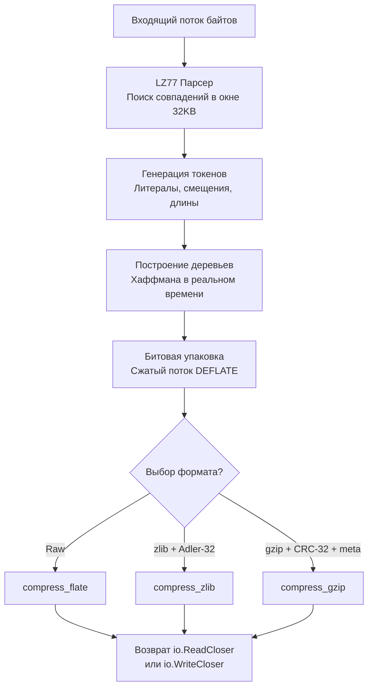

## Философия потокового сжатия и семейство DEFLATE

В компьютерных сетях и распределенных системах передача информации всегда сопряжена с фундаментальным физическим компромиссом: мы либо платим драгоценными тактами центрального процессора за уменьшение объема данных, либо расходуем пропускную способность сетевых каналов и дисковую емкость хранилищ. 

В стандартной библиотеке Go семейство пакетов `compress/flate`, `compress/zlib` и `compress/gzip` реализует не три принципиально различных алгоритма сжатия, а три слоя оберток над единым проверенным математическим ядром — стандартом **DEFLATE** (RFC 1951):
- `compress/flate` предоставляет чистый, низкоуровневый поток сжатых бит по спецификации DEFLATE без каких-либо служебных заголовков или контрольных сумм.
- `compress/zlib` оборачивает поток DEFLATE в компактный контейнер: двухбайтовый заголовок и быструю 4-байтовую контрольную сумму Adler-32 (RFC 1950). Он традиционно применяется в графическом формате PNG и сетевых протоколах (SSH, TLS, сжатие заголовков HTTP/2 HPACK).
- `compress/gzip` упаковывает DEFLATE в полноценный контейнерный формат с 10-байтным заголовком, метаданными (имя файла, время модификации mtime, флаги ОС) и надежной 4-байтовой контрольной суммой CRC-32 (RFC 1952). Именно он является общепринятым стандартом интернета для HTTP `Content-Encoding: gzip`.

Для бэкенд-инженера понимание работы этих пакетов необходимо не столько для ручного создания архивных файлов, сколько для проектирования высоконагруженных сетевых сервисов: динамического сжатия HTTP-ответов, сжатия логов перед отправкой в Kafka/Elasticsearch и тонкой балансировки между загрузкой ядер CPU и сетевым трафиком.

> [!info] Под капотом
> Все три пакета спроектированы строго в парадигме **потоковой обработки** и реализуют канонические интерфейсы `io.ReadCloser` и `io.WriteCloser`. Они не требуют загрузки всего несжатого контента в оперативную память. Сжатие и распаковка осуществляются блоками («чанками») по мере поступления байтов через скользящее окно, благодаря чему потребление RAM остается строго константным даже при обработке многогигабайтных дампов или бесконечных HTTP-потоков (Server-Sent Events).

---

## Under the hood. Алгоритм DEFLATE: LZ77 и Хаффман

Элегантность алгоритма DEFLATE заключается в последовательном объединении двух взаимодополняющих математических подходов:

1. **Алгоритм Лемпеля — Зива (LZ77, Скользящее окно):** Устраняет пространственную избыточность. Алгоритм просматривает входящий поток байтов через скользящее окно фиксированного размера (32 КБ). Если текущая последовательность байтов уже встречалась в пределах этого окна, она заменяется компактной ссылкой назад — парой `<смещение, длина>` (back-pointer). Например, длинная повторяющаяся строка JSON-ключа `"transaction_status"` при втором появлении превратится всего в два числа: «120 байт назад, длина 18».
2. **Префиксное кодирование Хаффмана (Huffman Coding):** Устраняет статистическую избыточность. Идея аналогична азбуке Морзе: буква «E», встречающаяся в английском языке чаще всего, кодируется одной точкой, а редкая «Q» — длинной последовательностью тире и точек. Алгоритм Хаффмана динамически строит бинарное дерево частот: часто встречающимся байтам и парам LZ77 назначаются короткие битовые последовательности (вплоть до 1-2 бит), а редким — более длинные.



### Архитектурная гармония с кэшем процессора

Почему разработчики DEFLATE выбрали размер скользящего окна ровно 32 КБ? Это классический пример Mechanical Sympathy (сочувствия к машине): буфер в 32 КБ идеально помещается в кэш данных первого уровня (L1d) или второго уровня (L2) практически любого современного микропроцессора. Поиск совпадений происходит внутри сверхбыстрой статической памяти ядра CPU, минимизируя промахи мимо кэша (`cache miss`) и позволяя аппаратному предзагрузчику (`prefetcher`) работать с максимальной отдачей.

---

## Различия пакетов: flate, zlib, gzip

| Пакет | Заголовок | Контрольная сумма | Метаданные | Основное применение |
|---|---|---|---|---|
| `compress/flate` | Отсутствует (0 байт) | Нет | Нет | Низкоуровневые бинарные протоколы, кастомные форматы сериализации. |
| `compress/zlib` | 2 байта (CMF/FLG) | Adler-32 (4 байта) | Нет | Графика PNG, протокол SSH, сжатие заголовков HTTP/2 HPACK. |
| `compress/gzip` | 10+ байт (Magic, метод, флаги, mtime) | CRC-32 (4 байта) | Имя файла, комментарии, тип ОС | Сетевой заголовок HTTP `Content-Encoding: gzip`, утилиты tar.gz, ротация логов. |

> [!warning] Ловушка / Gotcha
> **Путаница форматов при распаковке.**
> Попытка декодировать входящий `gzip` поток через `zlib.NewReader` или `flate.NewReader` немедленно завершится ошибкой `invalid header` или `unexpected EOF`. Несмотря на идентичное математическое ядро DEFLATE, форматы заголовков и контрольных сумм несовместимы.
> 
> Для сетевого веб-трафика HTTP всегда используйте исключительно `compress/gzip`. Для обработки изображений PNG или структур HPACK применяйте `compress/zlib`. Пакет `compress/flate` используется только тогда, когда вы полностью контролируете оба конца канала передачи данных и хотите сэкономить десяток байт заголовка.

---

## Mechanical Sympathy: CPU, кэш-линии и уровни сжатия

Сжатие данных в реальном времени — один из самых частых источников скрытых проблем с производительностью в высоконагруженных API.

### 1. Уровни компрессии и нелинейная стоимость

Стандартная библиотека Go поддерживает уровни сжатия от `flate.NoCompression` (0) до `flate.BestCompression` (9). По умолчанию используется константа `flate.DefaultCompression` (-1, что соответствует уровню 6).

В инженерной практике зависимость степени сжатия от затрат CPU строго нелинейна:
* **Уровни 1–3 (`flate.BestSpeed`):** алгоритм использует упрощенный хэш-поиск совпадений LZ77 и быстрое статическое дерево Хаффмана. Нагрузка на процессор минимальна, а степень сжатия текста составляет 60–70% от исходного размера. Это идеальный выбор для онлайн-сжатия HTTP-ответов.
* **Уровни 7–9 (`flate.BestCompression`):** алгоритм запускает исчерпывающий перебор цепочек совпадений. Затраты процессорного времени возрастают в 4–8 раз, тогда как выигрыш в объеме передаваемых данных составляет ничтожные 1–3%. В боевом веб-сервере использование уровня 9 способно поднять p99 latency с 5 мс до 150 мс. Уровни выше 6 оправданы исключительно при фоновой архивации данных на «холодное» долгосрочное хранение (S3/Glacier).

### 2. Влияние на GC и пулы в HTTP

Создание нового экземпляра `gzip.NewWriter` требует аллокации десятков килобайт памяти: кольцевого буфера окна 32 КБ, хэш-таблиц поиска совпадений и структур дерева Хаффмана. При трафике в 10 000 RPS создание писателя на каждый входящий запрос приведет к выделению сотен мегабайт в секунду и парализует рантайм частыми паузами сборщика мусора.

В высоконагруженных сервисах сжатие организуется через переиспользование структур с помощью `sync.Pool`:

```go
package main

import (
	"compress/gzip"
	"io"
	"net/http"
	"strings"
	"sync"
)

// gzipPool хранит предварительно выделенные структуры gzip.Writer
var gzipPool = sync.Pool{
	New: func() any {
		// Создаем писатель с уровнем BestSpeed для минимизации нагрузки на CPU
		w, _ := gzip.NewWriterLevel(io.Discard, gzip.BestSpeed)
		return w
	},
}

// gzipResponseWriter оборачивает http.ResponseWriter для сжатия тела ответа
type gzipResponseWriter struct {
	http.ResponseWriter
	Writer io.Writer
}

func (w *gzipResponseWriter) Write(b []byte) (int, error) {
	return w.Writer.Write(b)
}

// gzipMiddleware реализует прозрачное сжатие ответов
func gzipMiddleware(next http.Handler) http.Handler {
	return http.HandlerFunc(func(w http.ResponseWriter, r *http.Request) {
		// Проверяем, поддерживает ли клиент сжатие gzip
		if !strings.Contains(r.Header.Get("Accept-Encoding"), "gzip") {
			next.ServeHTTP(w, r)
			return
		}

		w.Header().Set("Content-Encoding", "gzip")
		
		// Извлекаем writer из пула
		gz := gzipPool.Get().(*gzip.Writer)
		defer gzipPool.Put(gz)

		// Reset перенаправляет поток в сетевой ResponseWriter без новых аллокаций!
		gz.Reset(w)
		// defer gz.Close() ОБЯЗАТЕЛЕН: он записывает завершающий CRC-32 и маркер конца
		defer gz.Close()

		gw := &gzipResponseWriter{ResponseWriter: w, Writer: gz}
		next.ServeHTTP(gw, r)
	})
}
```

Вызов `Reset(w)` полностью очищает внутреннее состояние алгоритма и перенаправляет вывод в новый `io.Writer`, не совершая ни единой аллокации в куче! Это сокращает нагрузку на GC и ускоряет инициализацию на 40–60%.

---

## Идиомы использования: потоки, буферы и обязательное закрытие

### Правильная запись с проверкой ошибок

При работе со сжатием файлов на диске принципиально важно соблюдать правильный порядок финализации дескрипторов:

```go
package main

import (
	"compress/gzip"
	"fmt"
	"io"
	"os"
)

func compressToFile(inputPath, outputPath string) (err error) {
	in, err := os.Open(inputPath)
	if err != nil {
		return fmt.Errorf("open source: %w", err)
	}
	defer in.Close()

	out, err := os.Create(outputPath)
	if err != nil {
		return fmt.Errorf("create target: %w", err)
	}
	// Гарантируем закрытие целевого файла на диске
	defer func() {
		if closeErr := out.Close(); closeErr != nil && err == nil {
			err = fmt.Errorf("close file: %w", closeErr)
		}
	}()

	gz := gzip.NewWriter(out)
	// defer gz.Close() вызывается ПЕРЕД закрытием out.Close()!
	defer func() {
		if closeErr := gz.Close(); closeErr != nil && err == nil {
			err = fmt.Errorf("close gzip: %w", closeErr)
		}
	}()

	if _, err = io.Copy(gz, in); err != nil {
		return fmt.Errorf("compress data: %w", err)
	}

	return nil
}
```

> [!info] Под капотом
> **Почему вызов `Close()` абсолютно обязателен?**
> Потоки сжатия буферизируют данные и не могут записать финальную контрольную сумму (CRC-32 в gzip или Adler-32 в zlib) до тех пор, пока поток открыт. 
> 
> Метод `Close()` выполняет три критических действия:
> 1. Принудительно сбрасывает (flush) накопленные в буфере биты до границы байта.
> 2. Записывает маркер конца блока (EOB, End of Block).
> 3. Вычисляет и дописывает в хвост потока 4-байтную контрольную сумму и размер исходных несжатых данных.
> 
> Если вы забудете вызвать `Close()`, архив окажется поврежденным, а стандартная системная утилита `gzip -d` или браузер завершатся ошибкой `unexpected end of file`.

---

## Ловушки и вопросы с собеседований

| Сценарий | Проблема | Решение |
|---|---|---|
| **Забытый `gz.Close()` или `gz.Flush()`** | Контрольная сумма CRC-32 не записана. Клиент считает файл поврежденным, заголовок `Content-Length` расходится. | Всегда вызывайте `defer gz.Close()`. Для потоковой передачи HTTP (streaming / chunked) вызывайте `gz.Flush()` после каждой логической порции данных. |
| **Параллельный вызов одного Writer** | Состояние скользящего окна LZ77 и таблиц Хаффмана портится. На выходе — испорченный мусор или паника рантайма. | Структура `gzip.Writer` **не потокобезопасна**! Никогда не разделяйте один экземпляр между горутинами. Используйте `sync.Pool` или создавайте отдельный writer на запрос. |
| **`gzip.NewReader` на пустом потоке** | Возникает ошибка `unexpected EOF` уже при первом вызове `Read()`, так как заголовок gzip (минимум 10 байт) отсутствует. | Проверяйте `io.EOF` или предварительно убеждайтесь, что входящий поток содержит хотя бы заголовок. |
| **Высокий уровень сжатия в синхронном API** | Резкий рост p99 latency из-за 100% утилизации CPU на операциях сжатия. | Для синхронных ответов используйте `gzip.HuffmanOnly` или `flate.BestSpeed`. Сжатие выше уровня 6 оправдано только при асинхронной обработке. |
| **Ошибка `flate.ErrDictionary`** | Возникает при попытке декомпрессии потока, требующего предустановленного словаря. | Стандартный HTTP gzip не использует словари. Ошибка свидетельствует о несовместимости протоколов или попытке распаковать данные, сжатые с помощью `flate.NewWriterDict`. |

> [!tip] Собеседование
> **Вопрос:** Как протоколы HTTP/2 и HTTP/3 изменили необходимость сжатия gzip на прикладном уровне?
> **Ответ:** Протокол HTTP/2 внедрил алгоритм HPACK для сжатия заголовков запросов и ответов, а HTTP/3 (QUIC) использует алгоритм QPACK. Однако оба эти механизма сжимают исключительно служебные HTTP-заголовки. Тело ответа (HTML, JSON, CSS, JS) по-прежнему сжимается на уровне полезной нагрузки с помощью gzip, Brotli (`compress/brotli` в сторонних библиотеках) или zstd. Таким образом, сжатие тела ответов в Go бэкенде остается столь же актуальным. В современных веб-системах наряду с gzip часто подключают внешние библиотеки для Brotli или zstd, обеспечивающие еще более высокую плотность сжатия при сопоставимой нагрузке на CPU.
>
> **Вопрос:** Почему стандартный пакет `compress/gzip` не поддерживает многопоточное сжатие одного потока данных?
> **Ответ:** По своей природе классический алгоритм DEFLATE строго последователен: скользящее окно LZ77 в каждый момент времени зависит от предыдущих 32 КБ данных, а дерево Хаффмана непрерывно адаптируется под распределение символов. Для многопоточного сжатия поток необходимо разрезать на независимые независимые блоки, что ухудшает коэффициент сжатия на границах и требует вставки дополнительных заголовков. Для параллельного сжатия огромных файлов используют специализированные внешние утилиты (например, `pigz`) или реализуют кастомную блочную упаковку на уровне прикладной логики.

---

## Итог

1. Пакеты `flate`, `zlib` и `gzip` базируются на одном математическом ядре DEFLATE (LZ77 + Хаффман), но упаковывают данные в разные форматы заголовков и контрольных сумм. Выбирайте пакет в строгом соответствии со спецификацией протокола.
2. Все алгоритмы работают в потоковом режиме (`io.ReadCloser` / `io.WriteCloser`). Не загружайте файлы целиком в память — передавайте данные порциями через `io.Copy` между дескриптором `os.File` и `gzip.Writer`.
3. Вызов `gz.Close()` строго обязателен: именно он дописывает контрольную сумму CRC-32 и завершающий маркер потока (EOB).
4. В высоконагруженных HTTP-микросервисах обязательно используйте `sync.Pool` с методом `gz.Reset(w)` и ограничьте уровень сжатия значением `flate.BestSpeed` (или `DefaultCompression`) для предотвращения деградации latency.
5. Писатели сжатия (`gzip.Writer`) не являются потокобезопасными.
6. Для быстрого сжатия в реальном времени используйте `BestSpeed` или `gzip.HuffmanOnly`, для холодного архивирования — `BestCompression`.

Освоив сжатие данных, мы переходим к взаимодействию Go-приложения с внешним миром через операционную систему. Как безопасно запускать внешние процессы, управлять их стандартными потоками, передавать контекст отмены и избегать утечек дескрипторов? В следующей статье разберем пакет для системного взаимодействия: [[43. os_exec. Запуск внешних процессов]].