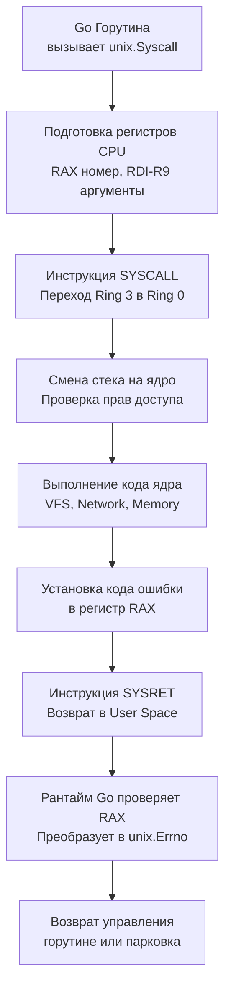

## Философия прямого взаимодействия с ядром и эволюция пакетов

В архитектуре вычислительных систем существует единственная непреодолимая граница между прикладным кодом и физическим кремнием компьютера — граница системных вызовов (system calls). Программа пользователя может оперировать сколь угодно элегантными абстракциями, структурами данных и горутинами, но в тот момент, когда ей требуется прочитать байт с NVMe-накопителя, отправить сетевой пакет в оптоволоконный кабель или запросить дополнительную страницу памяти, она обязана обратиться к ядру операционной системы.

В ранних версиях языка пакет `syscall` входил в стандартную библиотеку и предоставлял прямой доступ к системным вызовам Linux, macOS, Windows и других ОС. Однако с развитием платформы авторы Go приняли бескомпромиссное архитектурное решение: **заморозить пакет `syscall`** и перенести все низкоуровневые интерфейсы ядра в суб-репозиторий `golang.org/x/sys` (в частности, пакет `golang.org/x/sys/unix` для POSIX-систем).

Это решение было продиктовано обещанием обратной совместимости Go 1. Стандартная библиотека Go гарантирует неизменность API на десятилетия вперед. В то же время ядро Linux и операционные системы развиваются стремительно: появляются новые вызовы (`io_uring`, `epoll`, `fanotify`, интерфейсы `bpf`, `cgroups v2`, протоколы `netlink`), меняются флаги и форматы структур. Фиксация этих изменчивых структур внутри стандартной библиотеки связала бы руки инженерам.

Для разработчика системного уровня понимание этой эволюции обязательно. Прямой системный вызов — это прыжок из безопасного пространства пользователя (Ring 3) в привилегированный режим ядра (Ring 0). В Ring 0 нет сборщика мусора, нет проверки границ массивов и нет дружелюбных паник: любая ошибка в указателе или повреждение регистров ведут к немедленному падению процесса или зависанию ядра. Пакет `golang.org/x/sys/unix` сегодня является золотым отраслевым стандартом для создания контейнерных рантаймов, высокопроизводительных сетевых прокси, драйверов и системных утилит.

> [!info] Под капотом
> При вызове функций из пакета `golang.org/x/sys/unix` компилятор генерирует машинный код, подготавливающий регистры процессора в строгом соответствии с ABI системных вызовов целевой операционной системы. На платформе Linux x86_64 номер системного вызова загружается в регистр `RAX`, а аргументы последовательно помещаются в регистры `RDI`, `RSI`, `RDX`, `R10`, `R8`, `R9`. Затем исполняется процессорная инструкция `SYSCALL`. 
> 
> Процессор аппаратно переключается из непривилегированного режима пользователя (Ring 3) в режим ядра (Ring 0), подменяет указатель стека на стек ядра, проверяет права и передает управление диспетчеру прерываний ОС. После выполнения ядро загружает результат или отрицательный код ошибки в регистр `RAX` и возвращает управление в User Space инструкцией `SYSRET`. Рантайм Go проверяет значение `RAX` и автоматически преобразует отрицательные коды в типизированную ошибку `unix.Errno`.

---

## 1. Под капотом: Механика системного вызова в рантайме

В классическом C системные вызовы не выполняются напрямую — они оборачиваются библиотекой языка Си (`libc`, будь то glibc или musl). В отличие от C, Go вызывает ядро операционной системы **напрямую**, без посредников. В скомпилированном бинарнике Go нет неявной зависимости от динамического линковщика `libc` (если не используется cgo).

Однако прямое взаимодействие с ядром порождает сложнейшую задачу для планировщика Go: что делать, когда горутина засыпает на блокирующем системном вызове ввода-вывода?



Когда горутина выполняет блокирующий вызов ядра (например, `unix.Read` из дискового файла), рантайм не может допустить, чтобы физический поток операционной системы (структура `M`) заблокировался вместе с логическим процессором планировщика (`P`). Если это произойдет, сотни других готовых горутин на этом `P` окажутся парализованными.

В этот момент рантайм задействует механизм **Hand-off (передачи контекста)**:
1. Перед выполнением системного вызова генерируется обращение к внутренней функции `runtime.entersyscall`. Поток `M` помечается как вошедший в syscall.
2. Планировщик отвязывает логический процессор `P` от заблокированного системного потока `M`.
3. Если в локальной очереди `P` есть другие готовые к исполнению горутины, рантайм либо пробуждает спящий поток `M` из внутреннего пула, либо порождает новый тред ОС и привязывает `P` к нему.
4. Вызывающая горутина переводится в состояние ожидания `Gwaiting`.
5. По завершении системного вызова (вызов `runtime.exitsyscall`) поток `M` пытается вернуть свой прежний процессор `P`. Если все `P` заняты, горутина помещается в глобальную очередь выполнения (`sched.runq`), а тред `M` отправляется спать в пул свободных системных потоков.

---

## 2. Эволюция: Почему syscall устарел, а golang_org_x_sys стал стандартом

Разделение зон ответственности между стандартной библиотекой и внешним суб-репозиторием — блестящий пример прагматичного инженерного компромисса:

| Аспект | `syscall` (stdlib) | `golang.org/x/sys` |
|---|---|---|
| **Статус разработки** | Полностью заморожен. Новые системные вызовы не добавляются, вносятся лишь критические патчи безопасности. | Активно поддерживается и развивается командой Go. Поддержка новых версий ядер Linux и архитектур появляется незамедлительно. |
| **Покрываемость API ядра** | Только устаревший базовый набор POSIX и WinAPI. Отсутствуют современные механизмы `epoll`, `fanotify`, `io_uring`. | Полная поддержка всех современных фич Linux: `io_uring`, eBPF (`bpf`), контрольные группы `cgroups v2`, протоколы сетевого стека `netlink`. |
| **Безопасность типов** | Изобилует небезопасными типами `uintptr` и нетипизированными указателями `unsafe.Pointer` без предварительной валидации. | Предоставляет строгие типизированные структуры, идиоматичные срезы и автоматическую трансляцию кодов возврата в `unix.Errno`. |
| **Инженерная рекомендация** | **Категорически запрещен** для любого нового серверного и системного кода. | **Единственный официальный стандарт** для низкоуровневой работы с ОС в Go. |

> [!warning] Ловушка / Gotcha
> **Смешивание `syscall` и `golang.org/x/sys` в одном проекте.**
> Пакеты `syscall` и `golang.org/x/sys/unix` определяют собственные, несовместимые на уровне типов структуры данных для дескрипторов файлов, сигналов и структур времени. 
> 
> Попытка передать дескриптор `syscall.FD` в функцию, принимающую `unix.FD`, или смешивание обработчиков сигналов `syscall.SIGINT` с типами `unix.Signal` приводят либо к ошибкам компиляции, либо (что значительно опаснее) к неявным ошибкам кастинга памяти через `uintptr`. В новых модулях и библиотеках полностью исключайте импорт устаревшего `syscall`.

---

## 3. Mechanical Sympathy: Блокировки, кэш и цена переключения

Системный вызов — это чрезвычайно дорогая процессорная операция. При переходе из Ring 3 в Ring 0 процессор выполняет колоссальный объем аппаратной работы:
- Сохраняет регистры общего назначения, счетчик команд (`RIP`) и флаги (`RFLAGS`).
- Валидирует права доступа к сегментам памяти и переключает стек.
- После аппаратных уязвимостей типа Spectre и Meltdown современные ядра вынуждены сбрасывать предсказатели переходов и очищать части конвейера инструкций для изоляции памяти ядра от процесса пользователя.

Если приложение выполняет системные вызовы в плотном цикле (например, наивно читает сокет или файл по 1–4 байта), процессор тратит до 80% тактов на смену контекста и инвалидацию микроархитектурных буферов, а не на реальную обработку данных! 

Пакет `golang.org/x/sys/unix` предоставляет интерфейсы к векторным и позиционным системным вызовам (`unix.Preadv`, `unix.Readv`), которые позволяют за один-единственный системный переход передать ядру массив буферов (`iovec`), кардинально снижая нагрузку на конвейер CPU и планировщик ОС.

### Критическая роль `runtime.LockOSThread`

В Go горутины легки и подвижны: планировщик рантайма может в любой момент перенести выполнение горутины с одного потока операционной системы (тред M) на другой.

Однако многие системные вызовы ядра Linux изменяют состояние, привязанное **строго к конкретному потоку ядра (OS Thread)**:
- Системный вызов `unix.Setns` (переключение пространства имен / namespace, например сетевого `CLONE_NEWNET` в контейнерах).
- Системный вызов `ptrace` для отладки и трассировки процессов.
- Маски сигналов потока (`pthread_sigmask`) и приоритеты `nice`.

Если горутина вызовет `unix.Setns`, а затем планировщик перенесет ее на другой тред M, прикладной код окажется в непредсказуемом состоянии: последующие сетевые сокеты будут открываться в случайных пространствах имен!

Для защиты от миграций рантайм предоставляет функции `runtime.LockOSThread` и `runtime.UnlockOSThread`:

```go
package main

import (
	"fmt"
	"runtime"

	"golang.org/x/sys/unix"
)

// changeNetworkNamespace безопасно переключает сетевой неймспейс текущей горутины
func changeNetworkNamespace(newNetNS string) error {
	// КРИТИЧЕСКИ ВАЖНО: намертво привязываем горутину к текущему системному потоку ОС!
	runtime.LockOSThread()
	// Освобождаем привязку строго в defer при выходе из функции
	defer runtime.UnlockOSThread()

	// Открываем файловый дескриптор пространства имен с обязательным флагом O_CLOEXEC
	nsFD, err := unix.Open(newNetNS, unix.O_RDONLY|unix.O_CLOEXEC, 0)
	if err != nil {
		return fmt.Errorf("open namespace fd: %w", err)
	}
	defer unix.Close(nsFD)

	// Переключаем сетевой namespace для данного треда
	if err := unix.Setns(nsFD, unix.CLONE_NEWNET); err != nil {
		return fmt.Errorf("setns to %s: %w", newNetNS, err)
	}

	// Любые операции здесь гарантированно выполняются на этом же потоке ОС
	return nil
}
```

---

## 4. Идиомы использования: Эполл, обработка ошибок и сырые сокеты

Прямое взаимодействие с `golang.org/x/sys/unix` требует дисциплины в обработке ошибок. В ядре Linux ошибки возвращаются как целочисленный `errno`. Пакет Go автоматически транслирует его в тип `unix.Errno` (или стандартные обертки вроде `*PathError`), который реализует интерфейс `error`.

Рассмотрим промышленный пример создания неблокирующего TCP-сокета и его регистрацию в мультиплексоре `epoll`:

```go
package main

import (
	"fmt"

	"golang.org/x/sys/unix"
)

// createNonblockingSocketAndEpoll иллюстрирует низкоуровневую работу с сокетами и epoll
func createNonblockingSocketAndEpoll() (int, error) {
	// 1. Создаем сокет с атомарным флагом SOCK_CLOEXEC (защита от утечки в fork)
	fd, err := unix.Socket(unix.AF_INET, unix.SOCK_STREAM|unix.SOCK_CLOEXEC, unix.IPPROTO_TCP)
	if err != nil {
		return -1, fmt.Errorf("socket creation failed: %w", err)
	}

	// 2. Переводим дескриптор в неблокирующий режим через вызов fcntl
	flags, err := unix.FcntlInt(uintptr(fd), unix.F_GETFL, 0)
	if err != nil {
		unix.Close(fd)
		return -1, fmt.Errorf("fcntl getfl: %w", err)
	}
	if _, err := unix.FcntlInt(uintptr(fd), unix.F_SETFL, flags|unix.O_NONBLOCK); err != nil {
		unix.Close(fd)
		return -1, fmt.Errorf("fcntl setfl nonblock: %w", err)
	}

	// 3. Создаем инстанс epoll с флагом EPOLL_CLOEXEC
	epfd, err := unix.EpollCreate1(unix.EPOLL_CLOEXEC)
	if err != nil {
		unix.Close(fd)
		return -1, fmt.Errorf("epoll create failed: %w", err)
	}

	// 4. Регистрируем интерес к событиям входящих данных (EPOLLIN) и ошибок (EPOLLERR)
	event := unix.EpollEvent{
		Events: unix.EPOLLIN | unix.EPOLLERR,
		Fd:     int32(fd),
	}
	if err := unix.EpollCtl(epfd, unix.EPOLL_CTL_ADD, fd, &event); err != nil {
		unix.Close(fd)
		unix.Close(epfd)
		return -1, fmt.Errorf("epoll ctl add failed: %w", err)
	}

	return fd, nil
}
```

> [!info] Под капотом
> Почему функция `unix.FcntlInt` принимает тип `uintptr`? В низкоуровневых системных вызовах дескрипторы и указатели на структуры передаются напрямую в 64-битные регистры процессора. Использование `uintptr` сообщает компилятору и сборщику мусора, что это целочисленное значение архитектурного размера (64 бита), которое не является указателем на объект в управляемой куче Go. Сборщик мусора игнорирует его при сканировании и не устанавливает барьеры записи (write barriers).

---

## 5. Ловушки и хардкорные вопросы с собеседований

| Сценарий | Проблема | Решение |
|---|---|---|
| **Вызов `unix.Read` в цикле без обработки `EAGAIN`** | Неблокирующий сокет возвращает `unix.EAGAIN` (или `unix.EWOULDBLOCK`), когда в буфере нет данных. Наивный код считает это фатальным сбоем. | Явно проверяйте `err == unix.EAGAIN` (или `errors.Is(err, unix.EAGAIN)`) и паркуйте горутину через `netpoll` или `select`. |
| **Использование `syscall` в новом коде** | Пакет заморожен более 10 лет назад; в нем отсутствуют константы для современных ядер Linux и типов архитектур. | Полностью переходите на `golang.org/x/sys/unix`. Регулярно обновляйте модуль через `go get -u golang.org/x/sys`. |
| **Забытый флаг `unix.O_CLOEXEC`** | Любой порожденный дочерний процесс унаследует открытый дескриптор, удерживая блокировки файлов и сокеты. | Всегда объединяйте флаги открытия через побитовое ИЛИ: `unix.O_RDONLY | unix.O_CLOEXEC`. |
| **Невызов `UnlockOSThread` из-за паники** | Системный тред ядра остается навсегда заблокированным за «мертвой» горутиной. Рантайм порождает новые потоки, приводя к тред-трешингу. | Всегда оборачивайте вызовы `runtime.LockOSThread()` парным `defer runtime.UnlockOSThread()` или используйте эквивалент паттерна `try-finally`. |
| **Вызов `unix.Mmap` с флагом `unix.PROT_EXEC`** | Современные ядра с политиками W^X (Write XOR Execute, SELinux) немедленно блокируют выделение одновременно исполняемой и модифицируемой памяти. | Для генерации JIT-кода выделяйте память через `unix.PROT_READ | unix.PROT_WRITE`, записывайте код, и лишь затем меняйте флаги, либо используйте флаг `MAP_JIT`. При необходимости используйте вызов `unix.MADV_EXEC`. |

> [!tip] Собеседование
> **Вопрос:** Почему Go категорически запрещает использовать системный вызов `unix.Mprotect` для изменения прав на память, выделенную стандартным аллокатором кучи?
> **Ответ:** Рантайм Go управляет памятью кучи автономно с помощью специализированного аллокатора и битовых карт разметки (`heap bitmap`). Сборщик мусора выполняет фоновое конкурентное сканирование страниц памяти. Если прикладной код изменит атрибуты страницы кучи на `PROT_NONE` или уберет права на чтение, фоновый сборщик мусора упадет с фатальной паникой `SIGSEGV` в ядре при первой же попытке просканировать указатели. Системные вызовы `unix.Mprotect` и `unix.Mmap` допустимо применять исключительно к изолированным блокам памяти, выделенным напрямую через флаги `MAP_ANONYMOUS | MAP_PRIVATE` (`unix.MAP_ANONYMOUS | unix.MAP_PRIVATE`) в обход кучи рантайма.
>
> **Вопрос:** Как библиотека `golang.org/x/sys` справляется с несовместимостью версий ядер Linux на разных серверах?
> **Ответ:** Пакет компилирует константы для минимальной поддерживаемой версии ядра и предоставляет безопасные структуры. Для проверки наличия специфических системных вызовов в рантайме инженер может запросить версию ядра через системный вызов `unix.Uname`. Если системный вызов не поддерживается ядром хоста, ядро возвращает ошибку `unix.ENOSYS` (`unix.Unimplemented`) или `unix.EPERM`. Библиотека не прячет ошибки ядра, оставляя право на graceful degradation приложению.

---

## 6. Сравнение с экосистемами других языков

| Язык / Платформа | Механизм | Особенности в сравнении со стандартной библиотекой Go |
|---|---|---|
| **C / C++** | `<sys/syscall.h>`, системная `libc` | Прямой доступ к ассемблерным инструкциям `syscall`, но полное отсутствие координации с легковесными пользовательскими потоками. `libc` решает вопросы кросс-платформенности, но создает динамическую зависимость от окружения. |
| **Java** | JNI, `ProcessBuilder`, `sun.misc.Unsafe` | Для системного вызова требуется тяжелый переход через Java Native Interface (JNI). Переход в нативный код требует `CallNative` барьеров, дорогой по latency. Прямой вызов ядра без C-библиотек практически невозможен. |
| **Python** | Модули `os`, `subprocess`, `ctypes`, `cffi` | Любой системный вызов в CPython вынужден удерживать или отпускать Global Interpreter Lock (GIL). Вызовы через `ctypes` медленны из-за динамического маршалинга типов. |
| **Go** | `golang.org/x/sys/unix` | Нулевой оверхед мостов (прямой машинный код), безупречная интеграция с планировщиком горутин (G-M-P Hand-off), строгая типизация и полный контроль над потоками ОС через `LockOSThread`. |

---

## Итог

1. Устаревший пакет `syscall` заморожен. Для любых системных задач используйте официальный пакет `golang.org/x/sys/unix`.
2. Системный вызов — дорогая операция смены привилегий Ring 3 → Ring 0. Минимизируйте количество переходов с помощью буферизации и векторных вызовов (`unix.Readv`, `unix.Preadv`, системных вызовов `readv` и `writev`, механизмов `io_uring`).
3. При вызове функций, привязанных к конкретному треду операционной системы (`setns`, `ptrace`, маски сигналов), обязательно фиксируйте горутину через `runtime.LockOSThread()` и `UnlockOSThread()`.
4. Всегда используйте системный флаг `unix.O_CLOEXEC` при создании дескрипторов, чтобы исключить утечки секретов и сокетов в дочерние процессы.
5. Пакет `golang.org/x/sys/unix` автоматически преобразует коды возврата в тип `unix.Errno`. Корректно обрабатывайте неблокирующий маркер `unix.EAGAIN` при взаимодействии с сетевыми сокетами.
6. Прямой системный вызов снимает с вас защитный зонтик рантайма Go. Используйте системные утилиты `strace` и `perf` для верификации и профилирования взаимодействия вашего сервиса с ядром.

Освоив прямое взаимодействие с операционной системой, мы переходим к одному из самых важных этапов инженерной практики: обеспечению качества кода. Как писать надежные, быстрые и безопасные тесты, используя встроенные средства языка без сторонних фреймворков? В следующей статье мы разберем стандартный инструментарий проверки: [[45. testing. Unit test, Benchmark, Fuzzing]].