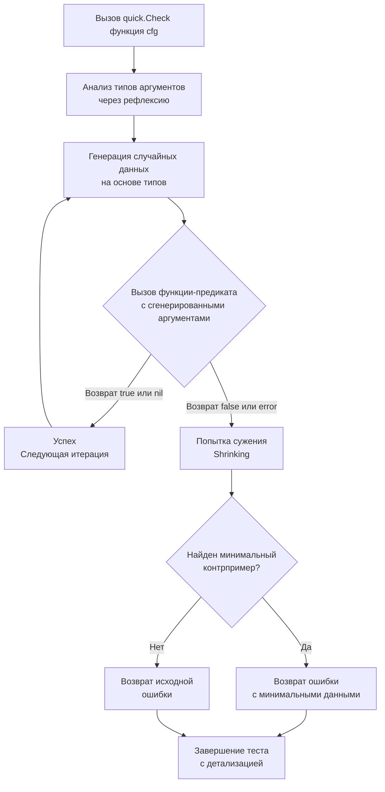

## Философия проверки свойств против примеров

Традиционное модульное тестирование, к которому привыкло большинство программистов, строится на конкретных примерах (example-based testing): «если подать на вход строку `"hello"`, функция обязана вернуть `"olleh"`». Мы тщательно подбираем краевые случаи — пустую строку, длинную строку, символы Юникода. Однако человек фундаментально ограничен собственной фантазией: мы тестируем лишь те сценарии и ловушки, о существовании которых уже догадались.

Подход **Property-Based Testing (PBT, тестирование на основе свойств)**, зародившийся в лабораториях функционального программирования (знаменитая библиотека QuickCheck для Haskell), переворачивает эту парадигму с головы на ноги:
Вместо проверки конкретных пар «вход → выход» инженер формулирует **математические инварианты (свойства системы)**, которые обязаны выполняться абсолютно для любого допустимого значения входных данных.

Классические примеры таких инвариантов:
- **Обратимость (Round-trip):** `decode(encode(data)) == data`.
- **Идемпотентность:** `sort(sort(list)) == sort(list)`.
- **Инвариантность длины:** при фильтрации списка длина результата никогда не может превышать длину исходного среза.
- **Двойное обращение:** `reverse(reverse(slice)) == slice`.

Пакет `testing/quick` в стандартной библиотеке Go предоставляет легковесную, элегантную и полностью автономную реализацию этой концепции. Он автоматически генерирует сотни случайных наборов данных, скармливает их функции-предикату и, если инвариант нарушается, запускает алгоритм поиска минимального контрпримера (shrinking), чтобы разработчик получил не гигантский нечитаемый массив, а простейший срез из двух байт, на котором сломалась логика.

> [!info] Под капотом
> Пакет `testing/quick` не зависит от внешних тяжелых библиотек. Он опирается на стандартный пакет `reflect` для интроспекции сигнатуры тестируемой функции прямо в рантайме. На основе типов параметров (`int`, `string`, `[]byte`, структуры с экспортированными полями) алгоритм рекурсивно конструирует случайные значения, используя генератор псевдослучайных чисел (PRNG). При этом генератор можно инициализировать фиксированным seed, что гарантирует абсолютную детерминированность и воспроизводимость упавших тестов в CI/CD.

---

## Under the hood. Механика работы и алгоритм сужения

При вызове функции `quick.Check(f, cfg)` разворачивается четкий и строгий алгоритм:

1. **Анализ сигнатуры функции:** Пакет через рефлексию проверяет контракт функции `f`. Предикат обязан возвращать либо `(bool, error)`, либо просто `(bool)`. Рантайм считывает типы всех аргументов.
2. **Цикл генерации значений:** Тест выполняется в цикле `cfg.MaxCount` раз (по умолчанию ровно 100 итераций). На каждом шаге создается объект `reflect.Value` для каждого аргумента и наполняется случайными данными.
3. **Вызов предиката:** Функция `f` вызывается через `reflect.Call`. Если возвращается `true` (и `nil` для ошибок), шаг считается пройденным, и цикл продолжается.
4. **Алгоритм сужения (Shrinking):** Если предикат возвращает `false` или ошибку, активируется процесс сужения контрпримера. Например, если функция упала на срезе из 10 000 элементов, отлаживать такой тест мучительно трудно. Движок shrinking начинает методично упрощать данные: делит целые числа пополам, усекает строки с конца, уменьшает размер срезов. Этот процесс продолжается до тех пор, пока тест продолжает воспроизводить ошибку. В итоге разработчик получает минимальный контрпример (например, массив из двух одинаковых отрицательных чисел).



---

## Mechanical Sympathy. Цена рефлексии и оптимизация генерации

Универсальность пакета `testing/quick` имеет свою вычислительную цену. Поскольку пакет написан для работы с любыми типами данных, он активно использует рефлексию `reflect`:
- Вызов `reflect.New(typ)` аллоцирует память в куче на каждый аргумент каждой итерации.
- Обращение к полям структур через `reflect.Value.Field()` или вызовы `Set()` создают косвенную адресацию памяти, вызывая промахи предсказателя ветвлений процессора.
- Вызов `reflect.Call()` производит перекладывание аргументов на стек и вызов по указателю, что полностью исключает возможность инлайнинга функции компилятором.

Если запустить тест при `MaxCount > 10000`, генератор создаст миллионы временных объектов в куче, спровоцирует активную работу GC и будет выполняться в 5–10 раз медленнее эквивалентного цикла на чистом коде Go.

### Идиоматичный пример: проверка инварианта разворота среза

Рассмотрим классическую задачу разворота числового среза и проверку математического свойства двойного разворота:

```go
package main

import (
	"math/rand"
	"reflect"
	"testing"
	"testing/quick"
)

// reverse разворачивает срез целых чисел на месте
func reverse(slice []int) []int {
	out := make([]int, len(slice))
	copy(out, slice)
	for i, j := 0, len(out)-1; i < j; i, j = i+1, j-1 {
		out[i], out[j] = out[j], out[i]
	}
	return out
}

func TestReverseInvariant(t *testing.T) {
	// Формулируем предикат свойства: reverse(reverse(x)) == x
	assertion := func(x []int) bool {
		// Nil-срез и пустой срез считаются эквивалентными в нашей логике
		if x == nil {
			return true
		}

		// Защита от избыточных аллокаций при случайной генерации огромных массивов
		if len(x) > 10000 {
			x = x[:10000]
		}

		reversed := reverse(x)
		doubleReversed := reverse(reversed)

		// Для сравнения срезов используем reflect.DeepEqual (в Go оператор == не применим к срезам)
		return reflect.DeepEqual(x, doubleReversed)
	}

	// Настраиваем конфигурацию запуска
	cfg := &quick.Config{
		MaxCount: 1000, // 1000 независимых случайных генераций
		Rand:     rand.New(rand.NewSource(42)), // Фиксированный seed для детерминизма в CI
	}

	if err := quick.Check(assertion, cfg); err != nil {
		t.Errorf("invariant failed: %v", err)
	}
}
```

> [!warning] Ловушка / Gotcha
> **`testing/quick` не генерирует `nil` для срезов и указателей по умолчанию.**
> Внутренний генератор спроектирован так, чтобы конструировать валидные ненулевые структуры данных. Если логика вашей функции критично завязана на обработку `nil` (например, проверка защиты от паники при разыменовании `nil`-указателя), вы должны проверять этот сценарий отдельным модульным тестом или явно генерировать `nil` через реализацию интерфейса `quick.Generator`. Кроме того, пакет не умеет генерировать значения интерфейсных типов и каналов.

---

## Ловушки и хардкорные вопросы с собеседований

| Сценарий | Проблема | Решение |
|---|---|---|
| **`quick.Check` с внешними сетевыми вызовами** | Тест пытается дергать HTTP-эндпоинты или базу данных. Случайный мусор ломает схему таблиц или вызывает 500-е ошибки. | PBT строго предназначен **только для чистых детерминированных функций** без побочных эффектов. Для интеграционных тестов используйте фиксированные фикстуры. |
| **Сложные структуры данных без shrinking** | Базовый shrinking в `testing/quick` умеет упрощать только элементарные скалярные типы. Сложные графы объектов и вложенные структуры возвращаются «как есть». | При необходимости сложного сужения применяйте специализированные внешние библиотеки (`gopter`, `rapid`, `go-check`). |
| **Плавающие падения в CI/CD** | При разных запусках генератор использует случайный seed, из-за чего баг воспроизводится раз в 50 билдов. | Всегда фиксируйте генератор псевдослучайных чисел: `quick.Config{Rand: rand.New(rand.NewSource(42))}`. |
| **Целочисленное переполнение** | Генератор создает экстремальные граничные числа вроде `math.MaxInt64`. Арифметика внутри функции переполняется и вызывает панику. | Ограничивайте диапазон значений внутри предиката или проверяйте граничные условия математических операций до вызова бизнес-логики. |
| **`reflect.DeepEqual` против кастомных компараторов** | `reflect.DeepEqual` медленен, чувствителен к неэкспортированным полям и не умеет сравнивать типы вроде `time.Time` или `float64` с дельтой погрешности. | Для нетривиальных структур с числами с плавающей точкой или временем используйте библиотеку `google/go-cmp` (метод `cmp.Equal`) внутри функции-предиката. |

> [!tip] Собеседование
> **Вопрос:** В каких архитектурных сценариях Property-Based Testing дает максимальную отдачу по сравнению с обычными Unit-тестами?
> **Ответ:** PBT раскрывает свой колоссальный потенциал там, где входное пространство данных бесконечно велико, а свойства системы поддаются строгой математической формализации:
> 1. Сериализаторы и десериализаторы (проверка симметрии `unmarshal(marshal(v)) == v`).
> 2. Алгоритмы сжатия данных (`decompress(compress(b)) == b`).
> 3. Криптографические примитивы и хэш-функции (отсутствие коллизий на различных диапазонах).
> 4. Синтаксические парсеры и AST-трансляторы (парсинг никогда не должен завершаться паникой рантайма, какой бы мусор ни пришел на вход).
> 5. Математические и финансовые алгоритмы (ассоциативность, коммутативность, сохранение баланса при переводах).
>
> **Вопрос:** Почему пакет `testing/quick` часто называют «наследием прошлого» (legacy) и какие альтернативы существуют в современном Go?
> **Ответ:** Пакет `testing/quick` был добавлен в ранние дни существования Go и почти не развивался более десяти лет. В нем нет поддержки современных дженериков Go 1.18+, отсутствует stateful-тестирование (проверка моделей конечных автоматов), а алгоритм сужения (shrinking) крайне примитивен. В современном production-коде для глубокого тестирования свойств используют библиотеки `rapid` (современная, zero-reflection библиотека с мощным shrinking) или `gopter`. Тем не менее, `testing/quick` остается бесценным инструментом в стандартной библиотеке: он гарантированно доступен в любом окружении с нулевыми внешними зависимостями.

---

## Сравнение с экосистемами других языков

| Язык / Библиотека | Подход к PBT | Особенности в сравнении со стандартным Go |
|---|---|---|
| **Haskell** (`QuickCheck`) | Родоначальник парадигмы. Вывод генераторов типов на этапе компиляции через систему классов типов (`Arbitrary`). | Максимальная выразительность и математическая строгость. В Go вывод типов на этапе компиляции отсутствует, генерация опирается на рантайм-рефлексию. |
| **Java** (`jqwik`, `ScalaCheck`) | Аннотации, интеграция с JUnit 5, генерация через динамические прокси. | Мощный shrinking и stateful-модели, но тяжеловесный код с аннотациями и накладными расходами JVM. Go предлагает минималистичный декларативный интерфейс. |
| **Python** (`hypothesis`) | Продвинутый движок сужения на базе байтовых потоков, stateful testing. | Эталонный shrinking среди всех динамических языков. Однако скорость генерации ограничена интерпретатором CPython. Go в разы быстрее на численных алгоритмах. |
| **Rust** (`proptest`) | Макросы компилятора, zero-cost генераторы без рефлексии. | Предельная производительность и типобезопасность на этапе компиляции. Go жертвует скоростью ради простоты единого пакета `reflect`. |
| **Go** (`testing/quick`) | Встроен в стандартную библиотеку, нулевые зависимости, интеграция с `go test`. | Идеален для быстрых проверок инвариантов и smoke-тестирования в CI/CD без раздувания `go.mod`. |

---

## Итог

1. Property-Based Testing проверяет непреложные инварианты системы на сотнях случайно сгенерированных наборов данных, позволяя находить скрытые баги в неочевидных граничных пространствах.
2. Пакет `testing/quick` использует рефлексию `reflect` для динамического построения аргументов и встроенный алгоритм сужения (shrinking) для поиска минимального контрпримера ошибки.
3. Всегда ограничивайте объем итераций параметром `cfg.MaxCount` (разумный диапазон — от 100 до 1 000) и фиксируйте seed генератора случайных чисел для детерминированности проверок в пайплайне CI.
4. PBT применим исключительно к чистым функциям без побочных эффектов. Не используйте его для кода, взаимодействующего с сетью или базами данных.
5. Для сложных иерархических структур и проектов промышленного масштаба рассмотрите современные альтернативы (`rapid` или `gopter`), однако сохраняйте знание `testing/quick` как надежного инструмента stdlib с нулевыми зависимостями.
6. Сочетайте классические табличные тесты с тестированием свойств: таблицами проверяйте известные бизнес-кейсы, а PBT доверяйте проверку фундаментальных математических инвариантов.

Разобрав методы тестирования и валидации свойств кода, мы переходим к механизму динамической загрузки модулей. Позволяет ли Go загружать код в runtime, как это делают плагины в C или Java, и какие архитектурные ограничения накладывает статическая линковка? В следующей статье мы изучим возможности и границы этой технологии: [[47. plugin. Динамическая загрузка модулей]].