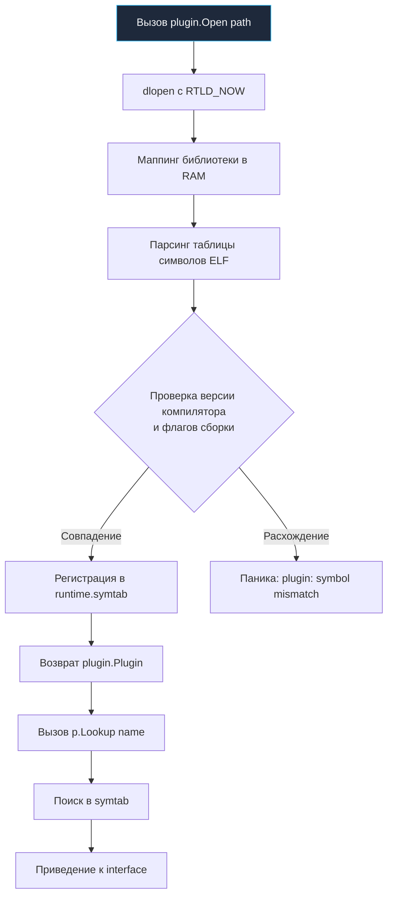
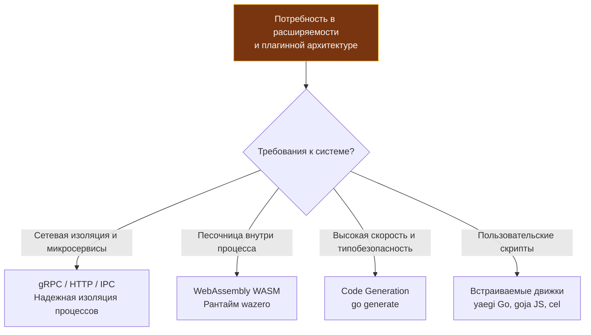

## Философия статической линковки и ограничения динамической загрузки

Одно из величайших архитектурных решений, определивших триумф Go в облачной инфраструктуре — это возврат к бескомпромиссной **статической линковке по умолчанию**. 

Десятилетиями разработчики на C, C++ и Java страдали от так называемого «DLL hell» (ада разделяемых библиотек): несовместимости версий в `LD_LIBRARY_PATH`, конфликтов транзитивных зависимостей и непредсказуемых сбоев при обновлении системных пакетов операционной системы. Go разрубил этот гордиев узел: компилятор собирает весь прикладной код, рантайм и сторонние библиотеки в единый самодостаточный бинарный файл. Вы просто копируете один файл в чистый Docker-образ `scratch` — и сервис мгновенно запускается на любом Linux-сервере с тем же ядром и архитектурой CPU.

Пакет `plugin` был добавлен в Go 1.8 как экспериментальный механизм для нишевых задач, когда пользователям требовалось динамически подгружать скомпилированный код во время работы программы без ее перезапуска (например, для аналитических модулей или расширений баз данных). 

Однако этот механизм идет вразрез с фундаментальной философией языка. Для Senior-инженера критически важно понимать: **пакет `plugin` — одна из самых хрупких и опасных частей стандартной библиотеки, категорически не рекомендуемая для production-систем**. В этой статье мы разберем, как устроен этот механизм на уровне ELF и `dlopen`, почему он лишен песочницы и какие современные альтернативы (от gRPC до WebAssembly) вытеснили динамические плагины в промышленной разработке.

> [!info] Под капотом
> При сборке с флагом `go build -buildmode=plugin` компилятор генерирует динамически разделяемую библиотеку (`.so` на Linux). В момент вызова `plugin.Open()` рантайм Go обращается к системному вызову операционной системы `dlopen` с флагом `RTLD_NOW`, загружает машинный код библиотеки прямо в виртуальное адресное пространство текущего процесса, парсит таблицу символов ELF и регистрирует их во внутренней структуре `runtime.symtab`.
> 
> Загруженный плагин **не изолирован**: он разделяет ту же самую кучу (heap), тот же самый Garbage Collector и тот же пул потоков планировщика (G-M-P), что и основное приложение!

---

## Механика работы и разрешение символов

Плагин в Go представляет собой обычный пакет с объявлением `package main`, в котором экспортируются функции, типы или переменные верхнего уровня. На этапе компиляции основного сервиса компилятор ничего не знает о типах плагина — вся проверка согласованности откладывается на момент выполнения (runtime) при вызове метода `p.Lookup`.

Исходный код плагина:
```go
// plugin.go (компилируется командой: go build -buildmode=plugin -o mod.so plugin.go)
package main

type Handler struct{}

func (h Handler) Process(data string) string {
	return "processed: " + data
}

// Экспортируемая переменная верхнего уровня обязана находиться в package main
var MyPluginHandler = Handler{}
```

Загрузка и вызов плагина в хост-приложении:
```go
package main

import (
	"errors"
	"fmt"
	"log"
	"plugin"
)

func loadAndRun(path string) error {
	// 1. Динамическая загрузка разделяемой библиотеки через dlopen
	p, err := plugin.Open(path)
	if err != nil {
		return fmt.Errorf("open plugin: %w", err)
	}

	// 2. Поиск символа в таблице экспорта по строковому имени
	sym, err := p.Lookup("MyPluginHandler")
	if err != nil {
		return fmt.Errorf("lookup symbol: %w", err)
	}

	// 3. Динамическое приведение типов (type assertion) в рантайме.
	// Компилятор не проверял типы заранее! Ошибка приведет к panic, если не проверить ok.
	handler, ok := sym.(interface{ Process(string) string })
	if !ok {
		return errors.New("invalid plugin signature: interface contract mismatch")
	}

	result := handler.Process("test-payload")
	log.Println(result)
	return nil
}
```



> [!warning] Ловушка / Gotcha
> **Абсолютное и беспощадное требование к совпадению версий и окружения.**
> Хост-приложение и плагин **обязаны** быть скомпилированы абсолютно идентичной версией компилятора Go, с одинаковыми системными флагами сборки (`-trimpath`, `-ldflags`, целевыми переменными `GOOS` и `GOARCH`), и — самое сложное — использовать до бита одинаковые версии абсолютно всех транзитивных зависимостей!
> 
> Если хост использует библиотеку `github.com/lib/pq` версии 1.10.7, а плагин был скомпилирован с версией 1.10.8 (или даже с идентичной версией, но другой ревизией компилятора), вызов `plugin.Open()` или `p.Lookup()` завершится фатальной паникой: `plugin was built with a different version of package...`. В реальных распределенных CI/CD пайплайнах поддержание такой синхронизации практически недостижимо.

---

## Mechanical Sympathy. ABI, GC и отсутствие изоляции

Пакет `plugin` не создает виртуальной машины, песочницы или изолированного процесса. Он буквально внедряет чужой машинный код в живой процесс вашего сервиса:

1. **Единая куча и невидимость для GC:** Все объекты, создаваемые кодом плагина, аллоцируются в единой куче процесса Go. Сборщик мусора сканирует их на общих основаниях. При этом встроенный профайлер `pprof` не может четко разделить аллокации хоста и плагина, а утечка памяти в непроверенном коде плагина неизбежно приводит к OOM всего серверного процесса.
2. **Паника в плагине уничтожает хост:** Встроенная функция `recover()` в Go способна перехватить панику только в рамках **текущей горутины**. Если плагин внутри своего метода породит фоновую горутину через ключевое слово `go` и в ней произойдет паника (разыменование `nil`-указателя или выход за границы среза), **весь хост-процесс мгновенно упадет**. Никакой изоляции сбоев нет!
3. **Нестабильность ABI (Application Binary Interface):** Язык Go сознательно не фиксирует стабильный бинарный интерфейс между минорными релизами компилятора. Выравнивание полей в структурах, соглашения о передаче аргументов через регистры CPU (ABIInternal) и метаданные сборщика мусора могут меняться от версии к версии. Это делает динамические плагины непригодными для распространения в виде готовых бинарных модулей.
4. **Невозможность выгрузки (No Unload):** В рантайме Go **принципиально не реализована выгрузка плагинов** (`dlclose`). Если вы загрузили `.so` файл, его код, структуры и память останутся в адресном пространстве процесса навсегда, вплоть до полного завершения работы операционной системы. «Горячая замена» кода без перезапуска процесса через `plugin` невозможна!

---

## Идиомы использования и современные альтернативы

Пакет `plugin` сегодня допустим лишь в узких нишах:
- Локальные CLI-утилиты разработчика, где перезапуск процесса при обновлении плагина не является проблемой.
- Устаревшие legacy-системы, жестко привязанные к разделяемым библиотекам Си через `cgo`.
- Быстрое прототипирование proof-of-concept.

В современной промышленной разработке на Go для расширяемости систем применяются совершенно иные, зрелые архитектурные подходы:



1. **Микросервисы и gRPC / IPC:** Плагины оформляются как отдельные независимые процессы, взаимодействующие с хостом через Unix Domain Sockets или TCP с помощью `gRPC`. При падении плагина хост продолжает работу, процессы деплоятся и масштабируются независимо.
2. **WebAssembly (WASM):** Главная революция в плагинной архитектуре. Код компилируется в байткод WASM и исполняется внутри безопасной песочницы. Библиотека `wazero` — это чистый рантайм WebAssembly на 100% Go без необходимости в `cgo`. Вы получаете изоляцию памяти, контроль ресурсов и возможность безопасного исполнения недоверенного пользовательского кода.
3. **Кодогенерация (`go generate`):** Статическое связывание на этапе сборки. Конфигурация описывается декларативно, генератор создает строго типизированный Go-код, который компилируется в монолитный бинарник с нулевым runtime-overhead.
4. **Встраиваемые скриптовые интерпретаторы:** Для динамических бизнес-правил применяются безопасные интерпретаторы: `yaegi` (интерпретатор чистого Go), `goja` (полноценный движок ECMAScript/JavaScript на Go) или Google `cel` (Common Expression Language).

---

## Ловушки и вопросы с собеседований

| Сценарий | Проблема | Решение |
|---|---|---|
| **`plugin.Lookup` возвращает `interface{}`** | Сигнатуры методов не проверяются компилятором. Ошибка в типах приведет к панике при первом же вызове. | Всегда используйте безопасное приведение типов (`type assertion`) с проверкой флага `ok`. Не допускайте слепого вызова без проверки контракта интерфейса. |
| **Попытка обновления плагина на лету** | Загрузка новой версии `.so` поверх старой приводит к коллизиям в таблице символов рантайма и падению процесса. | Штатный `plugin` не поддерживает hot-reload. Для бесшовного обновления используйте контейнеры с rolling-update или модули WebAssembly (WASM). |
| **Компиляция плагина под Windows** | Команда `go build -buildmode=plugin` исторически не имеет нативной поддержки на Windows и требует MinGW / `cgo`. | Разрабатывайте плагины исключительно для целевой платформы Linux/macOS, либо переходите на кросс-платформенный WASM. |
| **Утечки памяти при долгой работе** | Циклические ссылки между хостом и плагином могут препятствовать очистке памяти сборщиком мусора. | Избегайте плагинов в долгоживущих демонах. В крайних случаях для сброса страниц ОС применяют хак `runtime/debug.FreeOSMemory()`. |
| **Конфликт версий сторонних пакетов** | Хост и плагин импортируют разные версии `github.com/lib/pq` или других библиотек. | Модели компиляции Go не позволяют линковать разные версии одного пакета в один процесс: возникнет паника `plugin: symbol has wrong type`. Выносите конфликтующие модули в отдельные независимые микросервисы. |

> [!tip] Собеседование
> **Вопрос:** Почему пакет `plugin` в Go официально помечен как экспериментальный и не рекомендуется сообществом для production?
> **Ответ:** Архитектура Go фундаментально оптимизирована под статическую линковку и надежную изоляцию на уровне процессов ОС. Пакет `plugin` нарушает эти принципы: он жестко привязан к идентичности версий компилятора и всех библиотек, не обеспечивает изоляции памяти и паник (любая ошибка плагина роняет хост-сервис), не позволяет выгружать библиотеки из памяти (`dlclose` отсутствует) и плохо переносим между операционными системами (Windows нативно не поддерживается). Для создания расширяемых production-систем стандартом де-факто стали `gRPC` по Unix-сокетам или WebAssembly (`wazero`).
>
> **Вопрос:** Как организовать безопасное исполнение стороннего пользовательского плагина в облачном Go-сервисе?
> **Ответ:** Категорически нельзя использовать системные плагины `.so`, функции типа `eval` или вызов внешних shell-скриптов. Безопасное исполнение организуется через:
> 1. WebAssembly-песочницу (рантайм `wazero` на чистом Go): плагин компилируется в `.wasm`, не имеет прямого доступа к файловой системе и сети хоста, а потребление памяти и процессорных тактов строго квотируется.
> 2. Легковесные интерпретаторы вроде `cel` (для выражений валидации) или `goja` (для JavaScript).
> 3. Изоляцию на уровне операционной системы: запуск плагина в одноразовом Docker-контейнере или микро-ВМ (Firecracker) с ограничением ресурсов через контрольные группы ядра Linux (`cgroups`).

---

## Сравнение с экосистемами других языков

| Язык / Платформа | Механизм динамической загрузки | Особенности в сравнении со стандартным Go |
|---|---|---|
| **Java** | `ClassLoader`, загрузка `.jar`, OSGi | Богатейшая инфраструктура динамической загрузки с изоляцией пространств имен классов и поддержкой горячей выгрузки. Плагины тяжелы, но полноценно поддерживаются на уровне архитектуры JVM. В Go изоляция классов и выгрузка отсутствуют. |
| **Python** | Модули `importlib`, встроенный `exec` | Динамическая природа языка позволяет импортировать и заменять модули прямо во время исполнения скрипта. Однако Global Interpreter Lock (GIL) ограничивает параллелизм, а отсутствие типизации чревато скрытыми ошибками рантайма. |
| **C / C++** | Системный вызов `dlopen`, технологии COM / dlsym | Предельная гибкость и абсолютный контроль над памятью, но колоссальный риск `segmentation fault` при малейшей ошибке в указателях. Go добавляет безопасность типов и GC, но платит за это жесткими ограничениями на компиляцию. |
| **Go** | Пакет `plugin` | Простой API, но фатальная хрупкость: требует побитового совпадения версий компилятора и зависимостей, не защищен от паник и не поддерживает выгрузку кода. В современном стеке повсеместно замещается на WebAssembly (WASM) или RPC. |

---

## Итог

1. Go — язык статической линковки. Пакет `plugin` является экспериментальным исключением, создающим скрытые архитектурные риски и точки отказа.
2. Плагины требуют 100% совпадения версий компилятора Go, флагов сборки и версий всех общих зависимостей. Малейшее расхождение делает запуск невозможным.
3. Код плагина исполняется в едином адресном пространстве хоста. Паника в фоновой горутине плагина фатально завершает работу всего серверного приложения.
4. Выгрузка загруженных плагинов из памяти (`dlclose`) в рантайме Go принципиально не поддерживается.
5. Для расширения функциональности в современном production используйте проверенные альтернативы: микросервисы по `gRPC`, безопасную песочницу WebAssembly (`wazero`), генерацию кода `go generate` или интерпретаторы бизнес-правил (`cel`, `yaegi`).
6. Используйте пакет `plugin` исключительно для внутренних вспомогательных утилит CLI или исследовательских прототипов.

Завершив анализ всех пакетов стандартной библиотеки, мы подводим итоги раздела. В следующей статье мы систематизируем полученные знания, сформулируем стратегию выбора инструментов и определим, когда stdlib достаточна, а когда пора подключать внешние зависимости: [[48. Итоги раздела. Как эффективно использовать стандартную библиотеку Go]].