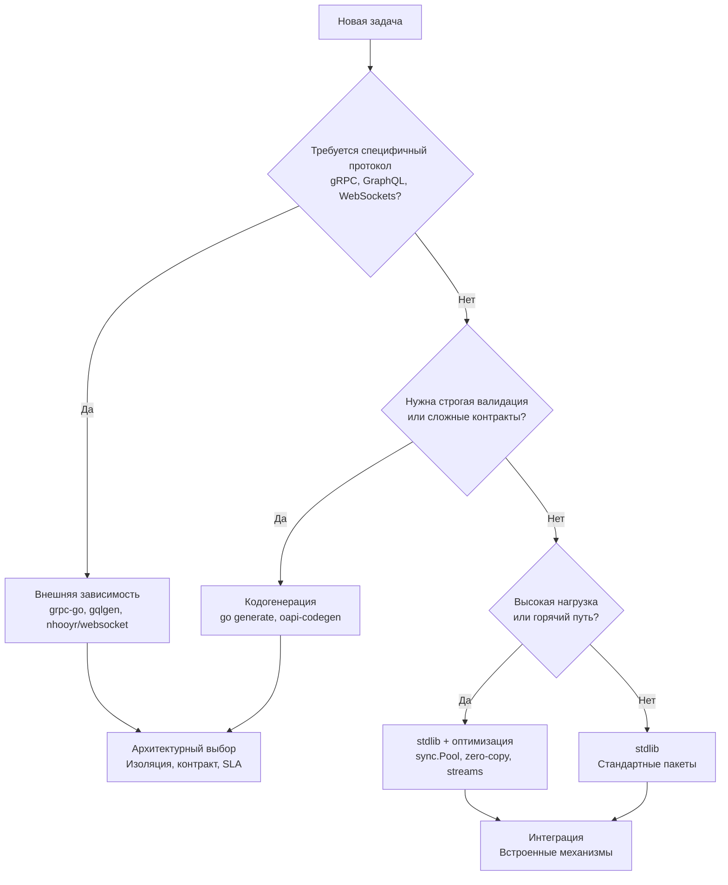

## Философия инженерного минимализма

Пройдя грандиозный путь от элементарных манипуляций со строками и рунами до низкоуровневых системных вызовов ядра и динамической загрузки модулей, мы можем с высоты птичьего полета охватить всю архитектурную картину. 

Стандартная библиотека Go — это не случайный склад разрозненных вспомогательных утилит, как во многих старых языках. Это **цельная, глубоко продуманная и согласованная инженерная экосистема**, созданная патриархами компьютерных наук из Bell Labs вокруг трех краеугольных принципов:
1. **Явность вместо неявной магии:** Никаких скрытых аннотаций, байткод-манипуляций и непредсказуемой подкапотной рефлексии. То, что написано в коде — ровно то и выполняется процессором.
2. **Ортогональная композиция:** Библиотека строится на миниатюрных, филигранно отточенных интерфейсах (`io.Reader`, `io.Writer`, `http.Handler`, `fs.FS`). Любой компонент легко стыкуется с любым другим, подобно кубикам конструктора Lego.
3. **Предсказуемость рантайма:** Код, написанный на стандартной библиотеке, ведет себя детерминированно под высокой нагрузкой. Вы всегда можете оценить затраты тактов CPU, количество аллокаций в куче и характер обращений к ядру ОС.

Для программиста, пришедшего из мира тяжеловесных монолитных фреймворков (Spring Boot, Ruby on Rails, Laravel, ASP.NET), стандартный инструментарий Go поначалу может показаться аскетичным. Однако для Senior- и Lead-инженера этот минимализм — величайшее архитектурное преимущество: вы проектируете системы, где каждый сетевой сокет, каждый поток и каждый байт памяти находятся под полным контролем вашей команды, без зависимости от сотен чужих транзитивных библиотек.

> [!info] Под капотом
> Все пакеты стандартной библиотеки функционируют внутри **единого монолитного рантайма**: они разделяют общий сборщик мусора (GC), единый распределитель памяти (аллокатор на базе принципов `tcmalloc`) и единый кооперативный планировщик горутин (модель G-M-P). 
> 
> Это означает, что пакеты `net/http`, `encoding/json` и `database/sql` не просто «совместимы» — они работают в едином адресном пространстве, делят общую кучу, одни и те же системные треды ядра Linux и общие примитивы синхронизации. Глубокое понимание их симбиоза позволяет писать сервисы, которые не борются с рантаймом, а многократно усиливают его естественные преимущества.

---

## Стратегический фреймворк выбора инструментов

Каждый день перед архитектором встает фундаментальный вопрос: решить задачу стандартными средствами языка или подключить стороннюю зависимость? Для принятия обоснованных инженерных решений в боевых сервисах с нагрузкой от 1 000 до 50 000+ RPS используйте следующий проверенный алгоритм:

### Практическая матрица инженерных решений

1. **Управление конфигурацией:** Для 80% микросервисов связка `os.Getenv` + пакет `flag` (или `encoding/json` для чтения файлов) абсолютно достаточна. Переходите на внешние конфигураторы (`viper`, `koanf`) только при жесткой необходимости динамического перезапуска конфигурации на лету (hot reload) или при работе со сложными иерархическими форматами YAML/TOML с валидацией схем.
2. **Структурированное логирование:** Начиная с Go 1.21, стандартный пакет `log/slog` полностью вытеснил сторонние логгеры для большинства задач. Подключайте внешние библиотеки (`OpenTelemetry`, `Structlog`) только для сквозной интеграции с распределенной трассировкой спанов (Distributed Tracing) и метриками.
3. **HTTP-маршрутизация и API:** Встроенный пакет `net/http` с новым маршрутизатором `http.ServeMux` (Go 1.22+ с поддержкой паттернов методов и путей `GET /users/{id}`) покрывает потребности 90% микросервисов. Сторонние роутеры (`chi`, `gin`, `echo`) оправданы лишь при наличии сложных разветвленных middleware-цепочек или при миграции крупного легаси-кода.
4. **Сериализация данных:** Формат `encoding/json` — универсальный стандарт для внешних клиентских REST API. Пакет `encoding/gob` идеален для высокоскоростной передачи бинарных данных между сервисами на Go в локальных очередях. При сверхвысоких требованиях к пропускной способности (>100k RPS) переходите на бинарный `protobuf` либо оптимизированные кодогенераторы JSON (`sonic`, `easyjson`).
5. **Работа с реляционными СУБД:** Стандартный слой `database/sql` в сочетании с нативными драйверами (`pgx` для PostgreSQL, `mysql` для MySQL) и генератором `sqlc` дает абсолютный идеал: типобезопасный код без накладных расходов. Использование тяжелых ORM (`gorm`, `ent`) допустимо только в командах с высокой динамикой изменения схем или при отсутствии глубокой экспертизы в SQL.

---

## Under the hood: Системная интеграция и рантайм

Каждый пакет стандартной библиотеки Go спроектирован с учетом глубокого взаимопроникновения с ядром рантайма и операционной системой:

* **Сетевая подсистема (`net`, `net/http`):** Реализует неблокирующий ввод-вывод через встроенный в рантайм сетевой поллер (`netpoller`), мультиплексирующий дескрипторы через `epoll/kqueue` (Linux/BSD/macOS). В отличие от классических языков с потоками ОС, ожидающая сетевого ответа горутина Go не блокирует системный тред (M), а паркуется планировщиком G-M-P в User Space, экономя системные вызовы.
* **Примитивы синхронизации (`sync`, `sync/atomic`):** Используют гибридную двухфазную стратегию. На первом этапе выполняется атомарная инструкция `CAS` (Compare-And-Swap) в пользовательском пространстве без переключения контекста. Лишь при возникновении длительной конкуренции рантайм Go обращается к системному вызову `futex` в Kernel Space ядра Linux, паркуя горутину.
* **Управление памятью и GC (`sync.Pool`, `bytes`, `strings`):** Спроектированы для минимизации аллокаций. Переиспользование буферов через `sync.Pool` и методы `Reset()` и `Grow()` удерживает объекты в быстром поколении памяти, исключая разрастание кучи и предотвращая преждевременное срабатывание сборщика мусора по порогу `GOGC`.
* **Управление контекстом и временем (`context`, `time`):** Пакет `context` опирается на иерархическое закрытие каналов Go. Сигнал отмены — это атомарная операция $O(1)$ закрытия канала `<-ctx.Done()`, мгновенно пробуждающая все дочерние горутины в `select`. Внутренняя куча таймеров рантайма отслеживает наступление дедлайнов с точностью до наносекунд.
* **Криптографический фундамент (`crypto/*`, `crypto/subtle`):** Обеспечивает аппаратное ускорение через процессорные инструкции (`AES-NI`, `SHA Extensions`) и гарантирует строгое constant-time исполнение операций сравнения, делая приложение неуязвимым к атакам по сторонним каналам (side-channel attacks).

---

## Mechanical Sympathy: Паттерны высоконагруженных систем

Для достижения времени отклика p99 < 10 мс в высоконагруженных системах применяйте золотые правила проектирования:

1. **Потоковая обработка вместо полной загрузки в память:** Всегда связывайте источники и приемники через потоковые интерфейсы `io.Copy`, `json.Decoder`, `tar.Reader` и буферизацию `bufio`. Категорически запрещайте использование `io.ReadAll` для обработки входящих HTTP-запросов и сетевых потоков неограниченного размера.
2. **Zero-Copy и минимизация аллокаций:** Применяйте `unsafe.Slice`, `strings.Builder` и функции семейства `strconv.Append*` в критических путях обработки данных. Исключайте тяжелое форматирование через `fmt.Sprintf` и лишние взаимные конвертации `[]byte <-> string` внутри горячих циклов.
3. **Явный контроль пулов соединений:** Всегда конфигурируйте сетевые транспорты `http.Transport` и пулы баз данных `database/sql`. Лимиты `MaxIdleConns`, `MaxOpenConns` и время жизни `IdleConnTimeout` обязаны соответствовать реальному трафику и лимитам открытых файловых дескрипторов операционной системы.
4. **Контекст как первый аргумент:** Передавайте `context.Context` первым параметром во все функции ввода-вывода. Интегрируйте его в сетевые запросы `http`, транзакции `sql`, запуск подпроцессов `exec` и бизнес-методы для обеспечения надежного graceful shutdown и каскадной отмены зависших операций.
5. **Идиоматичная обработка ошибок:** Оборачивайте ошибки с сохранением стека и контекста через `fmt.Errorf("%w", err)`, сопоставляйте маркеры сбоев через `errors.Is` и безопасно извлекайте типизированные структуры через `errors.As`. Никогда не глушите ошибки пустым идентификатором `_` без исчерпывающего комментария.

---

## Правила Senior Engineer при работе со stdlib

> [!warning] Ловушка / Gotcha
> **Стандартная библиотека — это не монолитный фреймворк.**
> Попытки построить поверх Go «микро-Spring» или сложный enterprise-комбайн с динамической DI-магией, рефлексией `reflect` и глобальными реестрами разрушают идиоматику языка, превращая быстрый и предсказуемый бинарник в медленного монстра, не поддающегося отладке и статическому анализу.

1. **Композиция интерфейсов превыше наследования:** Проектируйте взаимодействие через лаконичные стандартные интерфейсы `io.Reader`, `http.Handler`, `fs.FS`. Избегайте искусственного раздувания иерархий и создания пустых абстракций вида `IUserService`.
2. **Явность лучше неявной магии:** Не полагайтесь на структуры с десятками рефлексивных тегов `json`/`sql` как на единственный источник правды. Пишите явные конвертеры данных или применяйте кодогенератор `sqlc`. Любая неявная магия ломается при масштабировании кодовой базы.
3. **Профилирование до любой оптимизации:** Никогда не пытайтесь угадать узкое место на глазок! Запускайте точные бенчмарки `go test -bench`, снимайте профили `pprof`, исследуйте трассировку планировщика `trace`. Оптимизируйте ровно те участки, на которые указывает пламенная диаграмма Flame Graph (flame graph / 火焰 graph).
4. **Тестируйте контракт и поведение, а не детали реализации:** Стройте тестовую базу на табличных тестах, тестовых серверах `httptest` и изолированных окружениях `testcontainers`. Для поиска граничных условий алгоритмов используйте генеративное тестирование свойств `testing/quick`.
5. **Держите граф зависимостей чистым и легким:** Каждая внешняя библиотека в `go.mod` — это потенциальная брешь безопасности, риск заброшенного репозитория и замедление компиляции. Подключайте сторонний модуль только тогда, когда стандартная библиотека объективно не решает поставленную бизнес-задачу.

> [!tip] Собеседование
> **Вопрос:** Какими критериями вы руководствуетесь при выборе: написать функциональность на базе стандартной библиотеки Go или подключить стороннюю внешнюю библиотеку?
> **Ответ:** Зрелое инженерное решение основывается на анализе четырех факторов:
> 1. **Критичность к домену бизнеса:** Реализует ли модуль ключевое конкурентное преимущество сервиса или является рядовой утилитой.
> 2. **Нагрузка и производительность:** Создаст ли сторонняя библиотека неконтролируемые аллокации в куче, паузы GC или задержки (latency) в критическом пути исполнения (hot-path).
> 3. **Качество и сопровождение зависимости:** Репутация авторов, регулярность обновлений, отсутствие известных CVE, минимальное количество транзитивных зависимостей.
> 4. **Инженерная стоимость поддержки:** Если задача решается написанием 50–100 строк чистого идиоматичного кода Go с покрытием тестами — безусловно предпочтительнее собственная реализация на stdlib. Если же задача требует учета сотен граничных условий сетевых протоколов (например, полный стек WebSockets, парсинг сложных форматов или gRPC) — подключается признанная индустрией внешняя библиотека.
> 
> **Вопрос:** Почему код, написанный на базе стандартной библиотеки Go, часто оказывается быстрее сторонних аналогов?
> **Ответ:** Стандартная библиотека разрабатывается в симбиозе с компилятором Go: компилятор знает внутреннее устройство стандартных структур и может применять агрессивный инлайнинг, оптимизацию escape analysis и мономорфизацию дженериков. Пакеты stdlib интенсивно используют `sync.Pool`, оптимизированный ассемблерный код для `crypto`, аппаратные инструкции процессора и прямые системные вызовы без накладных расходов Си-библиотеки `libc`. Сторонние библиотеки в попытке стать универсальными нередко платят за гибкость рефлексией и избыточными аллокациями памяти.

---

## Итог: Фундамент для роста

Стандартная библиотека Go — это не просто вспомогательный набор «батареек в комплекте», а **фундаментальный архитектурный скелет**, на котором возводятся самые надежные, масштабируемые и производительные распределенные системы современного мира. Ее несокрушимая мощь кроется в простоте, предсказуемости и абсолютном механическом сочувствии (Mechanical Sympathy) к аппаратному обеспечению.

1. **Используйте стандартную библиотеку по умолчанию.** Это радикально снижает сложность проекта, гарантирует обратную совместимость, ускоряет сборку и упрощает онбординг новых инженеров в команду.
2. **Понимайте глубинную механику рантайма:** как работает сетевой поллер `netpoller`, как функционирует GC pacing, когда происходит переход от `CAS/futex`, и как распространяется отмена контекста `context cancellation`. Именно это знание отличает рядового кодера от архитектора распределенных систем.
3. **Оптимизируйте осознанно и хладнокровно:** применяйте `sync.Pool`, потоковую обработку данных через `io.Copy`, zero-copy подходы и буферизацию памяти только после того, как профилировщик `pprof` подтвердил наличие проблемы.
4. **Откажитесь от громоздкого фреймворкового мышления.** Пишите ясный, композируемый, слабосвязанный код с простыми интерфейсами и прозрачной обработкой ошибок.
5. **Подключайте внешние зависимости осознанно:** только для специализированных бинарных протоколов (`gRPC`, WebSockets), экстремальных нагрузок (`sonic`) или сложных схем валидации (`oapi-codegen`, `sqlc`).

Этот раздел сформировал у вас глубокое, низкоуровневое понимание языка и всех возможностей стандартных инструментов Go. Вы полностью готовы к переходу на следующий стратегический уровень — от синтаксиса и стандартных пакетов к проектированию масштабных распределенных систем, созданию высоконагруженных API, синхронизации распределенного состояния и обеспечению абсолютной отказоустойчивости сервисов!