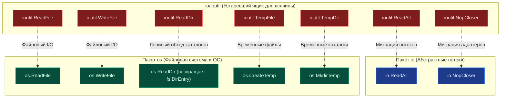
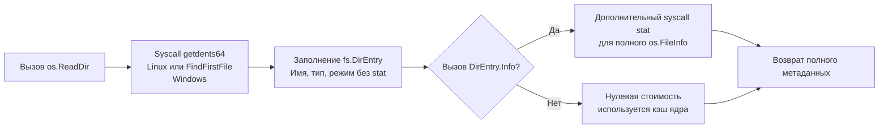

## Исторический контекст и декатализация

> *"Rule of Simplicity: Design for simplicity; add complexity only where you must."*  
> — Философия Unix

В каждом доме есть ящик письменного стола, куда складывают всё, чему не нашлось очевидного места: изоленту, запасные батарейки, переходники и связки старых ключей. В ранней экосистеме Go (начиная с версии 1.0) таким «ящиком для всякой всячины» стал вспомогательный пакет `io/ioutil`. Если разработчику нужно было быстро прочитать файл целиком, отбросить закрытие потока или создать временную директорию, рука сама тянулась к спасительному `ioutil`.

Однако по мере взросления языка и архитектуры стандартной библиотеки этот ящик стал причиной архитектурного дискомфорта. Начиная с версии Go 1.16, пакет `io/ioutil` официально переведён в статус `deprecated`. Это не было случайным рефакторингом или капризом разработчиков. Команда Go провела масштабный аудит стандартной библиотеки и обнаружила, что `ioutil` нарушает ключевые принципы проектирования Go: логическую группировку по доменам, строгую ортогональность и минимализм.

Функции из `ioutil` были хаотично разбросаны между операциями с абстрактными потоками данных (`io`) и операциями с файловой системой операционной системы (`os`). Их миграция в соответствующие пакеты устранила эту архитектурную асимметрию, структурировала API и подготовила почву для внедрения унифицированной файловой абстракции `io/fs`.



> [!info] Под капотом
> Пакет `io/ioutil` **не удалён** из компилятора ради обещания обратной совместимости Go 1 Compatibility Promise. Вы можете продолжать его импортировать в легаси-кодовой базе, код скомпилируется и будет безупречно работать. Внутренне в `src/io/ioutil/ioutil.go` функции превращены в тривиальные прокси-обертки (type aliases и forward-вызовы `io.ReadAll`, `os.ReadFile` и т.д.). Однако `go vet` и современные линтеры будут выдавать настойчивые предупреждения. В новых проектах и при рефакторинге легаси миграция обязательна.

---

## 1. Почему пакет `io_ioutil` исчез из рекомендаций

Основная причина — грубое нарушение границы ответственности (Separation of Concerns). `ioutil` содержал функции, которые по своей природе относятся к принципиально разным слоям абстракции компьютерной системы:

* **Потоковые операции (`ReadAll`, `NopCloser`)** логичнее живут в пакете `io`, так как работают с абстрактными интерфейсами `io.Reader` и `io.Writer`. Им абсолютно всё равно, откуда текут байты — из сетевого сокета, криптографического генератора, памяти или сжатого архива.
* **Файловые операции (`ReadFile`, `ReadDir`, `TempDir`)** требуют прямого доступа к файловой системе операционной системы (`os`), так как взаимодействуют с метаданными ядра Linux/Unix, дескрипторами `inode`, путями `os.Path`, файловыми дескрипторами и правами доступа ОС.

Разнесение функций устранило двойственность, упростило поиск в документации пакетов, уменьшило когнитивную нагрузку на инженера и позволило компилятору строже проверять типы аргументов, исключая использование пакетов не по назначению.

---

## 2. Карта миграции и логика переноса

Каждая функция из `ioutil` нашла своё естественное место в обновленной экосистеме. Ниже приведена точная матрица соответствий.

| Старая функция `io/ioutil` | Новая функция | Логика переноса |
|----------------------------|---------------|-----------------|
| `ioutil.ReadAll` | `io.ReadAll` | Работает с абстрактным потоком `io.Reader`, не привязана к файлам. |
| `ioutil.ReadFile` | `os.ReadFile` | Требует открытия файла на диске, знает про `os.Path` и дескрипторы ОС. |
| `ioutil.WriteFile` | `os.WriteFile` | Аналогично: файловые системные вызовы ядра, биты прав доступа. |
| `ioutil.ReadDir` | `os.ReadDir` | Возвращает `[]fs.DirEntry` вместо тяжелых `[]os.FileInfo`. |
| `ioutil.TempFile` | `os.CreateTemp` | Унификация нейминга: идиома `Create` + `Temp`. |
| `ioutil.TempDir` | `os.MkdirTemp` | Унификация нейминга: идиома `Mkdir` + `Temp` (по аналогии с `os.Mkdir`). |
| `ioutil.NopCloser` | `io.NopCloser` | Обёртка-адаптер для превращения `io.Reader` в `io.ReadCloser`. |

> [!warning] Ловушка / Gotcha
> **Сигнатура `os.WriteFile` отличается.**
> В `ioutil.WriteFile` аргумент прав доступа (`perm`) был третьим. В `os.WriteFile` он остался третьим, но тип стал строго `os.FileMode`. Убедитесь, что передаёте `0o644` или `0o600` (с префиксом `0o` для октальных чисел, введенным в Go 1.13+), а не десятичные `644`. Десятичное число `644` в восьмеричной системе равно `01204`, что приведет к установке совершенно непредсказуемых битов `setuid` и прав выполнения!

---

## 3. Under the hood: Эволюция работы с файловой системой

Наиболее значительное архитектурное изменение коснулось обхода каталогов (`ReadDir`). Старый `ioutil.ReadDir` возвращал срез `[]os.FileInfo`. Чтобы сконструировать `os.FileInfo`, рантайм Go был вынужден выполнять немедленный системный вызов `stat()` для **каждого** файла в директории. 

Представьте каталог с 50 000 файлов: ядру ОС приходилось 50 000 раз искать метаданные в структурах inode и дергать дисковую подсистему. В современных ОС системный вызов `stat` дорог, а на сетевых файловых системах (NFS, SMB, CIFS) или при работе в контейнерах с OverlayFS он превращался в катастрофическую задержку ввода-вывода (I/O latency).

Новый `os.ReadDir` возвращает `[]fs.DirEntry`. Это предельно лёгкая структура интерфейса, которая кэширует базовые метаданные, полученные напрямую от ядра ОС во время чтения содержимого каталога (из системного вызова `getdents64` в Linux).



```
Системный вызов getdents64 заполняет структуру dirent:
+-------------------------------------------------------------+
| d_ino (8B) | d_off (8B) | d_reclen (2B) | d_type (1B) | d_name (...) |
+-------------------------------------------------------------+
                                                 ▲
                                                 │
                                                 └── Тип файла (DT_REG, DT_DIR, DT_LNK)
                                                     уже известен БЕЗ вызова stat()!
```

Ключевое преимущество `fs.DirEntry` — **ленивая загрузка тяжёлых метаданных**. Если вам нужно только отфильтровать файлы по расширению или найти подкаталоги, системный вызов `stat` никогда не вызывается. Информация об имени и базовом типе уже получена из буфера `getdents64`. Это сокращает время обхода директорий в десятки и сотни раз.

---

## 4. Mechanical Sympathy: Оптимизация аллокаций и системных вызовов

Миграция на `os.ReadFile` и `os.WriteFile` несёт прямую выгоду для производительности на уровне оперативной памяти и тактов CPU.

### Предварительное выделение памяти (Pre-allocation)
Функция `io.ReadAll` работает «вслепую»: она не знает, сколько байт передаст ей `io.Reader`. Поэтому она читает чанками фиксированного размера (по 512 байт, затем удваивая буфер) и растёт через `append`, вызывая повторяющуюся реаллокацию и копирование памяти по мере заполнения буфера:

$$\text{Аллокации вслепую: } 512 \text{ Б} \to 1024 \text{ Б} \to 2048 \text{ Б} \to \dots \to \text{OOM}$$

Напротив, функция `os.ReadFile`, зная, что работает с файлом на диске, сначала выполняет быстрый `stat` (или `fstat`), узнаёт точный размер файла и **выделяет буфер ровно нужного размера** одним вызовом `make`:

```go
func readFileOptimized(path string) ([]byte, error) {
    // os.ReadFile под капотом делает примерно следующее:
    info, err := os.Stat(path)
    if err != nil {
        return nil, err
    }
    // Точная аллокация без реаллокаций и копирований:
    // make выделяет память ровно под размер файла info.Size() + 1 байт запаса
    buf := make([]byte, info.Size())
    f, err := os.Open(path)
    if err != nil {
        return nil, err
    }
    defer f.Close()
    _, err = f.Read(buf) // Чтение за один или два syscall
    return buf, err
}
```

Это полностью устраняет избыточное давление на Garbage Collector. В высоконагруженных микросервисах, где чтение конфигурационных файлов, сертификатов или мелких payload происходит регулярно, отсутствие промежуточных буферов экономит миллионы процессорных циклов и снижает паузы сборщика мусора (`GC pause`).

### Атомарность и права доступа
Функция `os.WriteFile` открывает файл с флагами `O_WRONLY | O_CREATE | O_TRUNC`. Она гарантирует, что файл будет создан или усечен до нуля и перезаписан с указанными правами доступа. Это предотвращает распространённую ошибку безопасности, когда разработчики вручную создают файл через `os.Create` (который наследует `umask` системы и по умолчанию ставит `0666 & ~umask`), а затем пытаются исправить права через отдельный вызов `Chmod`. 

Между `os.Create` и `os.Chmod` образуется временное окно гонки (Time-of-Check to Time-of-Use, TOCTOU), в течение которого другой процесс в системе может прочитать файл с конфиденциальными секретами или токенами доступа. `os.WriteFile` атомарно передает режим доступа в системный вызов `open(2)` / `openat(2)`.

---

## 5. Ловушки и вопросы с собеседований

| Ловушка | Описание | Решение |
|---------|----------|---------|
| `fs.DirEntry.Type()` vs `Info().IsDir()` | `Type()` возвращает `fs.FileMode` только с флагами типа. `IsDir()` на `DirEntry` безопасен и быстр. `Info()` вызывает `stat`. | Для проверки директорий используйте `entry.IsDir()`. Вызывайте `entry.Info()` только если нужны `ModTime`, `Size` или `Sys`. |
| Порядок сортировки `os.ReadDir` | Возвращает файлы, отсортированные по имени. Гарантия задокументирована. | Не сортируйте вручную после вызова. Это уже сделано ядром/рантаймом эффективно. |
| `io.NopCloser` и утечка ресурсов | `NopCloser` добавляет пустой метод `Close()` к `io.Reader`. Он **не закрывает** underlying источник, если тот был `io.Closer`. | Используйте только для адаптации интерфейсов. Не полагайтесь на `Close()` для освобождения реальных ресурсов (файлов, сокетов). |
| Конфликт имён после миграции | В одном файле могут остаться `ioutil.ReadAll` и появиться `io.ReadAll`, если импорты не отформатированы. | Всегда запускайте `go fmt` и `goimports`. Убедитесь, что `io/ioutil` удалён из `go.mod` через `go mod tidy`. |

> [!tip] Собеседование
> **Вопрос:** Почему `os.ReadDir` возвращает `[]fs.DirEntry`, а не `chan fs.DirEntry` для потоковой обработки?  
> **Ответ:** Возврат слайса проще в использовании, безопаснее для конкурентности (нет риска утечки горутины, если чтение из канала прервано) и позволяет сразу оценить размер выделенной памяти. Для потоковой обработки каталогов-гигантов (миллионы файлов) существует `os.File.Readdirnames` или использование пакета `filepath.WalkDir`, который вызывает callback на каждый элемент, не загружая всё содержимое в RAM. `ReadDir` оптимизирован под типичные сценарии загрузки конфигов и небольших каталогов.
>
> **Вопрос:** Как `os.ReadFile` ведёт себя с виртуальными устройствами `/proc` или `/sys`?  
> **Ответ:** Файлы в псевдофайловых системах `proc` и `sys` генерируются ядром Linux на лету и имеют размер `0` при системном вызове `stat`, но содержат полезные текстовые данные при чтении. `os.ReadFile` проверяет: если `info.Size() == 0`, то функция выделяет стартовый буфер фиксированного размера (512 байт) и переходит в адаптивный режим чтения `ReadAll`, динамически наращивая срез по мере поступления данных. Это гарантирует корректное и бесперебойное чтение виртуальных файлов ядра.

---

## Итог

1. **`io/ioutil` устарел.** Мигрируйте на пакеты `io` и `os`. Это канонический стандарт начиная с Go 1.16+.
2. **`os.ReadDir` + `fs.DirEntry` = производительность.** Ленивый `stat` и кэшированные метаданные ядра (`getdents64`) экономят сотни тысяч системных вызовов на обход директорий.
3. **`os.ReadFile` оптимизирован.** Предварительное выделение буфера по `stat` устраняет реаллокации и снижает нагрузку на Garbage Collector.
4. **Соблюдайте права доступа.** Используйте восьмеричную форму `0o644`/`0o600` в `os.WriteFile`, чтобы исключить ошибку перевода десятичных чисел и избежать уязвимостей типа TOCTOU.
5. **`NopCloser` — это адаптер, а не менеджер ресурсов.** Он не закрывает underlying stream автоматически и предназначен исключительно для стыковки интерфейсов.

Разобравшись с эволюцией стандартных утилит ввода-вывода, мы переходим к следующему фундаментальному уровню абстракции: как избежать миллионов мелких системных вызовов с помощью кольцевых буферов в памяти: [[6. bufio. Буферизированный ввод и вывод]].