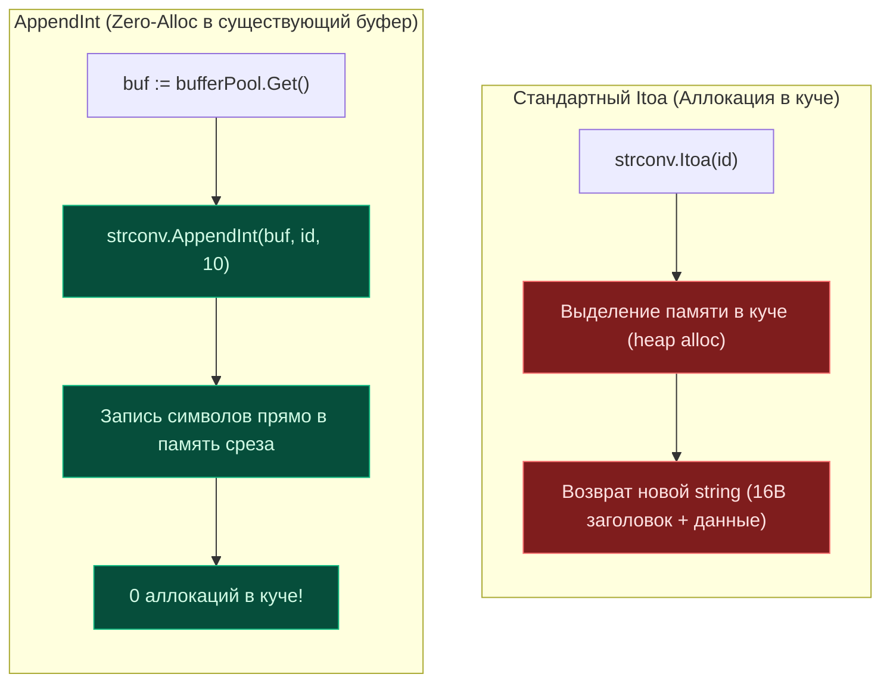

## `strconv`: Мост между бинарным миром и текстом

> *«В первом издании книги „Язык программирования Си“ мы уместили функцию atoi в три строчки кода. Она была простой, изящной и делала ровно то, что требовалось. Пакет `strconv` в Go бережно хранит этот дух минимализма, добавляя строгость требований современного оборудования и управления памятью».*    
> — Брайан Керниган

В компьютерных системах существует два параллельных мира: мир процессора и памяти, где живут компактные бинарные числа (`int`, `float`, `uint64`), и мир внешних протоколов, где царствует текст (HTTP-заголовки, JSON-пейлоады, конфигурационные файлы YAML и SQL-строки).

Пакет `strconv` (string conversion) — это канонический высокоскоростной мост между этими мирами. В отличие от универсального `fmt.Sprintf`, который тратит драгоценные такты процессора на парсинг форматирующей строки во время выполнения и вынужден боксить аргументы в `interface{}` (heap allocations), `strconv` предоставляет строго типизированные, специализированные функции. Они компилируются в прямолинейный, векторизованный машинный код.

Для бэкенд-инженера умение быстро и без лишних аллокаций преобразовывать идентификаторы, порты, суммы и счетчики — фундаментальный навык оптимизации горячих путей сервиса.

> [!info] Под капотом
> Функции `strconv` не используют регулярные выражения или тяжелые абстрактные парсеры. Они работают побайтово, используя прямую арифметику над кодами символов ASCII. Например, чтобы превратить байт символа `'5'` в число `5`, процессор выполняет элементарную операцию вычитания смещения таблицы ASCII: `byte('5') - '0'`. Это делает преобразование предсказуемым по времени и свободным от ветвлений конвейера (branch-predictor friendly).

---

## 1. Конвертация целых чисел: `Atoi`, `Itoa` и `ParseInt`

### `strconv.Atoi` vs `strconv.ParseInt`
Функция `Atoi` (ASCII to integer) — это классическая Bell Labs утилита, представляющая собой удобную обертку над `ParseInt(s, 10, 0)`. Она возвращает платформо-зависимый тип `int` (размер которого равен 32 или 64 битам в зависимости от целевой архитектуры CPU).

```go
// Atoi — быстрый путь для типичного int
n, err := strconv.Atoi("12345")

// ParseInt — когда нужна строгая битность или другая система счисления
// Возвращает int64. Последний аргумент (0) означает "использовать размер int"
n64, err := strconv.ParseInt("12345", 10, 64) 
```

**Когда использовать что:**
*   **`Atoi`**: Когда вы работаете со стандартными `int` (ID сущностей, счетчики, номера страниц пагинации) и вам важна максимальная лаконичность кода.
*   **`ParseInt`**: Когда нужно строго контролировать размерность (например, парсинг `int8` или `int64` для бинарных протоколов и полей базы данных) или основание системы счисления (например, парсинг HEX-цветов или хэшей `base=16`).

### `strconv.Itoa` и `FormatInt`
Обратная операция — преобразование целого числа в текстовую строку. Функция `Itoa` (integer to ASCII) — это просто прозрачная обертка над вызовом `FormatInt(int64(i), 10)`.

> [!warning] Ловушка / Gotcha
> **Переполнение при парсинге.**
> Если входная строка содержит число, превышающее максимальное значение типа (`math.MaxInt64`), `ParseInt` вернет ошибку `strconv.ParseInt: parsing "9223372036854775808": value out of range`.
> Однако, если вы используете `Atoi` на 32-битной системе для большого числа, поведение будет аналогичным. Всегда проверяйте условие `err != nil`. Игнорирование ошибки при парсинге пользовательского ввода — частая уязвимость, приводящая к непредсказуемому поведению (тихому возврату `0` и последующим аномалиям бизнес-логики).

---

## 2. Работа с плавающей точкой: `ParseFloat` и `FormatFloat`

Конвертация чисел с плавающей точкой (`float64`) на порядок сложнее из-за специфики аппаратного стандарта IEEE 754.

```go
f, err := strconv.ParseFloat("3.14159", 64)
s := strconv.FormatFloat(3.14159, 'f', 2, 64) // "3.14"
```

### Форматы вывода (`fmt` byte)
*   `'f'`: Десятичная запись (-ddd.dddd). Стандарт для денежных величин и простых физических величин.
*   `'e'`/`'E'`: Научная нотация экспоненты (-d.dddde±dd).
*   `'g'`/`'G'**: Автоматический выбор: использует `'e'`, если экспонента меньше -4 или больше/равна точности, иначе выбирает `'f'`. Убирает хвостовые нули. Идеально для общего назначения.
*   `'b'`: Двоичная экспонента (для отладки низкоуровневой точности мантиссы).

> [!info] Под капотом
> `FormatFloat` использует современные вариации алгоритма Драгона4 (Dragon4 / Grisu3 / Ryu) для гарантированно корректного и точного округления чисел с плавающей запятой в их строковое представление минимальной длины. Это сложная математическая операция над большими целыми числами. Если вам нужно просто отбросить знаки после запятой для грубого отображения, иногда быстрее умножить, привести к `int` и разделить, чем использовать полноценный форматтер, хотя `strconv` достаточно оптимизирован для большинства задач.

---

## 3. Mechanical Sympathy: Избегаем аллокаций с `Append`

Самая мощная, но часто упускаемая из виду часть пакета `strconv` — функции семейства `Append*`.

Стандартные функции `Itoa` и `FormatFloat` неизбежно выделяют память под **новую строку** в куче. Функции `Append` (такие как `strconv.AppendInt`, `strconv.AppendFloat`, `strconv.AppendBool`) принимают существующий срез `[]byte` и дописывают текстовый результат прямо в него, используя уже доступную емкость (`cap`).



```go
// ❌ Плохо: Аллокация новой строки в куче на каждом шаге
idStr := strconv.Itoa(userID)
key := "user:" + idStr 

// ✅ Хорошо: Нулевая аллокация (если буфер достаточной емкости)
var buf []byte
buf = append(buf, "user:"...)
buf = strconv.AppendInt(buf, int64(userID), 10)
// buf теперь содержит "user:123"
key := string(buf) // Единственная аллокация в конце, если нужно именно string
```

Это критически важно в горячих путях бэкенда:
1.  Генерация составных ключей для Redis/Memcached.
2.  Формирование структурированных логов в формате JSON вручную.
3.  Сборка SQL-запросов и метрик для Prometheus/StatsD.

Использование семейства `Append` позволяет переиспользовать один и тот же буфер (например, из пула `sync.Pool` или структуры `bytes.Buffer`), сводя давление на сборщик мусора (GC) к абсолютному нулю.

---

## 4. Булевы значения и кватернионы

Функция `strconv.ParseBool` спроектирована чрезвычайно практично: она принимает не только строгие литералы `"true"`/`"false"`, но и `"1"`/`"0"`, `"t"`/`"f"`, `"T"`/`"F"`, `"yes"`/`"no"` и т.д. Это незаменимо при парсинге переменных окружения или параметров запроса, где пользователи могут писать что угодно:

```go
// Принимает: 1, t, T, TRUE, true, True, 0, f, F, FALSE, false, False
val, err := strconv.ParseBool(os.Getenv("DEBUG"))
```

---

## 5. Сравнение подходов: `strconv` vs `fmt` vs `cast`

| Метод | Скорость | Аллокации | Гибкость | Использование |
|-------|----------|-----------|----------|---------------|
| `strconv.Itoa/ParseInt` | 🚀 Очень быстро | 1 (результат) | Низкая (только base 10) | Основная работа с числами |
| `strconv.AppendInt` | 🚀🚀 Максимально быстро | 0 (в существующий буфер) | Низкая | Высоконагруженные системы, генерация ключей |
| `fmt.Sprintf("%d")` | 🐢 Медленно | 2+ (интерфейсы + строка) | Высокая (форматирование) | Логи, человеко-читаемый вывод |
| `github.com/spf13/cast` | 🐇 Средне | Зависит от контекста | Очень высокая (any -> type) | Конфигурации, маппинг структур |

> [!tip] Собеседование
> **Вопрос:** Почему `strconv.Atoi` быстрее, чем `fmt.Sscanf("%d", &n)`?  
> **Ответ:** `fmt.Sscanf` должен распарсить форматную строку `%d`, определить тип аргумента через рефлексию, обработать возможные пробелы и флаги формата. `strconv.Atoi` проходит по байтам строки один раз, выполняя простую арифметику `n = n * 10 + int(c - '0')`. Отсутствие рефлексии и парсинга шаблона дает выигрыш в порядок величины.
>
> **Вопрос:** Как безопасно конвертировать `string` в `int64` без аллокаций, если строка получена из `http.Request.URL.Query()`?  
> **Ответ:** Метод `URL.Query()` возвращает `map[string][]string`. Значения там уже представлены в виде `string`. Используем `strconv.ParseInt(vals.Get("id"), 10, 64)`. Аллокаций памяти не будет, так как мы парсим существующий строковый срез без создания промежуточных копий. Если бы мы использовали `fmt`, неизбежно возникла бы аллокация упаковки аргументов в интерфейсы.

---

## 6. Ловушки и нюансы

### Локаль и разделители дробной части
Пакет `strconv` **всегда** использует строгую точку `.` как разделитель дробной части числа, независимо от региональных настроек (локали) операционной системы. Это строго соответствует стандарту RFC 4627 (JSON) и подавляющему большинству сетевых протоколов. Если вы парсите ввод от пользователя, который может ввести запятую (например, `3,14` в русской или немецкой локали), `ParseFloat` вернет ошибку. В таких сценариях необходимо предварительно заменять запятые на точки через `strings.Replace`.

### Точность `float32` vs `float64`
Язык Go по умолчанию предпочитает `float64`. Функция `ParseFloat` всегда возвращает `float64`. Если в вашей структуре данных используется поле типа `float32`, вы должны явно привести тип: `float32(f)`. При этом возможна потеря точности округления. Напротив, `FormatFloat` позволяет явно указать битность (`32` или `64`), чтобы округление соответствовало исходному представлению.

```go
f64, _ := strconv.ParseFloat("0.1", 64)
f32 := float32(f64)
// f32 может не точно представлять 0.1 из-за ограничений IEEE 754 для 32 бит
```

---

## Итог

1.  **Используйте `strconv` вместо `fmt`** для конвертации чисел в продакшен-коде. Это на порядок быстрее и не нагружает Garbage Collector мусором.
2.  **`Append` функции — ваши лучшие друзья** для высоконагруженных приложений. Они позволяют дописывать байты в существующие срезы без единой аллокации.
3.  **Всегда проверяйте ошибки.** Парсинг внешних данных (HTTP, БД, конфиги) никогда не бывает гарантированно успешным.
4.  **Помните про локаль.** `strconv` работает только с точкой как разделителем десятичных дробей.
5.  **`Atoi` — это синтаксический сахар** для `ParseInt(s, 10, 0)`. Используйте его для удобства, но понимайте, что он возвращает платформо-зависимый `int`.

Освоив конвертацию примитивов, мы подходим к фундаментальной теме: работе с текстом, выходящим за рамки латинского ASCII. Как Go на самом низком уровне обрабатывает кириллицу, эмодзи и сложные многобайтовые кодировки? В следующей статье: [[10. unicode и unicode_utf8. Работа с рунами и UTF-8]].