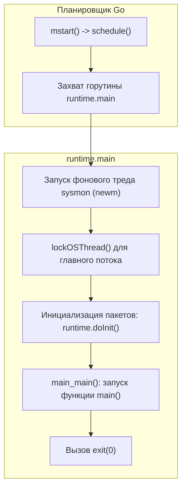

Добро пожаловать в седьмой раздел нашей инженерной энциклопедии — **«Глубокий Go (Внутреннее устройство)»**. До этого момента мы взаимодействовали с Go как с языком высокого уровня: создавали структуры, объявляли интерфейсы, запускали горутины и передавали данные через каналы, зачастую полагаясь на лаконичный синтаксис и не задумываясь о том, что происходит под капотом.

Однако между высокоуровневой абстракцией и физическим кремнием лежит пропасть. Настоящий сеньор-инженер отличается от дилетанта тем, что видит программу глазами процессора и ядра операционной системы. Чтобы писать по-настоящему производительный, `production-ready` код без утечек памяти и bottleneck'ов, нам жизненно необходимо выработать **Mechanical Sympathy** (механическое сочувствие к машине) — ясное понимание того, как каждая строчка кода транслируется в машинные инструкции, переключения регистров CPU, системные вызовы и аллокации в кэшах L1–L3.

Начнем наше погружение с фундаментального вопроса: что на самом деле происходит в памяти и на процессоре, когда операционная система получает команду запустить скомпилированный бинарник Go?

---

## Иллюзия функции main

В большинстве языков программирования программисту кажется, что его код исполняется с первой же строки:
- В интерпретируемых скриптах (Python, Ruby, PHP) интерпретатор читает исходник сверху вниз;
- В Java виртуальная машина JVM сначала инициализирует внутренние классы, но программист видит точку входа `public static void main(String[] args)`;
- В C и C++ опытные инженеры знают о стартовом модуле `crt0` (C Runtime Init), настраивающем стек и вызывающем `main`.

В языке Go рантайм устроен принципиально глубже и «тяжелее», чем минималистичный рантайм C. Фактически среда выполнения Go (Go Runtime) представляет собой компактную, сверхэффективную «микро-ОС в пространстве пользователя». Она берет на себя управление памятью, планирование миллионов легковесных потоков (горутин), опрос сетевых событий через системные селекторы (`epoll`/`kqueue`/`IOCP`) и автоматическую сборку мусора. Прежде чем выполнится ваша `func main()`, рантайм обязан развернуть все свои внутренние органы жизнеобеспечения.

Поэтому, когда ядро Linux загружает ELF-бинарник Go в память, оно передает управление вовсе не вашей функции `main.main`. Перед тем как первая строчка вашего бизнес-кода получит процессорный такт, рантайм проходит многоступенчатую фазу инициализации.

```mermaid
flowchart TD
    OS["ОС загружает бинарник в память (sys_execve)"] --> ENTRY["Точка входа ELF: _rt0_amd64_linux"]
    ENTRY --> RT0AMD["_rt0_amd64: сохранение argc, argv"]
    RT0AMD --> RT0GO["Ассемблерный бутстрап rt0_go"]
    RT0GO --> CPU["Опрос CPUID: AVX2, AES, SSE"]
    CPU --> TLS["Настройка TLS (Thread Local Storage)"]
    TLS --> M0G0["Инициализация m0 и g0"]
    M0G0 --> SCHEDINIT["Вызов C/Go рантайма: runtime.schedinit"]
    SCHEDINIT -->|Память mheap, GC pacer, GOMAXPROCS| NEWPROC["runtime.newproc для runtime.main"]
    NEWPROC --> MSTART["Запуск планировщика runtime.mstart"]
    MSTART --> RUNTIMEMAIN["Выполнение runtime.main"]
    RUNTIMEMAIN -->|Фоновые треды sysmon, вызов init()| USERMAIN["Вызов пользовательской main.main"]
```

---

## Фаза 1. Ассемблерный бутстрап (rt0_go)

Точка входа программы прописана в заголовке исполняемого файла (поле `e_entry` в заголовке ELF для Linux или `LC_MAIN` в Mach-O для macOS). На архитектуре Linux x86-64 этой точкой входа является ассемблерная функция `_rt0_amd64_linux`.

Ее задача — принять от ядра Linux исходное состояние регистров и стека и немедленно передать управление цепочке инициализации:

```asm
// Исходный код: src/runtime/rt0_linux_amd64.s
TEXT _rt0_amd64_linux(SB),NOSPLIT,$-8
    JMP _rt0_amd64(SB)
```

Вспомогательная функция `_rt0_amd64` считывает со стека количество аргументов `argc` и указатель на массив аргументов `argv`, сохраняя их в регистры `DI` и `SI`, после чего выполняет безусловный переход на главную низкоуровневую функцию старта — `runtime.rt0_go`.

Внутри `rt0_go` (файл `src/runtime/asm_amd64.s`) разворачивается критически важная механическая магия:

1. **Инспекция процессора через `CPUID`:**  
   Рантайм опрашивает флаги процессора, чтобы выяснить, поддерживает ли конкретный чип инструкции AVX, AVX2, SSE4.2, BMI1/BMI2, а также аппаратное ускорение шифрования AES-NI. На основе этих флагов динамически подключаются наиболее быстрые ассемблерные реализации функций хэширования, копирования памяти (`memmove`) и криптографии.
2. **Парсинг аргументов и окружения:**  
   Сохраняются системные указатели `argc`, `argv` и `envp` во внутренние глобальные переменные рантайма, доступные пакету `os`.
3. **Настройка TLS (Thread Local Storage):**  
   На x86-64 рантайм настраивает сегментный регистр `FS` (через системный вызов `arch_prctl(ARCH_SET_FS)`), чтобы текущий тред операционной системы мог мгновенно — за одно чтение со смещением вида `MOVQ FS:0, AX` — получать указатель на структуру текущей горутины (`g`) без тяжелых обращений к таблицам ядра.
4. **Инициализация `m0` и `g0`:**  
   Создаются два фундаментальных связующих звена между операционной системой и рантаймом.

> [!info] Под капотом: m0 и g0
> 
> В модели [[9. Scheduler Go. G, M, P и work stealing]] мы подробно разбираем структуру планировщика Go. Но уже на нулевом этапе старта процессору требуются две особые сущности:
> 
> - **`m0` (Machine 0)** — глобальная структура рантайма, представляющая самый первый, первичный поток операционной системы (главный тред ОС), порожденный системным вызовом `clone`/`fork` при запуске бинарника.
> - **`g0` (Goroutine 0)** — системная горутина, жестко привязанная к `m0`. В отличие от пользовательских горутин, стартующих с крошечным динамическим стеком в 2 КБ, `g0` использует полноразмерный системный стек потока ОС (обычно 8 МБ в Linux). На стеке `g0` выполняются все системные операции: переключение контекста планировщика, фазы Stop-The-World в сборщике мусора и аллокация страниц памяти. Пользовательский код никогда не выполняется на стеке `g0`.

---

## Фаза 2. Пробуждение рантайма (schedinit)

Когда базовый каркас потока и регистров подготовлен, ассемблерный код `rt0_go` передает управление первой высокоуровневой функции, написанной на Go — `runtime.schedinit()` (файл `src/runtime/proc.go`).

В этот момент рантайм оживает, последовательно запуская свои ключевые подсистемы:

1. `mallocinit()` — инициализирует глобальный менеджер кучи (`mheap`), списки центральных кэшей (`mcentral`) и базовые структуры виртуальной памяти (подробнее см. [[21. Аллокатор памяти Go. mcache, mcentral, mheap]]).
2. `osinit()` — выясняет число доступных процессоров у ядра ОС (через чтение системной информации `/sys/devices/system/cpu` или опрос `sched_getaffinity`), чтобы задать начальное значение `GOMAXPROCS`.
3. `gcinit()` — настраивает эвристики и внутренние триггеры сборщика мусора (GC Pacer, см. [[24. Сборщик мусора Go. Общая архитектура]]).
4. **Формирование пула процессоров `P` (Processors):**  
   Аллоцируется срез `allp` размером `GOMAXPROCS`. Каждая структура `P` получает локальную очередь готовых к выполнению горутин (`runq`) и локальный кэш аллокатора (`mcache`). Поток `m0` связывается с первым логическим процессором `allp[0]`.

---

## Фаза 3. Рождение первой горутины

Все подсистемы сконфигурированы, но процессор пока не выполняет ни одной горутины. В коде `rt0_go` происходит системный вызов `runtime.newproc()`:

```go
// Создание первой горутины для функции runtime.main
runtime.newproc(0, runtime.mainPC)
```

**Обратите внимание:** эта первая в жизни процесса горутина создается не для вашей функции `main.main`, а для внутренней функции рантайма **`runtime.main`**.

Новорожденная горутина получает свой персональный стек размером 2 КБ (с защитной зоной от переполнения) и помещается в локальную очередь выполнения процессора `P0`. Механика создания детально разобрана в статье [[12. Как создается и завершается goroutine]].

Сразу после этого вызывается ассемблерный переход в функцию `runtime.mstart()`. Главный тред ОС `m0` входит в бесконечный диспетчерский цикл планировщика `schedule()`. Планировщик видит единственную ожидающую горутину (`runtime.main`), переключает на нее контекст регистров и начинает ее исполнение.

---

## Фаза 4. runtime.main и ваш код

Функция `runtime.main` — это дирижер, соединяющий низкоуровневую среду рантайма с бизнес-логикой вашего приложения:



Что делает `runtime.main` по шагам:

1. **Запуск фонового наблюдателя `sysmon`:**  
   Через вызов `newm` порождается отдельный физический поток операционной системы (не горутина!), выполняющий функцию `sysmon`. Он работает без привязки к `P`, отслеживает долгие системные вызовы, инициирует принудительный сбор мусора при простое и отправляет прерывающие сигналы зависшим горутинам (см. [[10. sysmon, netpoller и фоновые потоки рантайма]] и [[43. Preemption. Как Go останавливает горутины]]).
2. **Привязка к главному потоку:**  
   Поток `m0` привязывается к выполнению `runtime.main` (вызов `runtime.lockOSThread`), что критично для GUI-библиотек или взаимодействия с платформенными API, требующими вызовов строго из начального потока.
3. **Инициализация пакетов (`runtime.doInit`):**  
   Компилятор строит направленный ациклический граф (DAG) зависимостей. Рантайм последовательно выполняет инициализацию глобальных переменных и все функции `init()` во всех пакетах, начиная от базовых библиотек рантайма и стандартной библиотеки до пользовательского пакета `main`.
4. **Вызов `main.main()`:**  
   Наконец вызывается точка входа, написанная разработчиком!
5. **Завершение программы:**  
   Как только функция `main.main()` возвращает управление, `runtime.main` немедленно вызывает системный вызов завершения процесса `exit(0)`.

> [!warning] Ловушка / Gotcha: Мгновенная смерть фоновых горутин
> 
> Понимание механизма выхода из `runtime.main` мгновенно объясняет классическую ошибку новичков. Если внутри `main.main()` запустить горутину через `go doSomething()` и не дождаться ее завершения (через `sync.WaitGroup`, каналы или контекст), процесс завершится раньше, чем горутина успеет сделать хоть один шаг.
> 
> Как только `main.main()` доходит до фигурной скобки `}`, управление возвращается в `runtime.main`, которая выполняет `os.Exit(0)`. Ядро операционной системы мгновенно уничтожает виртуальное адресное пространство процесса и убивает все связанные потоки ядра. Никакие `defer` в дочерних горутинах вызваны не будут.

> [!tip] Собеседование
> 
> **Вопрос:** В каком точном порядке запускаются: функция `main.init()`, планировщик Go, тред `sysmon` и пользовательская функция `main.main()`?
> 
> **Ответ:** 
> 1. Сначала ассемблерный бутстрап (`rt0_go`) настраивает среду и вызывает `runtime.schedinit()`.
> 2. Создается горутина для `runtime.main` и стартует планировщик (`mstart()`).
> 3. Планировщик начинает выполнение `runtime.main`.
> 4. Внутри `runtime.main` стартует фоновый тред `sysmon`.
> 5. Затем вызываются функции `init()` зависимостей, и только после них — `main.init()`.
> 6. И лишь после успешного завершения всех `init()` вызывается пользовательская `main.main()`.

---

## Итоги

1. Запуск Go-программы — это строгая многоступенчатая эскалация: от низкоуровневого ассемблерного кода `_rt0_amd64_linux` и чтения регистров процессора до развертывания планировщика, сборщика мусора и пула виртуальных процессоров `P`.
2. Пользовательская функция `main.main()` не является истинной точкой входа программы; это рядовая горутина, запускаемая внутренней функцией `runtime.main`.
3. Понимание различий между системным потоком `m0`, системной горутиной `g0` с полноразмерным стеком и пользовательскими горутинами `g` с динамическим стеком — ключ к анализу дампов памяти, профилей `pprof` и корректной работе с системными вызовами (см. [[40. Как runtime обрабатывает системные вызовы]]).

В этом разделе мы шаг за шагом препарируем каждый винтик этой сложнейшей инженерной конструкции. Но прежде чем рантайм сможет исполнить машинный код, компилятор должен превратить наши исходные `.go` файлы в этот самый эффективный бинарник.

В следующей лекции мы разберем: [[2. Архитектура компилятора Go]].