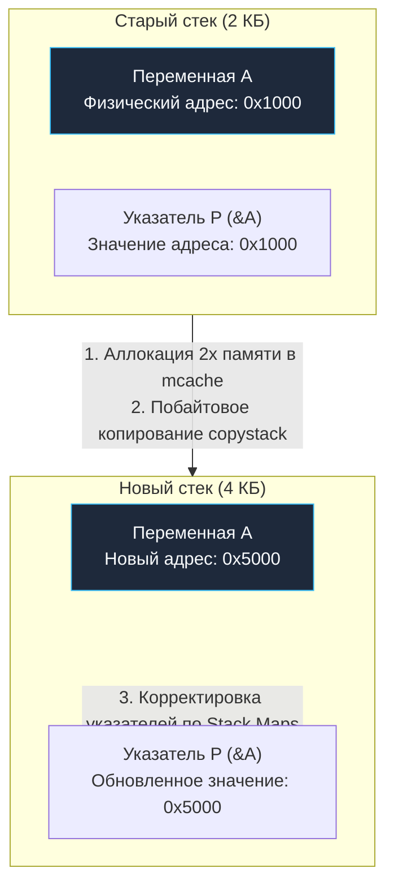

В предыдущих лекциях мы изучили, как планировщик Go жонглирует горутинами, а Netpoller и Sysmon предотвращают зависания потоков операционной системы. Но до сих пор мы воспринимали горутину как абстрактную вычислительную сущность `G`.

Пришло время заглянуть внутрь ее физического устройства. Самый критичный и динамичный ресурс любой исполняемой функции — это область памяти для размещения локальных переменных, входных аргументов, флагов возврата и адресов инструкций. Эта область памяти называется **Стеком (Stack)**.

То, как именно рантайм Go управляет памятью стека горутин, представляет собой один из главных шедевров инженерной мысли Bell Labs и Google. Именно эта подсистема сделала язык непревзойденным стандартом для создания легковесных высоконагруженных сетевых сервисов.

---

## Проблема OS Threads: Размер имеет значение

В традиционных языках программирования с потоковой моделью `1:1` (C++, Rust, Java, PHP под Apache) каждая параллельная задача неразрывно привязана к отдельному потоку операционной системы (**OS Thread**).

Когда ядро Linux порождает новый поток через системный вызов `clone`, оно обязано зарезервировать для него непрерывный диапазон виртуальных страниц под стек. В современных дистрибутивах Linux этот размер по умолчанию составляет **8 Мегабайт**.  
Такой огромный объем выделяется с запасом, поскольку стек потока ядра не способен динамически расширяться: если он упрется в границу, ядро ОС аварийно завершит процесс с аппаратной ошибкой `SIGSEGV` (Stack Overflow).

В реальном мире подавляющее большинство микросервисных функций используют лишь пару килобайт стековой памяти. Если поток ОС использует всего 1 КБ, оставшиеся 7.99 МБ виртуальной памяти висят мертвым грузом.  
Попытка запустить 10 000 одновременных потоков операционной системы приведет к тому, что ядро зарезервирует **80 Гигабайт** памяти только под стеки! Сервер неминуемо упадет, будучи уничтоженным системным OOM Killer (**OOM Killed**).

Создатели Go подошли к проблеме с бескомпромиссным сочувствием к машине (**Mechanical Sympathy**).  
При рождении новой горутины рантайм выделяет ей начальный стек размером всего **2 Килобайта** (в 4000 раз меньше стека ОС!).  
Благодаря этому 10 000 активных горутин в Go суммарно расходуют скромные **20 Мегабайт** оперативной памяти.

Но что происходит, если алгоритму с глубокой рекурсией или массивными локальными массивами перестает хватать этих 2 КБ?

---

## Эволюция: от Segmented к Continuous Stacks

> [!info] Под капотом: Исторический контекст
> 
> До версии Go 1.3 в языке использовались **Segmented Stacks (Сегментированные стеки)**. Когда стартовые 2 КБ подходили к концу, рантайм выделял в куче новый отдельный блок памяти и связывал его со старым двусвязным списком через указатели.  
> Это порождало тяжелейшую архитектурную проблему — **Hot Split**: если функция вызывалась внутри плотного цикла на самой границе переполнения 2 КБ, рантайм на каждой итерации выделял новый сегмент памяти, а при выходе из функции немедленно его освобождал. Частота аллокаций уничтожала производительность приложения.

Начиная с Go 1.3, язык перешел на **Continuous Stacks (Непрерывные стеки)**.  
Теперь, если горутине становится тесно, рантайм выделяет совершенно новый, непрерывный фрагмент памяти, размер которого ровно **в 2 раза больше** предыдущего (2 КБ $\rightarrow$ 4 КБ $\rightarrow$ 8 КБ $\rightarrow$ ... вплоть до 1 ГБ на 64-битных системах), и физически переносит туда все содержимое старого стека.

---

## Как компилятор определяет переполнение?

Рантайм Go не дожидается момента, когда указатель стека выйдет за физические границы памяти и вызовет аппаратный сбой. Проверка переполнения встроена компилятором непосредственно в машинный код каждой функции.

Как мы видели в лекции [[5. Go assembler и внутренний ассемблерный синтаксис]], компилятор еще на этапе генерации промежуточного представления точно знает размер фрейма локальных переменных функции (дескриптор `$framesize-argsize`, например `$0-24`).

В пролог (самое начало) каждой компилируемой функции компилятор автоматически внедряет крошечную последовательность инструкций — **Stack Bound Check**:
1. Регистр аппаратного стекового указателя `SP` сравнивается со значением поля границы стека текущей горутины — **`g.stackguard0`**;
2. Если текущее значение `SP` опускается ниже безопасного предела `stackguard0`, выполняется условный переход (Jump) к специальной процедуре рантайма — **`runtime.morestack`**.

```asm
// Типичный пролог функции в Go (amd64)
MOVQ (TLS), CX              // Загрузка указателя на текущую горутину 'g'
CMPQ SP, 16(CX)             // Сравнение SP с g.stackguard0
JLS  morestack              // Если места мало — прыжок в morestack
```

> [!warning] Ловушка / Gotcha: Директива NOSPLIT
> 
> В ассемблерных функциях рантайма часто встречается директива `NOSPLIT`.  
> Она приказывает компилятору: *«Эта функция гарантированно укладывается в защитную зону стека горутины, не вставляй инструкцию Stack Bound Check!»*.  
> Это критически важная оптимизация для функций планировщика и самого механизма `runtime.morestack`. Если бы код, расширяющий стек, сам проверял границы стека и пытался вызвать `morestack`, процессор вошел бы в бесконечную аппаратную рекурсию и немедленно обрушил рантайм.

---

## Механика роста стека (Stack Growth)

Когда срабатывает процедура `runtime.morestack`, разворачивается ювелирная инженерная операция:

1. **Приостановка и смена контекста:** Выполнение пользовательской функции замораживается. Поток ОС переключается на системную горутину **`g0`** с ее фиксированным системным стеком операционной системы (8 МБ), исключая риск нехватки памяти во время самой процедуры расширения.
2. **Аллокация удвоенного блока:** Рантайм вычисляет новый размер стека (например, с 2 КБ до 4 КБ) и запрашивает новый непрерывный блок памяти у локального аллокатора `mcache`.
3. **Побайтовое копирование (`copystack`):** Все активные стековые кадры побайтово копируются из старого блока в новый.
4. **Корректировка указателей (Pointer Adjustment):** Самый тонкий и математически сложный этап!

### Mechanical Sympathy: Боль корректировки указателей

Представьте, что внутри функции объявлена локальная переменная `a`, а рядом лежит локальный указатель `p`, ссылающийся на ее адрес:

```go
a := 42
p := &a
```

Оба значения физически расположены на стеке горутины. Когда процедура `copystack` перемещает стек на новый адрес в оперативной памяти, физический адрес ячейки `a` безвозвратно меняется!  
Если бы рантайм просто скопировал байты «как есть», то указатель `p` продолжил бы хранить старый адрес, превратившись в висячий указатель (**Dangling pointer**). Рано или поздно старая память была бы перетерта, и разыменование `*p` привело бы к повреждению памяти или Segfault.



Как рантайм Go решает эту фундаментальную дилемму?  
При компиляции Go-кода компилятор генерирует точные битовые карты указателей — **Stack Maps** (в ассемблере представленные метаданными `FUNCDATA` и `PCDATA`).  
Рантайм точно знает, в каких именно байтах каждого стекового кадра хранятся адреса указателей, а где лежат обычные скалярные значения (`int64`, `float64`).

Во время выполнения `copystack` рантайм обходит стек и обновляет каждый указатель, указывающий на объекты внутри перемещаемого стека, прибавляя к нему дельту смещения (**offset**):

$$\text{Address}_{\text{new}} = \text{Address}_{\text{old}} + (\text{Stack}_{\text{new\_lo}} - \text{Stack}_{\text{old\_lo}})$$

После завершения корректировки старый блок памяти возвращается аллокатору, регистры процессора `SP` и `BP` перенастраиваются на новый стек, и горутина продолжает исполнение на удвоенном стеке, не заметив перемещения в физической памяти.

> [!tip] Собеседование: CGO и инвалидация указателей
> 
> **Вопрос:** Почему правила безопасности Go строго запрещают передавать указатель на локальную переменную Go-стека в C-библиотеку через CGO и сохранять его там для последующих асинхронных вызовов?
> 
> **Ответ:** Причина заключается именно в непрерывных перемещаемых стеках Go!  
> Внешний C-код не контролируется рантаймом Go и ничего не знает о метаданных `Stack Maps`. Если функция на C сохранит адрес локальной переменной Go в своей статической памяти, а стек горутины в дальнейшем расширится (вызовет `copystack`), адрес этой переменной в Go изменится. Указатель в C станет «висячим» (**dangling pointer**), и последующее чтение приведет к фатальному `SIGSEGV` или тихой порче чужой памяти.  
> Рантайм Go отслеживает такие попытки и бросает жесткую панику: `panic: runtime error: cgo argument has Go pointer to Go pointer` (подробнее см. [[41. cgo. Как Go взаимодействует с C]]).

---

## Сжатие стека (Stack Shrink)

Если бы стек умел исключительно расти, долговременные серверные процессы страдали бы от утечек оперативной памяти: горутина могла бы однажды обработать гигантский XML-документ или выполнить глубокую рекурсию, раздув свой стек до 10–20 Мегабайт, а затем вернуться к тривиальной обработке легковесных Ping-запросов.

Для возврата неиспользуемой памяти операционной системе рантайм Go реализует симметричный механизм — **Сжатие стека (Stack Shrink)**.

Сжатие стека намеренно **никогда не происходит в момент выхода из функций**, чтобы полностью исключить возникновение проблемы Hot Split (колебаний между аллокацией и освобождением).

Вместо этого сжатие стеков делегировано **Сборщику мусора (Garbage Collector)**:
1. Во время фазы сканирования корней GC проверяет степень утилизации стека каждой горутины;
2. Если занято **менее 25%** от текущего размера стека (и текущий размер превышает минимальные 2 КБ);
3. Рантайм выделяет блок памяти **ровно в 2 раза меньше текущего** (но не менее 2 КБ);
4. Выполняется процедура `copystack`, переносящая живые данные в компактный буфер с обновлением указателей.

Таким образом, горутины динамически «дышат»: мгновенно расширяются под пиковыми нагрузками и плавно сжимаются во время регулярных циклов сборки мусора (см. [[24. Сборщик мусора Go. Общая архитектура]]).

---

## Итоги

1. **Легковесный старт:** Начальный стек горутины составляет всего **2 КБ** против 8 МБ у потока ядра Linux, что делает параллелизм в Go практически бесплатным по памяти.
2. **Continuous Stacks:** При переполнении стек не фрагментируется на связные куски, а удваивается (аллоцируется новый блок размера $2\times$, куда побайтово копируются данные старого стека).
3. **Безопасность благодаря Stack Maps:** Компилятор формирует метаданные типов (`FUNCDATA`/`PCDATA`), позволяя рантайму с абсолютной точностью корректировать адреса всех локальных указателей при переносе стека.
4. **Сжатие (Shrink):** Сборщик мусора проверяет утилизацию стеков и сжимает их вдвое, если объем активных данных падает ниже 25%, предотвращая утечки памяти в долгоживущих горутинах.

Теперь мы досконально знаем, как устроена память горутины, как работают ее регистры и как планировщик дирижирует потоками `M` и контекстами `P`.

В следующей лекции мы объединим эти фундаментальные знания и пошагово проследим весь жизненный путь горутины — от оператора `go` до ее естественной или аварийной смерти:

Переходим к: [[12. Как создается и завершается goroutine]].