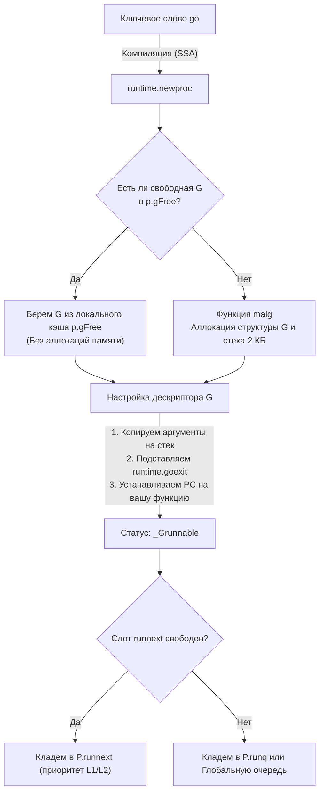

В предыдущих главах мы подробно исследовали архитектуру планировщика ([[9. Scheduler Go. G, M, P и work stealing]]) и динамическую организацию стековой памяти ([[11. Стек горутины. Рост и shrink стека]]). Теперь у нас есть все необходимые инженерные блоки, чтобы соединить их воедино и проследить полный драматический жизненный цикл горутины: от момента, когда компилятор встречает лаконичное ключевое слово `go`, до секунды, когда отработавшая задача бесследно исчезает из памяти.

Для бэкенд-инженера ясное понимание этого пути — не просто академическое любопытство, а практический щит от скрытых деградаций производительности и самого коварного врага распределенных Go-систем: **утечек горутин (Goroutine Leaks)**.

---

## Рождение: Синтаксический сахар и runtime.newproc

Ключевое слово `go` — это синтаксический сахар для программиста. Вы не найдете его в скомпилированном бинарнике. На этапе генерации SSA (о котором мы говорили в начале раздела) компилятор транслирует вызов вида `go myFunction(arg1, arg2)` (или `go processUser(userID)`) в вызов функции рантайма — **`runtime.newproc`**.

```go
// Ваш исходный код:
go processUser(userID)

// Что генерирует компилятор под капотом (концептуально):
runtime.newproc(sizeOfArgs, funcPC, argData)
```

Функция `runtime.newproc` (исходный код в `src/runtime/proc.go`) выполняет ювелирную работу по инициализации новой единицы исполнения. Этот процесс строго оптимизирован, чтобы минимизировать накладные расходы на аллокацию памяти.



### 1. Поиск в кэше (gFree)

Выделение новой памяти в общей куче (Heap) — дорогостоящая операция. Создатели Go руководствовались принципом **Mechanical Sympathy**: *самая быстрая аллокация памяти — та, которой удалось избежать*.

Поэтому горутины в Go **агрессивно переиспользуются**.  
Когда горутина завершает выполнение, ее структура `g` и выделенный стек не уничтожаются. Рантайм помещает ее в пул свободных горутин — **`gFree`**.  
Первым делом `newproc` обращается к текущему логическому процессору `P` и проверяет его локальный список `p.gFree`. Если локальный кэш пуст, рантайм захватывает порцию свободных структур из глобального репозитория `sched.gFree`. Это позволяет создавать тысячи кратковременных горутин с нулевыми аллокациями оперативной памяти!

### 2. Аллокация новой G (malg)

Если пул `gFree` исчерпан (например, при холодном старте сервиса или резком всплеске трафика), рантайм вызывает служебную функцию **`malg`** (Memory Allocate G).  
Функция `malg` запрашивает у аллокатора памяти новую структуру `g` и выделяет под нее начальный непрерывный стек размером ровно **2 КБ**.

### 3. Настройка контекста (gobuf)

Получив чистую структуру `g`, рантайм инициализирует ее внутреннее состояние:
* Аргументы вызываемой функции копируются на стек новорожденной горутины;
* В структуру сохраненного контекста `g.sched` (тип `gobuf`) записывается указатель на целевую функцию — программный счетчик **`PC`** (Program Counter);
* В регистр указателя стека **`SP`** (Stack Pointer) записывается адрес вершины выделенного 2-килобайтного фрейма.

### 4. Подмена адреса возврата

Здесь кроется один из самых остроумных трюков рантайма.  
В классической архитектуре процессора при вызове функции адрес возврата сохраняется на стеке инструкцией `CALL`, и по завершении инструкция `RET` возвращает управление вызывающей стороне.  
Но кто вызвал функцию новой горутины? Никто! Она запускается асинхронно в изолированном контексте. Куда должен прыгнуть процессор, когда функция дойдет до финальной фигурной скобки `}`?

Чтобы разрешить эту дилемму, рантайм **искусственно подделывает адрес возврата на стеке**.  
На самое дно стека новой горутины компилятор и рантайм вручную помещают адрес системной функции **`runtime.goexit`**. Когда прикладная функция завершает работу и выполняет инструкцию `RET`, процессор считывает этот поддельный адрес и автоматически проваливается в процедуру корректной утилизации горутины.

### 5. Отправка в очередь

Настройка завершена. Рантайм атомарно выставляет горутине статус **`_Grunnable`** (готова к выполнению) и передает ее планировщику:
- Сначала делается попытка поместить горутину в привилегированный слот **`runnext`** текущего процессора `P` (для мгновенного запуска на теплом L1/L2 кэше процессора);
- Если слот занят, горутина отправляется в локальную очередь `P.runq`;
- Если локальная очередь (256 элементов) переполнена, половина задач вместе с новой горутиной вытесняется в глобальную очередь `sched.runq`.

---

## Жизнь: Выполнение и Handoff

Когда свободный рабочий поток операционной системы (`M`) забирает горутину из очереди, он вызывает низкоуровневую ассемблерную процедуру **`gogo`**.  
Процедура `gogo` восстанавливает регистры CPU из структуры `g.sched`, переключает указатель стека процессора на стек горутины и совершает аппаратный прыжок по адресу функции. Статус горутины меняется на **`_Grunning`**.

В течение своей жизни горутина постоянно взаимодействует со средой:
- При обращении к сети она может быть усыплена Netpoller'ом со статусом `_Gwaiting`;
- При блокирующем системном вызове к диску планировщик совершит **Handoff**, передав контекст `P` другому потоку `M`;
- При передаче данных через каналы или блокировке на мьютексе горутина уступает место в потоке `M` другим задачам.

---

## Смерть: runtime.goexit и очистка

Когда пользовательская функция выполняет `return` или доходит до своего естественного конца, процессор совершает возврат по ранее подставленному адресу и передает управление функции **`runtime.goexit1`** (которая немедленно переключается на стек системной горутины `g0` и вызывает `runtime.goexit0`).

Процедура смерти — это четко выверенный ритуал очистки ресурсов:

1. **Исполнение отложенных вызовов (`defer`):**  
   Рантайм раскручивает стек горутины и последовательно выполняет все зарегистрированные функции `defer` в порядке LIFO. Если в ходе исполнения `defer` возникла паника, активируется механизм `recover` (подробнее см. [[39. defer, panic и recover под капотом]]).
2. **Смена статуса:** Горутина бесповоротно переходит в терминальный статус **`_Gdead`**.
3. **Очистка ссылок:** Рантайм обнуляет внутренние поля структуры `g` (указатели на каналы, структуры ожидания `sudog`, таймеры).  
   Это критически важный шаг для сборщика мусора: если оставить в дескрипторе мертвой горутины старые указатели на пользовательские данные, GC сочтет эти объекты живыми, что приведет к скрытой утечке памяти.
4. **Возврат в пул переиспользования (`gFree`):**  
   Освобожденная «оболочка» структуры `g` помещается в локальный список `p.gFree` текущего процессора `P`. Физический стек горутины не освобождается в ОС — он сохраняется для следующей горутины, гарантируя мгновенный старт новых задач.
5. **Освобождение исполнителя:** Поток ОС `M` возвращается в диспетчерский цикл `runtime.schedule()`, немедленно забирая следующую готовую задачу из очереди.

> [!info] Под капотом: gFree и память
> 
> Рантайм строго контролирует размер пула `gFree`. Если в результате резкого падения нагрузки в системе скапливаются тысячи неиспользуемых структур `g`, сборщик мусора (GC) во время периодических фаз очистки освобождает избыточные стеки пустых горутин, возвращая физические страницы памяти ядру операционной системы.

> [!warning] Ловушка / Gotcha: Утечка горутин (Goroutine Leak)
> 
> Процедура корректной утилизации горутины запускается **только тогда, когда функция завершает свое выполнение**.  
> В рантайме Go принципиально отсутствует механизм принудительного уничтожения горутин извне (в отличие от опасных методов вроде `Thread.Abort()` в C# или `pthread_cancel` в POSIX-нитях C++).
> 
> Если горутина заблокировалась на чтении из канала, в который никто никогда не запишет:
> 
> ```go
> func process() {
>     ch := make(chan int)
>     go func() {
>         <-ch // Утечка! Горутина навсегда зависает в _Gwaiting
>     }()
> }
> ```
> 
> Такая горутина навсегда останется в статусе `_Gwaiting`. Она никогда не дойдет до закрывающей скобки и никогда не вызовет `runtime.goexit`. Дескриптор `g` и стек памяти останутся замороженными в куче навечно. На высоконагруженном сервере сотни тысяч подобных «зомби»-горутин неизбежно приведут к исчерпанию RAM и аварийному падению процесса.  
> Главное средство защиты от утечек — строгое использование **`context.Context`** с таймаутами и отменой для всех асинхронных операций.

> [!tip] Собеседование: Что делает функция runtime.Goexit()?
> 
> **Вопрос:** В стандартном пакете `runtime` присутствует публичная функция `runtime.Goexit()`. Что произойдет, если вызвать ее прямо посреди обычной функции? Приведет ли это к завершению всей программы?
> 
> **Ответ:** Нет, процесс программы не завершится (в отличие от системного вызова `os.Exit(0)`).  
> Вызов `runtime.Goexit()` немедленно прерывает выполнение **исключительно текущей горутины**. При этом рантайм гарантированно и штатно выполнит все зарегистрированные функции `defer` в этой горутине, переведет ее статус в `_Gdead` и вернет поток `M` в распоряжение планировщика.  
> Однако если `runtime.Goexit()` вызывается внутри главной горутины `main.main`, программа аварийно упадет с паникой `fatal error: no goroutines (main goroutine was killed by Goexit)`, если в системе больше нет других активных горутин.

---

## Итог

1. Оператор `go func()` транслируется компилятором в вызов `runtime.newproc`.
2. Рантайм агрессивно кэширует дескрипторы завершившихся задач через списки `gFree`, предотвращая дорогостоящие аллокации памяти в куче.
3. Компилятор и рантайм искусственно подставляют адрес `runtime.goexit` на дно стека новой горутины, обеспечивая автоматический вызов процедуры утилизации при завершении функции.
4. Процедура смерти гарантирует вызов отложенных функций `defer`, зануление ссылок на объекты и возврат дескриптора `g` в локальный пул процессора `P`.
5. Горутину невозможно принудительно убить снаружи: зависшая в `_Gwaiting` горутина порождает неустранимую утечку памяти (**Goroutine Leak**).

Мы проследили путь одиночной горутины от рождения до утилизации. Но истинная выразительность Go раскрывается в коллективном взаимодействии горутин через каналы по завету Тони Хоара (CSP): *«Не общайтесь, разделяя память; разделяйте память, общаясь»*.

В следующей лекции мы препарируем каналы Go на уровне структур данных C и ассемблера:

Переходим к: [[13. Каналы под капотом. hchan, sudog, sendq, recvq]].