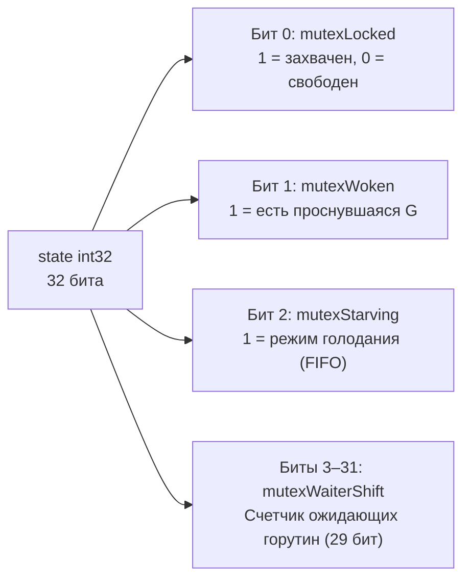
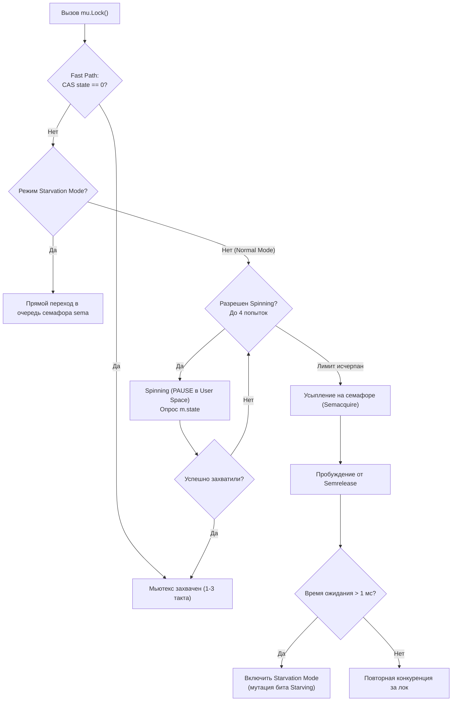

В предыдущей лекции [[13. Каналы под капотом. hchan, sudog, sendq, recvq]] мы сорвали романтические покровы с каналов и обнаружили, что внутри каждого канала неустанно трудится обыкновенный мьютекс. Каналы великолепно подходят для передачи владения данными, реализации паттернов Pipeline и оркестрации асинхронных горутин. Однако когда перед инженером стоит задача защитить изолированное состояние в памяти (например, инкрементировать счетчик запросов, обновить кэш или атомарно прочитать конфигурацию), каналы становятся непозволительной роскошью. Они порождают аллокации в куче, создают дескрипторы `sudog`, копируют данные и нагружают планировщик.

Для бескомпромиссной защиты разделяемого состояния (**State Protection**) фундаментом остаются классические примитивы взаимного исключения из стандартного пакета `sync`. Чтобы проектировать высоконагруженные сервисы без деградации tail latency, Senior-разработчик обязан понимать, как **`sync.Mutex`** и **`sync.RWMutex`** балансируют между аппаратным удержанием ядер CPU и засыпанием в операционной системе.

---

## Структура sync.Mutex: Искусство минимализма

Если исследовать реализацию мьютексов в стандартных библиотеках C++ (POSIX threads) или Java, мы увидим тяжелые объекты ядра операционной системы.  
В языке Go структура `sync.Mutex` (исходный код в `src/sync/mutex.go`) занимает ровно **8 байт** памяти на 64-битных платформах:

```go
type Mutex struct {
	state int32
	sema  uint32
}
```

Всего два 32-битных целочисленных поля, но за ними скрывается один из самых изощренных конечных автоматов в современном системном программировании.

### 1. Поле state (Состояние)

Поле `state` — это 32-битное число, используемое рантаймом как плотно упакованная **битовая маска (bitmask)**. Оно разбито на четыре функциональные зоны:



* **`mutexLocked` (Бит 0):** Флаг захвата мьютекса. Значение `1` означает, что критическая секция занята; `0` — мьютекс свободен.
* **`mutexWoken` (Бит 1):** Сигнал пробуждения. Выставляется в `1`, если одна из ранее уснувших горутин уже разбужена планировщиком и в данный момент борется за захват мьютекса. Это предотвращает избыточное пробуждение других горутин.
* **`mutexStarving` (Бит 2):** Флаг «Режима голодания» (**Starvation Mode**).
* **`Waiter Count` (Биты 3–31):** Оставшиеся 29 бит отведены под счетчик горутин, заблокированных на семафоре и ожидающих своей очереди. Это позволяет корректно отслеживать очередь из более чем 500 миллионов конкурентных задач.

Упаковка всех четырех параметров в единое 32-битное слово — шедевр механического сочувствия (**Mechanical Sympathy**): рантайм может атомарно изменить статус блокировки, флаги и число ожидающих ровно **одной процессорной инструкцией CAS**.

### 2. Поле sema (Семафор)

Если мьютекс занят и активное ожидание не дало результата, горутина должна уснуть. Для этого задействуется системный семафор рантайма — `sema`.  
Вызов процедуры `runtime.SemacquireMutex` переводит горутину в состояние сна `_Gwaiting` и открепляет ее от логического процессора `P` (происходит Handoff), освобождая поток ядра `M` для других задач.  
При освобождении мьютекса процедура `runtime.Semrelease` передает сигнал семафору, пробуждая спящую горутину из очереди.

---

## Fast Path: Как работает захват без блокировок

В соответствии с философией Bell Labs, накладные расходы на системные вызовы и переключение контекста должны сводиться к нулю в отсутствие конкуренции.

Когда горутина вызывает `mu.Lock()`, рантайм первым делом исполняет **Fast Path** (быстрый путь):

```go
// Концептуальный код Fast Path в Lock():
if atomic.CompareAndSwapInt32(&m.state, 0, mutexLocked) {
    return
}
```

Выполняется ровно одна атомарная инструкция процессора — **CAS (Compare-And-Swap)**. Если `state` равен `0` (мьютекс свободен, никто не ждет), значение мгновенно меняется на `1` (`mutexLocked`).  
Этот путь отрабатывает за **1–3 такта CPU** непосредственно в пространстве пользователя (User Space). Никаких обращений к ядру ОС, никаких структур ожидания.

Однако если `state` не равен нулю (мьютекс уже занят другой горутиной или в очереди есть ожидающие), управление немедленно передается в сложную процедуру — **Slow Path** (`m.lockSlow()`).

---

## Slow Path и два режима работы Мьютекса

Исторически, вплоть до релиза Go 1.9, мьютекс функционировал исключительно в «несправедливом» режиме. Когда текущий владелец вызывал `Unlock()`, разбуженная из очереди семафора горутина была вынуждена конкурировать за лок на общих основаниях с новыми горутинами, которые только что подошли к вызову `Lock()`.  
Новые горутины почти всегда побеждали: они уже были прогреты на ядрах CPU и находились в конвейере инструкций, в то время как спящей горутине требовалось время на переключение контекста планировщиком.  
Это приводило к катастрофическому явлению — **Голоданию (Starvation)**: в высоконагруженных системах старые горутины могли простаивать в очереди ожидания десятки миллисекунд и даже секунды, взвинчивая tail latency сервиса.

Чтобы устранить эту проблему, в Go 1.9 была внедрена гибридная двухрежимная архитектура: **Normal Mode** и **Starvation Mode**.



### 1. Normal Mode (Режим по умолчанию)

В обычном режиме горутины, столкнувшиеся с занятым мьютексом, не засыпают немедленно! Засыпание с привлечением планировщика и семафора — это накладные расходы порядка микросекунд.  
Вместо этого горутина входит в фазу **Spinning (Активное ожидание)**:

Горутина крутится в коротком цикле в пространстве пользователя, выполняя процессорную инструкцию **`PAUSE`** (на x86), сообщающую конвейеру CPU о спин-блокировке, и проверяет освобождение мьютекса.

*Строгие условия для перехода в Spinning:*
1. Процессор многоядерный (число ядер CPU > 1);
2. Переменная окружения `GOMAXPROCS` > 1;
3. Локальная очередь задач текущего процессора `P.runq` пуста (иначе спиннинг отнимал бы кванты CPU у полезных задач);
4. Выполняется **не более 4 попыток** кручения подряд.

Если за 4 итерации спиннинга мьютекс не освободился, горутина атомарно увеличивает счетчик `Waiter Count` в поле `state` и вызывает процедуру усыпления через семафор `sema`, переходя в `_Gwaiting`.

Когда мьютекс освобождается, он будит первую горутину из очереди. В Normal Mode эта проснувшаяся горутина должна конкурировать со свежими горутинами, только что вызвавшими `Lock()`. Если она проигрывает борьбу, она снова возвращается в начало очереди семафора.

### 2. Starvation Mode (Режим голодания)

Если проснувшаяся из очереди семафора горутина обнаруживает, что суммарное время ее ожидания в очереди превысило **1 миллисекунду**, она принудительно переключает мьютекс в **Starvation Mode** (устанавливая бит `mutexStarving` в `1`).

В режиме голодания правила игры становятся бескомпромиссно строгими:
1. **Spinning полностью запрещен.** Любая новая горутина, подошедшая к `Lock()`, даже не пытается крутиться на CPU или перехватить мьютекс через Fast Path;
2. **Строгий FIFO-порядок.** Все новые горутины немедленно инкрементируют счетчик ожидания и встают в хвост очереди семафора;
3. **Прямая передача владения.** Когда владелец вызывает `Unlock()`, он не сбрасывает бит `mutexLocked` в ноль. Он напрямую передает право владения мьютексом первой проснувшейся горутине из очереди семафора.

Мьютекс возвращается в производительный Normal Mode только тогда, когда очередная проснувшаяся горутина видит, что она ждала менее 1 мс, либо когда счетчик ожидающих горутин обнуляется.

> [!warning] Ловушка / Gotcha: Копирование мьютекса по значению
> 
> Распространенная ошибка даже среди опытных бэкендеров:
> 
> ```go
> type Cache struct {
>     mu   sync.Mutex
>     data map[string]string
> }
> 
> // ГРУБАЯ ОШИБКА: структура передается по значению!
> func (c Cache) Get(k string) string {
>     c.mu.Lock() // Блокируется ЛОКАЛЬНАЯ КОПИЯ мьютекса!
>     defer c.mu.Unlock()
>     return c.data[k]
> }
> ```
> 
> При передаче структуры по значению (`c Cache`) в памяти создается побайтовая копия всех полей, включая `state` и `sema`. Каждая вызывающая горутина блокирует свой персональный клон мьютекса, в то время как оригинальная критическая секция остается открытой. Это приводит к состояниям гонки (Data Race) и панике `concurrent map read and map write`.  
> Решение: всегда объявлять методы с pointer receiver: `func (c *Cache) Get()`. Статический анализатор `go vet` автоматически выявляет подобные ошибки копирования локов.

---

## sync.RWMutex: Не серебряная пуля

Когда в системе преобладают операции чтения над операциями записи, естественным выбором кажется **`sync.RWMutex`** (Reader/Writer Mutex). Он позволяет произвольному числу горутин-читателей удерживать разделяемый доступ параллельно (`RLock`), блокируя доступ только на время эксклюзивной записи (`Lock`).

Анатомия `sync.RWMutex` в исходниках Go:

```go
type RWMutex struct {
	w           Mutex  // Защищает очередь писателей
	writerSem   uint32 // Семафор для спящих писателей
	readerSem   uint32 // Семафор для спящих читателей
	readerCount int32  // Количество активных читателей
	readerWait  int32  // Сколько читателей писатель должен дождаться
}
```

### Механика работы

1. **`RLock()` (Читатель):**  
   Выполняет атомарный инкремент счетчика `readerCount`. Если результат неотрицателен, горутина мгновенно получает доступ к чтению. Если `readerCount` отрицателен — значит, в критическую секцию вошел писатель; читатель засыпает на семафоре `readerSem`.
2. **`Lock()` (Писатель):**  
   - Сначала захватывает внутренний мьютекс `w`, выстраивая других писателей в очередь;
   - Чтобы заблокировать вход новым читателям, писатель атомарно вычитает из `readerCount` колоссальную константу **`rwmutexMaxReaders`** ($1 \ll 30$, более 1 миллиарда):  
     Счетчик `readerCount` мгновенно становится отрицательным. Все последующие читатели видят отрицательное значение и отправляются спать на `readerSem`;
   - Писатель копирует количество текущих незавершенных читателей в поле `readerWait`;
   - Писатель засыпает на семафоре `writerSem`, пока самый последний активный читатель не вызовет `RUnlock()` и не разбудит его.

### Mechanical Sympathy: Почему RWMutex может быть медленнее Mutex?

На технических собеседованиях уровня Staff/Principal часто задают вопрос:  
*«Почему бенчмарк критической секции с 90% чтений и 10% записей показывает более высокую производительность на обычном sync.Mutex, чем на sync.RWMutex?»*

Ответ кроется в физике кэшей современных процессоров и эффекте **конкуренции за кэш-линию (Cache Line Contention / False Sharing)**.

При каждом вызове `RLock()` горутина обязана выполнить атомарный инкремент переменной `readerCount` в памяти (в ассемблере x86 это инструкция с блокировкой шины `LOCK XADD`).  
Если у вас 32-ядерный или 64-ядерный сервер, десятки ядер процессора одновременно пытаются выполнить атомарную запись в один и тот же 64-байтный фрагмент памяти (Cache Line).

Аппаратный протокол когерентности кэшей процессора (**MESI**) вынужден непрерывно аннулировать эту кэш-линию в кэшах L1 и L2 всех остальных ядер. Возникает эффект «дребезга кэш-линий» (**Cache Line Bouncing**). Ядра процессора сжигают сотни тактов, ожидая синхронизации шины памяти.

Обычный `sync.Mutex` также затрагивает кэш-линию, но его машинный код короче, в нем меньше логических ветвлений, и в отсутствие жесткой конкуренции он отрабатывает существенно быстрее.  
**Инженерное правило:** `sync.RWMutex` оправдан только тогда, когда сама операция чтения под локом занимает ощутимое время (микросекунды, парсинг данных, расчет хэша). Для микроскопических чтений обычный `sync.Mutex` или атомики всегда выигрывают в скорости!

> [!tip] Собеседование: Рекурсивный RLock и скрытый Deadlock
> 
> **Вопрос:** Способен ли следующий код спровоцировать взаимную блокировку (Deadlock)?
> 
> ```go
> var rw sync.RWMutex
> 
> func ReadA() {
>     rw.RLock()
>     defer rw.RUnlock()
>     ReadB()
> }
> 
> func ReadB() {
>     rw.RLock()
>     defer rw.RUnlock()
> }
> ```
> 
> **Ответ:** **Да, гарантированно способен!**  
> Если между вызовами первого `rw.RLock()` и второго `rw.RLock()` в другой параллельной горутине выполнится вызов `rw.Lock()` (писатель), то:
> 1. Писатель вычтет константу `rwmutexMaxReaders` и сделает счетчик `readerCount` отрицательным, заблокировав вход новым читателям;
> 2. Писатель уснет в ожидании завершения первого читателя (`ReadA`);
> 3. Функция `ReadA` вызовет `ReadB`, которая попытается взять второй `rw.RLock()`. Увидев отрицательный `readerCount`, второй `RLock` решит, что дорогу перешел писатель, и уснет на семафоре `readerSem`;
> 4. Возникает классический циклический **Deadlock**: писатель ждет завершения `ReadA`, а `ReadA` ждет писателя внутри `ReadB`.  
> Никогда не используйте повторные или рекурсивные вызовы `RLock` в рамках одной цепочки вызовов!

---

## Итог

1. **`sync.Mutex`** занимает всего 8 байт: 32-битное битовое поле `state` и 32-битный системный семафор `sema`.
2. **Fast Path:** При отсутствии конкуренции мьютекс захватывается за пару тактов CPU одной атомарной инструкцией CAS в User Space.
3. **Spinning:** В Normal Mode горутина крутится до 4 раз в активном цикле с инструкцией `PAUSE`, избегая дорогих системных вызовов.
4. **Starvation Mode:** Если горутина ждет в очереди семафора более 1 мс, мьютекс переходит в строгий режим FIFO, напрямую передавая лок ожидающим задачам и предотвращая голодание.
5. **`sync.RWMutex`** эффективен при длительных операциях чтения, но на сверхбыстрых операциях проигрывает обычному `sync.Mutex` из-за инвалидации кэш-линий протоколом MESI при параллельных атомиках `readerCount`.

В основе работы мьютексов, очередей каналов и самого планировщика лежит фундаментальный фундамент — **атомарные инструкции процессора**.

В следующей лекции мы спустимся на самый глубокий уровень синхронизации кремния и разберем:

[[16. sync_atomic и атомарные операции в рантайме]].