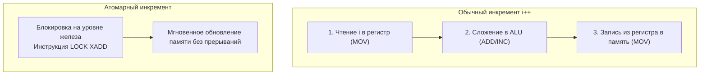
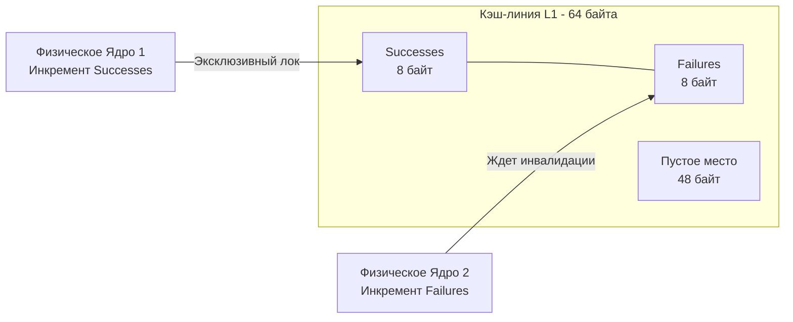

В статье [[15. Mutex и RWMutex под капотом.md]] мы детально исследовали, как устроен мьютекс, и увидели, что любой примитив синхронизации в Go опирается на быстрый путь (Fast Path), который использует загадочную инструкцию `CAS`. Мьютексы, каналы, планировщик (очереди `runq`), сборщик мусора — весь рантайм Go держится на одном фундаментальном механизме. Этот механизм — **атомарные операции**.

Пакет `sync/atomic` предоставляет нам доступ к этому слою абстракции. Но чтобы использовать его правильно (и не выстрелить себе в ногу деградацией производительности), инженер должен спуститься с уровня языка программирования на уровень кремния, шины процессора и кэш-линий.

---

## Иллюзия атомарности

Новички часто думают, что операция `i++` или `i = i + 1` выполняется мгновенно. На уровне исходного кода это одна элегантная строка. Но для процессора это классический **цикл Read-Modify-Write (RMW)**, состоящий как минимум из трех отдельных машинных инструкций:

1. **Read:** Перенести значение из оперативной памяти (или L1-кэша) в регистр процессора (`MOV`).
2. **Modify:** Увеличить значение в регистре через Арифметико-логическое устройство (ALU) (`INC` или `ADD`).
3. **Write:** Записать обновленное значение обратно в память (`MOV`).

Если два потока ОС (на двух разных физических ядрах CPU) выполнят эти три шага одновременно, они прочитают одно и то же старое значение, увеличат его и запишут одно и то же новое значение. Одно увеличение будет безвозвратно потеряно (Race Condition).



---

## Hardware: Как железо делает магию

Чтобы сделать операцию атомарной (неделимой), процессор должен гарантировать эксклюзивный доступ к участку памяти на все время цикла RMW.

В архитектуре `x86-64` это исторически достигалось добавлением префикса `LOCK` к машинным инструкциям (например, `LOCK XADD`, `LOCK CMPXCHG`).
В ранних процессорах префикс `LOCK` буквально активировал электрический сигнал на системной шине памяти (FSB — Front Side Bus): ни одно другое ядро и ни один контроллер DMA не могли обратиться к оперативной памяти, пока текущая инструкция не завершится. Это гарантировало атомарность, но обрушивало общую пропускную способность системы.

Современные многоядерные процессоры действуют тоньше. Они используют аппаратные протоколы когерентности кэшей (например, семейство **MESI** / MOESI). 
Вместо блокировки всей оперативной памяти процессор выполняет так называемую *блокировку кэш-линии (Cache Lock)*:
1. Загружает данные в свой L1-кэш (L1-кэш данных L1d).
2. Посылает по межъядерной кольцевой шине (Ring Bus или Mesh Interconnect) широковещательный запрос другим ядрам: *"Я беру эту кэш-линию в эксклюзивное владение (Modified state)"*.
3. Другие ядра инвалидируют (сбрасывают в состояние Invalid) эту кэш-линию у себя.
4. Ядро выполняет операцию RMW прямо в L1-кэше без помех со стороны других исполнителей, после чего освобождает эксклюзивность.

На современных архитектурах ARM (ARM64 v8.1+ LSE — Large System Extensions) для этого применяются специализированные атомарные инструкции вроде `LDADD` и `CAS`, а в более ранних — пары `LDREX` / `STREX` (Load-Linked / Store-Conditional).

---

## Атомарные примитивы в Go

Пакет `sync/atomic` предоставляет набор базовых низкоуровневых операций над целыми числами и указателями:
* `Add` (Атомарное сложение/вычитание).
* `Load` (Атомарное чтение с барьером памяти).
* `Store` (Атомарная запись).
* `Swap` (Запись нового значения с возвратом старого).
* **`CompareAndSwap` (CAS):** Краеугольный камень lock-free программирования.

Функция `CAS` принимает адрес памяти, ожидаемое старое значение и новое значение. Процессор обновляет память **только в том случае**, если текущее значение совпадает с ожидаемым. Если кто-то другой успел изменить значение до нас, CAS возвращает `false`, и мы обычно повторяем попытку в цикле повтора (Spin-loop):

```go
for {
    oldVal := atomic.LoadInt64(&val)
    newVal := oldVal + 10
    if atomic.CompareAndSwapInt64(&val, oldVal, newVal) {
        break
    }
}
```

> [!info] Под капотом. Магия компилятора (Intrinsics)
> Если вы попытаетесь найти исходный код функции `atomic.AddInt64` в репозитории Go, вы обнаружите в пакете `sync/atomic` лишь сигнатуру без тела функции (forward declaration).
> Почему? Потому что это **Compiler Intrinsic** (встроенная функция компилятора). 
> На этапе перевода AST в SSA компилятор распознает вызов пакета `atomic` и напрямую подставляет вместо него аппаратно-специфичные машинные инструкции (например, `LOCK XADDQ` на x86-64). Никакого создания фрейма функции, никакого вызова (CALL), никакого сохранения регистров — код встраивается (inlined) с предельной производительностью. (См. [[5. Go assembler и внутренний ассемблерный синтаксис.md]]).

---

## Эволюция: от функций к дженерикам (Go 1.19+)

До Go 1.19 мы использовали пакет `atomic` исключительно через процедурные функции, передавая нетипизированные указатели:
```go
var counter int64
atomic.AddInt64(&counter, 1)
```

Начиная с Go 1.19, в язык добавили безопасные типы (обертки на дженериках):
```go
var counter atomic.Int64
counter.Add(1)
```

Это не просто эстетический синтаксический сахар. Это решение двух фундаментальных проблем языка.

### Проблема 1: Выравнивание памяти (Alignment Trap)
Процессоры (особенно 32-битные архитектуры ARM или старые x86) требуют, чтобы 64-битные переменные (8 байт), над которыми совершаются атомарные операции, имели **выравнивание в памяти по границе 8 байт** (адрес должен быть кратен 8). 

Если вы используете классический тип `int64` внутри структуры, компилятор на 32-битной архитектуре может выровнять его по границе 4 байта. При попытке вызвать `atomic.AddInt64` программа **упадет с паникой**: `panic: unaligned 64-bit atomic operation`.

Новые типы (`atomic.Int64`, `atomic.Pointer`) гарантируют правильное выравнивание под капотом для любой архитектуры. Они используют внутренний трюк с массивами или директиву `align64`, навсегда избавляя разработчика от этой головной боли.

### Проблема 2: Type Safety
Раньше для атомарного обновления указателей использовался `atomic.Value` или `unsafe.Pointer`. Вы легко могли записать структуру одного типа, а прочитать другого, получив panic в рантайме (так как под капотом `atomic.Value` использует интерфейс `eface`, см. [[35. Интерфейсы под капотом. eface и iface.md]]).
Новый `atomic.Pointer[T]` использует дженерики для строгой проверки типов на этапе компиляции, устраняя риск некорректного приведения типов.

---

## Mechanical Sympathy: Ложное разделение (False Sharing)

Это классический вопрос для позиций Senior/Lead.
Атомарные операции невероятно быстры (единицы наносекунд), но они могут стать *медленнее* тяжелого мьютекса, если вы упустите из виду физику процессора.

Процессор загружает данные из оперативной памяти не отдельными байтами или переменными, а цельными блоками — **Кэш-линиями (Cache Lines)**. На современных архитектурах размер кэш-линии составляет **64 байта**.

Представьте структуру метрик высоконагруженного сервиса:
```go
type Metrics struct {
    Successes atomic.Int64 // 8 байт
    Failures  atomic.Int64 // 8 байт
}
var m Metrics
```

Обе эти переменные лежат в памяти вплотную друг к другу. Они занимают всего 16 байт и гарантированно **попадают в одну кэш-линию**.

Теперь представим сценарий: Горутина 1 (на Ядре 1) инкрементирует `Successes`, а Горутина 2 (на Ядре 2) инкрементирует `Failures`. 
* На логическом уровне горутины работают с совершенно разными переменными, и формальной гонки данных нет.
* На аппаратном уровне Ядро 1 блокирует кэш-линию (через MESI) и инвалидирует её у Ядра 2. Ядру 2 приходится запрашивать кэш-линию заново из кэша L3 или оперативной памяти, изменять `Failures` и в ответ инвалидировать линию у Ядра 1.

Кэш-линия начинает пинг-понгом метаться между ядрами. Эта проблема называется **False Sharing (Ложное разделение)**. Производительность приложения в многопоточном режиме может упасть в 10–50 раз.



> [!tip] Собеседование. Как починить False Sharing?
> Чтобы ядра не мешали друг другу, нам нужно «разнести» переменные в памяти так, чтобы они попали в разные кэш-линии. Для этого используется техника **CPU Padding (добивка)**.
> ```go
> type Metrics struct {
>     Successes atomic.Int64
>     _         [56]byte // Padding: добиваем до 64 байт
>     Failures  atomic.Int64
> }
> ```
> Теперь `Successes` и `Failures` лежат в разных кэш-линиях (расстояние между ними не менее 64 байт). Ядра процессора обновляют их абсолютно независимо, не вызывая конфликтов когерентности, и мы получаем честное линейное масштабирование производительности.

---

## Когда использовать atomic, а когда Mutex?

* **Используйте `sync/atomic` для:** простых счетчиков, флагов состояния (`atomic.Bool`), метрик и lock-free паттернов (например, реализация кольцевого буфера `Ring Buffer`).
* **Используйте `atomic.Value` или `atomic.Pointer[T]` для:** конфигураций или кэшей, которые редко пишутся, но часто читаются (паттерн Copy-On-Write — создаем новую структуру, заполняем её и атомарно заменяем указатель за O(1)).
* **Используйте `sync.Mutex` для:** сложной бизнес-логики, где нужно атомарно обновить сразу несколько связанных полей в мапе или структуре данных, либо защитить критическую секцию с операциями ввода-вывода.

---

## Итог

1. Операции присваивания или сложения (`i++`) в Go не являются атомарными на уровне железа: это трехшаговый цикл Read-Modify-Write.
2. Пакет `sync/atomic` обращается напрямую к инструкциям процессора (`LOCK XADD`), обеспечивая гарантию эксклюзивного изменения участка памяти на уровне когерентности кэшей.
3. Современные типы `atomic.Int64` и `atomic.Pointer[T]` из Go 1.19+ решают проблемы выравнивания памяти (на 32-битных архитектурах) и Type Safety.
4. Размещая атомарные переменные подряд, мы рискуем нарваться на **False Sharing** (инвалидацию кэш-линий 64-байт). Лечится это добавлением Padding'а.

Мы разобрали механизмы синхронизации снизу (атомарные операции) доверху (мьютексы и каналы). Но остается один фундаментальный концептуальный вопрос: если компилятор и процессор имеют законное право переставлять инструкции местами для оптимизации (Out-of-Order Execution), как Go гарантирует, что Горутина А увидит изменения памяти, сделанные Горутиной Б? 

Этот контракт между программистом, компилятором и железом описан в строгом математическом документе. В следующей статье мы разберем главный страх всех собеседований:
[[17. Go Memory Model и happens before.md]]