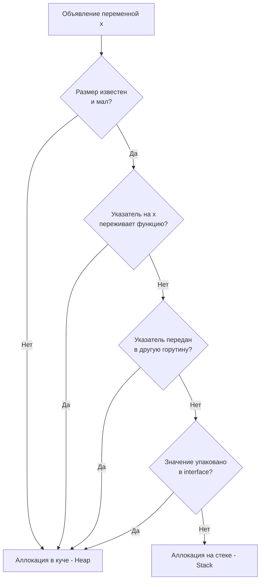

В прошлых статьях мы детально погружались в то, как рантайм управляет памятью горутины ([[11. Стек горутины. Рост и shrink стека.md]]) и как синхронизирует кэши ядер процессора ([[17. Go Memory Model и happens before.md]]). На протяжении этих бесед мы постоянно оперировали понятиями «Стек» и «Куча». 

В классических системных языках вроде C или C++ программист вынужден лично и безоговорочно решать, где именно выделить память:
* Написал `int a = 5;` — память выделилась на быстром стеке текущего кадра.
* Написал `int* a = malloc(sizeof(int));` — память запрошена в медленной куче.

Но если в Си вы по неосторожности вернете указатель на локальную переменную из функции, вы получите печально известный «висячий указатель» (Dangling Pointer) и фатальную ошибку памяти (Undefined Behavior). Стек функции уничтожается (точнее, инвалидируется) немедленно при выходе из нее, и ваш указатель будет смотреть на мусорную память, готовую перезаписаться при следующем вызове любой подпрограммы.

Go — это язык, изначально спроектированный для безопасной и продуктивной конкурентной разработки. Вы **можете** совершенно спокойно вернуть указатель на локальную структуру из функции, и программа не упадет и не повредит память. Почему? Потому что в конвейере компиляции (на этапе работы с AST и промежуточным представлением, см. [[3. Фазы компиляции. Lexer, Parser, Type Checker, SSA.md]]) непрерывно трудится важнейший алгоритм — **Escape Analysis (Анализ побега)**.

---

## Mechanical Sympathy. Цена вопроса

Зачем инженеру вообще заботиться о том, где именно размещается переменная? Разве сборщик мусора не освобождает нас от рутины управления памятью?

Давайте взглянем на происходящее глазами кремния:

**Аллокация на стеке:**
Стоит ровно **0 тактов CPU** в рантайме. Компилятор просто сдвигает регистр `SP` (Stack Pointer) вниз на этапе входа в функцию (`SUBQ $24, SP`). Когда функция завершается, указатель возвращается обратно простой инструкцией `ADDQ` или `RET`. Сборщик мусора (GC) никогда не тратит время на сканирование мертвых фреймов стека — стек очищается автоматически самим фактом завершения вызова. Это абсолютно бесплатная память.

**Аллокация в куче (Heap):**
Стоит ощутимо дорого. Рантайм обязан найти свободный блок памяти подходящего размера в структурах `mcache` или `mcentral` (см. [[21. Аллокатор памяти Go. mcache, mcentral, mheap.md]]), возможно, обратившись к глобальному аллокатору под мьютексом. Но самое драматичное — переменная в куче создает долгосрочную работу для Сборщика Мусора (GC). 

Связь здесь прямая и неумолимая:  
$$\text{Больше аллокаций в куче} \longrightarrow \text{Чаще запускается GC} \longrightarrow \text{Больше тактов CPU сгорает на обход графа объектов}$$  
В результате драгоценное процессорное время тратится не на обработку бизнес-логики и сетевых запросов, а на инспекцию живых указателей.

**Задача Escape Analysis** — математически доказать, что переменная не «убегает» (escape) за пределы времени жизни текущей функции. Если компилятор может это строго доказать, он с радостью размещает переменную на бесплатном стеке. Если же есть хоть малейшее сомнение или неоднозначность — переменная превентивно отправляется в кучу.

---

## Как компилятор принимает решение?

Анализ побега — это статический анализ графа потока данных (Directed Graph / Points-to Analysis). Компилятор отслеживает путь каждого создаваемого объекта и ищет ответы на ключевые вопросы.



Разберем 4 главных базовых правила, по которым компилятор «штрафует» код аллокациями в куче.

---

### Правило 1: Возврат указателя (Sharing Out)

Самый наглядный и естественный случай. Если функция инициализирует структуру и возвращает указатель на нее вызывающему коду, эта переменная обязана пережить завершение функции:

```go
func createUser() *User {
    u := User{Name: "Alex"} // Убегает в Heap
    return &u
}
```

Компилятор видит: стек функции `createUser` будет свернут сразу после возврата. Если `u` останется в этом фрейме, вызывающий код получит невалидный адрес. Поэтому компилятор молча переписывает инициализацию, заменяя ее на вызов рантайм-аллокатора `newobject` в куче.

---

### Правило 2: Передача указателя вглубь структур (Sharing Down)

Если вы помещаете указатель локальной переменной внутрь другой структуры, которая уже живет в куче, ваша локальная переменная тоже **обязана** отправиться в кучу:

```go
type Registry struct {
    users []*User
}

func addUser(r *Registry) {
    u := User{Name: "Bob"} // Убегает в Heap!
    r.users = append(r.users, &u)
}
```

Даже если переменная `u` не возвращается из `addUser` через оператор `return`, ссылка на нее сохраняется внутри среза `r.users`. Если сам `Registry` расположен в куче, то сборщик мусора попал бы в неразрешимую ситуацию: объект в долгоживущей куче ссылался бы на эфемерный стек завершившейся функции. Чтобы предотвратить катастрофу, компилятор принудительно эвакуирует `u` в кучу.

> [!warning] Ловушка / Gotcha. Каналы и указатели
> Отправка указателя в канал практически **всегда** приводит к Escape Analysis = Heap. 
> Компилятор на этапе сборки не может знать, какая именно горутина прочитает значение из канала и сколько времени оно там проведет. Поскольку стеки горутин строго изолированы друг от друга и могут перемещаться в памяти при росте (см. `copystack`), передавать между ними можно либо значения, либо указатели на общую память (кучу).

---

### Правило 3: Размер неясен или слишком велик

Размер стекового кадра каждой функции фиксируется компилятором заранее (он жестко закодирован в машинных инструкциях пролога функции). 

Если вы создаете слайс, длина которого определяется только в рантайме, компилятор не может зарезервировать под него точное число байт на стеке:

```go
func process(size int) {
    // Убегает в Heap! Компилятор не знает size на этапе сборки.
    buf := make([]byte, size) 
    
    // Остается на стеке! Размер константен и мал.
    buf2 := make([]byte, 64)  
    _ = buf
    _ = buf2
}
```

Кроме того, существует строгий лимит размера объекта. В современных версиях Go переменная размером больше **64 КБ** (даже если ее размер абсолютно константен и известен) гарантированно отправляется в кучу. Зачем? Чтобы не переполнять стартовый стек горутины, размер которого составляет всего 2 КБ. Размещение 64-килобайтного буфера на стеке вызвало бы немедленное дорогое расширение стека с копированием памяти.

---

### Правило 4: Упаковка в интерфейс (Interface Boxing)

Это одна из самых коварных причин скрытых аллокаций, на которой спотыкаются даже опытные разработчики:

```go
func printLog() {
    x := 42 // Убегает в Heap! Почему?
    fmt.Println(x)
}
```

Казалось бы: как элементарное число `int` может оказаться в куче?
Обратите внимание на сигнатуру `fmt.Println`: она принимает вариативный параметр `...any` (срез пустых интерфейсов `interface{}`). 

Под капотом пустой интерфейс (`eface`) представляет собой структуру из двух указателей: указатель на метаданные типа `_type` и указатель на сами данные `data`. Чтобы передать число `42` в качестве значения данных интерфейса, рантайм должен получить адрес этого значения в памяти. 
Поскольку `fmt.Println` внутри использует рефлексию и передает интерфейс через сложную цепочку вызовов, компилятор не может гарантировать, что ссылка на переменную не сохранится где-то глобально. Он перестраховывается и пессимистично выталкивает `42` в кучу.

*(Детально механику боксинга интерфейсов мы разберем в [[36. Interface Boxing и hidden allocation.md]])*.

---

## Как посмотреть решения компилятора?

Вам не нужно строить догадки или полагаться на интуицию. Разработчики компилятора Go предоставили великолепный диагностический инструмент — флаг компиляции `-gcflags="-m"`.

Создадим проверочный файл `main.go`:
```go
package main

type Data struct { Val int }

func makeData() *Data {
	d := Data{Val: 10}
	return &d
}

func main() {
	makeData()
}
```

Запустим сборку с флагом трассировки Escape Analysis:
```bash
go build -gcflags="-m" main.go
```

Вывод компилятора предельно прозрачен:
```text
./main.go:6:2: moved to heap: d
```

Компилятор открытым текстом сообщает: в строке 6 переменная `d` перемещена в кучу. 
Если вам требуется глубокий контекст и дерево причин (почему именно компилятор принял такое решение, какие узлы графа связаны), можно передать удвоенный или утроенный флаг: `-gcflags="-m -m"`.

> [!tip] Собеседование. Передача по значению или по указателю?
> **Вопрос:** Мы хотим передать структуру умеренного размера (например, 200 байт) в функцию-обработчик. Что будет работать быстрее и эффективнее: `func process(s Struct)` (по значению) или `func process(s *Struct)` (по указателю)?
> 
> **Ответ:** Ответ кроется в Escape Analysis! 
> Если вы передаете аргумент по значению, процессор копирует 200 байт на стек. На современных CPU с быстрой шиной памяти и L1-кэшем копирование 200 байт занимает пару наносекунд и **совершенно не нагружает Сборщик Мусора**.
> 
> Если же вы передаете аргумент по указателю, вы передаете всего 8 байт (адрес). Но если внутри `process` этот указатель «убежит» (сохранится в фоновую горутину, запишется в глобальный кэш или уйдет в интерфейс), то вся исходная структура в 200 байт будет принудительно аллоцирована в куче! Затраты на аллокацию в куче и последующий цикл работы GC в тысячи раз превысят копеечную экономию на передаче 8 байт вместо 200. В Go зачастую гораздо выгоднее передавать структуры небольшого и среднего размера по значению.

---

## Итог

1. **Escape Analysis** — это статический алгоритмический проход компилятора, определяющий реальное время жизни переменной и место ее размещения.
2. Аллокация на стеке бесплатна (сдвиг регистра `SP`). Аллокация в куче расходует циклы CPU и создает долговую нагрузку на Garbage Collector.
3. Переменная гарантированно убегает в кучу, если:
   * На нее возвращается указатель наружу из функции (`return &x`).
   * Указатель на нее присваивается в структуру или массив, уже живущие в куче.
   * Ее размер динамический (неизвестен на этапе компиляции) или превышает порог 64 КБ.
   * Она упаковывается в `interface{}` / `any` (Interface Boxing).
4. Главный инструмент практического аудита: `go build -gcflags="-m"`.

Понимание правил Escape Analysis — это краеугольный камень написания по-настоящему быстрого zero-allocation кода. Но как применить эти знания на практике при решении реальных задач? Как отрефакторить реальный бэкенд-код, чтобы устранить скрытые аллокации в горячих циклах (Hot Paths)?

В следующей статье мы на конкретных примерах разберем приемы оптимизации:
[[19. Escape Analysis на практике. Как писать меньше аллокаций.md]]