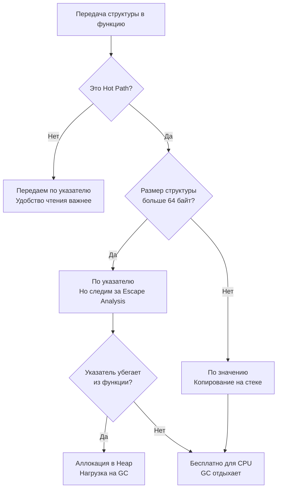

В статье [[18. Escape Analysis. Почему переменная ушла в heap.md]] мы разобрали строгую теорию: как компилятор выстраивает граф потока данных и решает судьбу ваших переменных. Теоретические основы незаменимы, но бэкенд-инженеру платят за то, чтобы боевой сервис выдерживал 10 000 RPS на скромном сервере без внезапных скачков задержки (Latency Spikes).

Аллокации в куче (Heap) — скрытый, но главный враг высокопроизводительного сервиса на Go. Каждое выделение памяти в куче отнимает драгоценные такты процессора на поиск свободных слотов в рантайм-аренах и, что еще опаснее, взваливает дополнительную работу на Сборщик мусора (GC). Сборщик вынужден регулярно активировать фазы разметки, отбирать до 25% процессорной мощности рабочих ядер и ненадолго останавливать выполнение горутин (Stop-The-World).

В этой главе мы перейдем от сухой теории к повседневному инженерному ремеслу. Мы разберем проверенные практические паттерны с точки зрения Mechanical Sympathy, которые позволяют управлять Escape Analysis и осознанно писать `zero-allocation` код в критических узлах архитектуры.

---

## Правило нулевое: Hot Path

Прежде чем бросаться вычищать каждую аллокацию в проекте, вспомним золотое правило Bell Labs: **не оптимизируйте холодный код**.

Если структура аллоцируется в куче при чтении конфигурационного файла на старте сервиса или при выполнении фоновой cron-задачи раз в сутки — забудьте о ней. Любые попытки экономить байты здесь приведут лишь к загромождению кода и снижению его читаемости. Оптимизировать нужно исключительно **Hot Path (Горячий путь)** — участки кода, которые выполняются тысячи или миллионы раз в секунду:
* Циклы разбора сетевых пакетов и потоков данных.
* Главные HTTP/gRPC хэндлеры обработки входящих запросов.
* Сериализаторы и десериализаторы сообщений из брокеров.
* Системные циклы сетевого поллера и очередей сообщений.

---

## Паттерн 1. Копирование по значению (Value Semantics)

Один из самых живучих мифов, перенесенный разработчиками из языков C++ или Java: *«Передавать структуры по указателю всегда быстрее, потому что мы копируем лишь 8 байт адреса»*.

В языке Go это утверждение оказывается ложным едва ли не в половине реальных сценариев.

Если вы передаете указатель на структуру в функцию, и внутри этой цепочки указатель попадает в интерфейс, замыкание или сохраняется в глобальную мапу, немедленно срабатывает Escape Analysis (Sharing Out / Sharing Down). Структура покидает стек и эвакуируется в кучу. Затраты на выделение памяти через аллокатор рантайма и последующий сбор мусора в сотни раз превышают микроскопическую выгоду от экономии на передаче нескольких байт.

Современные процессоры виртуозно умеют копировать непрерывные участки памяти. Перемещение структуры размером 64 или 128 байт по значению на стеке для CPU — это буквально несколько параллельных инструкций регистрового перемещения, попадающих прямо в горячий кэш L1d.



**Инженерное эмпирическое правило:**
1. Для небольших структур размером до 3–4 машинных слов (24–32 байта) передача по значению практически всегда быстрее и безопаснее.
2. Для структур среднего размера (до ~128 байт) передача по значению оказывается предпочтительнее, если она надежно предотвращает побег переменной в кучу.
3. Передавать указатель следует тогда, когда методу действительно необходимо мутировать состояние оригинала, либо когда размер структуры исчисляется сотнями байт или килобайтами.

---

## Паттерн 2. Интерфейсы и логирование (Boxing)

Вспомним Правило 4 из предыдущей главы: упаковка конкретного значения в `interface{}` (или тип-псевдоним `any`) вынуждает компилятор отправлять базовые типы в кучу. 
В реальных бэкенд-сервисах главный виновник скрытого мусора — неосторожное логирование.

Рассмотрим типичный фрагмент кода (использующий стандартный пакет `log` или библиотеку `logrus`):
```go
func processRequest(userID int64) {
    // userID = 42 (изначально живет на стеке)
    // При передаче в Println он пакуется в interface{} -> Убегает в Heap!
    log.Println("Processing user", userID) 
}
```

В высоконагруженном микросервисе каждый входящий запрос будет порождать десятки ненужных микроаллокаций на ровном месте. Как проектировать такие узлы правильно? Использовать структурированные логгеры с нулевыми аллокациями (например, `uber-go/zap` или `rs/zerolog`):

```go
func processRequest(userID int64, logger *zap.Logger) {
    // zap.Int64 не использует interface{}
    // Он использует строго типизированную структуру Field. 0 аллокаций!
    logger.Info("Processing user", zap.Int64("user_id", userID))
}
```

> [!tip] Собеседование. Как Generic'и спасают от интерфейсов?
> **Вопрос:** Если мы напишем обобщенную функцию `func Print[T any](val T)`, убежит ли `val` в кучу, как это неизбежно происходит с нетипизированным аргументом `func Print(val any)`?
> 
> **Ответ:** Нет, не убежит! Обобщения (Generics) в Go реализованы через механизм мономорфизации (stenciling). На этапе компиляции компилятор генерирует специализированные копии функций под конкретные типы (например, `Print_int`). Значение передается со строгим конкретным типом без упаковки в заголовок `eface`, благодаря чему Escape Analysis сохраняет переменную на стеке. (Подробнее этот механизм рассматривается в [[36. Interface Boxing и hidden allocation.md]]).

---

## Паттерн 3. Предварительная аллокация слайсов

Если вы инициализируете слайс (см. [[29. Внутреннее устройство slice.md]]) без указания начальной емкости (`capacity`) и начинаете наполнять его элементами в цикле, происходят две крайне нежелательные вещи:
1. Многократные дорогостоящие реаллокации (выделение нового буфера с множителем роста, копирование старых элементов, выбрасывание старого буфера в мусор).
2. Слайс почти наверняка убегает в кучу, так как его размер и адрес базового массива непрерывно меняются в динамике исполнения.

**Неэффективный подход:**
```go
func getIDs(users []User) []int64 {
    var ids []int64 // Длина 0, Капасити 0
    for _, u := range users {
        ids = append(ids, u.ID) // Постоянные реаллокации и рост в Heap
    }
    return ids
}
```

**Mechanical Sympathy (Идеальный подход):**
```go
func getIDs(users []User) []int64 {
    // Мы заранее знаем итоговое количество элементов! Резервируем память сразу.
    ids := make([]int64, 0, len(users)) 
    for _, u := range users {
        ids = append(ids, u.ID) // 0 реаллокаций, непрерывная память
    }
    return ids
}
```
Даже если возвращаемый слайс покидает функцию и неизбежно размещается в куче, мы заменяем цепочку из 5–8 последовательных аллокаций ровно **одной** атомарной аллокацией требуемого размера.

---

## Паттерн 4. Zero-Copy String Conversion

В рантайме Go строковый тип `string` представляет собой неизменяемую последовательность байт. Срез `[]byte`, напротив, открыт для любых модификаций. 
По этой причине стандартное приведение типов `[]byte(str)` или `string(bytes)` **всегда** производит выделение новой памяти в куче и побайтовое копирование, предотвращая изменение неизменяемой строки через разделяемый буфер.

Однако в критических парсерах (разбор HTTP-заголовков, токенизация JSON, сетевые протоколы) эти постоянные копирования становятся узким горлышком. Если вы можете строго гарантировать, что полученный байтовый буфер не будет модифицирован, вы можете применить инструментарий пакета `unsafe` для обхода ограничений системы типов.

> [!warning] Ловушка / Gotcha. unsafe-трюки
> До версии Go 1.20 разработчики часто прибегали к небезопасным хакам с манипуляциями структурами `reflect.SliceHeader` и `reflect.StringHeader`. Это было крайне рискованно, приводило к сбоям сборщика мусора и часто ломалось при минорных обновлениях компилятора.

Начиная с релиза Go 1.20 в стандартную библиотеку были добавлены официальные, безопасные и поддерживаемые рантаймом примитивы:

```go
import "unsafe"

// Преобразование из string в []byte (без аллокаций и копирования)
func strToBytes(s string) []byte {
    if s == "" {
        return nil
    }
    return unsafe.Slice(unsafe.StringData(s), len(s))
}

// Преобразование из []byte в string (без аллокаций и копирования)
func bytesToStr(b []byte) string {
    if len(b) == 0 {
        return ""
    }
    return unsafe.String(unsafe.SliceData(b), len(b))
}
```

Эти функции выполняются буквально за $0$ тактов процессора: они просто конструируют новый дескриптор, ссылающийся на уже существующий массив байт в памяти. Мы детально исследуем внутреннее устройство строк в [[34. Внутреннее устройство string.md]], а архитектуру и правила пакета `unsafe` — в [[38. Unsafe.Pointer и нарушение гарантий языка.md]].

---

## Паттерн 5. sync.Pool для тяжелых объектов

Если архитектура требует регулярного создания тяжелых временных объектов (например, буферов `bytes.Buffer` размером в десятки килобайт) на каждый входящий сетевой запрос, Escape Analysis бессилен: такие объекты обязаны жить в куче. В результате GC захлебывается в потоке кратковременного мусора.

Классическое решение этой задачи — переиспользование ранее выделенных объектов. Мы не выбрасываем каждый раз использованный предмет в мусорное ведро, а тщательно моем его и возвращаем на полку для следующего рабочего цикла.
Для реализации этой стратегии стандартная библиотека Go предлагает инструмент `sync.Pool`.

```go
var bufPool = sync.Pool{
    New: func() any {
        return new(bytes.Buffer)
    },
}

func handleRequest() {
    // Извлекаем готовый буфер из пула (0 аллокаций в устойчивом режиме)
    buf := bufPool.Get().(*bytes.Buffer)
    
    // КРИТИЧЕСКИ ВАЖНО: сбрасываем внутреннее состояние перед повторным использованием!
    buf.Reset() 
    
    // ... выполняем полезную работу с buf ...
    
    // Возвращаем очищенный экземпляр обратно в пул
    bufPool.Put(buf) 
}
```

> [!info] Под капотом
> `sync.Pool` работает с невероятной эффективностью, поскольку он глубоко интегрирован в рантайм Go и опирается на структуры логических процессоров `P`. Он обслуживает запросы локально для текущего ядра без глобальных блокировок мьютексами через lock-free очереди. Полное погружение в его внутреннее устройство ждет нас в [[23. sync_pool под капотом.md]].

---

## Как доказать отсутствие аллокаций?

Инженерные суждения бессмысленны без строгих воспроизводимых измерений. Главный арбитр оптимизации горячих путей — встроенный инструмент бенчмаркинга `testing` с анализом профиля памяти.

Напишем бенчмарк:
```go
func BenchmarkGetIDs(b *testing.B) {
    users := make([]User, 100)
    b.ResetTimer() // Сбрасываем таймер после этапа генерации фиктивных данных
    
    for i := 0; i < b.N; i++ {
        _ = getIDs(users)
    }
}
```

Запустим профилирование аллокаций памяти командой:
```bash
go test -bench=. -benchmem
```

Идеальный вывод, к которому стремится системный инженер:
```text
BenchmarkGetIDs-8    10000000    120 ns/op    0 B/op    0 allocs/op
```

Заветная запись `0 allocs/op` — документальное подтверждение вашей победы: код работает исключительно в границах стека либо безопасно переиспользует существующие пулы памяти.

---

## Итог

1. Анализ и устранение аллокаций имеют практический смысл только на **Hot Path** (горячих траекториях исполнения).
2. **Передача по значению** небольших и средних структур (до ~128 байт) в Go часто работает быстрее передачи по указателю, поскольку гарантирует локальность данных на стеке и разгружает GC.
3. Избегайте неявной упаковки базовых типов в `interface{}` в горячем коде (применяйте строгие типы, кодогенерацию или Generic-параметры).
4. Всегда определяйте емкость (`capacity`) при создании слайсов, если конечное число элементов известно заранее (`make([]T, 0, cap)`).
5. Для крупных буферов и объектов, неизбежно требующих памяти в куче, применяйте `sync.Pool`.

Мы подробно изучили стек горутины, анализ побега переменных и методы минимизации аллокаций. Но что представляет собой сама глобальная Куча (Heap)? Как именно рантайм Go делит системную память ОС между миллионами объектов разного размера?

В следующей главе мы спустимся в недра аллокатора памяти Go. Переходим к:
[[20. Stack vs Heap в Go.md]]