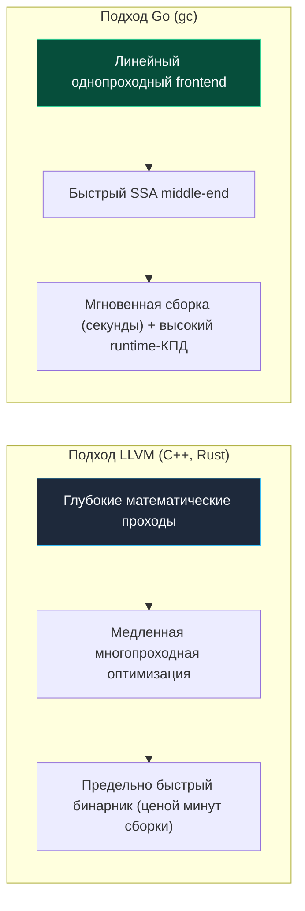
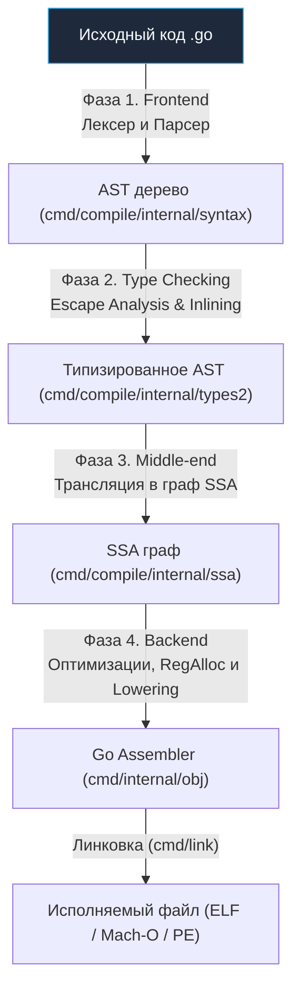

В предыдущей вводной лекции мы увидели финал работы программы — момент, когда скомпилированный бинарный файл загружается в оперативную память ядром операционной системы и рантайм начинает разворачивать структуры планировщика и памяти. Но прежде чем этот исполняемый файл появится на диске, исходный текст на языке Go должен пройти через строгий конвейер трансформаций.

Для инженера, переходящего в Go из мира виртуальных машин с JIT-компиляцией (Java HotSpot, C# CLR) или интерпретируемых скриптовых языков (Python, Ruby, PHP), устройство компилятора Go часто оказывается приятным откровением. Go опирается на классическую **AOT-компиляцию** (Ahead-of-Time). Это означает, что компилятор транслирует исходный код напрямую в машинные инструкции целевого процессора (x86-64, ARM64, RISC-V) еще до запуска приложения. В продакшене нет никаких промежуточных интерпретаторов, байт-кода или тяжелых виртуальных машин: сервер выполняет нативный машинный код, тесно спаянный с компактным системным рантаймом.

---

## Почему не LLVM. Философия компилятора

Инженеры часто задают резонный вопрос: почему создатели Go (Роб Пайк, Кен Томпсон, Роберт Гризмер) решили спроектировать собственный независимый компилятор с нуля, а не взяли готовую, проверенную индустрией модульную инфраструктуру LLVM, на которую опираются Rust, Swift, Zig и Clang (C++)?

Ответ уходит корнями в философию языка и наследие лаборатории Bell Labs: **баланс между скоростью компиляции и предельной глубиной оптимизации кода**.



Компилятор LLVM генерирует выдающийся, выверенный до каждого машинного такта код, применяя сотни сложных эвристических проходов. Однако этот процесс катастрофически медленный: сборка крупного монолита на C++ или Rust может длиться десятки минут или даже часы, превращая цикл «написал код — запустил тесты» в мучительное ожидание.

Go создавался в недрах Google именно как ответ на непомерно долгие сборки огромных распределенных систем. Главной метрикой была скорость обратной связи с разработчиком: компиляция должна происходить со скоростью набора текста. Поэтому архитектура компилятора Go (`cmd/compile`) намеренно спроектирована так, чтобы избегать вычислительно тяжелых глобальных оптимизаций, сохраняя колоссальную скорость сборки, но при этом выдавая надежный машинный код с отличной производительностью.

> [!info] Под капотом: Раскрутка компилятора (Bootstrapping)
> 
> До версии Go 1.4 компилятор Go был написан на языке C (наследие компиляторов Plan 9 Кена Томпсона). Начиная с версии Go 1.5, произошел исторический шаг — **Bootstrapping** (раскрутка компилятора): компилятор был полностью переписан на самом языке Go.  
> Теперь для сборки свежего компилятора Go из исходников требуется бинарник предыдущей стабильной версии Go. Это открыло возможность профилировать компилятор штатными средствами самого языка (`pprof`, трассировка), превратив его в идеальный тестовый полигон для оптимизации рантайма.

---

## Высокоуровневая архитектура пайплайна

Превращение текстовых файлов `.go` в машинный бинарник разделено на четыре четко разграниченные фазы. В отличие от тяжеловесных академических компиляторов, компилятор Go стремится двигаться строго вперед, минимизируя повторные проходы и аллокации промежуточных узлов памяти.



### 1. Frontend. Синтаксический анализ и проверка типов

На этапе фронтенда компилятор абсолютно ничего не знает об архитектуре физического процессора. Его цель — прочитать исходный текст, выявить грамматические конструкции и убедиться в семантической корректности:

- **Лексический и синтаксический анализ (`cmd/compile/internal/syntax`):**  
  Исходный поток символов разбивается на токены (ключевые слова `func`, `var`, операторы `:=`, идентификаторы), из которых строится Абстрактное Синтаксическое Дерево (AST — Abstract Syntax Tree).
- **Type Checking (Проверка типов):**  
  Компилятор сопоставляет типы выражений, проверяет реализацию интерфейсов, разрешает области видимости переменных. Здесь же происходит инстанцирование обобщенного кода (дженериков) с помощью гибридного механизма мономорфизации и упаковки в GCshape-словари.
- **Escape Analysis (Анализ побега):**  
  Прямо на этапе анализа AST компилятор принимает критически важное архитектурное решение: может ли переменная остаться на дешевом стеке функции или указатель на нее «убегает» наружу, вынуждая аллоцировать память в куче (heap). Детально этот процесс мы разберем в лекции [[18. Escape Analysis. Почему переменная ушла в heap]].

### 2. Middle-end. Переход в SSA

Хотя AST идеально подходит для синтаксической валидации, оно категорически неэффективно для генерации быстрого машинного кода, поскольку скрывает реальные потоки данных и порядок выполнения инструкций.

Поэтому типизированное дерево AST конвертируется в промежуточное представление — **SSA (Static Single Assignment)**:

SSA — это математически строгая форма представления алгоритма, в которой **каждой переменной значение присваивается ровно один раз**. Если в вашем Go-коде значение переменной многократно перезаписывается в цикле:

```go
x := 10
x = x + 5
```

то в представлении SSA компилятор разобьет эту переменную на неизменяемые версии (например, `x1`, `x2`, `x3` или `v1`, `v2`):

```text
x1 = 10
x2 = x1 + 5
```

> [!tip] Собеседование
> 
> **Вопрос:** Почему современный компилятор Go использует SSA-форму вместо прямой трансляции AST в ассемблер?
> 
> **Ответ:** В SSA-представлении граф потока данных (data flow graph) становится абсолютно явным. Поскольку каждое значение имеет единственное место определения, компилятору элементарно просто вычислять время жизни значений (liveness analysis). Это кардинально упрощает:
> 1. Удаление мертвого кода (DCE — Dead Code Elimination);
> 2. Устранение избыточных проверок границ срезов (BCE — Bounds Check Elimination);
> 3. Распределение физических регистров процессора (Register Allocation) с минимальным сбросом значений в стек (spilling).

### 3. Оптимизации SSA

Получив платформонезависимый SSA-граф, компилятор последовательно прогоняет через него серию оптимизационных проходов (passes). Именно на этом этапе закладывается аппаратная производительность (Mechanical Sympathy):

- **Inlining (Встраивание функций):**  
  Вызов функции сопряжен с накладными расходами на сохранение регистров и проверку стека. Компилятор анализирует «вес» небольших функций (бюджет inlining'а) и подставляет их тело прямо в точку вызова.
- **Dead Code Elimination (Удаление мертвого кода):**  
  Ветки условий, истинность которых доказана на этапе компиляции, полностью вырезаются из итогового графа.
- **Bounds Check Elimination (BCE):**  
  Если компилятор математически доказывает, что индекс обращения к массиву или срезу гарантированно находится в допустимых пределах `0 <= i < len`, он устраняет машинные инструкции проверки выхода за границы.
- **Devirtualization (Девиртуализация вызовов):**  
  Если компилятор видит, что вызов метода через интерфейс всегда адресуется к конкретной известной структуре, он заменяет дорогой косвенный вызов через таблицу методов на прямой вызов (direct call).

### 4. Backend и Кодогенерация (Lowering)

На финальном этапе универсальный SSA-граф «приземляется» (**lowering**) на физическую архитектуру целевого процессора, заданную переменной окружения `GOARCH` (`amd64`, `arm64`, `riscv64`).

Каждая абстрактная SSA-операция трансформируется в конкретные опкоды инструкций процессора. Алгоритм распределения регистров (Register Allocator) назначает реальные регистры кремния (`RAX`, `RBX`, `RDI`, `RSI` на x86-64 или `X0`–`X30` на ARM64) под активные переменные, минимизируя дорогостоящие обращения к оперативной памяти.

Результатом работы бэкенда является объектный файл, содержащий инструкции во внутреннем формате ассемблера Go (см. [[5. Go assembler и внутренний ассемблерный синтаксис]]).

> [!warning] Ловушка / Gotcha: Статическая линковка и fat binary
> 
> По умолчанию компилятор Go **не использует динамическую линковку** внешних библиотек. Вы не можете просто подменить на сервере `.so` или `.dll` файл, чтобы обновить логику или рантайм.
> 
> Все зависимости, прикладной код, сборщик мусора, планировщик и сетевой поллер линкуются утилитой `cmd/link` в единый монолитный исполняемый файл (**fat binary**).  
> Это колоссальное преимущество для Ops/DevOps (доставка в Docker-контейнере `FROM scratch` без внешних зависимостей), но платой за это является ощутимый размер бинарника (от 10–15 МБ даже для простейшей утилиты).

---

## Итог

1. Компилятор Go — это прагматичный инженерный компромисс между предельной скоростью сборки и глубиной оптимизаций, написанный на самом Go в результате процесса раскрутки (bootstrapping).
2. Он производит AOT-компиляцию прямо в бинарный машинный код целевой архитектуры, исключая необходимость в виртуальных машинах и JIT-компиляторах на сервере.
3. Фундаментом промежуточных оптимизаций компилятора выступает SSA-граф (Static Single Assignment), позволяющий прозрачно удалять мертвый код, устранять проверки границ срезов и эффективно распределять регистры процессора.

Мы рассмотрели конвейер компиляции с высоты птичьего полета. Теперь настало время детально разобрать первую фазу: как текст программы превращается в синтаксическое дерево и как строгая система типов гарантирует корректность программы еще до первого запуска.

Переходим к: [[3. Фазы компиляции. Lexer, Parser, Type Checker, SSA]].