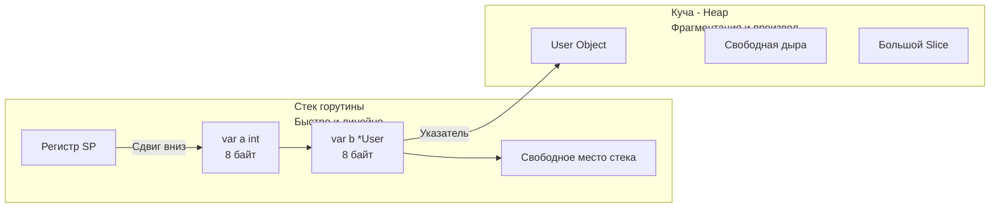
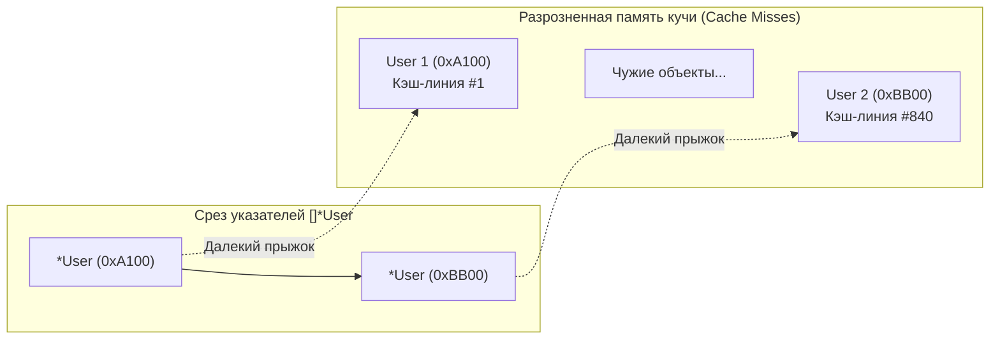

В статьях [[18. Escape Analysis. Почему переменная ушла в heap.md]] и [[19. Escape Analysis на практике. Как писать меньше аллокаций.md]] мы упорно боролись за то, чтобы наши переменные не «убегали» со стека. В процессе этих рассуждений легко сформировать упрощенное представление: стек — это абсолютное и безусловное благо, а куча — неизбежное зло, существующее лишь для того, чтобы нагружать Сборщик мусора.

Однако опытный инженер должен заглядывать глубже простых догм. Недостаточно знать, *как* избежать кучи синтаксически. Необходимо понимать физику процесса: что именно представляют собой эти две области памяти на уровне операционной системы, контроллеров памяти и кэш-линий процессора.

Почему аллокация на стеке работает практически мгновенно, а обращение к объектам в куче может катастрофически просадить пропускную способность сервиса, даже если мы полностью отключим Garbage Collector?

---

## Физическая реальность памяти

На уровне кремния (в микросхемах динамической памяти DRAM на материнской плате) не существует никакого физического разделения на «стек» и «кучу». Оперативная память для контроллера — это просто колоссальный одномерный массив байт с непрерывной адресацией.

Разделение на стек и кучу — это программно-аппаратная абстракция, созданная архитекторами операционных систем (механизм виртуальной памяти и таблицы страниц) и рантаймами языков программирования.

Когда операционная система запускает исполняемый ELF-бинарник Go, ядро выделяет процессу виртуальное адресное пространство. Рантайм Go захватывает это пространство и логически делит его на изолированные функциональные зоны.

### Стек (Stack): Линейная скорость

Как мы подробно выяснили в [[11. Стек горутины. Рост и shrink стека.md]], каждая горутина при создании получает свой собственный, сугубо локальный непрерывный участок памяти (изначально всего 2 КБ).

**Фундаментальные свойства стека:**
1. **Эксклюзивность и локальность:** К стековому кадру текущей горутины не имеет прямого доступа ни одна другая горутина (если мы явно не поделимся указателем наружу, что немедленно спровоцирует Escape Analysis). Следовательно, для выделения памяти на стеке **не нужны мьютексы, атомарные инструкции или межъядерная синхронизация**.
2. **Линейность и простота:** Память выделяется строго последовательно по принципу LIFO (Last-In, First-Out), словно стопка тарелок на раздаче. Вызов функции сводится к сдвигу регистра Указателя Стека (регистр `SP` в процессоре) на требуемое число байт вниз: `SUBQ $size, SP`.
3. **Бесплатная очистка:** Когда функция завершает работу, компилятор восстанавливает указатель `SP` обратным сдвигом. Память не затирается нулями и не требует вызова деструкторов — она просто объявляется свободной и будет перезаписана следующей вызванной функцией. Для сборщика мусора здесь работы нет.

### Куча (Heap): Глобальный хаос

Куча — это гигантский общий склад оперативной памяти для всего приложения, разделяемый всеми горутинами.

**Фундаментальные свойства кучи:**
1. **Конкурентность:** Тысячи и миллионы параллельных горутин могут одновременно запрашивать новые блоки памяти. Рантайм обязан гарантировать потокобезопасность (thread-safety), что требует многоуровневых кэшей и специализированных структур данных.
2. **Фрагментация:** Объекты разного размера выделяются и освобождаются в произвольном, непредсказуемом порядке. В памяти возникают «дыры» (свободные интервалы между еще занятыми структурами). Аллокатор вынужден тратить такты процессора на классификацию размеров и поиск подходящего свободного слота.
3. **Налог на Сборку мусора (GC Tax):** Любой байт, попавший в кучу, должен отслеживаться. Сборщик мусора обязан периодически обходить граф объектов, проверять их доступность и возвращать свободные слоты в оборот.



---

## Mechanical Sympathy: Настоящая цена Кучи

Многие разработчики пребывают в убеждении, будто единственный недостаток кучи заключается в накладных расходах Garbage Collector. Это глубокое заблуждение.
Главный скрытый тормоз кучи — это **Cache Miss (промах мимо кэша процессора)** и разрушение локальности данных.

Чтобы осознать физический масштаб проблемы, вспомним иерархию памяти современного сервера:
* **L1-кэш данных (внутри ядра CPU):** Доступ за ~1–2 такта. (Объем ~32–48 КБ на ядро).
* **L2-кэш (внутри ядра CPU):** Доступ за ~10–14 тактов. (Объем ~512 КБ–1 МБ).
* **L3-кэш (общий для всех ядер сокета):** Доступ за ~40–60 тактов. (Объем ~16–64 МБ).
* **RAM (Основная оперативная память):** Доступ за **~200–300 тактов**.

Если представить один такт процессора как 1 секунду человеческого времени, то чтение из L1 — это 2 секунды (взять блокнот со стола), а обращение в RAM — это 5 минут томительного ожидания (поход в дальний архив на другом этаже).

Процессор отчаянно пытается не ходить в RAM. Для этого контроллер памяти подтягивает данные блоками — кэш-линиями по 64 байта (см. [[16. sync_atomic и атомарные операции в рантайме.md]]).

### Почему Стек летает?
Стек активной горутины компактен и непрерывен. Когда горутина молотит вычисления, ее текущий стек практически целиком прогрет и находится в сверхбыстром кэше L1d или L2. 
Когда ядро процессора читает локальную переменную `a`, аппаратный кэш-контроллер автоматически затягивает в ту же кэш-линию 64 байта соседние переменные `b` и `c`. При обращении к ним процессор получает мгновенный **Cache Hit** со скоростью регистра.

### Почему Куча тормозит (Pointer Chasing)?
Объекты в куче распределены по адресному пространству хаотично. 

Представьте себе срез указателей: `users []*User`.  
Сам срез (массив 8-байтовых адресов) может лежать в памяти непрерывно. Но когда мы запускаем цикл обхода:
```go
for _, u := range users {
    print(u.Age)
}
```
Происходит классическая аппаратная катастрофа:
1. Процессор читает указатель на первого пользователя. Объект `User 1` лежит в куче по адресу `0xA100`.
2. Ядро отправляет запрос в память и ждет сотни тактов, пока структура загрузится в кэш.
3. На следующей итерации процессор читает адрес `User 2`, который аллокатор выделил совершенно в другом конце арены — по адресу `0xBB00`.
4. Вся предварительно подтянутая в кэш память оказывается бесполезной. Аппаратный предсказатель выборки (Hardware Prefetcher) оказывается бессилен. На каждом шаге цикла процессор ловит тяжелый **Cache Miss**, простаивая сотни тактов в ожидании шины памяти.

Этот антипаттерн в архитектуре компьютеров называется **Pointer Chasing (Погоня за указателями)**.



> [!tip] Собеседование. Массив структур vs Массив указателей
> **Вопрос:** Что работает быстрее при последовательной итерации и вычислении суммы полей: `[]User` (массив структур по значению) или `[]*User` (массив указателей)?
> 
> **Ответ:** Срез структур `[]User` работает **на порядки быстрее**. 
> В `[]User` все элементы упакованы в памяти в единый плотный массив (высокая пространственная локальность данных — Data Locality). Аппаратный предсказатель процессора видит линейный шаг и заблаговременно подтягивает следующие кэш-линии в кэш L1 еще до того, как инструкция запросит их (Prefetching). Цикл укладывается в единицы тактов на элемент.
> 
> В случае `[]*User` каждая структура аллоцирована в куче изолированно. Обход превращается в шторм промахов кэша (Cache Misses). Передавать элементы через срез указателей оправдано лишь тогда, когда сами структуры колоссальны по размеру и их копирование при сортировке или фильтрации слишком накладно, либо когда алгоритм требует разделяемой мутации исходных экземпляров.

---

## Миф: «Куча — это медленно из-за системных вызовов»

В классическом программировании на Си вызов `malloc` часто приводит к системному вызову ядра ОС (`brk` или `mmap`), переводя процессор в привилегированный режим ядра (Ring 0), что сжигает тысячи тактов.

Инженеры рантайма Go изначально учли этот опыт. Поэтому рантайм Go **не выполняет системных вызовов ядра при каждой обычной аллокации в куче**.
Рантайм запрашивает память у операционной системы заранее — огромными непрерывными блоками (аренами по 64 МБ) через `mmap`. А затем сам аллокатор Go внутри пользовательского пространства (User Space) молниеносно нарезает эту память на ячейки нужного калибра для ваших объектов.

Именно поэтому обычная аллокация в куче Go происходит существенно быстрее вызова стандартного glibc `malloc` в Си. Но она все равно остается заметно медленнее работы со стеком из-за неизбежной конкуренции за локальные пулы памяти и создания работы для GC.

---

## Когда Куча — это хорошо?

После разбора аппаратных издержек может сложиться впечатление, что кучу следует изгонять из архитектуры любой ценой. Это опасная крайность. Куча — это фундаментальный и незаменимый инструмент:

1. **Разделение состояния (Shared State):** Если в сервисе есть глобальный in-memory кэш (например, `map[string]User`), к которому обращаются сотни параллельных горутин-хэндлеров, этот кэш обязан жить в куче.
2. **Динамический и непредсказуемый размер:** Стек горутины строго ограничен. Если мы вычитываем из сети файл размером 10 МБ (через `io.ReadAll` или `make([]byte, 10*1024*1024)`), этот буфер обязан выделяться в куче. Попытка разместить многомегабайтный массив на стеке горутины приведет к цепочке взрывных расширений стека с постоянным копированием памяти (см. [[11. Стек горутины. Рост и shrink стека.md]]).
3. **Долгоживущие объекты (Long-lived objects):** Компоненты, жизненный цикл которых совпадает со временем жизни самого сервиса (пулы соединений с БД, клиенты очередей, логгеры, дескрипторы конфигурации), чувствуют себя в куче абсолютно гармонично. Они аллоцируются один раз на старте и не создают потока мусора для GC.

---

## Итог

1. **Стек:** Линейная память, локальная для конкретной горутины. Выделение стоит 0 тактов CPU (сдвиг `SP`). Идеальная дружба с L1/L2 кэшами (высочайшая Data Locality). Память освобождается автоматически при выходе из функции.
2. **Куча:** Глобальное пространство памяти, разделяемое всей системой. Сопровождается фрагментацией и требует управления со стороны GC. Главный источник замедления — аппаратные **Cache Misses** и синдром **Pointer Chasing**.
3. **Плотная упаковка:** Итерация по срезу значений `[]Struct` выполняется в разы быстрее обхода среза указателей `[]*Struct` благодаря предсказуемой выборке кэш-линий процессором.
4. Аллокатор Go работает целиком в пространстве пользователя (User Space), предварительно резервируя память у ядра через `mmap`, что исключает системные вызовы при рутинных операциях.

Но как именно рантайм Go умудряется нарезать память кучи в User Space на миллионы мелких объектов без мучительных блокировок мьютексами, чтобы тысячи горутин не блокировали друг друга в очереди за каждым байтом?

Этот шедевр инженерной мысли восходит к легендарному алгоритму `TCMalloc` от Google. В следующей главе мы разберем трехуровневую архитектуру аллокатора Go:
[[21. Аллокатор памяти Go. mcache, mcentral, mheap.md]]