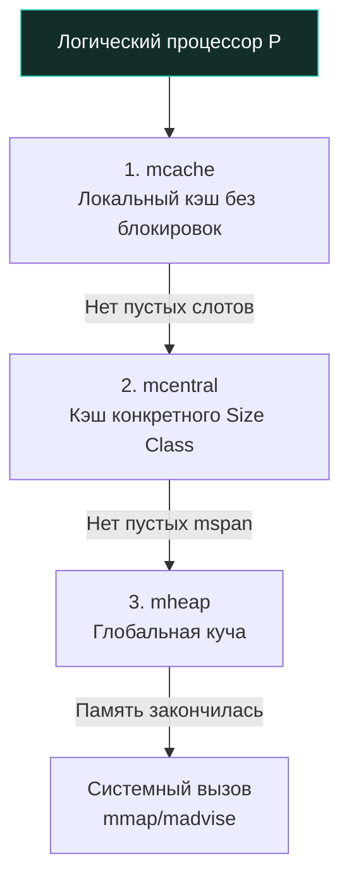

В статье [[20. Stack vs Heap в Go.md]] мы установили, что Куча (Heap) — это принципиально более сложная и медленная область памяти по сравнению со стеком. Однако главная причина замедления кучи в современной многопоточной системе — это вовсе не только аппаратные промахи кэша (Cache Misses), а разрушительная **конкуренция за блокировки (Lock Contention)**.

Представьте классическую реализацию функции `malloc` в языке C эпохи 1990-х годов. Это глобальная процедура, управляющая единым системным пулом оперативной памяти через один глобальный мьютекс. Если 16 или 64 физических ядра современного сервера одновременно захотят выделить память для своих объектов, 15 или 63 из них мгновенно выстроятся в очередь и уснут на примитиве синхронизации, пока одно-единственное ядро перебирает связный список свободных блоков. В высоконагруженном бэкенде такая архитектура приводит к падению пропускной способности в десятки раз.

Чтобы Go мог эффективно масштабироваться на сотни тысяч и миллионы конкурентных горутин, языку требовался аллокатор принципиально иного класса: способный выделять память параллельно, в подавляющем большинстве случаев **без единой блокировки**. Для решения этой грандиозной задачи инженеры Go взяли за основу архитектуру **TCMalloc** (Thread-Caching Malloc), изначально спроектированную Санджеем Гемаватом (Sanjay Ghemawat) в Google для высоконагруженных C++ систем.

Фундаментальная идея TCMalloc — многоуровневая иерархия кэшей. Рантайм Go делит управление динамической памятью на три четко разграниченных уровня: `mcache`, `mcentral` и `mheap`.

---

## Анатомия памяти: Page и mspan

Прежде чем исследовать уровни кэширования, необходимо понять физические единицы, которыми оперирует аллокатор. Рантайм Go принципиально не работает с произвольными байтами. Он мыслит крупными унифицированными квантами:

1. **Page (Страница):** Базовая аппаратная единица памяти, запрашиваемая у операционной системы. В рантайме Go размер виртуальной страницы фиксирован и равен **8 КБ** (в Linux базовая страница архитектуры x86-64 обычно равна 4 КБ; рантайм Go объединяет их попарно, абстрагируя системные детали).
2. **mspan (Span):** Фундаментальный строительный блок аллокатора. Структура `mspan` представляет собой заголовок, управляющий непрерывным блоком из одной или нескольких страниц (8 КБ, 16 КБ, 24 КБ и т.д.).

Сам по себе `mspan` — это просто сырой непрерывный диапазон адресов. Чтобы эффективно размещать в нем структуры пользовательского кода, рантайм предварительно нарезает `mspan` на одинаковые ячейки строго фиксированного размера. Эта концепция называется **Size Classes (Классы размеров)**.

В рантайме Go определено ровно **67 классов размеров** для малых объектов (от 8 байт до 32 КБ):
* Класс 1: Ячейки по 8 байт.
* Класс 2: Ячейки по 16 байт.
* Класс 3: Ячейки по 24 байта.
* ...
* Класс 67: Ячейки по 32 768 байт (32 КБ).

Если `mspan` размером в одну страницу 8 КБ (8192 байта) назначен для Класса 2 (16 байт), он математически распиливается на 512 готовых слотов по 16 байт ($8192 / 16 = 512$). Каждый такой слот отслеживается битовой маской аллокации.

> [!warning] Ловушка / Gotcha. Внутренняя фрагментация
> Квантование памяти по жестким классам размеров полностью устраняет проблему Внешней фрагментации (невозможность втиснуть блок из-за россыпи мелких дыр). Но взамен мы платим неизбежной **Внутренней фрагментацией**.
> Если вы аллоцируете структуру размером 19 байт, аллокатор не станет создавать для нее уникальный класс. Ближайший подходящий размер — это Класс 3 (24 байта). Рантайм выделит слот на 24 байта, из которых 5 байт останутся неиспользованным балластом (padding). Именно поэтому в Go критически важно грамотно упорядочивать поля в структурах (Struct Alignment): правильное выравнивание не только ускоряет чтение процессором, но и позволяет объекту уложиться в меньший Size Class, сберегая мегабайты оперативной памяти.

---

## Иерархия аллокатора: Три кита

Посмотрим, как предварительно нарезанные блоки `mspan` перемещаются между ядрами процессора и горутинами.

### 1. mcache (Уровень 1 — Локальный кэш)

Это высшее проявление Mechanical Sympathy в архитектуре аллокатора Go.
Как мы помним из главы [[9. Scheduler Go. G, M, P и work stealing.md]], рантайм моделирует вычислительные ресурсы через абстракцию `P` (Логический процессор), количество которых обычно равно числу физических ядер процессора (`GOMAXPROCS`). 

К каждому экземпляру `P` намертво привязан **один личный локальный кэш `mcache`**.

Внутри `mcache` хранится массив активных указателей на `mspan`. На самом деле для каждого из 67 классов размеров в `mcache` выделено по два спана: один для объектов, содержащих указатели (`scan`), и один для объектов без указателей (`noscan`, например обычные слайсы байт или строки, которые GC не нужно сканировать). Итого $67 \times 2 = 134$ спана прямо под рукой.

**Почему это работает мгновенно?**  
Поскольку в любой момент времени на одном логическом процессоре `P` выполняется ровно одна горутина (через поток ядра `M`), **обращение к `mcache` не требует никаких мьютексов или CAS-инструкций**. Выделение памяти сводится к элементарному вычислению индекса класса, извлечению свободного слота по битовой маске и сдвигу локального счетчика. Это занимает буквально 10–15 наносекунд. Ноль блокировок, ноль ожидания.

### 2. mcentral (Уровень 2 — Среднее звено)

Рано или поздно наступает момент, когда локальный `mspan` в `mcache` исчерпывает все свободные слоты. Если горутине требуется еще один объект на 24 байта, а в `mcache` для 3-го класса всё занято, логический процессор вынужден запросить свежий заполняемый спан. 

На этом этапе в дело вступает координатор второго уровня — `mcentral`.

В рантайме существует ровно **67 центральных менеджеров `mcentral`** — по одному на каждый класс размера (точнее, по паре для scan и noscan).
Каждый `mcentral` управляет двумя двусвязными списками спанов:
1. `partial`: список спанов `mspan`, в которых есть хотя бы один свободный слот, пригодный для аллокаций.
2. `full`: список полностью заполненных спанов (либо тех спанов, которые в данный момент переданы в эксклюзивное пользование какому-то `mcache`).

**Механика блокировок:**  
Поскольку за свежим спаном в `mcentral` может одновременно прийти несколько процессоров `P`, доступ к каждому `mcentral` защищен локальным спинлоком/мьютексом. Однако благодаря разделению на 67 изолированных классов конкуренция (Contention) практически отсутствует: поток, запрашивающий блок на 16 байт, обращается к `mcentral[2]` и ни на секунду не пересекается с потоком, запрашивающим память в `mcentral[4]` для объекта на 32 байта.

Когда `mcache` просит память, `mcentral` извлекает частично свободный `mspan` из списка `partial`, переносит его в список `full` и передает в локальное владение процессору `P`.

### 3. mheap (Уровень 3 — Глобальная куча)

Что происходит, если список `partial` в `mcentral` оказывается пуст и свободных спанов требуемого класса больше нет во всей системе? `mcentral` обращается к верховному распределителю ресурсов — `mheap`.

`mheap` — это единственный глобальный синглтон рантайма, представляющий собой всю виртуальную память программы.
* `mheap` оперирует не мелкими классами размеров, а крупными непрерывными диапазонами физических страниц памяти (по 8 КБ).
* Для мгновенного поиска свободных страниц рантайм использует специализированную структуру данных: ранее это было декартово дерево (`treap`), а в современных версиях Go — компактное префиксное битовое дерево (Page Allocator Radix Tree), позволяющее за константное время находить смежные блоки нужного объема.
* Если у `mheap` есть свободные страницы, он нарезает запрошенный диапазон, оборачивает его в новый дескриптор `mspan`, инициализирует метаданные класса размера и возвращает его в `mcentral`.
* Поскольку `mheap` глобален для всей программы, доступ к его корневым таблицам защищен глобальным мьютексом (`mheap.lock`).

И только если глобальный `mheap` обнаруживает, что все ранее выделенные пулы страниц исчерпаны, он обращается к ядру операционной системы с системным вызовом (`mmap` на Linux/macOS или `VirtualAlloc` на Windows), резервируя новую виртуальную арену памяти размером в 64 МБ.

> [!tip] Собеседование. Что такое Large Objects?
> **Вопрос:** Классы размеров (Size Classes) заканчиваются на значении 32 КБ. Как рантайм аллоцирует огромный массив данных размером 1 Мегабайт?
> 
> **Ответ:** Рантайм Go строго разделяет объекты на малые ($\le 32$ КБ) и крупные (Large Objects, $> 32$ КБ).
> Любой объект размером **больше 32 КБ** считается крупным. Он полностью игнорирует уровни `mcache` и `mcentral`! 
> Рантайм сразу обращается напрямую в глобальный `mheap`, захватывает глобальный мьютекс и выделяет под объект индивидуальный кастомный `mspan`, состоящий из непрерывной последовательности страниц (в случае 1 МБ это ровно $1024 / 8 = 128$ страниц по 8 КБ).
> 
> **Архитектурный вывод для бэкенда:** Регулярное выделение объектов размером более 32 КБ в горячих циклах (Hot Paths) создает разрушительную конкуренцию за глобальный лок `mheap.lock`, сковывая работу всех горутин сервиса. Для крупных буферов обязательно применяйте `sync.Pool`.

---

## Итоговый алгоритм аллокации

Когда в коде выполняется выражение `user := new(User)` (и Escape Analysis доказал, что объект обязан отправиться в кучу), рантайм совершает каскадный путь:

1. Вычисляется размер структуры `User` (допустим, 36 байт).
2. Подбирается ближайший достаточный Size Class (для 36 байт это Класс 4 — слоты по 48 байт).
3. Горутина обращается к своему текущему логическому процессору `P` и читает `mcache.alloc[ClassIndex]`.
4. **Fast Path:** В локальном спане есть свободный слот. Аллокатор мгновенно забирает его по битовой маске. Блокировок нет, затраты минимальны.
5. **Slow Path 1:** Локальный спан заполнен. `mcache` захватывает мьютекс `mcentral[ClassIndex]` и забирает свежий `mspan` со свободными слотами из списка `partial`.
6. **Slow Path 2:** В `mcentral` нет свободных спанов. Рантайм обращается к `mheap`, захватывает глобальный лок и запрашивает блок страниц нужной длины.
7. **Slow Path 3:** В `mheap` закончились физические страницы. Происходит системный вызов `mmap` к ядру ОС для выделения новой 64-мегабайтной арены.

---

## Итог

1. Аллокатор Go построен на проверенной архитектуре **TCMalloc**, минимизирующей блокировки и конкуренцию ядер за память.
2. Память кучи нарезается на **67 классов размеров (Size Classes)**, что полностью побеждает внешнюю фрагментацию за счет контролируемой внутренней фрагментации (padding).
3. **mcache** функционирует без блокировок, так как намертво закреплен за конкретным логическим процессором `P`.
4. **mcentral** разделяет нагрузку по классам размеров, снижая вероятность межпоточных очередей.
5. Объекты размером **более 32 КБ** классифицируются как Large Objects и выделяются напрямую из глобального `mheap` под глобальной блокировкой.

Мы детально исследовали путь обычных и крупных объектов. Но современный Go-сервис непрерывно оперирует миллиардами миниатюрных значений: булевыми флагами, однобайтными кодами ошибок, короткими строками и числами. 
Если бы под каждый `bool` (1 байт) аллокатор выделял минимальный Size Class (8 байт), мы бы выбрасывали 87% оперативной памяти на ветер!

Чтобы исключить эту чудовищную неэффективность, архитекторы Go внедрили в рантайм еще один изящный микромеханизм. В следующей статье мы познакомимся с ним:
[[22. Tiny Allocator и маленькие объекты.md]]