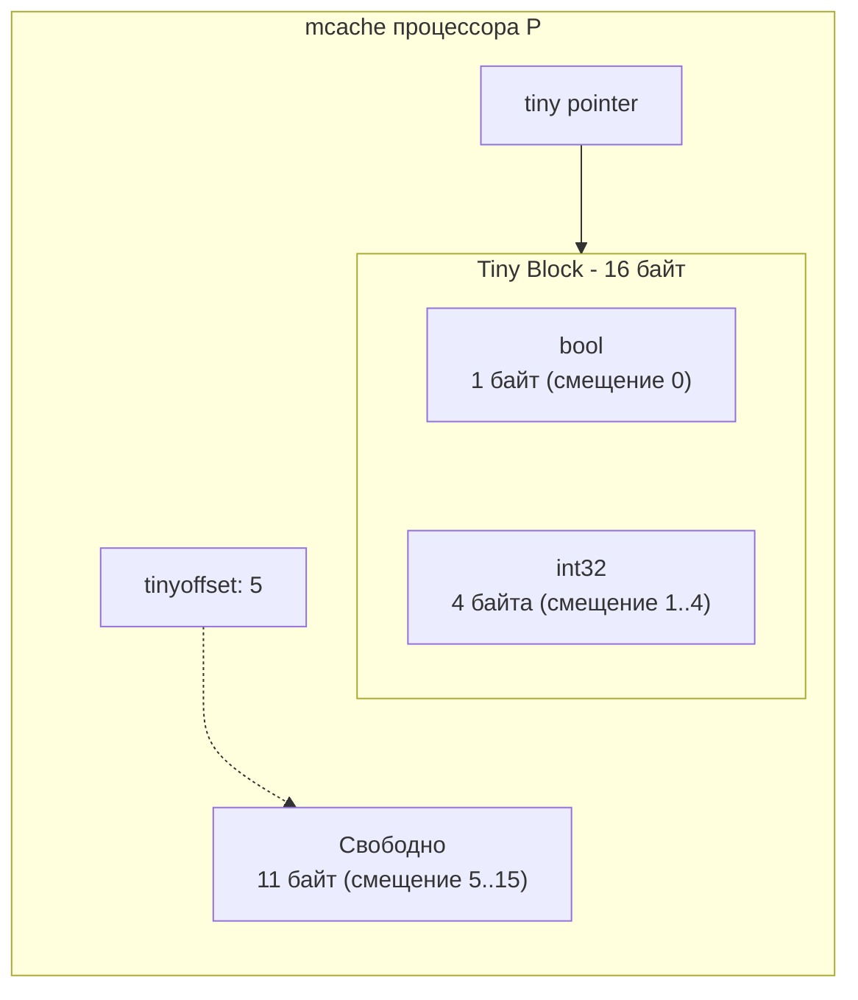
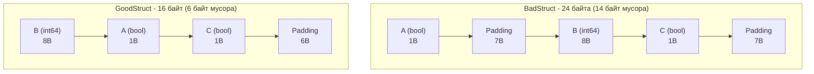

В статье [[21. Аллокатор памяти Go. mcache, mcentral, mheap.md]] мы подробно исследовали трехуровневую архитектуру аллокатора TCMalloc. Мы увидели, что рантайм Go квантует память кучи на 67 фиксированных классов размеров (Size Classes). 

Однако при внимательном анализе таблицы классов легко обнаружить серьезную архитектурную проблему. Минимальный стандартный класс размера выделяет непрерывный слот объемом **8 байт**. 

Что произойдет, если высоконагруженный бэкенд-сервис обрабатывает миллионы событий и аллоцирует множество микроскопических переменных типа `bool` (размер 1 байт), которые из-за передачи в замыкание или интерфейс неизбежно «убегают» в кучу (Escape Analysis)?

Если бы рантайм послушно выделял под каждый такой `bool` полноценный слот на 8 байт, 7 байт неизбежно превращались бы в бесполезный балласт. Это **87% внутренней фрагментации**! В масштабах промышленных микросервисов с гигабайтами оперативной памяти такое расточительство приводило бы к катастрофической потере полезного пространства и забиванию кэш-линий процессора нулями.

Чтобы устранить эту проблему, создатели Go встроили прямо в локальный кэш `mcache` специализированный микромеханизм — **Tiny Allocator (Крошечный аллокатор)**.

---

## Что такое Tiny Allocator?

Tiny Allocator — это компактный механизм сверхплотной упаковки микроскопических объектов, работающий непосредственно внутри локального контекста процессора `P`.

Он активируется компилятором и рантаймом исключительно при одновременном выполнении двух жестких условий:
1. Размер запрашиваемого объекта строго **меньше 16 байт** (например, базовые скалярные типы `bool`, `int8`, `int16`, `int32`, `float32` или `float64`).
2. Объект гарантированно **не содержит указателей (noscan)**.

> [!info] Под капотом. Почему запрещены указатели?
> Сборщик мусора (GC) в Go сканирует кучу, чтобы выявить живые объекты и освободить мертвые. Для каждого объекта, содержащего указатели, GC сверяется со специальной битовой картой разметки (gcmarkBits), где каждому машинному слову сопоставлены метаданные о наличии валидного адреса. 
> Если бы рантайм утрамбовал несколько независимых разнородных объектов с указателями в единый блок, сборщик мусора потерял бы способность точно определять границы объектов и время их индивидуального освобождения: гибель одного объекта удерживала бы в памяти весь блок. Поэтому структуры с указателями (даже тривиальная структура из одного поля `*User` размером 8 байт) всегда направляются в стандартные Size Classes и никогда не попадают в Tiny Allocator.

---

## Механика упаковки (Tiny Block)

Внутри структуры локального кэша `mcache` (намертво закрепленного за логическим процессором `P`) зарезервированы три специальных системных поля:
* `tiny`: прямой адрес начала текущего 16-байтного блока.
* `tinyoffset`: текущее смещение в байтах (указывает, сколько байт блока уже занято ранее размещенными объектами).
* `local_tinyallocs`: локальный счетчик крошечных аллокаций для снятия профилей и статистики рантайма.

Когда горутина аллоцирует независимый `bool` (1 байт), рантайм запрашивает у `mcache` свободный слот размером 16 байт (Tiny Block). Он размещает наш `bool` по смещению 0, устанавливает значение `tinyoffset = 1` и возвращает указатель вызывающему коду. 

Когда та же горутина следом запрашивает еще один `bool`, рантайм не обращается за новым слотом! Он просто размещает второй `bool` в тот же самый блок по смещению 1 и инкрементирует `tinyoffset = 2`. До тех пор пока 16-байтный блок не заполнится до конца, аллокации выполняются буквально за 2–3 машинных такта.



### Выравнивание памяти (Alignment)

Физический процессор требует строгого соблюдения выравнивания адресов. На современных архитектурах чтение 64-битного числа из адреса, не кратного 8, либо влечет штраф в десятки тактов из-за расщепления доступа между двумя кэш-линиями (Split Lock), либо вовсе завершается аппаратным сбоем (Alignment Trap, см. [[16. sync_atomic и атомарные операции в рантайме.md]]).

Tiny Allocator неукоснительно соблюдает эти аппаратные законы. Это приводит к важному следствию: **порядок поступления мелких аллокаций определяет объем полезно упакованной памяти**.

Представьте сценарий, в котором код последовательно аллоцирует сначала `bool` (1 байт), а затем `int64` (8 байт):
1. Байт `bool` укладывается по смещению `0`. Значение `tinyoffset` становится равным `1`.
2. Рантайм пытается разместить `int64`. Но для типа `int64` адрес в памяти обязан быть строго кратен 8!
3. Аллокатор вынужден выполнить выравнивание: он сдвигает `tinyoffset` с `1` сразу на `8`. 
4. Байт 0 занят, байты с 1 по 7 остаются неиспользованной пустотой (пустой padding). Число `int64` занимает слоты с 8 по 15 байт. В результате весь 16-байтный Tiny Block оказывается полностью исчерпан.

Мы запросили всего $1 + 8 = 9$ байт полезных данных, но из-за правил выравнивания израсходовали все 16 байт блока.

> [!warning] Ловушка / Gotcha. Порядок полей в структурах
> Это же фундаментальное правило выравнивания работает не только для независимых скалярных аллокаций, но и для полей ваших структур данных (Struct Packing). Если вы небрежно объявляете поля в структуре, компилятор вынужден вставлять скрытые байты пустоты (padding), раздувая структуру в памяти. В результате объект рискует не уместиться в Tiny Allocator и отправиться в значительно более тяжелый Size Class.

---

## Mechanical Sympathy. Оптимизация структур

Рассмотрим хрестоматийный пример с технического собеседования. Сколько байт занимает в памяти следующая структура на 64-битной платформе?

```go
type BadStruct struct {
    A bool  // 1 байт
    B int64 // 8 байт
    C bool  // 1 байт
}
```

Наивный подсчет дает: $1 + 8 + 1 = 10$ байт. 

Однако реальность кремния иная:
1. Поле `A` занимает байт со смещением 0.
2. Полю `B` (`int64`) требуется адрес, кратный 8. Компилятор вставляет 7 байт пустоты (padding) со смещений 1 по 7. `B` занимает байты 8–15.
3. Поле `C` занимает байт 16.
4. Но размер всей структуры обязан быть кратен максимальному выравниванию ее полей (8 байт), чтобы при размещении в массиве `[]BadStruct` каждый элемент начинался с адреса, кратного 8. Компилятор добавляет еще 7 байт добивки в конец структуры (байты 17–23).

**Итоговый размер `BadStruct`: 24 байта!**  
При аллокации в куче этот объект потребует слот класса 24 байта (а с учетом округления аллокатора — возможно, и 32 байта).

А теперь применим Mechanical Sympathy и упорядочим поля структуры от наибольших к наименьшим:

```go
type GoodStruct struct {
    B int64 // 8 байт
    A bool  // 1 байт
    C bool  // 1 байт
}
```

Поле `B` занимает байты 0–7. Поле `A` ложится со смещением 8. Поле `C` размещается следом со смещением 9. Добивка структуры до кратности 8 требует всего 6 байт в конце (байты 10–15).

**Итоговый размер `GoodStruct`: ровно 16 байт!**  
Мы мгновенно сэкономили 33% оперативной памяти, не изменив ни единой строчки бизнес-логики программы.



> [!tip] Собеседование. Как найти неоптимизированные структуры?
> Вручную вычислять смещения байт в крупной кодовой базе на сотни тысяч строк — неблагодарный и подверженный ошибкам труд. В экосистеме Go для этой цели существует проверенный статический анализатор — `fieldalignment` (исторически развивавшийся как утилита `maligned`).
> Он интегрирован в стандартный мета-линтер `golangci-lint` (линтер `govet` с включенным правилом `fieldalignment`). Инструмент не только находит структуры с избыточными зазорами, но и с флагом `-fix` способен автоматически переставить поля в идеальном порядке.

---

## Итог

1. **Tiny Allocator** — специализированный компонент внутри локального кэша `mcache`, предотвращающий внутреннюю фрагментацию памяти при массовом создании мелких объектов.
2. Он группирует объекты размером **менее 16 байт** в единые 16-байтные кванты памяти.
3. Механизм принимает исключительно объекты **без указателей (noscan)**, чтобы не усложнять и не замедлять работу Сборщика мусора.
4. Понимание аппаратных требований к выравниванию памяти (Memory Alignment) позволяет сокращать объем структур данных на 20–40%, экономя гигабайты RAM в высоконагруженных бэкендах.

Мы досконально изучили всю цепочку выделения динамической памяти: от стека горутины до иерархии `mheap` и микро-аллокатора `Tiny Allocator`. Рантайм Go делает всё возможное, чтобы процедура аллокации работала молниеносно.

Но в компьютерных науках остается непреложная истина: самая быстрая аллокация — это та, которую удалось полностью предотвратить.

Если ваш сервис вынужден создавать тяжелые буферы на каждый входящий сетевой запрос, даже самый быстрый аллокатор рано или поздно перегрузит Сборщик мусора. Выход один — повторное использование уже выделенной памяти.

В следующей главе мы разберем механизм, позволяющий эффективно переиспользовать память в обход аллокатора кучи:
[[23. sync_pool под капотом.md]]