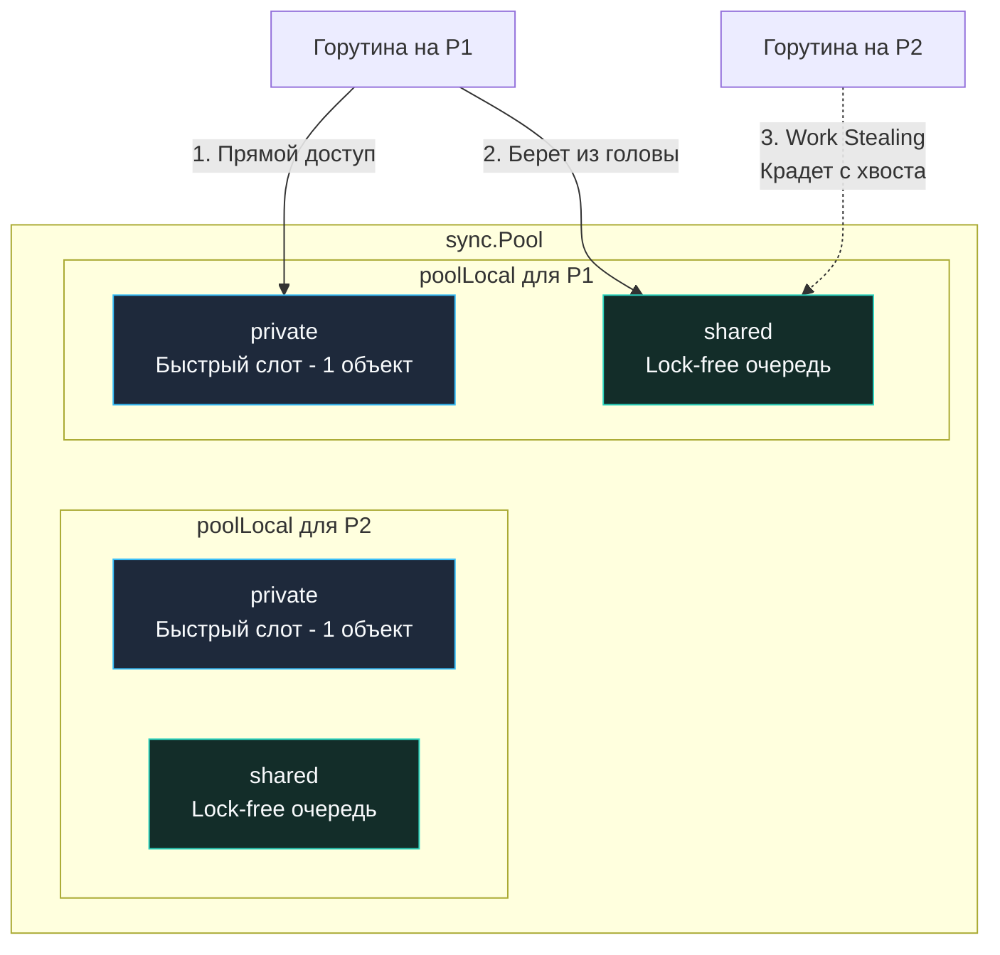
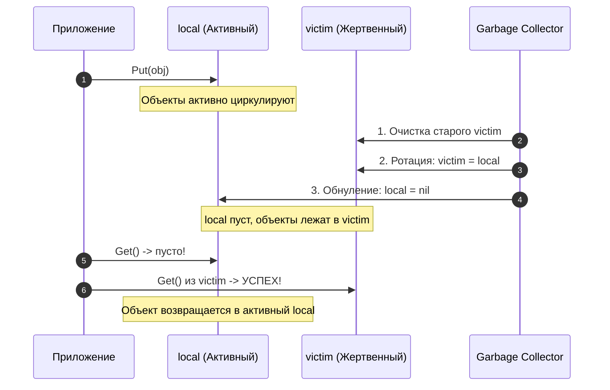

В предыдущих статьях ([[21. Аллокатор памяти Go. mcache, mcentral, mheap.md]] и [[22. Tiny Allocator и маленькие объекты.md]]) мы подробно убедились, что рантайм Go делает всё возможное, чтобы выделение памяти работало предельно быстро и без межпоточных блокировок. Но какой бы изощренной ни была внутренняя архитектура аллокатора, фундаментальная истина компьютерных систем неизменна: самая быстрая аллокация в куче — это та, которой удалось избежать.

Если ваш высоконагруженный сетевой HTTP/gRPC сервис на каждый входящий запрос выделяет буфер `bytes.Buffer` размером 10 КБ для парсинга JSON, Escape Analysis гарантированно отправит этот объект в кучу. При нагрузке в 10 000 RPS сервис начнет генерировать 100 Мегабайт мусора в секунду! Сборщик мусора (GC) неизбежно начнет захлебываться, а ядра процессора будут тратить до четверти своей вычислительной мощности не на обработку бизнес-логики, а на непрерывную разметку и очистку памяти.

Чтобы разорвать этот порочный круг, создатели Go добавили в стандартную библиотеку пакет `sync`. В нем содержится структура данных, позволяющая многократно переиспользовать уже выделенную память в обход регулярного цикла аллокатора кучи, действуя в идеальной гармонии с планировщиком горутин — **`sync.Pool`**.

---

## Главное заблуждение: Это не кэш

Первое и главное правило системного инженера: `sync.Pool` — это **пул временных объектов**, а вовсе не долговременный кэш (Cache).

В классическом прикладном кэше (будь то внутрипроцессный LRU-кэш или распределенный Redis) вы помещаете объект и вправе рассчитывать, что сможете прочитать его спустя секунды или минуты. 
В `sync.Pool` рантайм оставляет за собой абсолютное право **безвозвратно уничтожить** любые накопленные объекты в любой момент времени (и, как мы увидим ниже, сборщик мусора регулярно делает это).

В `sync.Pool` категорически нельзя хранить сетевые соединения с базой данных (для этого предназначен пул соединений `sql.DB`), открытые TCP-сокеты, дескрипторы файлов или данные пользовательских сессий. `sync.Pool` спроектирован ровно для одной задачи: разгрузить аллокатор памяти и снизить давление на Garbage Collector за счет рециркуляции дорогостоящих структур данных.

---

## Архитектура под капотом

Как спроектировать универсальный пул объектов, к которому одновременно обращаются десятки тысяч параллельных горутин, и при этом не превратить его в узкое горлышко (bottleneck) на глобальном мьютексе?

Создатели Go вновь применили проверенный принцип изоляции и локальности ресурсов (аналогично архитектуре `mcache`).

Если заглянуть в исходный код рантайма в файле `src/sync/pool.go`, мы обнаружим, что `sync.Pool` — это не банальный кольцевой буфер или стек под мьютексом. Это распределенная иерархическая структура, жестко привязанная к логическим процессорам рантайма `P` (см. [[9. Scheduler Go. G, M, P и work stealing.md]]).

Внутри структуры `sync.Pool` содержится массив `local` (указатель на непрерывную область памяти). Размер этого массива строго равен значению `GOMAXPROCS`. Каждому логическому процессору `P` в системе принадлежит ровно один локальный сегмент этого массива — структура `poolLocal`.



### Структура poolLocal

Каждый локальный сегмент `poolLocal` разделен на два принципиально разных уровня хранения:
1. **private:** Одиночный слот (указатель на **ровно один** объект). Это самый быстрый и желанный путь (Fast Path). Поскольку доступ к этому слоту разрешен исключительно горутине, исполняющейся на текущем логическом процессоре `P`, работа с `private` не требует никаких мьютексов и даже атомарных инструкций процессора.
2. **shared:** Двусвязная lock-free очередь (структура `poolChain`, состоящая из кольцевых буферов `poolDequeue`). Сюда перемещаются объекты, если слот `private` уже занят. Текущий процессор `P` добавляет (push) и извлекает (pop) объекты из «головы» своей очереди, используя дешевые локальные операции.

> [!info] Под капотом. Mechanical Sympathy и False Sharing
> В главе [[16. sync_atomic и атомарные операции в рантайме.md]] мы детально исследовали физику эффекта Ложного разделения (False Sharing). Если структуры `poolLocal` для соседних процессоров `P1` и `P2` размещаются в оперативной памяти вплотную друг к другу, они неизбежно окажутся в пределах одной аппаратной кэш-линии L1 (64 байта). Когда ядро, на котором исполняется `P1`, выполнит запись в свой локальный пул, протокол MESI принудительно инвалидирует кэш ядра `P2`, спровоцировав тяжелый кэш-промах на ровном месте.
> Чтобы полностью исключить этот аппаратный конфликт, структура `poolLocal` в исходниках Go спроектирована с принудительным выравниванием:
> ```go
> type poolLocal struct {
>     poolLocalInternal
>     // Добивка до 128 байт!
>     pad [128 - unsafe.Sizeof(poolLocalInternal{})%128]byte 
> }
> ```
> Разработчики намеренно внедрили массив `pad` (пустые байты-заполнители), чтобы размер структуры стал кратен 128 байтам (две стандартные 64-байтные кэш-линии). Благодаря этому каждый `poolLocal` гарантированно изолирован в собственных кэш-линиях процессора. Это академический образец кода, написанного с глубоким «механическим сочувствием» к физическому кремнию.

---

## Механика работы: Get()

Когда пользовательский код вызывает метод `pool.Get()`, рантайм проходит строгий многоступенчатый алгоритм — от самого дешевого локального доступа до глобальных операций:

1. **Pin (Привязка):** Вызывающая горутина временно «прикалывается» к текущему логическому процессору `P` (системный вызов `runtime_procPin`). На время выполнения критической секции планировщик рантайма блокирует вытеснение (preemption) горутины на другие ядра, что гарантирует целостность локального указателя `P`.
2. **Fast Path (Private Slot):** Рантайм проверяет поле `private` текущего `P`. Если там присутствует объект, мы забираем его, обнуляем слот `private`, вызываем `runtime_procUnpin` и немедленно возвращаем объект. Затраты: буквально пара инструкций без единого атомарного барьера.
3. **Shared Head:** Если слот `private` пуст, горутина обращается к голове своей локальной очереди `shared`. Здесь применяется атомарный CAS, защищающий структуру от гонок со сторонними ворами.
4. **Work Stealing (Кража у соседей):** Если локальная очередь `shared` текущего процессора также пуста, горутина не спешит аллоцировать память. Она поочередно обходит структуры `poolLocal` всех остальных процессоров `P` в системе и пытается **украсть** готовый свободный объект с «хвоста» (tail) их `shared`-очередей. Это выравнивает нагрузку между ядрами.
5. **Victim Cache:** Если кража объектов у соседей не увенчалась успехом, рантайм обращается к специальному Жертвенному кэшу (о нем ниже).
6. **New():** Если все пулы во всей системе абсолютно пусты, вызывается зарегистрированная пользователем функция `pool.New()`, выполняющая честную аллокацию нового объекта в куче.

Механизм метода `Put()` зеркален: сначала мы пытаемся сохранить возвращаемый объект в свободный слот `private` текущего процессора `P`. Если он уже занят — объект проталкивается в голову локальной очереди `shared`.

---

## Жертвенный кэш (Victim Cache) и сборка мусора

До релиза Go 1.13 поведение `sync.Pool` вызывало справедливую критику системных программистов: при каждом цикле Сборщика мусора (GC) **все** накопленные объекты во всех пулах на всех процессорах безусловно зачищались. 
Если под высокой нагрузкой GC запускался несколько раз в секунду, `sync.Pool` оказывался перманентно опустошенным, и метод `Get()` превращался в конвейер аллокаций через `New()`, полностью обесценивая идею пула.

Начиная с Go 1.13 разработчики внедрили элегантный механизм **Victim Cache (Жертвенный кэш)**.
Теперь каждый экземпляр `sync.Pool` оперирует двумя независимыми наборами массивов:
* `local`: активный рабочий пул для текущего поколения.
* `victim`: жертвенный теневой пул предыдущего поколения.

Что происходит в момент наступления фазы Stop-The-World сборщика мусора?
1. GC не уничтожает объекты из `sync.Pool` напрямую.
2. Вместо этого рантайм безжалостно очищает старый массив `victim` (все невостребованные объекты окончательно отдаются сборщику).
3. Затем весь текущий массив `local` целиком переносится на место `victim` (`victim = local`).
4. Сам массив `local` обнуляется и становится чистым листом для нового поколения.



Что это дает на практике?
Если после сборки мусора сервис продолжает активно запрашивать буферы через `pool.Get()`, рантайм обнаруживает пустой `local`, но тут же находит теплый объект в `victim`. Он извлекает его оттуда и **возвращает в активный `local`**! 

Объекты, находящиеся в постоянном обращении, мигрируют между `local` и `victim`, безопасно переживая сборки мусора и оставаясь в памяти неограниченно долго. Те же объекты, которые перестали запрашиваться программой (например, после спада пиковой нагрузки), тихо и экологично утилизируются сборщиком мусора на следующем цикле.

---

## Mechanical Sympathy. Правила безопасного использования

Поскольку интерфейс `sync.Pool` оперирует абстрактным типом `any`, мы обязаны помнить о скрытых рисках Interface Boxing (см. [[36. Interface Boxing и hidden allocation.md]]) и соблюдать строгую культуру обращения с памятью.

> [!warning] Ловушка / Gotcha. Утечка данных (Data Leak)
> Если вы возвращаете объект в пул, вы **обязаны** гарантировать сброс его внутреннего состояния (Reset).
> ```go
> var builderPool = sync.Pool{
>     New: func() any { return new(strings.Builder) },
> }
> 
> func handle() {
>     b := builderPool.Get().(*strings.Builder)
>     // ФАТАЛЬНАЯ ОШИБКА: забыли вызвать b.Reset()!
>     b.WriteString("secret_password")
>     builderPool.Put(b)
> }
> ```
> Если следующая горутина, обрабатывающая сетевой запрос другого пользователя, вызовет `Get()`, она получит тот же самый экземпляр `Builder`, содержащий в своем внутреннем буфере конфиденциальные данные предыдущего клиента! Это классическая критическая уязвимость информационной безопасности.  
> **Инженерный стандарт:** Всегда очищайте буфер методом `Reset()` либо непосредственно перед вызовом `Put()`, либо сразу после извлечения из `Get()`.

> [!tip] Собеседование. Слайсы в пуле и утечка памяти
> **Вопрос:** Мы используем `sync.Pool` для переиспользования слайсов байт `[]byte`. Почему со временем потребление оперативной памяти процессом монотонно растет вплоть до срабатывания OOM Killer?
> 
> **Ответ:** Емкость слайсов (`capacity`) умеет расти, но никогда не уменьшается автоматически! 
> Если в процессе обработки одного гигантского запроса емкость буфера раздулась до 100 Мегабайт, и вы наивно вернули этот срез в пул через `Put(buf[:0])`, этот 100-мегабайтный массив останется закрепленным в оперативной памяти пула. Если параллельно обработается тысяча таких запросов, сервис заморозит в пуле 100 Гигабайт памяти!
> 
> **Решение:** Внедряйте строгий санитарный лимит на максимальную вместимость возвращаемых объектов:
> ```go
> func putBuffer(buf []byte) {
>     if cap(buf) > 64*1024 { // Не сохраняем в пуле слайсы крупнее 64 КБ
>         return // Отдаем аномальный объект на растерзание штатному GC
>     }
>     buf = buf[:0] // Сбрасываем длину, сохраняя адекватную емкость
>     bytePool.Put(buf)
> }
> ```

---

## Итог

1. **`sync.Pool`** — высокопроизводительный рантайм-инструмент повторного использования памяти, нивелирующий затраты на аллокации в куче.
2. Он обеспечивает масштабируемость без глобальных блокировок за счет разделения данных (`poolLocal`) по логическим процессорам `P`.
3. Для балансировки применяется алгоритм **Work Stealing**: незанятые ядра процессора забирают объекты из очередей соседних `P`.
4. Двухуровневая архитектура **Victim Cache** гарантирует, что активно востребованные объекты живут неограниченно долго, не очищаясь при первом же цикле сборки мусора.
5. Работа с пулом требует безупречной дисциплины: обязательного сброса состояния (Reset) и жесткого контроля предельной емкости (Capacity Limit).

В ходе обсуждения пулов мы неоднократно упоминали Сборщик Мусора (GC) как некую неумолимую силу, периодически очищающую память кучи. Мы научились предотвращать аллокации (Escape Analysis) и прятать буферы от утилизации (sync.Pool). 

Но пришло время заглянуть в самое сердце управления памятью: как именно устроен Сборщик Мусора в Go? Каким образом он сканирует гигабайты памяти в реальном времени, не замораживая отзывчивость бэкенда на сотни миллисекунд?

В следующей главе мы откроем архитектурный фундамент подсистемы GC:
[[24. Сборщик мусора Go. Общая архитектура.md]]