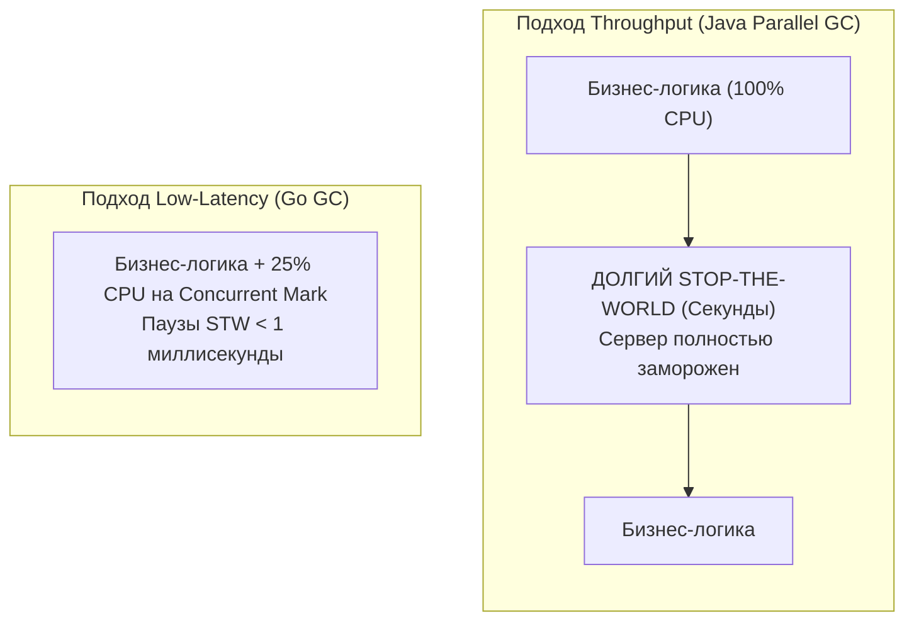
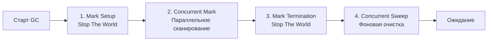

В прошлых статьях мы детально разобрали архитектуру аллокатора памяти ([[21. Аллокатор памяти Go. mcache, mcentral, mheap.md]]) и способы минимизации аллокаций в куче ([[18. Escape Analysis. Почему переменная ушла в heap.md]], [[23. sync_pool под капотом.md]]). Но как бы виртуозно мы ни оптимизировали алгоритмы, часть долгоживущих объектов неизбежно оседает в глобальной памяти программы. Рано или поздно эту память необходимо возвращать операционной системе, иначе сервер неминуемо упадет с фатальной ошибкой `Out Of Memory` (OOM).

За очистку кучи отвечает Сборщик мусора (Garbage Collector, GC). 

Для многих инженеров, пришедших из миров C++ или Rust, само наличие сборщика мусора ассоциируется с потерей контроля, медлительностью и непредсказуемыми зависаниями приложения (паузы Stop-The-World). Разработчики корпоративных систем на старых версиях Java до сих пор с содроганием вспоминают, как сборщик мусора мог внезапно «заморозить» сервер на десятки секунд в самый разгар торговой сессии.

Go предложил миру принципиально иной инженерный манифест. Архитектура GC в Go — это бескомпромиссный выбор в сторону **минимального времени отклика (Low Latency)**.

---

## Философия Go GC: Latency vs Throughput

При проектировании любого алгоритма автоматической сборки мусора инженеры всегда сталкиваются с фундаментальным архитектурным компромиссом (Trade-off) между двумя противоположными метриками:

1. **Throughput (Пропускная способность):** Какую долю процессорного времени приложение отдает полезной работе (бизнес-логике), а какую — обслуживающим процедурам GC.
2. **Latency (Задержка отклика):** Насколько долго приложение замирает (становится недоступным для обработки сетевых запросов), пока сборщик мусора производит манипуляции с памятью.

Исторически виртуальная машина Java (JVM с классическим Parallel GC) делала категорическую ставку на максимальный Throughput. Мусор накапливался гигабайтами, после чего JVM объявляла полную остановку мира (Stop-The-World, STW) на сотни миллисекунд или даже секунды, зато быстро и эффективно уплотняла память на максимальной скорости ядер.

Инженеры Go во главе с Риком Хадсоном (Rick Hudson) пошли по диаметрально противоположному пути, сделав абсолютным приоритетом **Latency**. В современном Go длительность пауз Stop-The-World практически никогда не превышает **1 миллисекунду** (а на практике составляет десятки микросекунд). Это выдающееся достижение опирается на то, что подавляющая часть работы сборщика выполняется **конкурентно** — параллельно с исполнением кода ваших горутин.

### Почему Go GC не Generational (не поколенческий)?

В средах исполнения Java или C# (.NET) сборщики мусора традиционно делят память на поколения: «молодое» (Eden, Survivor) и «старое» (Tenured). Это базируется на так называемой слабой гипотезе о поколениях: *«Подавляющее большинство объектов погибает вскоре после создания»*.

На техническом собеседовании это один из излюбленных вопросов: *почему в Go нет поколенческого сборщика мусора?*

**Ответ кроется в алгоритме Escape Analysis.**  
В языках вроде Java практически любая сущность (`new Object()`) безусловно рождается в куче. В Go эту проблему берет на себя компилятор: благодаря статическому анализу графа побега подавляющее большинство короткоживущих объектов размещается на локальном стеке горутины. Стек уничтожается абсолютно бесплатно (сдвигом регистра `SP`) и вообще не требует внимания со стороны сборщика мусора!

В кучу Go попадают в основном долгоживущие объекты: глобальные кэши, пулы соединений, долгоживущие фоновые буферы. Внедрять в рантайм сложнейшую логику поколений, тяжелые барьеры чтения (Read Barriers) и таблицы отслеживания межпоколенческих ссылок (Card Tables) ради редких короткоживущих объектов, случайно просочившихся в кучу — значит наложить колоссальный налог на производительность всей системы.

### Почему Go GC не Compacting (не уплотняющий)?

Многие сборщики мусора после сканирования физически передвигают выжившие объекты в памяти, упаковывая их в плотный блок, чтобы устранить внешнюю фрагментацию («дыры»). 

Go принципиально не перемещает объекты в куче.
1. Во-первых, физическое перемещение объектов требует продолжительной фазы STW: необходимо остановить все потоки и синхронно обновить триллионы указателей по всему адресному пространству.
2. Во-вторых, аллокатор Go изначально спроектирован на базе архитектуры `TCMalloc` и классов размеров (Size Classes). Как мы выяснили в [[21. Аллокатор памяти Go. mcache, mcentral, mheap.md]], память кучи фрагментирована на унифицированные спаны `mspan` строго фиксированного размера. Внешняя фрагментация в ней исключена алгоритмически.

---

## 4 Фазы работы Сборщика мусора

Полный рабочий цикл сборщика мусора в Go относится к семейству алгоритмов `Mark and Sweep` (Пометка и Очистка). Он строго структурирован на четыре последовательные фазы:

### Фаза 1: Mark Setup (Stop The World)

Цикл инициируется кратковременной паузой Stop-The-World: рантайм на миг приостанавливает выполнение **всех** горутин приложения.

Что происходит за эту долю миллисекунды:
1. Планировщик дожидается, пока все активные горутины дойдут до безопасных точек останова (Safe Points). В современном Go (начиная с Go 1.14) это обеспечивается механизмом асинхронного вытеснения по сигналам ОС (`SIGURG`).
2. Включается **Write Barrier (Барьер записи)**. Это критически важная рантайм-ловушка, отслеживающая любые мутации указателей в памяти во время последующей конкурентной фазы (подробно в [[27. Write Barrier и почему она нужна.md]]).
3. Рантайм инициализирует и пробуждает выделенные горутины сборщика — Mark Workers.

После этого нормальное исполнение программы немедленно возобновляется. Приложение «висело» буквально $10-50$ микросекунд.

---

### Фаза 2: Concurrent Mark (Конкурентная пометка)

Это самая ресурсоемкая фаза сборки. Ваше приложение продолжает полноценно работать: обрабатывать HTTP-запросы, читать базы данных и рассчитывать данные. Однако рантайм Go принудительно резервирует **ровно 25% вычислительной мощности CPU**.

Если сервер располагает 8 логическими ядрами (`GOMAXPROCS=8`), ровно 2 ядра будут целиком выделены под фоновые горутины сборщика мусора (Mark Workers).

Воркеры обходят память кучи по алгоритму **Tri-color Abstraction (Трехцветная абстракция)**:
1. В качестве отправной точки берутся корни (Roots) — глобальные переменные, регистры CPU и локальные указатели со стеков всех горутин. Найденные объекты помечаются Серым цветом (объект найден, но его внутренние поля еще не исследованы).
2. Воркер извлекает Серый объект, переводит его в Черный цвет (объект полностью исследован) и рекурсивно переходит по всем содержащимся в нем указателям, окрашивая найденные зависимые структуры в Серый цвет.
3. Процедура продолжается до тех пор, пока очередь Серых объектов полностью не иссякнет. Все объекты, оставшиеся к этому моменту Белыми, математически признаются недостижимым мусором.

> [!warning] Ловушка / Gotcha. Налог на аллокацию (Mark Assist)
> Представьте ситуацию: фоновый сборщик выделил 25% CPU для сканирования 10 ГБ кучи. Процесс сканирования займет 100 миллисекунд. Но горутины бизнес-логики (работающие на оставшихся 75% CPU) настолько интенсивно порождают новые объекты, что объем нового мусора растет быстрее, чем GC успевает его помечать!
> В таком критическом сценарии рантайм применяет защитный механизм — **Mark Assist (Помощь сборщику)**. Когда горутина бизнес-логики обращается к аллокатору (`mallocgc`) за очередным куском памяти, планировщик временно блокирует ее запрос и заставляет эту горутину *лично* выполнить часть работы по разметке кучи. На графиках метрик сервиса это проявляется как внезапная просадка пропускной способности и резкий рост времени обработки запросов (Троттлинг).

---

### Фаза 3: Mark Termination (Stop The World)

Вторая и завершающая фаза остановки мира в цикле сборки:
1. Рантайм вновь кратковременно переводит систему в режим Stop-The-World.
2. Сканируются остаточные изменения и локальные очереди разметки, возникшие на финише конкурентной фазы.
3. Полностью отключается Write Barrier.
4. Внутренний механизм регуляции (GC Pacer) рассчитывает целевой порог памяти для следующего триггера запуска сборщика.

Эта пауза также чрезвычайно компактна и обычно укладывается в диапазон $60-100$ микросекунд.

---

### Фаза 4: Concurrent Sweep (Конкурентная очистка)

Все оставшиеся Белыми объекты официально признаны мертвыми.
Очистка памяти в Go спроектирована ленивой (Lazy Concurrent Sweep). Рантайм не тратит время на то, чтобы немедленно стереть гигабайты мусора нулями.

Вместо этого фоновый поток (во взаимодействии с монитором `sysmon` и горутинами `bgsweep`) постепенно актуализирует битовые карты аллокаций в спанах `mspan`, возвращая освободившиеся слоты в структуры `mcentral` и `mcache`. 
Когда вашему приложению снова потребуется память под новые структуры, оно просто запишет новые данные поверх старых мертвых слотов.

> [!tip] Собеседование. Что такое «Пауза GC»?
> **Вопрос:** Если мониторинг (Prometheus/Grafana) показывает, что метрика GC Pause Time составляет 1 миллисекунду, означает ли это, что Сборщик Мусора завершил всю свою работу за 1 мс?
> 
> **Ответ:** Категорически нет! Метрика «паузы» (Pause Time) учитывает исключительно суммарную длительность жестких блокировок мира (Stop-The-World) в Фазах 1 и 3. 
> Сама конкурентная разметка (Фаза 2) могла выполняться сотни миллисекунд, отбирая 25% всех ядер CPU и вовлекая рабочие горутины в Mark Assist. Сервер не «висел», но работал с пониженной производительностью. Поэтому в мониторинге высоконагруженного бэкенда необходимо отслеживать не только задержки STW, но и метрику суммарной длительности сборки `go_gc_duration_seconds` и долю времени в GC `go_gc_cpu_fraction`.

---

## Итог

1. **Баланс характеристик:** Архитектура Go GC сознательно жертвует частью пропускной способности Throughput (налог 25% CPU и штрафы Mark Assist), обеспечивая эталонную предсказуемость времени ответа сервиса (паузы STW менее 1 миллисекунды).
2. **Отсутствие поколений:** Большая часть временных структур отсекается на стеке горутин механизмом Escape Analysis. Куча Go содержит преимущественно долгоживущие данные, что делает разделение на поколения избыточным.
3. **Отсутствие перемещений (Non-compacting):** Объекты не двигаются в памяти. Это исключает долгие паузы на пересчет указателей. С внешней фрагментацией справляется квантование TCMalloc на классы размеров.
4. **Конкурентная разметка:** Основная работа по обходу графа объектов выполняется параллельно с бизнес-логикой.

Мы рассмотрели общую четырехфазную архитектуру Сборщика Мусора. Но как именно рантайм математически гарантирует, что ни один живой объект не будет случайно удален, если указатели в куче непрерывно мутируют прямо во время сканирования?

В следующей главе мы погрузимся в математику графов памяти и алгоритм Трехцветной раскраски:
[[25. Mark, Sweep и Tricolor GC.md]]