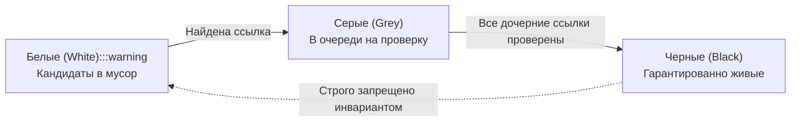
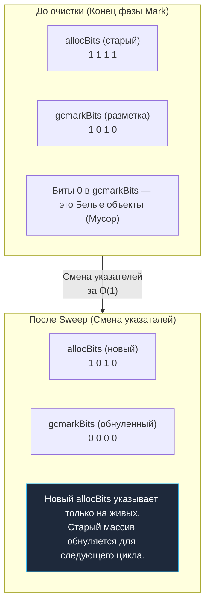

В статье [[24. Сборщик мусора Go. Общая архитектура.md]] мы увидели общую архитектуру с высоты птичьего полета: Сборщик мусора (GC) в Go исполняется в четыре строгие фазы, сознательно перенося основную вычислительную нагрузку в конкурентное русло, чтобы свести паузы Stop-The-World (STW) к незаметным долям миллисекунды.

Но как именно фоновые воркеры GC математически определяют, какие объекты в памяти остаются «живыми», а какие превратились в мусор, особенно в условиях, когда сотни тысяч параллельных горутин непрерывно создают, мутируют и разрывают связи между объектами?

В основе этой системы лежит элегантный математический алгоритм обхода графа — **Tricolor Mark and Sweep (Трехцветная пометка и очистка)**. Для Senior-разработчика глубокое понимание этого механизма — ключ к профессиональному чтению трейсов `pprof` и осознанному управлению бюджетом аллокаций.

---

## Иллюзия простого Mark and Sweep

Классический алгоритм `Mark and Sweep` (впервые сформулированный Джоном Маккарти (John McCarthy) в 1960 году для языка Lisp) предельно прост и логичен:

1. **Mark (Пометка):** Программа полностью замораживается. Сборщик мусора определяет Корни (Roots — глобальные переменные, регистры CPU и стеки потоков) и рекурсивно обходит все доступные указатели в глубину или ширину, выставляя флаг «Живой» на каждом достигнутом объекте.
2. **Sweep (Очистка):** Сборщик линейно сканирует всю память кучи от начала до конца. Если у объекта нет флага «Живой» — это мусор, и память немедленно возвращается в список свободных блоков. Флаг «Живой» очищается для подготовки к следующей сборке.

**В чем фундаментальная проблема?**  
В современных высоконагруженных бэкендах куча измеряется десятками гигабайт. Полный рекурсивный обход миллиардов указателей на такой глубине занимает сотни миллисекунд или даже секунды. Классический алгоритм требует **полной остановки всего приложения (STW)** на все время обхода: если позволить коду работать во время пометки, мутирующие горутины перепишут указатели, и сборщик случайно сотрет живые данные.

Инженерам Go требовался алгоритм, который можно инкрементально прерывать и выполнять небольшими независимыми квантами параллельно с пользовательским кодом. Таким решением стала Трехцветная абстракция Дейкстры (Edsger Dijkstra).

---

## Tricolor Abstraction (Трехцветная абстракция)

Суть алгоритма заключается в разделении абсолютно всех объектов кучи на три непересекающихся логических множества, маркируемых условными цветами:

1. **Белые (White):** Объекты, до которых сборщик мусора еще не добрался. В момент старта цикла сборки абсолютно вся память кучи считается белой. По завершении фазы разметки все объекты, оставшиеся белыми, математически признаются недостижимым мусором и подлежат утилизации.
2. **Серые (Grey):** Объекты, которые GC уже обнаружил и признал гарантированно живыми, но сборщик **еще не исследовал** их внутренние указатели. Серые объекты образуют динамический рабочий фронт сканирования (work queue).
3. **Черные (Black):** Объекты, которые GC посетил, признал живыми и досконально просканировал все их дочерние поля-указатели. Они не содержат необработанных ссылок.

**Краеугольный инвариант алгоритма:** Черный объект никогда не может напрямую ссылаться на Белый объект (Strong Tri-color Invariant). Если черная сущность ссылается на белую, между ними обязательно должен существовать хотя бы один серый объект-посредник (Weak Tri-color Invariant).

### Алгоритм работы (Пошагово)

1. **Старт (Mark Setup):** На ультракороткой паузе STW рантайм сканирует все Корни (Roots) — глобальные переменные пакетов и текущие стеки работающих горутин. Все объекты, адреса которых обнаружены в корнях, мгновенно окрашиваются в **Серый** цвет (добавляются в очередь сканирования).
2. **Конкурентный цикл (Concurrent Mark):** Параллельные фоновые воркеры GC извлекают Серые объекты из очередей:
   * Сканируют память объекта в поисках валидных адресов.
   * Все найденные дочерние объекты окрашивают в **Серый** цвет (помещают в очередь на сканирование).
   * Исходный проинспектированный объект переводят в **Черный** цвет.
3. **Финиш разметки:** Цикл продолжается до тех пор, пока очередь Серых объектов полностью не иссякнет.
4. **Очистка (Sweep):** Все Черные объекты объявляются выжившими. Все оставшиеся Белые объекты признаются мусором, и их слоты возвращаются аллокатору. Цвета сбрасываются: выжившие объекты снова трактуются как Белые в ожидании следующего цикла GC.

---

## Mechanical Sympathy: Где хранятся цвета?

Это классический проверочный вопрос на собеседованиях уровня Lead/Staff: *если в нашей программе объявлена структура `type User struct { ... }`, добавляет ли рантайм в нее скрытое служебное поле `color`?*

**Ответ: Категорически нет.**  
Хранение метаинформации сборщика мусора непосредственно в теле пользовательских структур разрушительно для производительности:
1. **Cache Locality и False Sharing:** Если бы воркеры GC непрерывно записывали байты цвета прямо в поля структур, они бы непрерывно инвалидировали кэш-линии L1/L2 ядер CPU, на которых в этот момент горутины приложения исполняют полезный код (см. [[16. sync_atomic и атомарные операции в рантайме.md]]).
2. **Copy-on-Write (CoW):** В операционных системах запись в память страницы, разделяемой через `mmap` или `fork`, немедленно провоцирует физическое копирование 4-килобайтной страницы памяти в RAM.

Рантайм Go следует принципам Mechanical Sympathy и хранит цвета в **отдельных компактных битовых картах (Bitmaps)**.

В главе [[21. Аллокатор памяти Go. mcache, mcentral, mheap.md]] мы изучали структуру `mspan`. В заголовке каждого спана размещены две параллельные битовые карты:
* `allocBits`: Бит равен 1, если соответствующий слот спана занят выделенным объектом.
* `gcmarkBits`: Бит равен 1, если соответствующий объект был найден и помечен в процессе текущей сборки GC.

**Как цвета проецируются на биты:**
* **Белый цвет:** `allocBits = 1`, `gcmarkBits = 0` (память выделена, но сборщик до объекта еще не добрался).
* **Черный / Серый цвет:** `allocBits = 1`, `gcmarkBits = 1` (объект достижим и помечен).

Но если и Черный, и Серый объекты имеют единицу в `gcmarkBits`, как рантайм отличает их между собой?  
Различие определяется **наличием объекта в рабочей очереди (gcWork)**:
* **Серый объект:** бит в `gcmarkBits` взведен в 1, и адрес объекта **находится в очереди** `gcw` логического процессора `P`.
* **Черный объект:** бит в `gcmarkBits` равен 1, но объект **уже извлечен** из очереди `gcw` и все его ссылки просканированы.

> [!info] Под капотом. Lock-free очереди воркеров
> Очередь серых объектов (`gcWork`) не является единым глобальным массивом под общим мьютексом. Каждый логический процессор `P` снабжен локальными двухуровневыми буферами `gcw` (структуры `workbuf`). 
> Воркеры GC работают на системных стеках `g0` и сканируют графы параллельно. Если локальный буфер процессора пустеет, он использует атомарный Work Stealing, воруя порцию серых указателей у соседних процессоров, что гарантирует равномерную загрузку всех ядер без блокировок.

---

## Фаза Sweep: Ленивая магия

Когда в системе не остается ни одного Серого объекта, фаза Mark Termination на доли миллисекунды фиксирует финал разметки, после чего запускается фоновая фаза Concurrent Sweep.

В традиционных языках фаза очистки была тяжелой вычислительной процедурой: сборщику приходилось последовательно обходить всю память и вызывать деструкторы. В Go процедура Sweep работает с феноменальной скоростью благодаря архитектуре `mspan` и битовым картам.

Что делает Sweep физически?  
**Он просто меняет местами указатели на массивы `allocBits` и `gcmarkBits` в заголовке `mspan`!**

Все слоты памяти, где `gcmarkBits` содержал 0 (Белые объекты), автоматически становятся свободными ячейками в обновленном `allocBits`. Рантайму даже не требуется заполнять эту память нулями сразу: очистка происходит лениво, ровно в тот момент, когда аллокатор выделит освободившийся слот новому объекту вашей программы.

> [!tip] Собеседование. Что делает runtime.GC()?
> **Вопрос:** Если мы принудительно вызываем в коде `runtime.GC()`, заблокирует ли этот вызов текущую горутину до момента полного освобождения оперативной памяти в ОС?
> 
> **Ответ:** Функция `runtime.GC()` блокирует вызывающую горутину только до завершения фазы **Mark** (пока все живые объекты не будут окрашены в Черный цвет, а мир не пройдет Mark Termination). 
> Сама фаза **Sweep** (очистка битовых карт и спанов) запускается асинхронно в фоне. Поэтому функция возвращает управление вызывающему коду *до* того, как память реально освободится. Ручной вызов `runtime.GC()` в production-коде — классический антипаттерн: он грубо нарушает математическую модель адаптивного пейсера (GC Pacer), провоцирует внеплановые остановки мира и просаживает общую производительность сервиса.

---

## Предвестие катастрофы: Гонка данных с Мутатором

Мы подробно рассмотрели безупречную логику трехцветного алгоритма в предположении, что граф объектов статичен. Но архитектурная суть Go заключается в том, что GC работает **конкурентно**. 

Пока фоновые воркеры сборщика мусора (на 25% CPU) перекрашивают память из Серого в Черный, ваши горутины приложения (называемые в теории компиляторов **Мутатором** — Mutator) непрерывно исполняют бизнес-логику: создают новые объекты, перезаписывают поля и удаляют ссылки.

Представьте критическую гонку данных:
1. Черный объект (уже полностью просканированный GC) внезапно получает прямую ссылку на Белый объект (еще не обнаруженный GC).
2. В ту же микросекунду Серый объект, который держал единственную легитимную ссылку на этот Белый объект, затирает ее (ссылка удаляется).

Что произойдет?  
Воркеры GC больше никогда не вернутся к Черному объекту (ведь он уже помечен как завершенный). Серый объект больше не содержит ссылки на Белый. В результате Белый объект останется Белым до самого конца цикла разметки! 

На фазе Sweep сборщик мусора сочтет его мертвым и **удалит из памяти живой объект, который ваше приложение активно использует прямо сейчас**. Произойдет повреждение кучи (Memory Corruption) и крах рантайма.

Чтобы предотвратить эту катастрофу, не прибегая к перманентной остановке мира, в рантайм Go внедрен сложнейший механизм перехвата записи. В следующей статье мы разберем, как Go выходит из этой ловушки:
[[26. Concurrent GC и Stop The World.md]]