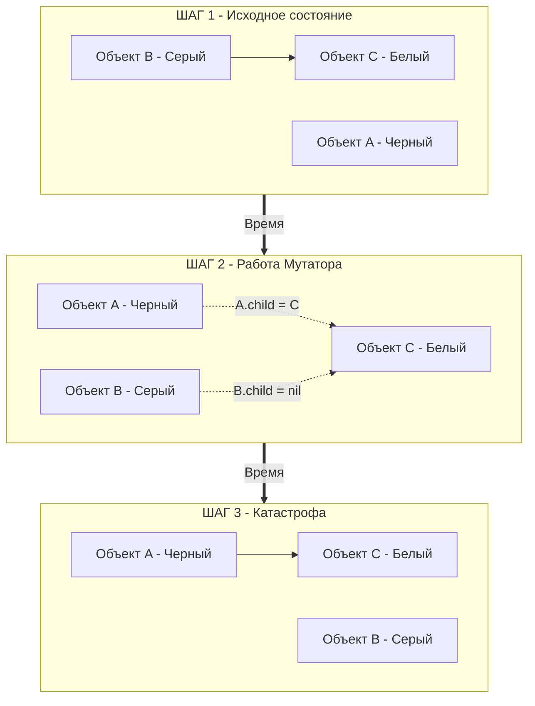
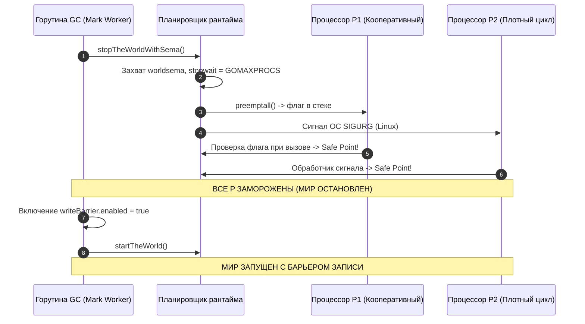

В финале статьи [[25. Mark, Sweep и Tricolor GC.md]] мы подошли к одной из сложнейших и драматичных проблем современного системного программирования. Мы выяснили, как элегантно работает алгоритм трехцветной пометки в идеализированном мире, где граф объектов кучи полностью «заморожен» и неподвижен.

Однако суровая реальность многоядерных бэкендов на Go иная: мы имеем дело с **Concurrent GC (Конкурентным сборщиком мусора)**. Пока фоновые воркеры сборщика на четверти мощности процессора старательно перекрашивают узлы графа из Серого в Черный, ваши рабочие горутины (называемые в теории компиляторов **Мутатором** — *Mutator*) непрерывно молотят вычисления на остальных ядрах CPU. Мутатор ежесекундно создает новые структуры, перезаписывает указатели и рвет существующие связи в памяти.

В этой главе мы разберем, как именно параллельное исполнение способно сломать трехцветный алгоритм, почему полностью исключить паузы **Stop The World (STW)** физически невозможно в реальных системах, и как рантайм Go умудряется останавливать сотни тысяч горутин за считанные микросекунды.

---

## Фундаментальный конфликт: Мутатор против GC

Чтобы осознать архитектурный вызов, стоявший перед авторами Go, смоделируем классическую аппаратную гонку данных (Data Race) между сборщиком мусора и пользовательским кодом.

Представим следующую последовательность событий:
1. Воркер GC проинспектировал объект `A` и перевел его в состояние **Черный** (он полностью проверен, к нему сборщик в текущем цикле больше не притронется).
2. Воркер GC обнаружил объект `B` и окрасил его в **Серый** цвет (он помещен в очередь задач на проверку внутренних ссылок).
3. Объект `B` (Серый) содержит ссылку на объект `C` (**Белый**, до которого сборщик еще не добрался).

В эту самую микросекунду планировщик ОС отдает квант времени горутине приложения (Мутатору). Код Мутатора выполняет две банальные операции присваивания:
```go
A.child = B.child // Черный объект A теперь ссылается на Белый объект C
B.child = nil     // Серый объект B теряет ссылку на Белый объект C
```

Взглянем на произошедшее через призму теории графов:



**Что произойдет дальше?**  
Фоновый воркер GC просыпается, извлекает объект `B` (Серый) из своей очереди, проверяет его поля и не находит ни одного указателя (ведь Мутатор только что обнулил их). Воркер удовлетворенно переводит `B` в Черный цвет.

А что случилось с объектом `C`?  
Объект `C` остался **Белым** до конца цикла! Единственный путь к нему в графе памяти теперь ведет исключительно через Черный объект `A`. Но фундаментальный закон трехцветной пометки гласит: *Черные узлы повторно не инспектируются*. 

На фазе Sweep сборщик мусора посмотрит на Белый объект `C`, сочтет его недостижимым мусором и вернет его слот оперативной памяти аллокатору. Но ваше приложение прямо сейчас хранит живую ссылку на `C` через указатель `A.child`! 

При следующей попытке обратиться к полям `A.child.Field` сервер мгновенно завершится аварийной паникой с аппаратным сигналом ядра `SIGSEGV` (Segmentation Fault) либо, что еще опаснее, тихо прочитает чужой мусор, если аллокатор успеет выдать этот слот новому объекту.

---

## Триколорные инварианты

Эта фундаментальная уязвимость конкурентной сборки мусора исследована учеными еще в 1970-х годах. Чтобы гарантировать корректность памяти, алгоритм обязан строго обеспечивать соблюдение хотя бы одного из двух математических инвариантов:

1. **Сильный триколорный инвариант (Strong Tricolor Invariant):** Черный объект **никогда** не должен иметь прямых ссылок на Белый объект. (Именно это строгое правило мы нарушили на Шаге 2 нашего примера).
2. **Слабый триколорный инвариант (Weak Tricolor Invariant):** Черный объект имеет право ссылаться на Белый объект, **НО только при условии**, что к этому Белому объекту в графе памяти сохраняется альтернативный маршрут через хотя бы один Серый объект-посредник.

Если рантайм на аппаратном и компиляторном уровне гарантирует соблюдение хотя бы одного из этих инвариантов, сборщик мусора никогда не удалит живые данные. 

Но чтобы безопасно активировать механизм, контролирующий соблюдение инварианта (Write Barrier), и согласованно зафиксировать корневые указатели, рантайму требуется момент абсолютной тишины в памяти. Ему необходима процедура **Stop The World**.

---

## Механика Stop The World (STW)

Вопреки распространенному рекламному мифу, Go не отменил паузы STW. Создатели языка пошли по более реалистичному инженерному пути: они сделали эти паузы микроскопическими (обычно $< 1$ мс).

Напомним, что полная остановка мира инициируется дважды за цикл:
1. **Mark Setup:** Включение защиты (Write Barrier) и захват исходных корней.
2. **Mark Termination:** Выключение барьера и финализация очередей.

Каким образом рантайм способен скоординированно и синхронно остановить 100 000 параллельных горутин, распределенных по 32 или 64 физическим ядрам сервера?

В исходном коде рантайма Go (файл `src/runtime/proc.go`) за этот процесс отвечает низкоуровневая процедура `stopTheWorldWithSema`. Процесс остановки — эталон архитектурной оркестрации:

1. **Глобальная блокировка координатора:** Горутина-инициатор захватывает семафор `worldsema`. Это гарантирует, что никакой другой системный поток (например, фоновый монитор `sysmon` или CGO-поток) не сможет параллельно запустить собственную остановку мира.
2. **Счетчик подтверждений:** Выставляется атомарный системный счетчик `sched.stopwait`, равный общему числу активных логических процессоров `P`, которые требуется перевести в безопасное состояние.
3. **Кооперативное вытеснение (Preemption):** Рантайм выполняет системную процедуру `preemptall()`. Для каждого логического процессора `P` выставляется специальный бит прерывания. При каждом вызове любой функции компилятор Go генерирует проверку границ стека (Stack Bound Check, см. [[11. Стек горутины. Рост и shrink стека.md]]). Обнаружив флаг вытеснения, горутина самостоятельно и вежливо уступает процессор.
4. **Асинхронный сигнал ОС (Начиная с Go 1.14):** Что делать, если горутина застряла в плотном математическом цикле `for {}` без вызовов функций? В версиях Go до 1.14 такой цикл мог заморозить весь сервер на секунды. Начиная с Go 1.14 рантайм действует решительно: поток `sysmon` посылает потоку ОС аппаратный POSIX-сигнал `SIGURG`. Ядро Linux перехватывает исполнение потока, сохраняет контекст регистров и принудительно переключает горутину на планировщик в точку останова (подробнее в [[43. Preemption. Как Go останавливает горутины.md]]).
5. **Системные вызовы (Syscalls):** Если поток `M` заблокирован внутри ядра ОС (ждет дискового ввода-вывода или сетевого сокета), рантайм отрывает от него дескриптор `P` (механизм Handoff) и сразу помечает этот `P` как остановленный. Когда поток `M` вернется из системного вызова, он обнаружит остановленный мир и послушно уснет на системном семафоре.

Мир считается официально остановленным только тогда, когда **каждый** логический процессор `P` подтвердил: *«Я нахожусь в безопасной точке (Safe Point) и заморожен»*.



> [!warning] Ловушка / Gotcha. Длинные паузы STW
> Если графики мониторинга (Prometheus / Grafana) или трассировки pprof фиксируют внезапные всплески пауз GC до 50–200 миллисекунд, это практически никогда не свидетельствует о медлительности алгоритмов сборщика. 
> Это означает, что **рантайм не мог вовремя остановить мир**. Классические причины задержки входа в STW:
> 1. Использование тяжелых сторонних C-библиотек через CGO (рантайм Go не имеет права прерывать выполнение нативного C-кода сигналом `SIGURG`).
> 2. Аппаратный своппинг операционной системы (RAM исчерпана, страница выгружена на диск, и сигнал ОС зависает в ожидании дискового Page Fault).
> 3. Использование устаревших версий Go (до 1.14), где числодробительные циклы не имели точек кооперативного вытеснения.

---

## Жизнь внутри STW

Когда все логические процессоры замерли, фоновый системный воркер `gcBgMarkWorker` получает эксклюзивный монопольный доступ к процессу.

Именно в этой абсолютной тишине (на фазе Mark Setup) рантайм выставляет глобальный атомарный флаг:
```go
writeBarrier.enabled = true
```
После этого мгновенно вызывается процедура `startTheWorld()`, семафор `worldsema` освобождается, и горутины продолжают обслуживание пользователей. Вся пауза занимает считанные микросекунды.

---

## Mechanical Sympathy: Налог на конкурентность

Конкурентная архитектура сборщика мусора не бывает бесплатной. Полностью избавившись от многосекундных зависаний STW, мы заплатили за это двумя неизбежными аппаратными «налогами»:

1. **Mark Assist (Штраф за аллокации):** Если горутины бизнес-логики (Мутатор) порождают мусор с более высокой скоростью, чем фоновые воркеры GC успевают его размечать, серверу грозит скорый Out Of Memory. Рантайм принудительно штрафует такие горутины: при обращении к `mcache` аллокатор заставляет горутину отработать часть времени на сканировании кучи пропорционально объему запрошенной памяти. Для конечного пользователя это выглядит как резкий скачок задержки конкретного HTTP-запроса.
2. **Write Barrier Overhead:** Включение флага `writeBarrier.enabled` заставляет процессор выполнять дополнительные инструкции проверки и затенения при **каждой** перезаписи указателя в куче.

> [!tip] Собеседование. Как избежать Mark Assist?
> **Вопрос:** Мы анализируем профиль исполнения через `go tool trace` и видим, что рабочие горутины тратят до 30% времени внутри рантайм-функции `runtime.gcAssistAlloc`. Как устранить эту проблему?
> 
> **Ответ:** Единственный надежный способ избавиться от Mark Assist — снизить общую интенсивность (Rate) аллокаций в куче. 
> Необходимо оптимизировать горячие траектории (Hot Paths): применять правила Escape Analysis, переводить частые временные структуры на стек, активно использовать `sync.Pool` для крупных буферов и заблаговременно указывать вместимость срезов (`capacity`). Как только приток мусора снизится, штатные 25% CPU фоновых воркеров будут справляться с разметкой самостоятельно, и механизм Mark Assist перестанет отбирать ресурсы у бизнес-логики.

---

## Итог

1. **Гонка Мутатора и GC:** Конкурентная сборка мусора неизбежно порождает риск удаления живых объектов, если Черный объект получает ссылку на Белый, а Серый объект разрывает связь с Белым (разрушение триколорных инвариантов).
2. **STW:** Для безопасной смены режимов и фиксации начальных состояний рантайм использует микросекундные паузы Stop The World, координируя процессоры `P` через Safe Points и аппаратные сигналы ядра `SIGURG`.
3. Затяжные паузы STW в современном Go — симптом системных проблем (CGO, Page Faults при своппинге, блокировки ядра), а не работы алгоритма разметки.
4. Конкурентность требует платы: налог на процессорные такты через **Mark Assist** и накладные расходы **Write Barrier**.

Мы выяснили, *зачем* рантайму необходим защитный барьер во время конкурентной сборки и *когда* он активируется. 
Но что конкретно представляет собой этот барьер на уровне ассемблерного кода? Как именно компилятор перехватывает мутации указателей и математически удерживает Триколорный инвариант?

В следующей главе мы спустимся в исходный код компилятора и разберем архитектуру барьера записи:
[[27. Write Barrier и почему она нужна.md]]