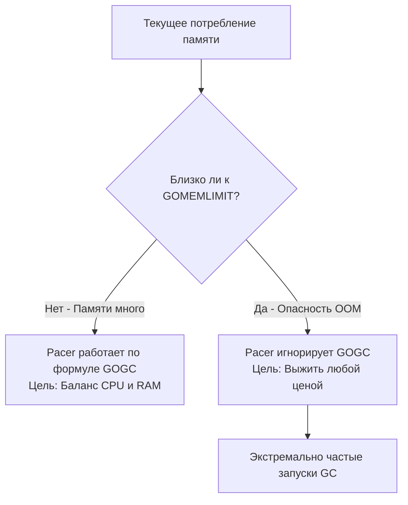

В прошлых статьях мы детально препарировали Сборщик мусора (GC) рантайма Go. Мы разобрали его общую архитектуру ([[24. Сборщик мусора Go. Общая архитектура.md]]), математические алгоритмы поиска мертвого графа объектов ([[25. Mark, Sweep и Tricolor GC.md]]) и защитные механизмы против параллельных гонок данных ([[26. Concurrent GC и Stop The World.md]], [[27. Write Barrier и почему она нужна.md]]). 

Создатели Go всегда гордились тем, что их Сборщик мусора великолепно работает «из коробки». В отличие от мира корпоративной Java, где разработчикам приходится разбираться в дебрях десятков параметров JVM (выбирать между сборщиками G1 или ZGC, высчитывать мегабайты поколений Eden/Survivor, настраивать пороги пауз), в Go этот зоопарк намеренно отсутствует. Вы не можете сменить базовый алгоритм сборщика.

Однако в экстремальном Highload-бэкенде дефолтные настройки рантайма могут сыграть злую шутку: либо спровоцировать внезапную смерть контейнера от Linux OOM Killer (OOMKilled), либо бессмысленно сжечь процессорную мощность на чересчур частые циклы пометки. 

Для гармоничного баланса между CPU и оперативной памятью рантайм Go оснащен математическим контроллером — **Pacer (Пейсер)**, а инженеру предоставлены две главные ручки управления: классический параметр `GOGC` и современный мягкий лимит `GOMEMLIMIT`.

---

## Pacer: Ритмоводитель Сборщика мусора

Сборщик мусора не может работать непрерывно: если бы он сканировал память каждую наносекунду, полезная бизнес-логика сервиса остановилась бы. Сборщик должен математически точно определить момент, **когда именно** ему следует проснуться и запустить фазу *Mark Setup*. 

Этим расчетом управляет встроенный алгоритмический регулятор — Pacer (пропорционально-интегральный контроллер скорости).

Pacer непрерывно производит мониторинг двух ключевых системных метрик:
1. **Скорость аллокации (Allocation Rate):** С какой интенсивностью горутины прикладного кода (Мутатор) запрашивают новые слоты памяти в куче.
2. **Объем живой кучи (Live Heap):** Сколько реальной полезной памяти осталось занято выжившими объектами после завершения предыдущего цикла очистки.

На основе этих параметров Pacer в динамике вычисляет **Target Heap Size** — целевой размер кучи, при достижении которого рантайм обязан инициализировать следующий цикл сборки мусора, чтобы завершить разметку аккуратно до исчерпания системного бюджета памяти.

---

## Ручка 1: Переменная GOGC

Исторически единственным официальным рычагом влияния на Pacer являлась переменная окружения `GOGC` (по умолчанию ее значение равно `100`).

Математическая формула расчета целевого размера кучи выглядит следующим образом:

$$Target = LiveHeap + \frac{LiveHeap \times GOGC}{100}$$

Где $LiveHeap$ — суммарный объем данных, признанных живыми по итогам предыдущей фазы Mark.

**Как это работает на практике:**  
Представьте, что после прохода сборщика мусора в живых осталось 100 МБ данных (долгоживущие кэши, сессии, служебные пулы). При стандартном значении `GOGC=100`:
$$Target = 100 + \frac{100 \times 100}{100} = 200 \text{ МБ}$$

Сборщик мусора погружается в спячку до тех пор, пока ваша программа в процессе выполнения бизнес-логики не аллоцирует дополнительные 100 МБ мусора, доведя суммарную кучу до 200 МБ. В этот момент Pacer разбудит воркеров GC.

### Mechanical Sympathy: Трейд-офф CPU vs RAM

Регулируя значение `GOGC`, инженер заключает прямую сделку с операционной системой и аппаратным обеспечением:

* **Агрессивный GC (`GOGC=50`):**  
  $$Target = 100 + 50 = 150 \text{ МБ}$$  
  Сборщик мусора активируется значительно раньше. Программа удерживает **минимальный объем оперативной памяти (RAM)**, но фазы *Concurrent Mark* запускаются в два раза чаще. Вы сознательно жертвуете тактами процессора (CPU) ради жесткой экономии оперативной памяти.
* **Ленивый GC (`GOGC=200`):**  
  $$Target = 100 + 200 = 300 \text{ МБ}$$  
  Сборщик позволяет куче свободно разрастаться. Вы расплачиваетесь гигабайтами оперативной памяти (RAM), но процессор значительно реже отвлекается на сканирование памяти и барьеры записи, что драматически увеличивает пропускную способность (Throughput) высоконагруженного сервиса.
* **Отключение GC (`GOGC=off`):**  
  Автоматический сборщик мусора полностью деактивируется (память собирается исключительно при явном вызове `runtime.GC()`). Сервис работает с максимальной теоретической скоростью нативного C-кода, пока не исчерпает физическую память машины и не погибнет от OOM (Out of Memory).

---

## Эпоха хаков: Memory Ballast

До выхода релиза Go 1.19 системные разработчики высоконагруженных распределенных платформ сталкивались с тяжелой дилеммой.

Представьте типичный промышленный сервер: машина с 64 ГБ RAM. Ваше микросервисное приложение удерживает всего 50 МБ стабильного «живого» состояния (структуры конфигурации, дескрипторы сокетов), но при этом прокачивает гигантский поток сетевого трафика, генерируя и выбрасывая сотни мегабайт временных байтовых срезов в секунду.

При `GOGC=100` триггер кучи срабатывает при достижении 100 МБ. Разница между 50 и 100 МБ исчерпывается за считанные миллисекунды. В результате GC запускается десятки и сотни раз в секунду, стабильно отбирая 25% CPU и накладывая штрафы Mark Assist на бизнес-горутины, хотя на хосте простаивает 63 Гигабайта свободной памяти!

Поднять `GOGC` до `1000`? Опасно: если объем живой кучи под нагрузкой внезапно вырастет до 5 ГБ, триггер улетит на отметку 55 ГБ, и внезапный пиковый всплеск аллокаций немедленно убьет процесс через OOM.

**Инженеры компании Twitch первыми предложили легендарный хак — Memory Ballast (Балласт памяти).**

На самом старте функции `main` инициализировался гигантский неиспользуемый байтовый массив:
```go
func main() {
    // Создаем пустой балластный массив на 10 Гигабайт
    ballast := make([]byte, 10<<30)
    
    // ... запускаем рабочие сервисы и HTTP-серверы ...
    
    // Предотвращаем преждевременную сборку балласта компилятором
    runtime.KeepAlive(ballast) 
}
```

Что происходило в рантайме?
1. Объем «живой» кучи искусственно завышался: 10 Гигабайт балласта + 50 Мегабайт реальных данных.
2. При стандартном значении `GOGC=100` триггер запуска следующей сборки вычислялся как **20 Гигабайт** ($10 + 10$).
3. Приложение получало колоссальный буфер: оно могло непрерывно аллоцировать 10 Гигабайт временного мусора без единого вмешательства GC. Частота сборок мусора падала с сотен в секунду до одного раза в несколько минут. Нагрузка на CPU мгновенно снижалась на 20–30%!

> [!info] Под капотом. Почему балласт не съедал реальную RAM?
> Вызов `make([]byte, 10<<30)` обращается к ядру Linux через `mmap` и выделяет **виртуальное адресное пространство**. Ядро операционной системы с готовностью резервирует 10 ГБ виртуальных адресов, но не связывает их с физическими страницами оперативной памяти (Physical RAM) до тех пор, пока в эти адреса не произойдет реальная запись байт. 
> Поскольку массив балласта оставался девственно нетронутым, процессор не генерировал прерываний отсутствия страницы (Page Fault), и физический размер процесса в оперативной памяти (RSS — Resident Set Size) оставался на уровне скромных десятков мегабайт!

---

## Ручка 2: GOMEMLIMIT (Go 1.19+)

Балласт памяти был гениальным трюком своего времени, но оставался опасным архитектурным костылем. Он плохо уживался с динамическими средами оркестрации Kubernetes, где жесткие ограничения cgroups v1/v2 безжалостно уничтожали контейнеры при малейших расхождениях виртуальной и физической памяти.

В релизе Go 1.19 произошло фундаментальное событие: Майкл Нисвандер (Michael Knyszek) представил механизм **Мягкого лимита памяти — `GOMEMLIMIT`**. 
Это официально сделало практику Memory Ballast пережитком прошлого.

Параметр `GOMEMLIMIT` задает предельную границу оперативной памяти, которую рантайм Go всеми силами обязуется не превышать. Он динамически **переопределяет логику `GOGC`**, когда объем используемой памяти приближается к критической отметке.



**Эталонная конфигурация для современного Kubernetes:**  
Если контейнеру пода в спецификации пода выделен лимит памяти `resources.limits.memory: 1Gi`, переменные окружения настраиваются так:
```bash
GOMEMLIMIT=900MiB
GOGC=off   # или GOGC=200..500
```

Что выигрывает сервис?
* Пока память контейнера далека от 900 МБ, Pacer при `GOGC=off` вообще не запускает сборщик мусора! Приложение утилизирует память с околонулевыми накладными расходами на GC.
* Как только суммарное потребление подбирается к 900 МБ, Pacer перехватывает управление, экстренно пробуждает GC и оперативно очищает кучу, предотвращая принудительное уничтожение процесса ядром Linux (OOMKilled).

> [!warning] Ловушка / Gotcha. Почему не 100% от лимита контейнера?
> Категорически запрещено устанавливать `GOMEMLIMIT` равным ровно 100% от лимита пода в Kubernetes. Рантайму Go требуется оперативная память не только под управляемую кучу!
> Необходимо всегда оставлять санитарный запас в 10–20% для:
> 1. Внутренних структур самого рантайма Go (стеки тысяч горутин, дескрипторы `mspan`, таблицы типов).
> 2. Страничного кэша операционной системы (Page Cache) при работе с файлами и сокетами.
> 3. Вызовов CGO (память, выделенная библиотеками на C через нативный `malloc`, принципиально не контролируется `GOMEMLIMIT`).
> 
> Если вы укажете `GOMEMLIMIT=1000MiB` при жестком лимите контейнера 1000MiB, системный Linux OOM Killer уничтожит под раньше, чем Pacer Go успеет инициировать защитный цикл сборки мусора.

---

## Death Spiral (Смертельная спираль трэшинга)

Что произойдет, если в программе образовалась системная утечка памяти (например, забытые горутины, удерживающие контексты, см. [[12. Как создается и завершается goroutine.md]]), либо реальный объем живых долгоживущих данных превысил заданный `GOMEMLIMIT`?

В наивной реализации сборщик мусора попал бы в замкнутый катастрофический круг:
1. Рантайм видит: память приблизилась к `GOMEMLIMIT`. Он немедленно запускает GC.
2. GC сканирует всю кучу, но не находит мертвых объектов: вся память реально удерживается живыми ссылками.
3. Куча по-прежнему превышает лимит. Рантайм мгновенно запускает следующий цикл GC.
4. Процессор тратит 100% времени на непрерывное сканирование, сервис намертво зависает и перестает отвечать на Health Check пробы. Это опасное состояние называется **GC Thrashing**.

Создатели Go спроектировали надежную защиту от этой «смертельной спирали»:
В рантайм жестко зашит аппаратный предохранитель: **Сборщик мусора ни при каких обстоятельствах не имеет права потреблять более 50% процессорного времени (CPU)**.

Если заданный лимит `GOMEMLIMIT` превышен, но объем мусора не уменьшается, рантайм констатирует: *«Я сделал всё возможное в рамках бюджета ресурсов, но я не стану сжигать весь CPU»*. Он ограничивает активность сборщика планкой в 50% CPU, позволяет объему памяти выйти за пределы `GOMEMLIMIT` и отдает судьбу сервиса операционной системе, которая штатно перезапустит упавший под по сигналу OOM. Это зрелое инженерное решение: предсказуемый быстрый перезапуск процесса несравнимо лучше бесконечного зомби-зависания.

---

## Итог

1. **Pacer** — адаптивный математический регулятор рантайма, вычисляющий целевой порог (Target Heap Size) для инициализации следующего цикла сборщика.
2. **`GOGC`** — относительный коэффициент прироста кучи (по умолчанию 100%). Снижение значения экономит RAM за счет повышенного расхода CPU; повышение — экономит такты процессора за счет большего аппетита к памяти.
3. **Memory Ballast** — исторический трюк с виртуальным срезом для урежения циклов сборки. В современном коде на Go 1.19+ использовать **категорически запрещено**.
4. **`GOMEMLIMIT`** — фундаментальный мягкий лимит памяти (Go 1.19+). Оптимален для контейнеров Kubernetes. Позволяет безопасно отключать или завышать `GOGC`, гарантируя надежную защиту от OOMKilled.
5. Защита от **GC Thrashing** аппаратно ограничивает аппетиты сборщика планкой в 50% CPU, предотвращая бесконечное зависание сервера при реальном переполнении памяти.

Мы полностью завершили фундаментальный блок, посвященный управлению памятью в Go: от кремниевой физики стеков и многоуровневого аллокатора TCMalloc до тонких нюансов конкурентного Сборщика Мусора и его боевого тюнинга.

Теперь самое время подняться из глубин рантайма к тем конструкциям, с которыми разработчик взаимодействует каждый день. Первая и самая распространенная структура данных в Go, которая регулярно провоцирует баги на собеседованиях и скрытые аллокации в боевом коде — это динамический срез `slice`.

В следующей главе мы разберем его анатомию до последнего машинного слова:
[[29. Внутреннее устройство slice.md]]