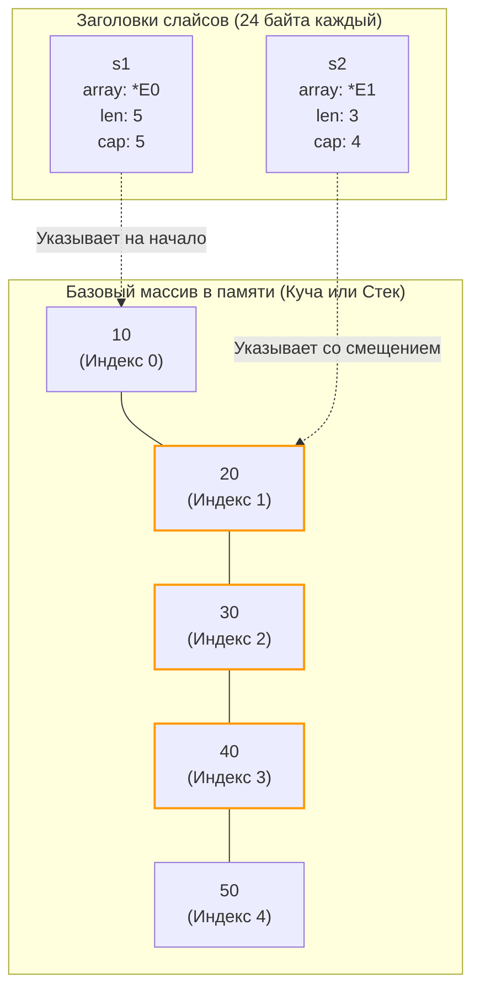

В прошлых статьях мы детально разобрали, как рантайм Go управляет памятью: от архитектуры стеков горутин до тонкостей конкурентного сборщика мусора. В главе [[19. Escape Analysis на практике. Как писать меньше аллокаций.md]] мы упоминали, что грамотное обращение со срезами (slices) способно спасти кучу от взрывного мусорообразования и бесконечных реаллокаций.

Слайсы — это, без сомнения, самая востребованная и вездесущая структура данных в Go. Однако именно они выступают неиссякаемым источником скрытых багов: от внезапного нежелательного изменения данных «где-то в недрах соседней функции» до катастрофических утечек памяти (Memory Leaks).

Чтобы писать надежный системный код, инженер должен навсегда перестать воспринимать слайс как классический «динамический массив». Слайс — это вовсе не массив. Это легковесный трехсловный дескриптор, подвижное «окно», сквозь которое мы смотрим на сырой непрерывный сегмент памяти.

---

## 1. Анатомия слайса: 24 байта

На уровне машинного кода (и в исходных файлах рантайма `src/runtime/slice.go`) слайс представляет собой элементарную структуру `slice` (в пользовательском коде исторически доступную через `reflect.SliceHeader`):

На любой 64-битной архитектуре заголовок слайса **всегда** занимает ровно **24 байта**, независимо от того, сколько элементов находится в его распоряжении — ноль, десять или миллиард:

```go
type slice struct {
	array unsafe.Pointer // Указатель на первый элемент базового массива (8 байт)
	len   int            // Текущая длина (8 байт)
	cap   int            // Вместимость (8 байт)
}
```

* **`array`:** Адрес в оперативной памяти (на стеке или в куче), где физически размещен первый доступный элемент базового массива.
* **`len` (Length):** Число элементов, которые мы непосредственно «видим» через наше текущее окно.
* **`cap` (Capacity):** Полная емкость — количество элементов, которое физически способно уместиться в базовом массиве, начиная от текущего адреса `array` и до конца непрерывно выделенного блока памяти.

### Массивы vs Слайсы

В языке Go присутствуют и настоящие массивы фиксированной длины (например, `[5]int`). Фиксированные массивы — это монолитные блоки памяти:
* Если вы присваиваете массив другой переменной (`a := b`), компилятор копирует **все его элементы** до единого.
* Если вы передаете фиксированный массив в функцию как аргумент, на стек функции копируется весь его физический объем. Передача массива на 1 МБ сожжет ровно 1 МБ стека горутины, спровоцировав вызов `morestack`.

Слайс — это легковесный заголовок над базовым массивом. Когда вы передаете срез в функцию по значению (`func process(s []int)`), процессор копирует **только 24 байта** заголовка (в современном Go через ABIInternal эти три поля передаются напрямую в регистрах CPU `RAX`, `RBX`, `RCX`). Сам базовый массив остается неподвижным в памяти.

---

## 2. Операция Slicing: Как двигается окно

Рассмотрим классический пример создания под-слайса:

```go
func main() {
    // Выделяем массив на 5 элементов
    // len = 5, cap = 5
    s1 := []int{10, 20, 30, 40, 50} 
    
    // Берем "под-слайс"
    s2 := s1[1:4] 
}
```

Что произошло в памяти при выполнении среза `s1[1:4]`?  
Новая память **не выделялась**. Элементы **не копировались**.

Рантайм лишь сконструировал новую 24-байтную структуру `s2` по жестким математическим правилам:
* `array` = адрес смещается на 1 элемент вперед (адрес `s1.array` + `1 * 8` байт).
* `len` = `4 - 1` = `3`.
* `cap` = `s1.cap - 1` = `4`.



Оба дескриптора смотрят в один и тот же участок физической памяти. Если вы выполните мутацию `s2[0] = 99`, то значение элемента `s1[1]` автоматически станет равным `99`, поскольку физически это одна и та же ячейка памяти.

> [!warning] Ловушка / Gotcha. Утечка памяти при парсинге
> Это одно из самых коварных последствий архитектуры срезов в Go.
> Представьте сценарий: сервис вычитывает в память большой файл логов:  
> `logData := make([]byte, 100*1024*1024)` (100 Мегабайт).
> Далее парсер находит в логе короткий идентификатор ошибки из 10 байт и возвращает его вызывающему коду:  
> `return logData[100:110]`
> 
> **Катастрофический результат:** Исходные 100 Мегабайт памяти **никогда не будут освобождены Сборщиком Мусора**! 
> Возвращенный 10-байтный срез хранит указатель `array`, ссылающийся внутрь 100-мегабайтного блока. Для GC весь гигантский базовый массив остается живым и достижимым.
> 
> **Решение:** Если требуется сохранить миниатюрный фрагмент из крупного массива, скопируйте его в изолированную память: используйте `bytes.Clone()` или `strings.Clone(string(logData[...]))`.

---

## 3. Магия append и Реаллокация

Встроенная функция `append` — это механизм, динамически расширяющий логические границы среза:

```go
s1 := make([]int, 0, 3) // len=0, cap=3
s1 = append(s1, 1)      // len=1, cap=3
s1 = append(s1, 2)      // len=2, cap=3
s1 = append(s1, 3)      // len=3, cap=3
```

До тех пор пока `len < cap`, операция `append` выполняется за $O(1)$ (константное время). Рантайм просто записывает новое значение по адресу `array + len*sizeof(T)` и возвращает обновленный дескриптор с инкрементированным `len`.

Но что произойдет при вызове `s1 = append(s1, 4)`? Свободное место в базовом массиве исчерпано (`len == cap`).  
В этот момент инициируется процедура **Реаллокации (Reallocation)**:
1. Аллокатор кучи выделяет **новый** непрерывный массив увеличенного объема.
2. Выполняется скоростное низкоуровневое копирование (инструкция `memmove`) всех старых элементов в новый блок памяти.
3. В конец нового массива записывается добавляемый элемент.
4. Создается и возвращается новый дескриптор `slice`, указатель `array` которого смотрит на свежевыделенную память, а старый отработанный массив отдается на утилизацию Garbage Collector.

### Mechanical Sympathy: Формула роста (Как меняется Capacity?)

Классический вопрос технических интервью: *«По какому закону увеличивается capacity среза при нехватке места?»*

Многие кандидаты цитируют старое правило: *«Размер удваивается до 1024 элементов, а затем увеличивается на 25%»*.

**Этот ответ устарел!** Начиная с версии Go 1.18 математическая модель функции роста (файл `runtime/slice.go`, внутренняя функция `growslice`) была кардинально модернизирована для обеспечения плавного экспоненциального перехода.

Современный алгоритм вычисляет емкость следующим образом:
1. Если требуемая новая вместимость (`cap`) превышает удвоенный старый размер (`doublecap`), выделяется точно запрошенная вместимость.
2. В противном случае, если старый `cap < 256` (в старых версиях порог составлял 1024), размер строго удваивается ($2 \times cap$).
3. Если же старый `cap >= 256`, размер плавно прирастает по формуле:
   `newcap += (newcap + 3*256) / 4`

Эта элегантная формула исключает резкий перепад градиента аллокаций (когда на 1024 элементах рост внезапно падал с $2x$ до $1.25x$). Теперь коэффициент сглаживания монотонно скользит от $2.0$ к $1.25$ по мере увеличения размера среза.

*Аппаратное примечание:* После вычисления теоретического `newcap` рантайм округляет требуемый размер в байтах до ближайшего класса размеров (**Size Classes**) аллокатора памяти `mcache` (см. [[21. Аллокатор памяти Go. mcache, mcentral, mheap.md]]). Поэтому итоговый `cap` на практике часто оказывается чуть больше математического значения.

> [!tip] Собеседование. Передача слайса по значению
> **Вопрос:** Что выведет следующий фрагмент программы?
> ```go
> func modify(s []int) {
>     s[0] = 99
>     s = append(s, 4)
> }
> func main() {
>     s := make([]int, 1, 3)
>     s[0] = 1
>     modify(s)
>     fmt.Println(s)
> }
> ```
> **Ответ:** Программа напечатает `[99]`.
> 
> **Почему `99` появилось в выводе?**  
> Слайс был передан по значению: скопировался 24-байтный заголовок. Указатель `array` внутри копии ссылается на тот же физический массив памяти. Операция `s[0] = 99` мутирует общую память.
> 
> **Почему не видно добавленного числа `4`?**  
> При вызове `append` внутри функции `modify` локальная копия заголовка получила значение `len = 2`. Однако эта локальная переменная была уничтожена на стеке при выходе из функции! Оригинальный заголовок `s` внутри `main` сохранил свой прежний `len = 1`. Он физически не видит четверку, хотя она лежит во 2-м слоте базового массива в памяти.  
> Именно поэтому `append` **всегда** возвращает обновленный дескриптор, и идиоматичный код Go требует переприсваивания: `s = append(s, ...)`.

---

## 4. Паттерн Full Slice Expression (Ограничение Capacity)

Что делать, если вам необходимо передать срез в стороннюю функцию или внешнюю библиотеку, но вы хотите железно гарантировать, что чужой код не затрет ваши последующие элементы через неаккуратный `append`?

В Go предусмотрен синтаксис трех-индексного среза: `[low:high:max]`.

```go
func main() {
    base := []int{1, 2, 3, 4, 5} // len=5, cap=5
    
    // Обычный срез: len=2, cap=5. 
    // Если чужой код сделает append, он перезапишет тройку в base!
    unsafeSlice := base[0:2] 
    
    // Полный срез: len=2, cap=2.
    safeSlice := base[0:2:2] 
}
```

Установив параметр `max` равным значению `high` (`base[0:2:2]`), мы искусственно приравниваем `cap` нового слайса к его `len`. 
Если вызываемая функция попытается выполнить операцию `append(safeSlice, 99)`, у нее не окажется свободной емкости. Сработает штатная Реаллокация: рантайм выделит новый изолированный блок памяти, скопирует элементы `1, 2` и запишет `99`. Ваш оригинальный срез `base` гарантированно останется в целости и сохранности!

---

## 5. Очистка слайса (Memory leaks)

Если в базовом массиве слайса хранятся указатели (например, срез `[]*User`), и вы удаляете элементы путем уменьшения `len`, сборщик мусора **не сможет освободить** исключенные объекты! Базовый массив продолжает удерживать физические ссылки на них за пределами видимого окна.

**Ошибочный подход:**
```go
// Удаляем первый элемент срезом
s = s[1:] 
// GC не освободит s[0], так как базовый массив все еще держит физический указатель!
```

**Mechanical Sympathy (Корректный подход):**  
До появления Go 1.21 инженеры обнуляли ссылку вручную:
```go
s[0] = nil
s = s[1:]
```

Начиная с версии Go 1.21 в стандартном пакете `slices` появилась официальная функция:
```go
import "slices"
s = slices.Delete(s, 0, 1)
```
Она под капотом аккуратно сдвигает оставшиеся элементы влево и принудительно зануляет освободившийся хвост массива (через встроенную функцию `clear`), позволяя Сборщику Мусора своевременно вернуть память отброшенных объектов.

---

## Итог

1. **Слайс — это не массив.** Это компактный 24-байтный дескриптор, состоящий из указателя `array`, длины `len` и емкости `cap`.
2. Операции среза (`s[a:b]`) не аллоцируют память и не копируют данные: они лишь конструируют новый заголовок, нацеленный на тот же базовый массив.
3. Удержание миниатюрного среза из огромного массива парализует работу GC для всего массива. Используйте `bytes.Clone()` или `strings.Clone()`.
4. В Go 1.18+ формула роста `append` обеспечивает плавный переход от множителя $2.0$ к $1.25$ после преодоления порога в 256 элементов.
5. Передача слайса в функцию копирует только 24 байта заголовка. Мутация элементов по индексам изменит исходный массив, но изменения `len/cap` (через `append`) оригинал не затронут.
6. Для защиты срезов от побочных эффектов `append` применяйте трех-индексные срезы `[low:high:max]`.

Мы разобрались с базовой структурой слайса и узнали, что это всего лишь 24-байтное «окно» в память. Но мы лишь вскользь затронули самый ресурсоемкий и опасный процесс — увеличение этого окна. Как именно рантайм выделяет новую память, копирует гигабайты данных и какие ловушки скрываются за безобидной функцией `append`? 

В следующей статье мы разберем механику роста слайсов под микроскопом:
[[30. Рост slice. append, realloc и copy.md]]