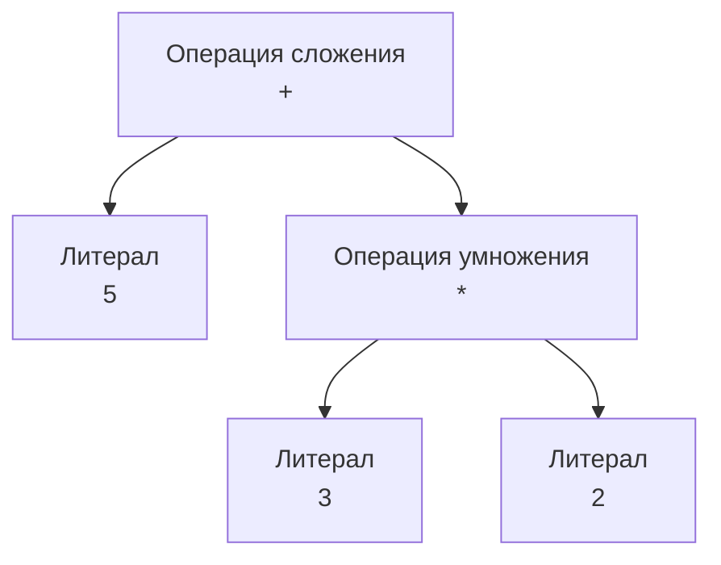

В предыдущей лекции мы познакомились с общей архитектурой AOT-компилятора Go. Теперь снимем защитный кожух и проследим, как исходный код шаг за шагом проходит через первую половину производственного конвейера — от сырого текста до структурированного промежуточного представления (Intermediate Representation, IR), готового к глубоким оптимизациям.

Этот начальный этап компиляции традиционно называется **Frontend**. Его главная обязанность — прочесть текст, разобрать грамматику, проверить семантические правила языка и гарантировать, что написанный программистом код имеет строгий математический смысл. В современном компиляторе Go работа фронтенда сосредоточена в пакетах `cmd/compile/internal/syntax` (лексер и синтаксический парсер) и `cmd/compile/internal/types2` (проверка типов).

---

## 1. Лексический анализ (Lexer / Scanner)

Процессор физически не знает слов `func`, `select` или `struct`. Для кремниевого кристалла и операционной системы исходный код на Go — это просто линейный массив байт в кодировке UTF-8, лежащий на накопителе. Первая задача компилятора — превратить неструктурированный поток символов в упорядоченную последовательность атомарных смысловых единиц. Этим занимается **Лексер** (Lexer), или сканер (`syntax.scanner`).

Лексер представляет собой конечный автомат (FSM), который считывает входящие руны символ за символом и группирует их в **токены** (Tokens).

Рассмотрим простую строку кода:

```go
a := 5 + 3
```

Лексер распознает в ней пять независимых токенов:
1. `IDENT("a")` — идентификатор имени переменной;
2. `DEFINE` — оператор краткого объявления `:=`;
3. `INT("5")` — целочисленный числовой литерал;
4. `ADD` — арифметический оператор сложения `+`;
5. `INT("3")` — целочисленный числовой литерал.

Помимо распознавания символов, лексер выполняет важнейшую скрытую работу — очищает код от комментариев и пробельных символов, сохраняя точные координаты (номер строки и позицию в столбце) каждого токена. Эти координаты сохраняются на протяжении всей компиляции, чтобы при ошибке сборки или панике в рантайме показать программисту точное место в исходнике.

> [!warning] Ловушка / Gotcha: Автоматическая вставка точек с запятой
> 
> В коде на Go программисты практически не ставят точки с запятой `;` в конце строк, хотя формальная грамматика языка (унаследованная от C/B) строго требует разделения инструкций символом `;`. Как разрешается это противоречие?  
> **Лексер вставляет точки с запятой автоматически прямо на лету!**
> 
> Правило компилятора предельно простое: если строка заканчивается токеном, который может легитимно завершать инструкцию (идентификатор, числовой или строковый литерал, ключевые слова `break`, `continue`, `fallthrough`, `return`, либо закрывающая скобка `)`, `]`, `}`), сканер при обнаружении символа переноса строки `\n` автоматически подставляет невидимый токен `;`.
> 
> Именно из-за этого правила в Go синтаксически запрещено переносить открывающую фигурную скобку `{` на новую строку:
> 
> ```go
> // ОШИБКА: Лексер автоматически вставит ';' сразу после cond!
> if cond 
> {
>     doSomething()
> }
> ```
> 
> Парсер увидит инструкцию `if cond;` и выдаст синтаксическую ошибку `syntax error: unexpected semicolon or newline before {`. Открывающая скобка `{` обязана находиться на той же строке.

---

## 2. Синтаксический анализ (Parser)

Поток токенов лишен иерархической структуры. Лексер зафиксировал, что токены `a`, `+`, `b` следуют друг за другом, но он не понимает контекста: является ли это частью вызова функции, условием цикла `for` или возвратом значения из метода.

Эту задачу решает **Парсер** (`syntax.parser`). Он считывает поток токенов и трансформирует их в древовидную структуру — **Абстрактное Синтаксическое Дерево (AST — Abstract Syntax Tree)**.

Компилятор Go использует классический **рекурсивный нисходящий парсер** (Recursive Descent Parser) с операторным предшествованием (Operator Precedence). Он рекурсивно обходит грамматические конструкции, конструируя в памяти дерево узлов (Node). Каждый узел представляет конкретный языковой элемент: объявление типа (`syntax.TypeDecl`), оператор ветвления (`syntax.IfStmt`) или бинарное выражение (`syntax.Operation`).

Например, для классического арифметического выражения `5 + 3 * 2` парсер с учетом приоритетов умножения и сложения построит дерево, где умножение вычисляется раньше сложения:



Дерево AST отражает точную вложенность выражений, изолируя алгоритмическую логику от синтаксических деталей (пробелов, переносов строк и запятых).

---

## 3. Проверка типов (Type Checking)

Получив дерево AST, компилятор знает, что код синтаксически безупречен (скобки сбалансированы, ключевые слова расставлены верно). Однако программа вполне может содержать грубые логические бессмыслицы: попытку сложить срез со строкой, передачу четырех аргументов в функцию с двумя параметрами или вызов несуществующего метода.

За валидацию логики отвечает подсистема **Type Checking** (пакет `cmd/compile/internal/types2`). На этом этапе выполняются фундаментальные проверки:

1. **Разрешение типов (Type Resolution):**  
   Компилятор сопоставляет имена идентификаторов с таблицей символов текущего пакета и импортов. Каждому узлу AST приписывается строгий тип (`int64`, `string`, указатель или пользовательская `struct`).
2. **Проверка интерфейсов:**  
   Компилятор проверяет, реализует ли переданная структура контракт интерфейса: присутствуют ли все объявленные методы с совпадающими сигнатурами аргументов и возвращаемых значений.
3. **Monomorphization и Stenciling (Дженерики):**  
   При использовании обобщенного кода (Generics) компилятор генерирует специализированные реализации функций под конкретные типы аргументов. В отличие от Java, где работает стирание типов (Type Erasure), требующее упаковки примитивов в объекты на куче, Go использует гибридный подход: для типов одинакового размера в памяти (GCshape, например все указатели) генерируется одна общая функция с передачей словаря типов, а для примитивов (`int`, `float64`) создаются мономорфные специализированные копии. Это предотвращает накладные расходы на Interface Boxing и сохраняет предельный темп работы CPU.
4. **Escape Analysis (Анализ побега):**  
   Компилятор исследует направленный граф потока значений, определяя время жизни каждой переменной. Если переменная не покидает фрейм стека текущей функции, она аллоцируется на дешевом стеке без участия GC (подробнее см. [[18. Escape Analysis. Почему переменная ушла в heap]]).

> [!tip] Собеседование
> 
> **Вопрос:** Почему в Go можно написать `time.Duration(2) * time.Second`, но нельзя умножить `int(2)` на `time.Second`, хотя `time.Duration` — это `int64` под капотом?
> 
> **Ответ:** Причина кроется в фундаментальном понятии **Untyped Constants** (нетипизированные константы).  
> Числовой литерал `2` в исходном тексте не имеет жесткого машинного типа — он представляет собой нетипизированную константу произвольной точности. Type Checker видит, что нетипизированная двойка участвует в операции с типом `time.Duration`, и неявно приводит ее к `time.Duration` прямо на этапе компиляции.  
> Однако если мы берем строго типизированное значение `int(2)`, система типов Go категорически запрещает умножение разных типов (`int` и `time.Duration`), даже если их базовая структура в памяти идентична (`int64`). Для компиляции требуется явное приведение типов: `time.Duration(2) * time.Second`.

### Constant Folding (Свертка констант)

Прямо во время проверки типов компилятор выполняет ключевую оптимизацию — **Constant Folding** (свертку констант). Если в коде встречаются математические операции между константами, компилятор производит все вычисления во время сборки.

Например, строка:

```go
seconds := 60 * 60 * 24
```

никогда не будет умножаться регистрами процессора во время выполнения программы на сервере. В сгенерированном машинном коде `seconds` сразу получит константное значение `86400`. Это хрестоматийный пример Mechanical Sympathy: мы экономим драгоценные такты процессора в рантайме, перенося вычислительную нагрузку на фазу компиляции.

---

## 4. Переход от AST к SSA (Генерация IR)

К завершению фазы Type Checking компилятор оперирует полностью проверенным, типизированным синтаксическим деревом (Typed AST). Однако дерево AST отражает структуру исходного текста, а не физическую логику выполнения инструкций процессором. На дереве AST крайне сложно реализовать вынос инвариантов за пределы цикла, регистровое распределение или удаление неиспользуемых вычислений.

Поэтому модуль генерации промежуточного кода (`cmd/compile/internal/ssagen`) конвертирует Typed AST в плоский ориентированный граф — **SSA (Static Single Assignment)**.

Главное математическое правило SSA-формы: **каждое значение присваивается переменной ровно один раз**.

Если в исходном Go-коде программист пишет привычные мутирующие операции:

```go
x := 1
x = x + 2
x = x * 3
```

то генератор SSA создаст три строго изолированных иммутабельных значения:

```asm
v1 = const 1
v2 = add v1, const 2
v3 = mul v2, const 3
```

Создавая новые иммутабельные версии (`v1`, `v2`, `v3`), компилятор формирует явный Граф Потока Данных (Data Flow Graph). Если в дальнейшем коде значение `v2` нигде не читается (например, `x` был сразу перезаписан константой), компилятор моментально выявляет этот факт и применяет **Dead Code Elimination**, полностью вырезая инструкцию сложения из финального бинарника.

---

## Итог фронтенда компиляции

1. **Лексер (Scanner):** считывает массив байт UTF-8, преобразует его в поток именованных токенов и незаметно подставляет точки с запятой в концах строк.
2. **Парсер (Parser):** строит из плоского потока токенов иерархическое Абстрактное Синтаксическое Дерево (AST) с учетом приоритета операторов.
3. **Type Checker:** выполняет разрешение типов, строгую проверку контрактов интерфейсов, свертку констант (Constant Folding) и инстанцирование обобщенных типов (дженериков).
4. **Генератор SSA (`ssagen`):** трансформирует высокоуровневое синтаксическое дерево в ориентированный граф иммутабельных значений SSA.

На этой границе исходный текст на Go окончательно прекращает свое существование, превращаясь в универсальный математический граф потока вычислений. В следующей лекции мы детально изучим, какие оптимизационные проходы компилятор совершает над SSA-графом, чтобы заставить наш код летать на физическом железе:

Переходим к: [[4. SSA в Go. Как компилятор оптимизирует код]].