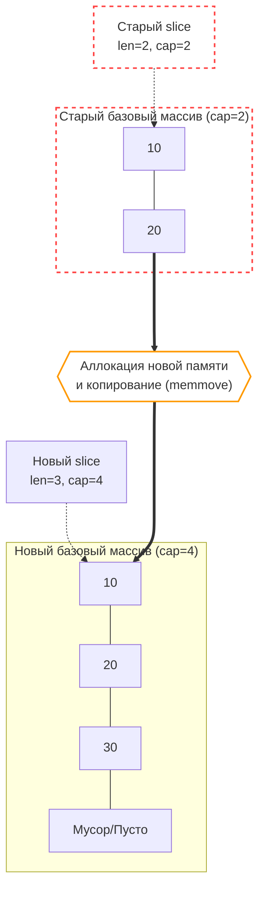

В предыдущей главе ([[29. Внутреннее устройство slice.md]]) мы деконструировали срез Go до элегантного 24-байтного дескриптора (`array`, `len`, `cap`). Мы увидели, что операции взятия под-среза (`s[1:4]`) работают за константное время $O(1)$ и совершенно не требуют выделения новой памяти.

Однако современный сервер редко оперирует статическими структурами неизменного объема. Мы непрерывно вычитываем строки из базы данных, формируем динамические JSON-ответы, буферизуем входящие сетевые пакеты. Для плавного расширения коллекций язык Go предоставляет встроенную функцию `append`.

Начинающему разработчику `append` часто кажется элементарной синтаксической «магией», делающей массив бесконечным. Но для опытного инженера `append` — это потенциальная точка падения производительности и скрытых аллокаций. Чтобы писать предсказуемый и быстрый код, необходимо четко понимать: в какой момент `append` выполняется за считанные наносекунды, а когда превращается в тяжелую операцию с переключением контекстов аллокатора кучи, векторным копированием памяти и долговой нагрузкой на Сборщик Мусора.

---

## 1. Fast Path: append без аллокаций

Если в базовом массиве еще остается свободное место (то есть текущая длина `len` строго меньше выделенной вместимости `cap`), `append` идет по предельно оптимизированному «быстрому пути» (Fast Path).

```go
s := make([]int, 0, 5) // len=0, cap=5
s = append(s, 42)      // Fast path!
```

На уровне компилятора и рантайма здесь не происходит вызова никаких сложных внешних функций. Компилятор Go инлайнит (встраивает) этот фрагмент непосредственно в точку вызова, превращая операцию в элементарную арифметику указателей:
1. Вычисляется целевой адрес свободной ячейки: `ptr = s.array + s.len * sizeof(int)`.
2. По вычисленному адресу напрямую записывается значение `42`.
3. Возвращается обновленная структура `slice`, в которой `len` увеличен на единицу, а поля `array` и `cap` сохраняют свои прежние значения.

Эта операция занимает буквально **несколько тактов процессора**. Она не тревожит аллокатор кучи, не порождает мусора и исполняется целиком в горячих кэшах L1/L2 процессора.

---

## 2. Slow Path: Реаллокация (Reallocation)

Аппаратная катастрофа (в микро-масштабах наносекунд) наступает в тот момент, когда мы вызываем `append`, а свободного места в базовом массиве больше не осталось (`len == cap`).

```go
s := make([]int, 2, 2) // len=2, cap=2
s[0], s[1] = 10, 20
s = append(s, 30)      // Slow path! Реаллокация!
```

Поскольку за границами текущего спана может располагаться чужая память, компилятор не может просто «дописать» элемент в конец. Рантайм вынужден активировать медленный путь и вызвать тяжелую функцию `runtime.growslice`.

Внутри `growslice` разворачивается многоступенчатый конвейер:
1. **Расчет нового размера:** Рантайм вычисляет, какой объем `cap` потребуется для нового расширенного слайса (по специальной формуле роста).
2. **Аллокация:** Рантайм обращается к аллокатору памяти (к структурам `mcache` или `mcentral`, см. [[21. Аллокатор памяти Go. mcache, mcentral, mheap.md]]) и запрашивает выделение совершенно нового, непрерывного блока памяти требуемого калибра.
3. **memmove (Копирование):** Рантайм берет исходные данные (`10` и `20`) и побайтово копирует их из старого буфера в новый. Для этого задействуется высокооптимизированная низкоуровневая ассемблерная функция `runtime.memmove`, использующая векторные регистры процессора (AVX/SIMD) для блочной пересылки данных.
4. **Запись нового элемента:** По смещению старого `len` в свежую память записывается добавляемый элемент `30`.
5. **Мусор:** Старый базовый массив теряет ссылку и превращается в отработанный мусор, который в скором времени будет утилизировать Garbage Collector.



> [!warning] Ловушка / Gotcha. Инвалидация указателей
> Представьте сценарий: у вас был срез, и вы сохранили прямой указатель на один из его элементов: `ptr := &s[0]`. Затем в оригинальной горутине выполняется вызов `s = append(s, 42)`, который спровоцировал реаллокацию.
> Что произойдет с `ptr`?
> Он продолжит указывать на **старый, осиротевший** блок памяти! Срез `s` физически переехал по совершенно новому адресу, а ваш указатель остался смотреть на покинутый массив. Любые последующие модификации по адресу `ptr` больше никогда не отразятся на элементах слайса `s`.

---

## 3. Математика роста: От 2x к плавному переходу (Go 1.18+)

Если бы при каждом переполнении рантайм выделял память ровно под один дополнительный элемент, то тривиальный цикл:
```go
for i := 0; i < 1000; i++ { 
    s = append(s, i) 
}
```
потребовал бы 1000 последовательных аллокаций и 1000 физических копирований всего содержимого. Временная сложность тривиального наполнения массива деградировала бы до квадратичной: $O(N^2)$.

Чтобы амортизировать вычислительную стоимость копирования, рантайм выделяет емкость с запасом. 

До релиза Go 1.18 действовало историческое правило: строго удваивать вместимость (`cap * 2`), пока число элементов не превысит 1024, а после преодоления этого порога прибавлять по 25%.

**Начиная с Go 1.18 алгоритм был модернизирован**, чтобы устранить ступенчатый перепад кривой аллокаций.

Современная процедура `growslice` действует по следующей математической логике:
1. Вычисляется удвоенная исходная емкость: `doublecap = old.cap + old.cap`.
2. Если запрошенная новая вместимость превышает `doublecap` (например, `append(s, make([]int, 1000)...)` к пустому слайсу), рантайм сразу выделяет запрошенный объем.
3. В противном случае, если старая вместимость **меньше 256** элементов (вместо старого порога в 1024), емкость строго удваивается: `newcap = doublecap`.
4. Если же текущая вместимость `cap >= 256`, размер плавно наращивается по формуле:
   $$newcap = newcap + \frac{newcap + 3 \times 256}{4}$$
   Этот шаг циклически повторяется до тех пор, пока `newcap` не покроет требуемое число элементов.

Эта изящная формула обеспечивает непрерывный переход: для небольших слайсов множитель расширения составляет честные $2.0x$, а по мере приближения к крупным массивам плавно и асимптотически стремится к $\approx 1.25x$, минимизируя нерациональный расход памяти.

---

## 4. Скрытый хак: Size Classes и выравнивание памяти

На глубоких технических интервью часто предлагают разобрать следующий неочевидный код:

```go
func main() {
    s := make([]int, 0) // cap = 0
    s = append(s, 1)    // len = 1, cap = 1 (всё логично)
    s = append(s, 2)    // len = 2, cap = 2 (удвоилось)
    s = append(s, 3)    // len = 3, требуемый cap = 4. А какой будет реальный?
    
    fmt.Println(cap(s)) // Выведет 4? Нет! 
}
```

Чтобы объяснить наблюдаемое поведение, необходимо вспомнить архитектуру многоуровневого аллокатора (`mcache` из главы [[21. Аллокатор памяти Go. mcache, mcentral, mheap.md]]).

Аллокатор рантайма Go принципиально не умеет выделять произвольное число байт. Он оперирует строго фиксированными классами размеров (Size Classes): 8, 16, 24, 32, 48, 64, 80 байт и далее вплоть до 32 КБ.

Проследим судьбу среза из 3 целых чисел (на 64-битной платформе `int` занимает ровно 8 байт):
1. Формула роста говорит: «Прежний cap=2, удваиваем — требуется `cap=4`».
2. Для размещения 4 целых чисел необходимо: $4 \times 8 = 32$ байта памяти.
3. Рантайм заглядывает в таблицу Size Classes: размер 32 байта существует в сетке классов. Аллокатор выдает блок ровно на 32 байта, и вместимость фиксируется как **4**.

А теперь рассмотрим случай, когда тип элементов — `int32` (размер 4 байта):
1. У нас было 2 элемента `int32`. Мы добавляем третий.
2. Формула требует вместимости `cap=4`.
3. Для 4 элементов требуется: $4 \times 4 = 16$ байт.
4. В сетке классов размеров присутствует класс 16 байт. Итоговая вместимость составит ровно **4**.

**Но что произойдет, если размер структуры равен, к примеру, 5 байтам?**
1. Исходная вместимость была `cap=2`. Формула запрашивает `cap=4`.
2. Требуемый физический объем: $4 \times 5 = 20$ байт.
3. Аллокатор обращается к сетке Size Classes: доступные размеры — 8, 16, 24, 32 байта. Ближайший подходящий размер — **24 байта**.
4. Рантайм выделяет блок размером 24 байта.
5. Сколько структур по 5 байт способно разместиться в блоке на 24 байта? $24 / 5 = 4.8$, то есть ровно **4** полноценных экземпляра (а 4 байта уйдут во внутреннюю фрагментацию — Internal Fragmentation). Вместимость составит 4.

**Инженерный секрет:** Из-за дискретного округления под классы размеров аллокатора (Size Classes) фактическая вместимость `cap` после выполнения `append` нередко оказывается **больше**, чем предсказывает математическая формула роста! Рантайм просто задействует излишек выделенного слота памяти и бесплатно отдает его в распоряжение вашего среза.

---

## 5. Встроенная функция copy

Наряду с `append`, в Go существует низкоуровневая встроенная функция блочного копирования:
```go
copy(dst, src []T) int
```

```go
src := []int{1, 2, 3}
dst := make([]int, len(src))
copied := copy(dst, src) // Скопирует 3 элемента, вернет 3
```

Ключевые свойства `copy`, обязательные для понимания:
1. **Нулевые аллокации:** `copy` никогда не запрашивает память в куче и не модифицирует `len/cap` дескрипторов. Она копирует ровно столько элементов, сколько способно уместиться в меньшем из двух срезов: `min(len(dst), len(src))`.
2. **Безопасное перекрытие памяти (Overlapping):** `copy` абсолютно надежна, даже если `dst` и `src` представляют собой взаимно перекрывающиеся диапазоны одного и того же базового массива (например, `copy(s[1:], s[:3])`). Под капотом рантайм вызывает процедуру `runtime.memmove`, которая предварительно определяет взаимное направление сдвига и исключает затирание исходных данных.
3. **Прямое копирование строк в байты:** Конструкция `copy(byteSlice, myString)` выступает официальным и наиболее производительным способом скопировать неизменяемую строку `string` в изменяемый буфер `[]byte` без промежуточных аллокаций.

---

## 6. Mechanical Sympathy: Пишем быстрый код

Сформулируем золотые правила эффективного обращения со срезами:

### Правило 1: Pre-allocation (Предварительная аллокация)
Это незыблемое правило номер один для бэкенда на Go. Если вы наполняете срез в цикле и способны хотя бы приблизительно оценить конечное количество записей — всегда инициализируйте срез через `make` с явным указанием `capacity`.

**Неэффективно (каскад реаллокаций в куче, шторм мусора для GC):**
```go
var ids []string
for _, user := range users {
    ids = append(ids, user.ID)
}
```

**Mechanical Sympathy (ровно 1 аллокация, скорость выше в 10–20 раз):**
```go
ids := make([]string, 0, len(users)) // Резервируем capacity сразу!
for _, user := range users {
    ids = append(ids, user.ID) // Отрабатывает строго по Fast Path
}
```

### Правило 2: Nil slice vs Empty slice
Необходимо четко различать два состояния пустого слайса:

```go
var s1 []int         // s1 == nil. len=0, cap=0, array=nil
s2 := make([]int, 0) // s2 != nil. len=0, cap=0, array=0xMemoryAddress
```

С точки зрения последующих операций `append` они ведут себя эквивалентно (обе структуры выделят новый массив при первой вставке). Однако при сериализации `json.Marshal(s1)` вернет значение `null`, тогда как `json.Marshal(s2)` сгенерирует пустой массив `[]`.

Кроме того, выражение `make([]int, 0)` создает скрытую псевдо-аллокацию: рантайм присваивает указателю `array` глобальный адрес `runtime.zerobase` (специальный маркер для объектов нулевого размера). Всегда предпочитайте `var s []int`, если слайс может остаться пустым.

### Правило 3: Обрезка слайса для пула
Если вы организуете повторное использование срезов через `sync.Pool` (см. [[23. sync_pool под капотом.md]]), вы обязаны сбрасывать длину до нуля, сохраняя накопленную емкость:

```go
// Сброс длины с сохранением дорогостоящей capacity!
s = s[:0] 

// Затирание хвостов (начиная с Go 1.21), предотвращающее удержание чужих указателей
clear(s)  
```

---

## Итог

1. **Fast Path:** Вызов `append` работает за константное время $O(1)$ и не обращается к аллокатору, пока длина строго меньше вместимости (`len < cap`).
2. При исчерпании `cap` активируется процедура **реаллокации**: выделение нового непрерывного блока памяти, векторное копирование старых данных через `memmove` и появление брошенного мусора для GC.
3. Закон роста срезов стал непрерывным с релиза Go 1.18: удвоение действует только до порога в **256 элементов**, после чего скорость расширения плавно амортизируется к коэффициенту $\approx 1.25x$.
4. Реальная вместимость после `append` часто превышает расчетную из-за квантования памяти по **Size Classes** аллокатора кучи.
5. Предварительная аллокация (`make(T, 0, cap)`) — главный инструмент оптимизации памяти в Go, избавляющий от каскадных реаллокаций в горячих циклах.

Срезы представляют собой непрерывную, линейную и невероятно быструю память. Однако они бессильны, когда требуется поиск по произвольным ключам. Для решения этой задачи рантайм Go предлагает встроенные ассоциативные хэш-таблицы (`map`).

Внутреннее устройство мапы в Go — это сложнейший механизм с бакетами, разрешением коллизий, генерацией хэшей на лету и алгоритмом инкрементальной эвакуации, не блокирующим исполнение программы.

В следующей главе мы разберем анатомию хэш-таблиц Go:
[[31. Внутреннее устройство map. hmap, bucket, overflow.md]]