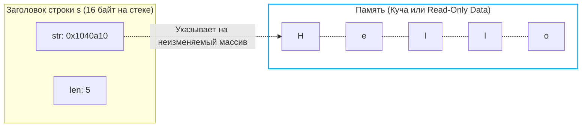
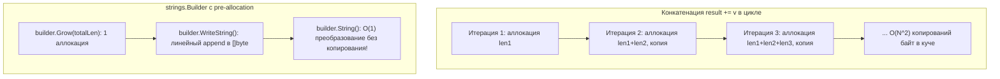

В прошлой статье ([[33.1. sync_map под капотом. Read и dirty словари.md]]) мы погрузились в мир lock-free программирования и конкурентных словарей. 
Большинство ключей в мапах, логов и JSON-ответов бэкенда — это текст. 

Строки (`string`) в Go кажутся самым привычным и безобидным типом данных. Мы склеиваем их плюсиками, передаем в функции как аргументы и парсим регулярными выражениями. Но с точки зрения рантайма, процессорного конвейера и аллокатора памяти, строка — это мина замедленного действия. 

Непонимание того, как устроены строки, приводит к скрытым OOM (Out Of Memory), повреждению многобайтовых символов (кракозябры), невидимым аллокациям в куче и тяжелым просадкам производительности при банальной конкатенации. Пришло время разобрать анатомию текста в Go с позиций системного программирования.

---

## 1. Анатомия строки: 16 байт

В классическом языке C строка — это просто непрерывный массив байтов, оканчивающийся нулевым байтом (`\0`). Чтобы узнать длину такой строки, процессору нужно пройти её от начала до конца через `strlen()`, тратя $O(N)$ тактов и рискуя выйти за границы памяти при отсутствии терминирующего нуля (источник сотен тысяч уязвимостей переполнения буфера).

Создатели Go (Кен Томпсон и Роб Пайк) пошли по пути так называемых «длинных строк» (Pascal-style strings), но оформили их в виде компактного двухсловного дескриптора. 

Как мы помним из [[29. Внутреннее устройство slice.md]], слайс занимает 24 байта (Pointer, Length, Capacity).  
Строка — это «младший брат» слайса. На 64-битной архитектуре заголовок строки (исторически `reflect.StringHeader`, а во внутренностях рантайма — структура `stringStruct`) всегда занимает ровно **16 байт** (два машинных слова по 8 байт).

```go
// Внутреннее представление строки в рантайме Go (src/runtime/string.go)
type stringStruct struct {
	str unsafe.Pointer // Указатель на первый байт массива (8 байт)
	len int            // Длина в БАЙТАХ (8 байт)
}
```

Чего здесь не хватает по сравнению со слайсом? **Вместимости (`cap` / Capacity).**  
Строке не нужна вместимость, потому что строки в Go **абсолютно иммутабельны (неизменяемы)**. Их нельзя расширить (append) на месте, им нельзя изменить внутренние элементы. 



### Зачем нужна иммутабельность?

Многие разработчики, пришедшие из C или PHP, поначалу удивляются: *«Почему я не могу сделать `str[0] = 'a'`?»*. 

Иммутабельность дает три фундаментальных преимущества:
1. **Thread-safety (Потокобезопасность):** Миллион горутин могут одновременно читать одну и ту же строку без единого мьютекса или атомика. Данные никогда не изменятся под капотом, и гонка данных (Data Race) физически невозможна.
2. **Идеальный ключ для map:** Хэш строки вычисляется на основе её байтов. Если бы строку можно было изменить после вставки в мапу, её хэш бы изменился, она оказалась бы «не в том бакете», и мы бы потеряли элемент навсегда.
3. **Совместное использование памяти (Sharing) и нулевая цена копирования:** Передача строки в функцию как параметра копирует всего 16 байт заголовка (два регистра CPU `RAX` и `RBX` в Go ABIInternal), независимо от того, весит ли сама строка 5 байт или 5 гигабайт!
4. **Сегмент `.rodata`:** Строковые литералы, жестко прописанные в исходном коде (например, `"hello"`), компилятор помещает в сегмент констант бинарника (`.rodata`). Эти страницы памяти защищены аппаратным флагом процессора (Read-Only). Они загружаются ядром ОС в память один раз и вообще не расходуют кучу. Попытка записать байт по такому адресу через `unsafe` приведет к немедленному аппаратному прерыванию CPU `SIGSEGV` (Segmentation Fault).

---

## 2. Ловушка UTF-8: Байты против Рун

Это один из самых частых вопросов на собеседованиях любого уровня.

В Go **строка — это просто неизменяемый срез произвольных байт**. Рантайму абсолютно всё равно, что там лежит: текст, бинарный payload, сжатый gzip или кусок картинки. Никакой валидации при создании строки рантайм не выполняет.

Но *по умолчанию* исходный код Go и вся стандартная библиотека предполагают, что текст закодирован в **UTF-8**. Это неудивительно: саму кодировку UTF-8 Кен Томпсон и Роб Пайк разработали в 1992 году на салфетке в кафетерии для операционной системы Plan 9 в стенах Bell Labs!

В кодировке UTF-8:
* Символы стандартной таблицы ASCII (английские буквы, цифры, знаки препинания) кодируются ровно **1 байтом** (старший бит равен `0`).
* Символы кириллицы, греческого, арабского алфавитов занимают **2 байта**.
* Символы иероглифических письменностей (китайский, японский) занимают **3 байта**.
* Редкие символы, исторические алфавиты и эмодзи (например, 🚀 или 🤖) занимают **4 байта**.

```go
func main() {
    s := "Привет"
    fmt.Println(len(s)) // Выведет 6? НЕТ! Выведет 12!
}
```

Функция `len(s)` возвращает **количество байт**, а не количество символов. Слово «Привет» (6 букв) в UTF-8 занимает 12 байт, потому что каждая кириллическая буква кодируется парой байтов.

```
Слово:    П       р       и       в       е       т
Байты: [d0 9f] [d1 80] [d0 b8] [d0 b2] [d0 b5] [d1 82]
Индекс: 0   1   2   3   4   5   6   7   8   9   10  11
```

### Как получить количество символов?

Символ (Unicode Code Point) в Go называется **`rune`** (руна, которая является алиасом для целочисленного типа `int32`).

**Плохой способ (лишняя аллокация в куче):**
```go
runes := []rune("Привет") // Конвертация выделяет новый массив int32 в куче!
fmt.Println(len(runes))   // 6. Верно, но мы сожгли CPU и память на аллокацию 24 байт.
```

**Mechanical Sympathy (быстрый способ без аллокаций):**
```go
import "unicode/utf8"

count := utf8.RuneCountInString("Привет") // 6. Работает за O(N) без аллокаций!
```
Функция `utf8.RuneCountInString` просто сканирует байты строки по маске UTF-8 в регистрах процессора, подсчитывая стартовые байты символов без выделения памяти в куче.

> [!warning] Ловушка / Gotcha. Обрезка многобайтовых строк
> Если вы сделаете `s := "Привет"[:3]`, вы не получите «При». Вы «отпилите» первые 3 байта. 
> Буква «П» (`[d0 9f]`, 2 байта) влезет целиком, а от буквы «р» (`[d1 80]`, 2 байта) останется только сиротливый первый байт `[d1]`. 
> При попытке вывести такую строку в терминал или отправить по сети вы увидите кракозябру — символ замены `` (Unicode Replacement Character `U+FFFD`), потому что байтовая последовательность перестала быть валидным UTF-8!
> Для безопасной обрезки по символам нужно использовать функции пакета `utf8` или предварительно декодировать руны.

---

## 3. Взятие подстроки (Slicing) и Утечки памяти

Взятие подстроки `s2 := s1[0:5]` работает так же дешево, как со слайсами. **Новая память не аллоцируется**. Рантайм просто создает новый 16-байтный заголовок на стеке, где поле `str` указывает на исходный байтовый массив, а поле `len` равно новому размеру.

И в этом механизме кроется классическая ловушка утечки памяти (Memory Leak):

```go
func extractID(logLine string) string {
    // logLine весит 10 Мегабайт (например, гигантская JSON-строка)
    // Мы возвращаем строку из 5 байт:
    return logLine[10:15] 
}
```

Сборщик мусора (GC) работает с блоками памяти целиком. Он видит, что возвращенная строка `extractID` всё ещё содержит указатель `str`, ссылающийся внутрь того самого 10-мегабайтного блока памяти. 

В результате сборщик мусора **не удалит** 10-мегабайтный лог из памяти! Ваш крошечный 5-байтный возвращенный `string` держит в заложниках весь огромный массив кучи. Если вы обработаете 1 000 таких логов и сохраните ID в мапу, ваше приложение съест 10 гигабайт памяти вместо 5 килобайт.

**Решение (Go 1.18+):**
```go
import "strings"

func extractID(logLine string) string {
    return strings.Clone(logLine[10:15]) 
}
```
Функция `strings.Clone` принудительно аллоцирует в куче ровно 5 байт и побайтово копирует туда данные, полностью отвязываясь от оригинального гигантского массива. Старый 10-мегабайтный буфер спокойно утилизируется сборщиком мусора.

---

## 4. Конкатенация (Склеивание)

Поскольку строки иммутабельны, базовая операция `a + b` **всегда** выделяет новый блок памяти размером `len(a) + len(b)` и побайтово копирует туда обе строки.

В Go конкатенация через `+` оптимизирована компилятором. Если вы пишете в одну строчку выражение:
```go
msg := a + b + c + d
```
Компилятор не создает промежуточные временные строки для `a+b` и `(a+b)+c`. Он заменяет эту цепочку на один вызов внутренней функции рантайма `runtime.concatstrings`. Она заранее суммирует длины всех слагаемых, выполняет **ровно одну аллокацию** нужного суммарного размера и копирует туда все 4 переменные.

Но если вы делаете конкатенацию **в цикле** — это алгоритмическая и аппаратная катастрофа:
```go
var result string
for _, v := range items {
    result += v // O(N^2) аллокаций и копирований памяти!
}
```
На каждой итерации процессор заново аллоцирует кусок памяти, копирует всё, что уже накопилось в `result`, добавляет `v`, а предыдущий кусок выбрасывает в мусор. Для $N$ элементов это дает квадратичную сложность $O(N^2)$ и гигантскую нагрузку на GC.

### Спаситель: strings.Builder

Для эффективной сборки текста в цикле был создан `strings.Builder`. 
Под капотом это структура с изменяемым срезом байтов `buf []byte`.

```go
var builder strings.Builder
builder.Grow(100) // Mechanical Sympathy: заранее выделяем память (Pre-allocation)
for _, v := range items {
    builder.WriteString(v) // Просто append к []byte, без мусора!
}
fmt.Println(builder.String())
```

Метод `Grow` позволяет заранее выделить буфер нужного размера, избегая промежуточных реаллокаций внутреннего слайса (как мы изучали в [[30. Рост slice. append, realloc и copy.md]]).



> [!tip] Собеседование. Магия builder.String()
> **Вопрос:** Мы знаем, что конвертация `[]byte` в `string` через обычный каст `string(bytes)` всегда копирует память (ведь строка иммутабельна, а слайс можно изменить). Почему вызов `builder.String()` работает за $O(1)$ без единого копирования и аллокаций?
> 
> **Ответ:** `strings.Builder` использует оптимизацию через пакет `unsafe`.
> В исходниках `Builder` метод `String()` выглядит так:
> ```go
> return unsafe.String(unsafe.SliceData(b.buf), len(b.buf))
> ```
> Он берет базовый массив слайса и **без копирования** прикручивает к нему строковый заголовок (16 байт). Это абсолютно безопасно, потому что `strings.Builder` внутри имеет защитный механизм (поле `addr *Builder` для проверки копирования) и запрещает прямой доступ к своему срезу `buf` извне, гарантируя, что после вызова `String()` никто не сможет мутировать эти байты через слайс.
> 
> *(Примечание: начиная с Go 1.20 стандартные функции `unsafe.String` и `unsafe.SliceData` официально заменили устаревшие манипуляции со структурой `reflect.StringHeader`).*

---

## 5. Оптимизация компилятора: Zero-Copy поиск в Map

Есть еще один блестящий трюк рантайма Go, о котором полезно знать каждому инженеру.

Представьте, что вы читаете данные из сокета в слайс байт `buf := []byte("user_id_123")` и хотите проверить, есть ли такой ключ в мапе `m := map[string]User{}`.
Обычный код:
```go
user, ok := m[string(buf)]
```
Казалось бы: каст `string(buf)` обязан выделить память в куче и скопировать туда байты из `buf`! Ведь мапе нужна иммутабельная строка. 

Однако компилятор Go содержит специальную оптимизацию: если конвертация `string(buf)` происходит **прямо внутри индексного выражения мапы** (`m[string(buf)]`), компилятор не выделяет память в куче. Он временно конструирует виртуальный 16-байтный заголовок строки прямо на регистрах, берет хэш от слайса и ищет в бакетах. Аллокация равна **0 байт**!

Но если вы напишете:
```go
key := string(buf) // Тут произойдет честная аллокация!
user, ok := m[key]
```
Компилятор уже не сможет применить эту оптимизацию, и память будет выделена. Помните об этой тонкости в высоконагруженных парсерах и сетевых протоколах.

---

## Итог

1. **Строка — это не массив символов.** Это 16-байтный дескриптор (Указатель `str` + Длина в байтах `len`), указывающий на неизменяемую память.
2. Строки **иммутабельны**. Это обеспечивает потокобезопасность, стабильность хэшей для мапы и дешевое создание подстрок за $O(1)$.
3. Вызов `len()` возвращает **байты**, а не символы. Для работы с человеческими символами (рунами) используйте пакет `unicode/utf8`.
4. Срез от гигантской строки удерживает её в куче. Используйте `strings.Clone()` для предотвращения утечек памяти.
5. Для конкатенации в цикле используйте `strings.Builder`, который работает со слайсом байт и превращает его в строку за $0$ аллокаций через магию `unsafe.String` и `unsafe.SliceData`.

Мы часто упоминали, что строка — это отличный ключ для мапы, а пустой интерфейс (`interface{}` или `any`) позволяет класть в мапу что угодно. Но как именно работают интерфейсы? Почему `interface{}` в памяти весит 16 байт, а не размер самой структуры? И что такое «Interface Boxing», о котором мы говорили в статьях про аллокации и Escape Analysis?

Пришло время открыть черный ящик системы типов Go. В следующей статье мы разберем: [[35. Интерфейсы под капотом. eface и iface]]