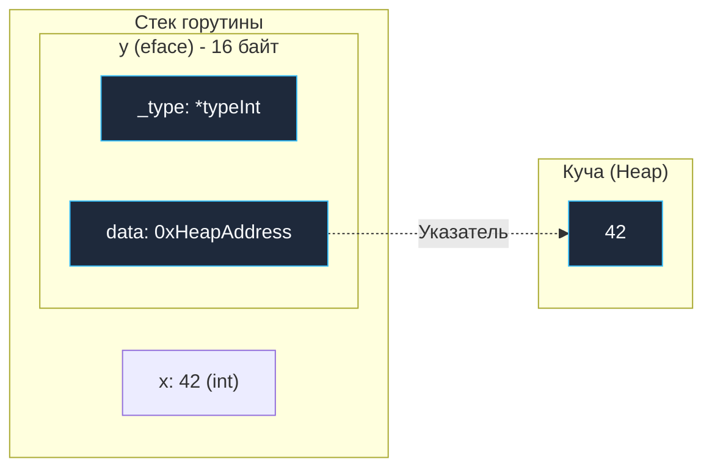
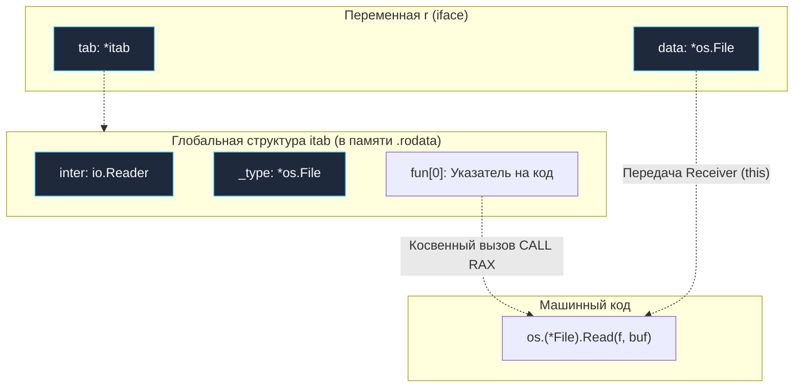
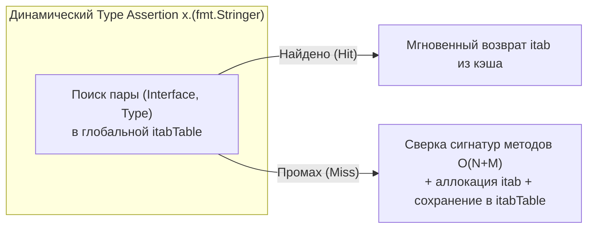

В прошлых статьях мы детально разобрали, как устроены базовые типы: массивы, слайсы, словари и строки. Они хранят конкретные байты и данные. Но подлинная архитектурная выразительность Go раскрывается в его системе типов, построенной вокруг **Интерфейсов (Interfaces)**.

Интерфейсы в Go реализуют парадигму утиной типизации (Structural Subtyping / Duck Typing) с бескомпромиссной статической проверкой типов на этапе компиляции: *«Если нечто ходит как утка и крякает как утка — это утка»*. Если конкретный тип реализует все сигнатуры методов интерфейса, он *автоматически* удовлетворяет этому интерфейсу. Нам не нужно явно писать `implements MyInterface` (как в Java или C#).

Это невероятно элегантно и удобно для разработчика. Но как это работает на уровне кремния и оперативной памяти? 

В объектно-ориентированных языках вроде C++ каждый объект полиморфного класса вынужден таскать в своем заголовке скрытый указатель на таблицу виртуальных методов (`vptr`), что раздувает каждую структуру данных в памяти. Создатели Go (Bell Labs) пошли совершенно другим путем: они оставили структуры данных «чистыми» (структура в Go занимает ровно столько байт, сколько занимают её поля), а весь полиморфизм вынесли в специальный двухсловный дескриптор — **Fat Pointer (толстый указатель)**.

Как рантайм Go умудряется хранить в переменной типа `error` (которая является интерфейсом) и крошечную структуру на 8 байт, и гигантский `http.Response` на килобайты? И почему системные инженеры постоянно говорят о стоимости «упаковки в интерфейс» (Interface Boxing)?

Открываем исходники рантайма `src/runtime/runtime2.go`. На уровне ассемблера и машинного кода никаких абстрактных интерфейсов не существует. Существуют только две конкретные структуры: **`eface`** и **`iface`**.

---

## 1. eface: Пустой интерфейс (interface{})

Начнем с самого простого — пустого интерфейса `interface{}` (или его современного псевдонима `any`, появившегося в Go 1.18).
В него можно положить значение абсолютно любого типа, потому что пустой интерфейс не требует реализации ни одного метода.

На 64-битной архитектуре пустой интерфейс — это структура `eface`, которая всегда занимает ровно **16 байт** (два 8-байтных машинных слова).

```go
// src/runtime/runtime2.go
type eface struct {
	_type *_type         // Указатель на метаинформацию о типе данных (8 байт)
	data  unsafe.Pointer // Указатель на сами данные в памяти (8 байт)
}
```

* **`_type`:** Это указатель на глобальную статическую структуру метаданных типа, сгенерированную компилятором и зашитую в сегмент `.rodata`. Она описывает тип целиком: его размер (`size`), выравнивание (`align`), битовую маску указателей для сборщика мусора (`ptrdata` и `gcdata`), функцию хэширования, функцию проверки равенства (`equal`), строковое имя и флаги типа.
* **`data`:** Указатель `unsafe.Pointer` на физическое расположение данных в памяти. И вот здесь кроется главная ловушка производительности.

### Interface Boxing (Упаковка в интерфейс)

Посмотрим на безобидный на первый взгляд код:
```go
var x int = 42       // x лежит на стеке, занимает 8 байт
var y any = x        // Упаковка в eface!
```

Структура `eface` жестко фиксирована компилятором: она занимает 16 байт и состоит строго из двух указателей. Она не может положить само число `42` прямо в поле `data`, потому что поле `data` обязано быть валидным адресом памяти для сборщика мусора (GC) и разыменования!

Поэтому, когда вы присваиваете значение конкретного типа в пустой интерфейс, компилятор инициирует процедуру **Interface Boxing (Boxing / Упаковка)**:

1. Рантайм аллоцирует **в куче (Heap)** новые 8 байт памяти (через функцию `runtime.convT64`).
2. Копирует значение числа `42` в эту выделенную ячейку кучи.
3. Записывает адрес этой новой памяти в поле `data` структуры `eface`.
4. Записывает глобальный указатель на метаданные типа `int` в поле `_type`.



Мы подробно изучали этот феномен в [[18. Escape Analysis. Почему переменная ушла в heap.md]]. Передача простых типов (чисел, структур по значению) в функции, принимающие `any` (например, `fmt.Println(x)`), **гарантированно вызывает аллокацию в куче**, создавая невидимую работу для Garbage Collector!

> [!tip] Оптимизация в Go (Zero-allocation any)
> Инженеры рантайма Go пошли на изящную хитрость ради оптимизации стандартных операций. Если вы передаете в интерфейс `byte` или `int` небольшого размера (например, в диапазоне от 0 до 255), рантайм **не делает аллокацию в куче**. 
> В сегменте данных бинарника (`.rodata`) заранее заготовлен статический массив всех чисел от 0 до 255 (массив `staticuint64s`). Если вы делаете `var a any = 5`, поле `data` просто будет указывать на ячейку `5` в этом готовом глобальном массиве. Аллокация равна $0$ байт!

---

## 2. iface: Интерфейс с методами

Теперь посмотрим на настоящие интерфейсы с набором методов (например, `io.Reader`, `fmt.Stringer`, стандартный интерфейс `error`).
В рантайме они представляются структурой **`iface`**, которая тоже весит ровно **16 байт** (два машинных слова).

```go
// src/runtime/runtime2.go
type iface struct {
	tab  *itab          // Указатель на таблицу интерфейса (8 байт)
	data unsafe.Pointer // Указатель на сами данные в памяти (8 байт)
}
```

Поле `data` здесь работает точно так же, как в `eface` — оно указывает на конкретное значение (или его копию в куче). 

Вся магия статической проверки, утиной типизации и динамической диспетчеризации (Dynamic Dispatch) спрятана в поле **`tab`** — указателе на структуру **`itab`** (Interface Table).

### Анатомия itab

Структура `itab` — это специализированный мост между абстрактным интерфейсом (какие методы требуются) и конкретным типом (где эти методы физически лежат в машинном коде).

```go
// src/runtime/runtime2.go
type itab struct {
	inter *interfacetype // Описание интерфейса (напр. io.Reader)
	_type *_type         // Описание конкретного типа (напр. *os.File)
	hash  uint32         // Хэш типа для быстрых проверок (Type Assertion)
	_     [4]byte
	fun   [1]uintptr     // Массив указателей на точки входа функций (методов)
}
```

* **`inter`:** Описывает сигнатуру самого интерфейса: список имен и типов аргументов всех требуемых методов (например, метод `Read([]byte) (int, error)`).
* **`_type`:** Полные метаданные конкретного типа, лежащего под интерфейсом (например, структура `*os.File`).
* **`hash`:** Копия хэша из `_type.hash`. Используется для ультрабыстрого Type Assertion `x.(T)` и Type Switch: вместо побайтового сравнения тяжелых структур метаданных рантайм сравнивает одно 32-битное число.
* **`fun`:** Самое главное поле — таблица виртуальных методов! Это непрерывный массив указателей на машинный код методов конкретного типа (`*os.File.Read`). В Go структура объявлена с массивом размера `[1]uintptr`, но в реальности память выделяется с запасом под все методы интерфейса (классический прием переменной длины «struct hack»).

Когда вы вызываете метод через интерфейс:
```go
var r io.Reader = myFile
r.Read(buf)
```

Процессор на уровне ассемблерных инструкций делает следующее:
1. Загружает адрес `r` (структура `iface`).
2. Извлекает поле `tab` (указатель на `itab`).
3. Берет из `itab` поле `fun[0]` (указатель на реализацию `Read` для данного типа).
4. Вызывает функцию косвенным переходом `CALL RAX`, передавая значение из поля `data` в первый регистр аргументов в качестве receiver'а (неявного аргумента `this` / `self`).



Это называется **Virtual Method Call (Вызов виртуальной функции)** или косвенная диспетчеризация. 
Цена такого вызова — дополнительная операция разыменования указателя (Dereference) и невозможность для компилятора сделать Inlining метода на месте. Однако процессорный блок предсказания переходов (Branch Target Buffer, BTB) прекрасно справляется с такими вызовами, если тип под интерфейсом не меняется в цикле миллион раз.

---

## 3. Сборка itab: Когда компилятор молчит

Главная особенность утиной типизации в Go — неявная реализация. Если тип `User` имеет метод `String() string`, он автоматически реализует `fmt.Stringer`, даже если автор типа `User` никогда не слышал о пакете `fmt`.

Как рантайм строит структуру `itab`, если в коде нет явного связующего ключевого слова `implements`?

Здесь работают два механизма:
1. **Статическая генерация компилятором:** Если компилятор на этапе сборки видит статическое присваивание `var s fmt.Stringer = u`, он **заранее** (во время компиляции) конструирует готовую структуру `itab` для этой пары `(fmt.Stringer, User)` и зашивает её прямо в секцию данных исполняемого файла (`.rodata`). В рантайме сборка не стоит вообще ничего — просто запись готового указателя!
2. **Динамическая генерация на лету (On-the-fly):** А что если приведение типов происходит динамически во время работы программы? Например, при использовании пакета `reflect` или операции Type Assertion `x.(fmt.Stringer)`, где исходно переменная `x` была `any`?

В этом случае рантайм вынужден динамически проверить, реализует ли тип все методы интерфейса.
Он берет отсортированный по алфавиту список методов интерфейса и отсортированный список методов типа и запускает алгоритм поиска пересечения за $O(N + M)$ шагов. Если все методы совпали, рантайм конструирует новый `itab` прямо в памяти.



> [!info] Кэширование itab в рантайме
> Чтобы не выполнять дорогостоящее сопоставление строк и сигнатур методов при каждом Type Assertion, рантайм кэширует все когда-либо созданные `itab` в глобальную потокобезопасную хэш-таблицу `itabTable`. Доступ к ней реализован через lock-free чтение с атомиками. Если пара `(Интерфейс, Тип)` уже встречалась в процессе работы приложения хотя бы один раз, рантайм мгновенно достанет готовый `itab` из кэша.

---

## 4. Mechanical Sympathy: Ловушка "Nil Interface"

Это самая частая и коварная ошибка в Go, с которой сталкивался абсолютно каждый разработчик и которая гарантированно звучит на каждом собеседовании.

Посмотрим на код, который приводит к панике (Nil Pointer Dereference) в продакшене:

```go
func getReader() io.Reader {
    var f *os.File = nil
    return f // Мы возвращаем nil указатель в интерфейс
}

func main() {
    r := getReader()
    if r == nil {
        fmt.Println("Reader пустой!")
    } else {
        fmt.Println("Reader не пустой!") // ВЫВЕДЕТ ЭТО!
    }
}
```

Почему `r != nil`, если мы своими руками вернули `nil`?

Давайте посмотрим на физическую структуру `iface`, которую сконструировал компилятор при выполнении инструкции `return f`:
* Поле `data` равно `nil` (потому что сам указатель `f` равен `nil`).
* Поле `tab` **НЕ равно nil**! Оно указывает на глобальную структуру `itab`, которая говорит: «Этот интерфейс относится к `io.Reader`, а тип под ним — `*os.File`».

```
       Структура iface в памяти:
       ┌────────────────────────┐
 tab:  │ 0x4a20b0 (*os.File)    │  <-- НЕ NIL! (Тип известен)
       ├────────────────────────┤
 data: │ 0x000000 (nil)         │  <-- NIL! (Значения нет)
       └────────────────────────┘
```

**Фундаментальное правило Go:**
> **Интерфейс считается `nil` ТОЛЬКО тогда, когда ОБА его поля (`tab` и `data`) равны `nil`.**

Если `tab` заполнен (тип известен), интерфейс с точки зрения логики языка **уже не `nil`**, даже если поле `data` указывает в пустоту!

Если вы попытаетесь вызвать `r.Read()`, программа упадет, потому что в реализацию `os.(*File).Read` будет передан `nil` в качестве receiver'а (nil pointer dereference).

Когда программа в `main` видит, что `r != nil`, она считает ридер валидным и вызывает метод:
```go
r.Read(buf)
```
Процессор добросовестно находит метод в `tab`, переходит по адресу `os.(*File).Read`, передавая в качестве receiver'а `data = nil`. Метод пытается прочитать дескриптор файла `f.fd`, разыменовывает нулевой указатель и приложение падает с паникой: `panic: runtime error: invalid memory address or nil pointer dereference`.

Особенно часто эта катастрофа случается при работе с ошибками:
```go
type MyError struct{}
func (e *MyError) Error() string { return "fail" }

func run() error {
    var err *MyError = nil
    // ... логика ...
    return err // ОШИБКА: возвращается iface{tab: *MyError, data: nil} != nil!
}

func main() {
    if err := run(); err != nil {
        // ЭТОТ БЛОК ВЫПОЛНИТСЯ ВСЕГДА! Ошибка считается существующей!
    }
}
```

**Решение:** Если функция должна вернуть пустой интерфейс при отсутствии ошибки или данных, **всегда возвращайте явный нетипизированный `nil`**, а не переменную-указатель, содержащую `nil`:

```go
func getReaderSafe() io.Reader {
    var f *os.File = nil
    if f == nil {
        return nil // Возвращаем чистый (tab: nil, data: nil) интерфейс
    }
    return f
}
```

---

## 5. Дженерики против Интерфейсов: Мономорфизация

С появлением дженериков в Go 1.18 у разработчиков появилась альтернатива динамическому полиморфизму интерфейсов.

* **Интерфейсы (`iface` / `eface`):** Динамический полиморфизм. Разрешение методов происходит в рантайме через косвенный переход по таблице `itab.fun`. Требует упаковки (boxing) для value-типов, запрещает инлайнинг функций компилятором.
* **Дженерики (`[T any]`):** Статический полиморфизм. Компилятор на этапе сборки генерирует специализированный машинный код под каждый конкретный тип (мономорфизация, в Go реализованная гибридно через GCShape). Никаких `itab`, никаких косвенных переходов — прямой вызов функции и возможность инлайнинга.

Если ваша цель — максимальная производительность в критических путях, дженерики позволяют избежать накладных расходов `iface` и аллокаций упаковки.

---

## Итог

1. Интерфейсов в рантайме не существует. Есть две компактные 16-байтные структуры: **`eface`** (пустой интерфейс `any`) и **`iface`** (интерфейс с методами).
2. **Interface Boxing:** Присваивание Value-типа (числа, структуры) в интерфейс всегда аллоцирует память в куче, чтобы получить адрес для поля `data`. Исключение — встроенная константная таблица чисел 0..255.
3. **`itab` (Interface Table):** Это мост между интерфейсом и типом. Содержит метаданные типа и массив указателей `fun` на машинный код методов.
4. **Утиная типизация:** `itab` генерируется компилятором заранее, либо рантаймом динамически с сохранением в кэш `itabTable`.
5. **Nil Interface:** Интерфейс равен `nil` тогда и только тогда, когда оба указателя (`tab` и `data`) равны `nil`. Типизированный `nil`-указатель, упакованный в интерфейс, дает не-nil интерфейс!

Мы разобрали внутреннее устройство интерфейсов и поняли, что за магией «утиной типизации» стоят конкретные структуры `iface` и `eface`. Но самое важное знание для инженера — это цена, которую мы платим за эту гибкость. Каждый раз, когда мы передаем данные в интерфейс, рантайм может незаметно для нас выделять память и нагружать Garbage Collector.

В следующей статье мы разберем «темную сторону» интерфейсов и научимся видеть невидимые аллокации: [[36. Interface Boxing и hidden allocation.md]]