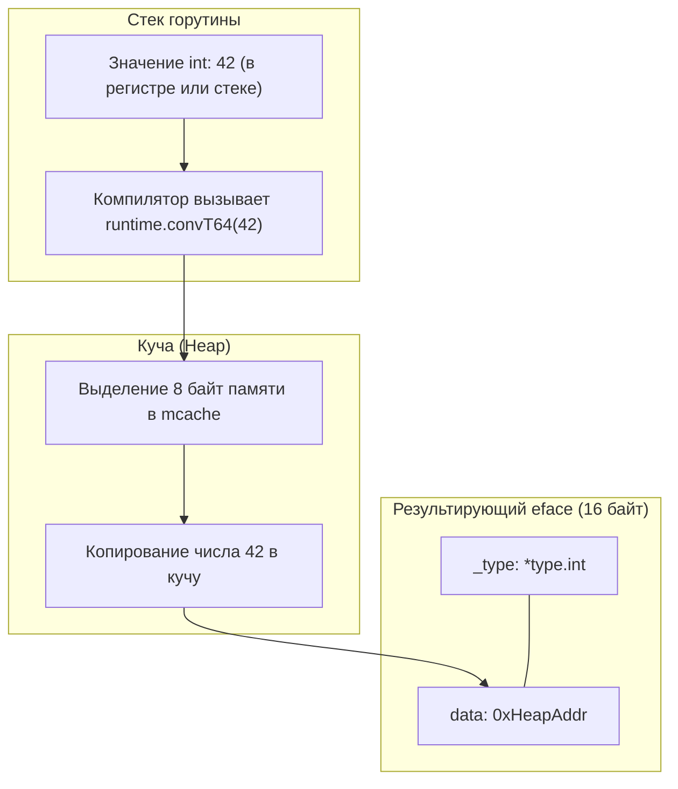
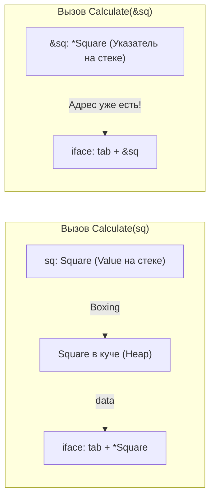

В прошлой статье ([[35. Интерфейсы под капотом. eface и iface]]) мы узнали, что интерфейс в Go — это компактный 16-байтный заголовок, содержащий указатель на данные (`data`) и указатель на тип или таблицу методов (`itab`).

Для Senior-разработчика и системного инженера интерфейсы — это не только инструмент элегантной абстракции и инверсии зависимостей, но и один из главных источников **Hidden Allocations (скрытых аллокаций)**. Когда вы пишете высоконагруженный бэкенд, вы можете отполировать алгоритмы, вычистить лишние слайсы, но если вы не понимаете механику **Interface Boxing**, ваш сервис будет непрерывно «мусорить» в кучу на совершенно ровном месте. Это вызывает деградацию хвостовой задержки (Tail Latency P99) из-за повышенной нагрузки на GC и частых промахов процессорного кэша L1/L2.

---

## 1. Суть проблемы: Указатель требует адреса

Фундаментальное аппаратное ограничение структуры `iface/eface` заключается в том, что поле `data` — это бестиповый указатель `unsafe.Pointer`. 

Указатель в архитектуре фон Неймана обязан ссылаться на реальный адрес в памяти. 

Если у вас есть локальная переменная типа `int` (которая сама по себе не является указателем), и вы хотите положить её в `interface{}` (или `any`), рантайму буквально не на что сослаться. Число `42` — это просто 64 бита, лежащие в регистре процессора `RAX` или в стековом фрейме текущей функции. 

Если бы рантайм просто взял адрес локальной переменной со стека, этот адрес стал бы невалидным (Dangling Pointer) в ту же наносекунду, когда функция вернет управление и стек «схлопнется».

Чтобы гарантировать безопасность памяти и получить стабильный адрес, компилятор и рантайм вынуждены **выполнить Boxing (упаковку)**:
1. Выделить память в куче (8 байт для `int` через специализированный хелпер `runtime.convT64` или общий `runtime.convT2E`).
2. Скопировать туда значение `42`.
3. Сохранить адрес этой ячейки памяти в поле `data` заголовка интерфейса.



Это и есть классическая «скрытая аллокация». В исходном Go-коде её абсолютно не видно: программист не пишет операторы `new` или `make`, не берет адрес `&`, но аллокатор памяти послушно дергает `mcache` при каждом приведении конкретного типа к интерфейсу.

---

## 2. Типичные сценарии «невидимого мусора»

Давайте разберем типичные паттерны продакшен-кода, где разработчики невольно топят сервис в миллионах лишних аллокаций.

### Сценарий А: Логирование в Hot Path

Это абсолютная классика бэкенд-разработки. Почти все стандартные функции форматирования и логирования принимают вариативный список `...any`.

```go
func process(id int) {
    // Входящий id лежит на стеке (или в регистре).
    // При передаче в логику он неявно упаковывается в интерфейс any!
    // Результат: +1 аллокация в Heap на каждый вызов!
    log.Printf("обработка заказа: %d", id) 
}
```

Если этот метод вызывается 100 000 раз в секунду в горячем цикле обработки сетевых пакетов, вы генерируете 800 КБ мусора в секунду только на записи чисел в лог! 

Сборщик мусора вынужден непрерывно тратить кванты времени CPU на сканирование и освобождение этих сиротливых 8-байтовых блоков.

### Сценарий Б: Слайсы интерфейсов

```go
vals := make([]any, 1000)
for i := 0; i < 1000; i++ {
    vals[i] = i // 1000 аллокаций в куче!
}
```

Хотя сам слайс `vals` аллоцирован ровно один раз (выделив 16 КБ под 1000 заголовков `eface`), каждое присваивание `int` в ячейку `any` создает отдельный объект в куче через `convT64`. Вместо одной аллокации мы получаем 1001 аллокацию!

---

## 3. Обманчивые методы: Pointer vs Value Receivers

Еще одна коварная ловушка кроется в вызовах методов через интерфейсы при несовпадении типов получателя (Receiver).

```go
type Shaper interface { 
    Area() float64 
}

type Square struct { 
    side float64 
}

func (s Square) Area() float64 { 
    return s.side * s.side 
}

func Calculate(sh Shaper) { 
    fmt.Println(sh.Area()) 
}

func main() {
    sq := Square{side: 10}
    Calculate(sq) // Аллокация! Square копируется в кучу.
}
```

Что произошло при вызове `Calculate(sq)`?
Поскольку структура `Square` передается по значению, а интерфейс `Shaper` обязан хранить указатель в поле `data`, рантайм не имеет права взять адрес временной копии `sq` на стеке `main`. 

Рантайм вынужден скопировать всю структуру `Square` в кучу через функцию `runtime.convT2I`!



**Mechanical Sympathy (Оптимизация):**
Если тип реализует интерфейс по указателю, или если вы передаете указатель `Calculate(&sq)`, аллокации может не быть (если компилятор в ходе Escape Analysis докажет, что `sq` не «убегает» наружу из вызывающей функции), так как адрес структуры уже существует и может быть напрямую записан в поле `data`. 

Но в подавляющем большинстве случаев работа с интерфейсами по значению (Value) приводит к неизбежному Boxing-у.

---

## 4. Как избежать Hidden Allocations?

Зная физику рантайма, мы можем применять проверенные инженерные паттерны для полного обнуления скрытого оверхеда.

### 1. Использование Дженериков (Go 1.18+)

Дженерики — это главный и самый мощный инструмент устранения ненужных аллокаций интерфейсов в современном Go.

Вместо динамического полиморфизма интерфейсов:
```go
func Print(val any) {
    // val упаковывается в eface -> аллокация в куче!
}
```

Используйте параметрический полиморфизм:
```go
func Print[T any](val T) {
    // Компилятор подставляет конкретный тип T на этапе сборки!
}
```

При компиляции Go создаст конкретную версию функции для вашего типа (мономорфизация). Значение останется на стеке или в регистрах CPU, упаковки в `eface` не произойдет, а аллокация будет равна $0$ байт.

### 2. Типизированные логгеры

Откажитесь от `log.Printf` и `fmt.Sprintf` в высоконагруженных путях исполнения. Используйте специализированные zero-allocation библиотеки структурного логирования — `zap` или `zerolog`.

Вместо динамического интерфейса:
```go
logger.Info("id", id) // id превратится в any, вызвав boxing
```

Используйте строго типизированные поля:
```go
logger.Info("id", zap.Int("val", id))
```

Здесь `zap.Int` создает плоскую структуру `Field`, которая явно хранит `int64` прямо в теле структуры (in-place), и внутри логгера данные кодируются в JSON-буфер напрямую из регистров процессора без приведения к `any`.

### 3. Пул объектов (sync.Pool)

Если вам архитектурно необходимы интерфейсы (например, в высоконагруженном декодере сетевых пакетов или middleware), используйте `sync.Pool`, чтобы переиспользовать уже «упакованные» объекты, вместо создания новых на каждом запросе.

---

## 5. Исключения: Когда аллокаций НЕТ

Рантайм Go содержит несколько блестящих оптимизаций, снижающих нагрузку при работе с примитивами:

- **Малые целые числа (`0..255`):** Как мы отмечали, числа от 0 до 255 не аллоцируются в куче. Рантайм держит глобальный массив `staticuint64s` в сегменте `.rodata` и просто ссылается на его элементы.
- **Булевы значения (`true` и `false`):** Значения `true` и `false` всегда берутся из статической константной памяти рантайма (`runtime.staticuint64s`).
- **Пустые структуры (`struct{}{}`):** Любая пустая структура не занимает места в памяти. Поле `data` интерфейса всегда указывает на глобальный маркер `runtime.zerobase`.
- **Строковые литералы и константы:** В ряде случаев, когда значение известно на этапе компиляции, компилятор размещает константу в сегменте данных и формирует интерфейс без обращения к куче.

> [!tip] Как проверить скрытые аллокации своими глазами?
> Никогда не гадайте на кофейной гуще — используйте флаги компилятора! Запустите сборку с подробным отчетом Escape Analysis:
> ```bash
> go build -gcflags="-m -m" main.go
> ```
> Компилятор явно укажет строки:
> ```
> ./main.go:12:13: id escapes to heap
> ./main.go:12:13: ... argument does not escape
> ./main.go:12:13: id gets boxed into any
> ```
> Любое упоминание `gets boxed into any` — верный признак скрытой аллокации в куче.

---

## 6. Компиляторная оптимизация: Диспетчеризация и Devirtualization

Начиная с Go 1.20 и особенно с введением PGO (Profile-Guided Optimization) в Go 1.22+, компилятор Go научился выполнять **Devirtualization (Девиртуализацию)** интерфейсных вызовов.

Если компилятор видит (или данные PGO-профиля показывают), что в 99.9% случаев под интерфейсом `Shaper` оказывается конкретная структура `Square`, он заменяет дорогой косвенный вызов через `itab.fun[0]` на прямой вызов `Square.Area()`:

```go
// Псевдокод после девиртуализации:
if sh.tab == squareItab {
    Square.Area(sh.data) // Прямой вызов, доступен для Inlining!
} else {
    sh.tab.fun[0](sh.data) // Медленный вызов через таблицу
}
```
Это устраняет косвенность, позволяет заинлайнить машинный код прямо в вызывающую функцию и в ряде случаев полностью аннулирует необходимость аллокации в куче!

---

## Итог

1. **Boxing** — это процесс создания копии значения в куче для того, чтобы интерфейс мог получить валидный указатель на данные (`unsafe.Pointer`).
2. Каждое использование `any` (`interface{}`) с простыми типами данных — это потенциальная скрытая аллокация в куче.
3. Главные враги производительности в горячих путях: стандартное логирование, функции `fmt.Printf`, срезы `[]any` и передача структур по значению в интерфейсные функции.
4. **Дженерики (`[T any]`)** — лучший способ сохранить полиморфизм, полностью избавившись от накладных расходов интерфейсов и упаковки.
5. Для высоконагруженных путей используйте строго типизированные библиотеки (`zap.Int`) и профилируйте код флагом `-gcflags="-m -m"`.

Мы разобрались, как интерфейсы «съедают» нашу память и процессорное время. Но иногда нам нужно заглянуть внутрь интерфейса еще глубже: узнать список полей структуры, вызвать метод по имени или создать тип, которого не существовало на этапе компиляции.

Для этого в Go есть пакет `reflect`. Это мощнейший инструмент, который многие называют «черной магией». В следующей статье мы разберем, как он устроен и почему за его мощь приходится платить еще большую цену.

В следующей статье: [[37. Reflect под капотом.md]]