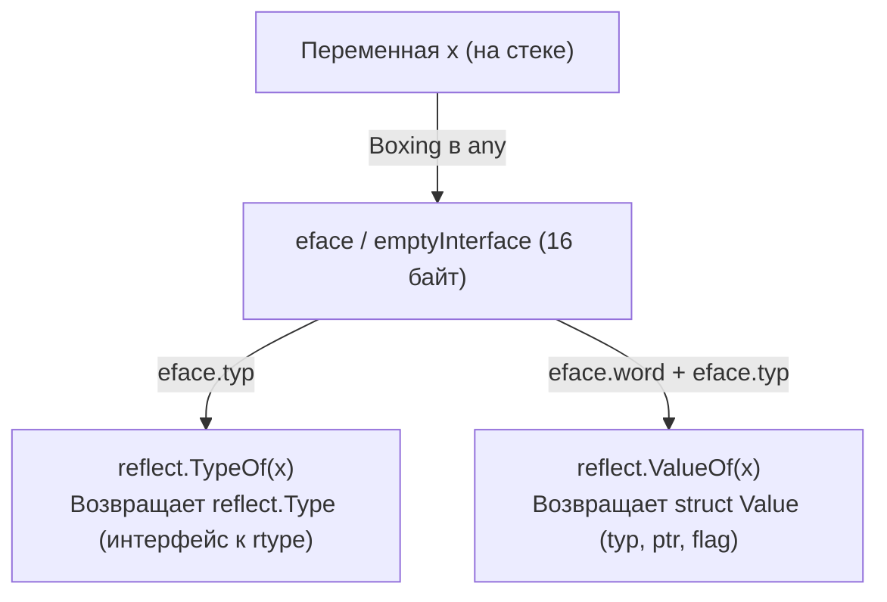
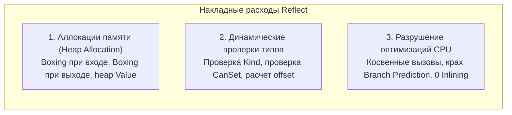
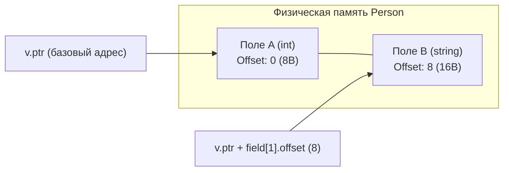

В прошлых статьях мы разобрали «невидимые» аллокации при использовании интерфейсов ([[36. Interface Boxing и hidden allocation.md]]). Пакет `reflect` — это логическое продолжение темы интерфейсов, возведенное в абсолют.

Один из авторов языка Go, Роб Пайк, однажды сформулировал знаменитую пословицу:  
> *«Clear is better than clever. Reflection is never clear.»*  
> (Ясное лучше, чем умное. Рефлексия никогда не бывает ясной.)

Рефлексия позволяет программе исследовать свою собственную структуру во время выполнения. Мы можем динамически прочитать приватные поля, вызвать методы по строковому имени, распарсить тэги структур в JSON-сериализаторе или создать слайс произвольного типа. Но в сообществе системных инженеров Go рефлексия считается «тяжелой артиллерией» и архитектурным злом, к которому следует прибегать только в самом крайнем случае. 

Чтобы понять, почему `reflect` работает медленно, создает колоссальную нагрузку на процессор и память и почему он потенциально опасен, нужно заглянуть под его капот и разобраться, как он взаимодействует со структурой `eface` и метаданными рантайма.

---

## 1. Входная точка: emptyInterface

Любая работа с рефлексией начинается с функции `reflect.TypeOf()` или `reflect.ValueOf()`. Обе они принимают аргумент типа `any` (`interface{}`). 

Если мы заглянем в исходный код стандартной библиотеки (`src/reflect/value.go` и `src/reflect/type.go`), мы увидим знакомую до боли картину:

```go
func TypeOf(i any) Type {
	eface := *(*emptyInterface)(unsafe.Pointer(&i))
	return toType(eface.typ)
}
```

Пакет `reflect` определяет свою внутреннюю структуру `emptyInterface`, которая является полным бинарным клоном низкоуровневой структуры `eface` из рантайма (см. [[35. iface и eface. Как устроены интерфейсы.md]]):

```go
type emptyInterface struct {
	typ  *rtype         // Указатель на структуру метаданных типа
	word unsafe.Pointer // Указатель на данные
}
```

Когда вы передаете переменную в `reflect.ValueOf(x)` или `reflect.TypeOf(x)`, компилятор немедленно инициирует **Interface Boxing**:
1. Ваше значение упаковывается в заголовок `eface`.
2. Если `x` — это Value-тип (число, структура), оно принудительно копируется в кучу через аллокатор памяти (`mcache`).
3. И только после этого пакет рефлексии начинает с ним работать, распаковывая указатели через `unsafe.Pointer`.



---

## 2. reflect.Type vs reflect.Value

Вся архитектура пакета `reflect` разделена на две фундаментальные абстракции:

1. **`reflect.Type`** — это интерфейс, который дает доступ исключительно к неизменяемым метаданным типа (имя типа, размер, список полей структуры, типы аргументов и возвращаемых значений функций). Под капотом это тонкая обертка над структурой `_type` (внутри пакета она называется `rtype`) из рантайма. Это статический «чертеж» объекта, зашитый в сегмент `.rodata`.
2. **`reflect.Value`** — это тяжелая конкретная структура, которая содержит **указатель на конкретные данные** в памяти, метаданные о типе и битовые флаги состояния. Это сам «экземпляр» объекта.

```go
type Value struct {
	typ *rtype           // Метаданные типа
	ptr unsafe.Pointer   // Указатель на данные
	flag                 // Флаги (доступно ли для записи, является ли методом и т.д.)
}
```

Поле `flag` — это 32-битное число, в котором закодированы свойства значения:
* Какой это базовый вид типа (`Kind`: Int, Float, Struct, Slice, Map, Ptr...).
* Доступно ли значение для изменения: флаг `flagAddr` (можно ли взять адрес) и флаг `flagRO` (является ли поле приватным/unexported).
* Является ли значение результатом вызова метода.

Важно понимать: `reflect.Value` — это очень тяжелая структура. Она заставляет Сборщик Мусора (GC) проделывать много лишней работы, так как хранит `unsafe.Pointer`, который GC обязан отслеживать во время фазы маркировки (Mark Phase).

---

## 3. Почему рефлексия — это медленно?

Существует три основные причины, по которым `reflect` проигрывает обычному статическому коду в 10–100 раз по производительности:



### А. Постоянные аллокации

Как только вы вызываете `reflect.ValueOf(x)`, вы создаете интерфейс (аллокация в куче). 

Если вы вызываете `v.Interface()`, чтобы получить данные обратно в пользовательский код, вы снова конструируете интерфейс (еще одна аллокация). 

Большинство промежуточных методов рефлексии (например, `v.Field(i)`, `v.Index(i)`, `v.Slice()`) возвращают новые экземпляры `reflect.Value`, многие из которых «убегают» в кучу через Escape Analysis.

### Б. Динамические проверки

Обычный Go-код проверяется компилятором один раз на этапе сборки. В скомпилированном бинарнике обращение `u.Age` — это просто чтение из памяти по фиксированному смещению `[RSP + 16]`.

Рефлексия вынуждена производить весь синтаксический анализ заново в рантайме. Когда вы вызываете `v.Field(0)`, рантайм должен:
1. Проверить по битовой маске `flag`, что `v` — это вообще структура (`Kind == Struct`), иначе бросить панику.
2. Проверить, что запрашиваемый индекс `0` не превышает общее число полей (`0 <= i < numFields`).
3. Рассчитать смещение (`offset`) этого поля в физической памяти структуры.
4. Проверить права доступа (экспортируемое поле или приватное `unexported`).

Все эти проверки занимают десятки машинных инструкций и ветвлений конвейера процессора на каждый доступ к полю!

### В. Вызовы функций (Dynamic Dispatch)

Вызов метода через `v.Method(0).Call(args)` — это худший сценарий для современного суперскалярного процессора. 

Рантайм должен:
1. Собрать переданные аргументы в слайс интерфейсов `[]reflect.Value` (множественные аллокации в куче!).
2. Проверить типы аргументов на полное соответствие сигнатуре метода.
3. Скопировать аргументы из слайса в регистры или на стек в соответствии с ABIInternal.
4. Выполнить косвенный переход по указателю на функцию.

Это полностью исключает возможность **Inlining** (встраивания кода) компилятором. Там, где обычный вызов метода `u.GetID()` разворачивается в 0 наносекунд (прямое чтение поля), рефлексивный вызов тратит сотни тактов CPU.

---

## 4. За кулисами: Смещение памяти (Layout)

Как рефлексия физически меняет данные, если она не знает тип на этапе компиляции? Она работает с памятью напрямую, используя знания о `layout` (расположении полей) структуры, хранящиеся в `_type`.

Если у нас есть `struct { A int; B string }` (или тип `type Person struct { A int; B string }`), рефлексия знает, что поле `A` находится по смещению 0, а поле `B` — по смещению 8 (на 64-битном CPU).

```go
type Person struct {
    A int    // 8 байт (offset 0)
    B string // 16 байт (offset 8)
}
```



Когда вы пишете код изменения значения:
```go
v.Field(1).SetString("hello")
```

Рантайм выполняет следующую низкоуровневую работу:
1. Проверяет флаги: доступно ли поле для записи (`CanSet() == true`).
2. Берет базовый указатель на начало структуры `v.ptr`.
3. Прибавляет к нему байтовое смещение поля `B` (`offset = 8`).
4. Полученный адрес принудительно приводит к указателю `*string`: `(*string)(unsafe.Pointer(uintptr(v.ptr) + offset))`.
5. По этому вычисленному адресу записывает новое 16-байтовое значение строки.

По своей сути пакет `reflect` — это та же самая адресная арифметика через `unsafe.Pointer`, но облаченная в толстый слой рантайм-проверок типов, исключающих порчу памяти.

---

## 5. Mechanical Sympathy: Как использовать reflect правильно?

Если вам по долгу службы приходится использовать рефлексию (например, вы пишете универсальный ORM, валидатор DTO или JSON-парсер), следуйте жестким правилам системной гигиены:

1. **Кэшируйте результаты анализа (Type Inspection):** Никогда не вызывайте `reflect.TypeOf()` и разбор полей в цикле обработки запросов. Извлеките структуру полей, тэги и смещения один раз при старте сервиса и сохраните готовый индекс в плоскую мапу или слайс.
2. **Используйте Type Assertion и Type Switch:** Если множество ожидаемых типов конечно, проверка через `switch v := i.(type)` работает на порядки быстрее рефлексии (это простая проверка хэша в `itab` за $O(1)$ без аллокаций).
3. **Избегайте `reflect.Value` для чтения метаданных:** Если вам нужно только проанализировать тип (имена полей, тэги), используйте `reflect.Type`. Она не содержит указателя на данные и создает в разы меньше работы для GC.
4. **Генерация кода (Code Generation) вместо рефлексии:** В экосистеме Go принято предпочитать кодогенерацию на этапе сборки (`go generate`, `easyjson`, `protobuf`) рантайм-рефлексии. Сгенерированный статический код работает на максимальной скорости «голого железа».

> [!tip] Собеседование. Как работает DeepEqual?
> **Вопрос:** Почему использование `reflect.DeepEqual` в продакшен-коде считается антипаттерном?
> 
> **Ответ:** `reflect.DeepEqual` — это одна из самых ресурсоемких функций во всей стандартной библиотеке Go. 
> Она рекурсивно обходит абсолютно все поля переданных структур, элементы слайсов, ключи и значения мап. 
> На каждом шаге рекурсии создаются новые структуры `reflect.Value`, выделяется память в куче, а для предотвращения зацикливания на циклических графах указателей `DeepEqual` ведет специальную карту посещенных адресов (`visited`).
> Для сложных вложенных структур вызов `reflect.DeepEqual` может выполняться миллисекунды, порождая тысячи мелких аллокаций. В высоконагруженном коде всегда следует писать специализированный рукописный метод `Equal()` или использовать кодогенерацию.

---

## Итог

1. **Рефлексия** — это программное окно в структуры метаданных рантайма (`_type` / `rtype`) через распаковку дескриптора `eface`.
2. Вся рефлексия строится вокруг двух понятий: статического чертежа типа **`reflect.Type`** и конкретного экземпляра данных **`reflect.Value`**.
3. Основные накладные расходы: скрытые аллокации памяти при упаковке в интерфейсы (Interface Boxing), рантайм-проверки прав доступа и невозможность инлайнинга виртуальных вызовов.
4. Метод `Set` в рефлексии вычисляет физическое смещение поля в памяти (`offset`) и пишет по указателю, аналогично пакету `unsafe`.
5. В высоконагруженных системах рефлексию заменяют на **кодогенерацию** (`easyjson`) или кэшируют результаты инспекции типов при старте.

Мы разобрали пакет `reflect` и поняли, что это безопасная, но тяжелая обертка над метаданными рантайма. Однако в Go есть еще более глубокий уровень взаимодействия с памятью, где нет никаких проверок типов и гарантий безопасности. Там, где заканчивается `reflect`, начинается «дикий запад» программирования на Go — пакет `unsafe`.

В следующей статье мы научимся ломать систему типов и узнаем, как работать с памятью напрямую: [[38. Unsafe.Pointer и нарушение гарантий языка.md]]