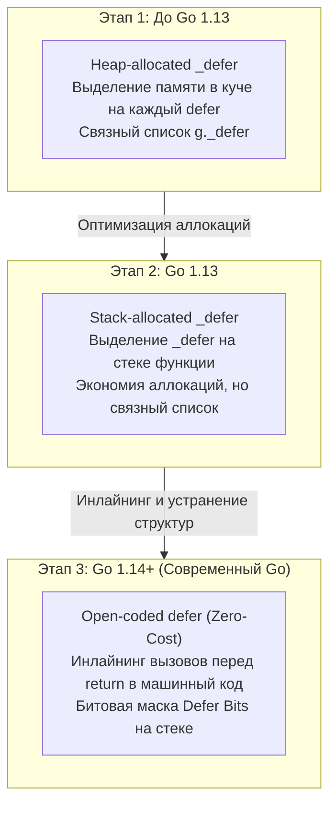
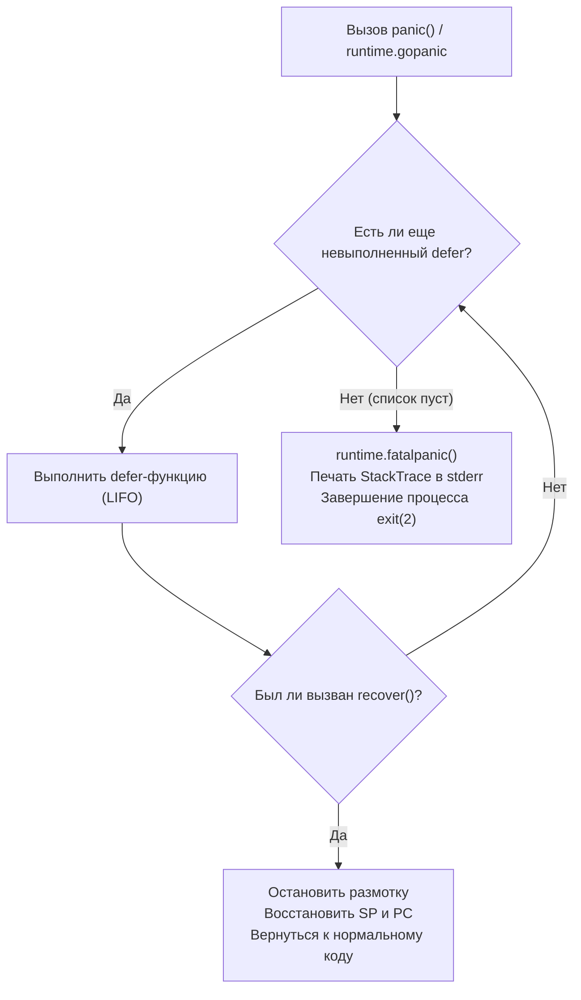
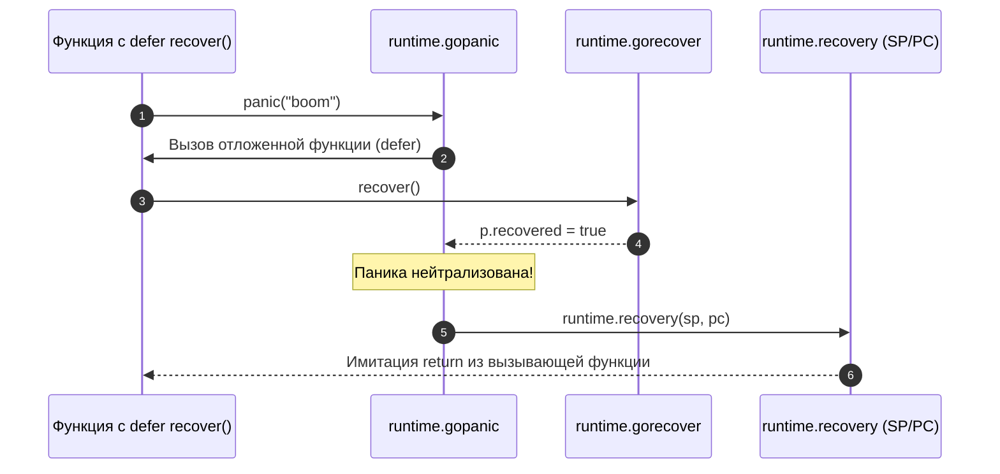

В прошлой статье ([[38. Unsafe.Pointer и нарушение гарантий языка.md]]) мы вышли за пределы безопасного Go, научившись манипулировать сырой памятью. Но даже в абсолютно безопасном и проверенном коде программы неизбежно сталкиваются с нештатными ситуациями: обращение по нулевому указателю (Nil Pointer Dereference), выход за границы слайса, закрытие уже закрытого канала или непредвиденный сбой внешней инфраструктуры. 

В отличие от C++ или Java с их громоздкими и медленными иерархиями исключений `try/catch/finally`, где раскрутка стека завязана на тяжелые таблицы `.eh_frame`, Go использует уникальную, лаконичную и прагматичную триаду: `defer`, `panic` и `recover`. 

Долгое время на инженерных собеседованиях считалось хорошим тоном менторски предостерегать: *«Никогда не используйте defer в горячих путях, он чудовищно медленный»*. Но рантайм Go не стоит на месте. Чтобы писать современный, идиоматичный и высокоскоростной код, системный инженер обязан понимать, как именно компилятор превращает эти ключевые слова в машинный код, как процессор осуществляет размотку стека и почему старые мифы о медлительности `defer` окончательно устарели.

---

## 1. Эволюция defer: От кучи к Zero-Cost

Когда вы пишете `defer f()`, вы регистрируете отложенный вызов: вы говорите рантайму: *«Выполни эту функцию непосредственно перед тем, как текущая функция вернет управление вызывающему коду (выполнит инструкцию return)»*. 

Исторически реализация этого механизма в компиляторе и рантайме Go прошла три фундаментальных этапа оптимизации.



### Этап 1: Heap-allocated defer (до Go 1.13)

В ранних версиях языка каждое ключевое слово `defer` приводило к созданию структуры `_defer` размером более 40 байт. Она содержала указатели на саму функцию, аргументы вызова и ссылку на предыдущий отложенный вызов.

Рантайм аллоцировал эту структуру **в куче (Heap)** через функцию `runtime.deferproc`! Эти структуры объединялись в односвязный список текущей горутины (`g._defer`). 

Каждый `defer` стоил минимум одной аллокации в куче и обращения к сборщику мусора. Именно в ту эпоху родилось жесткое правило: «Никаких defer в Hot Path».

### Этап 2: Stack-allocated defer (Go 1.13)

Инженеры рантайма обратили внимание на очевидный факт: в 99% случаев отложенная функция выполняется в рамках жизненного цикла того же стекового фрейма, где была объявлена. Зачем нагружать кучу?

В Go 1.13 компилятор научился выделять структуру `_defer` прямо **на стеке горутины**. Аллокация в куче исчезла, накладные расходы упали примерно на 30%, но накладные расходы на заполнение структуры `_defer`, регистрацию её в связном списке горутины и последующий вызов `runtime.deferreturn` всё еще отнимали драгоценные наносекунды.

### Этап 3: Open-coded defer (Go 1.14+)

В Go 1.14 произошла настоящая революция. Разработчики компилятора задали ключевой вопрос: *«Если количество отложенных вызовов в функции статически известно на этапе компиляции, зачем вообще создавать структуры `_defer` и вызывать рантайм?»*

Если функция содержит фиксированное количество defer-вызовов (до 8 штук в прямой последовательности без циклов), компилятор применяет **Open-coded defer (открытый / встроенный defer)**:
Он **физически встраивает (инлайнит)** вызовы отложенных функций прямо перед каждой точкой возврата (`return`) в сгенерированном машинном коде!

```go
// Ваш исходный код:
func do() {
    f, _ := os.Open("file.txt")
    defer f.Close()
    // работа с файлом f
}

// Во что это компилируется на уровне ассемблера:
func do() {
    f, _ := os.Open("file.txt")
    // работа с файлом f
    f.Close() // Прямой вызов функции, ZERO накладных расходов рантайма!
    return
}
```

> [!info] Под капотом. Defer Bits
> А что если вызов `defer` находится внутри ветвления `if`? Как компилятор перед выходом из функции узнает, выполнялась ли ветка с defer?
> Для этого компилятор заводит на стеке текущей функции одну невидимую 8-битную целочисленную переменную — **Defer Bits** (битовая маска `df`).
> Когда поток управления проходит через строку с `defer`, соответствующий бит устанавливается в единицу: `df |= (1 << 0)`. Это одна дешевая побитовая инструкция CPU `OR`.
> Перед каждой инструкцией `return` компилятор проверяет битовую маску: если нулевой бит равен 1, вызывается первая функция; если первый — вторая, и так далее. Вызовы выполняются строго в обратном порядке (LIFO).

**Вывод:** В современном Go накладные расходы на `defer` в обычных функциях сведены к уровню **Zero-Cost Abstraction** — они стоят ровно столько же, сколько стоил бы ручной вызов функции перед каждым `return`.

*Примечание:* Если `defer` находится внутри цикла `for`, компилятор не может предсказать количество вызовов на этапе сборки и автоматически откатывается к выделению структур на стеке или в куче.

---

## 2. Анатомия panic: Размотка стека

`panic` в Go — это не аналог `printf("error") + exit(1)`. Это высокоорганизованный процесс размотки стека (Stack Unwinding), управляемый рантаймом. На уровне исходного кода языка `panic` транслируется в вызов системной функции `runtime.gopanic`.

Что физически происходит в памяти и на стеке, когда программа встречает критическую ошибку или явный вызов `panic("error")`?

1. **Создание структуры `_panic`:** Рантайм создает структуру `_panic` и прикрепляет её к заголовку текущей горутины в виде односвязного списка (`g._panic`).
2. **Размотка стека (Stack Unwinding):** Рантайм начинает последовательно сканировать фреймы стека горутины, находя зарегистрированные отложенные функции (`_defer`). Для функций с Open-coded defer рантайм восстанавливает их список на лету, читая служебную таблицу метаданных `FUNCDATA_OpenCodedDeferInfo`.
3. **Выполнение отложенных функций:** Отложенные функции вызываются в строгом порядке **LIFO (Last-In, First-Out)**. На время выполнения каждого defer рантайм помечает его как активный.
4. **Обвал (Fatal Crash):** Если список `_defer` исчерпан, а ни одна отложенная функция не остановила панику вызовом `recover`, рантайм вызывает функцию `runtime.fatalpanic`. Она выводит в `stderr` сообщение об ошибке, трассировку стеков всех горутин (StackTrace) и немедленно завершает процесс вызовом системного вызова `exit(2)` ОС.



---

## 3. Магия recover: Как выжить при падении

Чтобы перехватить панику и спасти сервис от аварийного падения, используется встроенная функция `recover`. 
Вызов `recover()` компилируется в функцию `runtime.gorecover`.

Эта функция выполняет предельно простую проверку: она смотрит на верхнюю структуру `_panic` в цепочке `g._panic` текущей горутины и устанавливает её внутренний флаг `recovered = true`. Затем она возвращает переданный в `panic` аргумент.

Магия воскрешения происходит в функции `runtime.gopanic`, которая запустила отложенный вызов:
1. Завершив выполнение defer-функции, `gopanic` проверяет флаг: если `recovered == true` (в коде `if p.recovered`), паника нейтрализована.
2. Если флаг установлен, рантайм удаляет структуру `_panic` из списка горутины.
3. Рантайм понимает, что продолжать нормальное выполнение упавшей функции невозможно (её внутреннее состояние частично разрушено).
4. Вместо возврата в точку аварии рантайм вызывает ассемблерный трамплин `runtime.recovery`. Он **напрямую манипулирует регистрами процессора — указателем стека (`SP`) и счетчиком команд (`PC`)**!
5. Процессор совершает переход (JMP) так, как будто функция, содержавшая спасенный defer, только что выполнила штатный оператор `return`.



> [!warning] Ловушка / Gotcha. Почему recover() работает только напрямую в defer?
> Если вы напишете вспомогательную функцию-обертку:
> ```go
> func myRecover() {
>     if r := recover(); r != nil { ... }
> }
> defer myRecover() // НЕ СРАБОТАЕТ!
> ```
> Или вызовете `recover` во вложенной анонимной функции:
> ```go
> defer func() {
>     func() { recover() }() // Вложенный вызов — НЕ СРАБОТАЕТ!
> }()
> ```
> Почему? Функция `runtime.gorecover` осуществляет строгую валидацию фреймов стека. Она проверяет, что вызывающая её функция была запущена непосредственно кодом `gopanic` как отложенный вызов. Если `recover()` находится глубже по стеку, рантайм считает такой вызов несанкционированным, возвращает `nil` и продолжает раскрутку стека к аварийному завершению!

---

## 4. Mechanical Sympathy: Ловушки defer

Понимание того, как `defer` работает со стеком, памятью и регистрами процессора, спасает от сложнейших багов в продакшене.

### Ловушка 1: Момент вычисления аргументов

Посмотрим на классический вопрос с собеседований:
```go
func main() {
    i := 0
    defer fmt.Println(i) // Выведет 0 или 1?
    i++
}
```
**Ответ: 0.**  
Аргументы для отложенной функции вычисляются и сохраняются (копируются в стековый слот или регистр) **в момент встречи строки `defer`**, а не в момент фактического выполнения функции при выходе! 

Если вы хотите, чтобы функция увидела актуальное значение переменной на момент завершения, нужно использовать замыкание (Closure):
```go
defer func() { fmt.Println(i) }() // Выведет 1
```

### Ловушка 2: Именованные возвращаемые значения (Named Returns)

```go
func getError() (err error) {
    defer func() {
        err = fmt.Errorf("перехвачено: %v", err)
    }()
    return fmt.Errorf("оригинальная ошибка")
}
```

Инструкция `return` в Go **не является атомарной**. Она компилируется в три последовательных действия:
1. Запись возвращаемого значения в именованную ячейку стека (`err = fmt.Errorf("оригинальная ошибка")`, то есть присваивание `err = "оригинальная ошибка"`).
2. Вызов всех зарегистрированных функций `defer` в порядке LIFO.
3. Инструкция процессора `RET` (возврат управления вызывающему коду со сдвигом регистра `SP`).

Поскольку отложенная функция имеет доступ к именованной переменной `err` по ссылке (через фрейм стека), она может переписать возвращаемое значение *после* того, как сработал `return`. Функция `getError()` вернет `"перехвачено: оригинальная ошибка"`. Это канонический идиоматичный паттерн для обогащения ошибок контекстом перед возвратом.

### Ловушка 3: Defer внутри бесконечного цикла (Ресурсная утечка)

```go
// АНТИПАТТЕРН: Утечка файловых дескрипторов
for _, filename := range files {
    f, err := os.Open(filename)
    if err != nil { continue }
    defer f.Close() // f.Close() НЕ вызовется в конце итерации!
}
```
Отложенные функции выполняются **при выходе из функции**, а не при завершении итерации цикла `for`. 
Если в списке 10 000 файлов, цикл откроет 10 000 дескрипторов, ни один из них не будет закрыт, и операционная система вернет ошибку `too many open files` (EMFILE).

**Решение:** Выносите тело итерации в отдельную функцию или вызывайте `f.Close()` явно без defer.

---

## Итог

1. **Defer** больше не является медленной операцией. В современном Go (начиная с 1.14) благодаря оптимизации **Open-coded defer** компилятор инлайнит отложенные вызовы прямо перед точками `return`, используя быструю битовую маску Defer Bits на стеке.
2. **Panic** — это управляемый рантаймом процесс размотки стека (`runtime.gopanic`), который последовательно вызывает все отложенные функции в порядке LIFO.
3. **Recover** — работает только будучи вызванным непосредственно внутри defer-функции. Он помечает панику как снятую, после чего ассемблерный код `runtime.recovery` восстанавливает регистры `SP` и `PC`, имитируя штатный выход из функции.
4. Аргументы `defer` копируются сразу в момент объявления, но отложенные замыкания могут переписывать именованные возвращаемые значения после оператора `return`.
5. Использование `defer` внутри циклов накапливает вызовы до конца работы всей внешней функции, что требует осторожности при работе с ресурсами ОС.

Мы завершили детальное изучение всех ключевых внутренних компонентов и механизмов рантайма: от аллокатора памяти, планировщика и сборщика мусора до интерфейсов, рефлексии, пакета `unsafe` и обработки паник. 

Но программа на Go не живет в изолированном пространстве: ей необходимо взаимодействовать с внешним миром — читать файлы с диска, слушать сокеты и отправлять HTTP-запросы. Любая такая операция — это системный вызов (Syscall) к ядру операционной системы. 

Как легковесные горутины уживаются с блокирующими системными вызовами ядра Linux, не замораживая реальные потоки ОС?

В следующей статье мы выйдем за пределы рантайма Go и заглянем в интерфейс ядра:
[[40. Как runtime обрабатывает системные вызовы.md]]