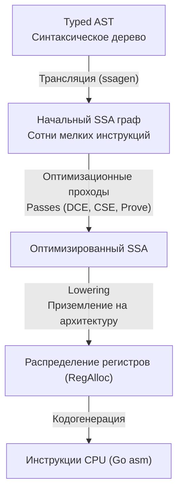

В лекции [[3. Фазы компиляции. Lexer, Parser, Type Checker, SSA]] мы остановились на том, как компилятор трансформировал типизированное синтаксическое дерево (AST) в линейный граф промежуточного представления (Intermediate Representation, IR). Теперь начинается кульминационный этап, на котором компилятор Go отрабатывает свою инженерную репутацию — фаза глубоких оптимизаций.

Сердцем и главным двигателем этих трансформаций выступает формат **SSA (Static Single Assignment)**. Понимание того, как компилятор оперирует этим графом, отличает прикладного разработчика от подлинного инженера, умеющего писать код с абсолютным сочувствием к процессору (**Mechanical Sympathy**).

---

## Что такое SSA и зачем он нужен

SSA — это математическое свойство промежуточного представления кода, при котором **каждой переменной значение присваивается ровно один раз** (Static *Single* Assignment).

В привычном императивном коде программист постоянно мутирует и переиспользует переменные ради экономии строк или локальной памяти:

```go
x := 5
x = x * 2
x = x + 1
```

Для человека такой код интуитивен: есть ячейка памяти `x`, значение которой последовательно изменяется. Но для компилятора изменяемое состояние во времени — сущий кошмар. Если код содержит разветвления (`if`/`else`), циклы и вызовы функций, отследить актуальное состояние переменной и ее истинную область жизни (liveness range) становится вычислительно неподъемной задачей.

В SSA-форме компилятор разворачивает эту последовательность, порождая на каждый шаг новое неизменяемое значение:

```asm
v1 = const 5
v2 = mul v1, const 2
v3 = add v2, const 1
```



В чем заключается фундаментальная сила SSA? Когда каждое значение константно с момента своего создания, компилятор оперирует **чистым графом зависимостей данных (Data Flow Graph)**. Если значение `v3` дальше нигде не читается и не возвращается, оптимизатор мгновенно доказывает, что `v3`, `v2` и `v1` являются балластом, и безжалостно вырезает их из итогового бинарника.

---

## Главные оптимизационные проходы (Passes)

Как только программа переведена в форму SSA, компилятор последовательно прогоняет граф через цепочку из более чем 40 специализированных проходов (optimization passes). Рассмотрим важнейшие из них, напрямую влияющие на производительность серверного бэкенда.

### 1. DCE (Dead Code Elimination)

Удаление мертвого кода. Если результат вычислений не влияет на возвращаемые значения функций и не порождает внешних побочных эффектов (запись в память, системные вызовы ввода-вывода, сетевые сокеты), компилятор удаляет эти инструкции.  
Если вы аллоцировали структуру, сериализовали ее в массив байт, но никуда не отправили и не вернули наружу — оптимизатор DCE сотрет эти вычисления, и процессор в продакшене не потратит на них ни единого такта.

### 2. CSE (Common Subexpression Elimination)

Устранение общих подвыражений. Если компилятор обнаруживает, что внутри базового блока одно и то же выражение вычисляется повторно над неизменными аргументами, он сохраняет результат первого вычисления и повторно использует его.

```go
// Исходный код разработчика:
a := x * y + 5
b := x * y + 10

// Представление SSA после прохода CSE:
v1 = mul x, y
a = add v1, 5
b = add v1, 10
```

Умножение `mul x, y` будет выполнено процессором всего один раз, сократив задержку конвейера.

### 3. Nil-check Elimination

При разыменовании указателя (`*ptr` или `ptr.Field`) язык обязан гарантировать безопасность: попытка доступа по нулевому адресу не должна приводить к неконтролируемому краху процесса операционной системы через аппаратное прерывание `SIGSEGV`. Рантайм Go перехватывает такие ситуации и трансформирует их в контролируемую панику (`panic: runtime error: invalid memory address or nil pointer dereference`).

Для этого компилятор генерирует явные инструкции проверки на `nil`. Однако избыточные проверки создают лишние условные переходы, засоряя буфер предсказателя ветвлений (Branch Target Buffer) в ядре CPU.  
В SSA компилятор анализирует граф доминирования (dominance frontier). Если в первой строке функции выполнено обращение `ptr.FieldA`, компилятор сохраняет проверку на `nil`. Но для всех последующих обращений к полям этого же объекта (`ptr.FieldB`, `ptr.FieldC`) в рамках той же ветки выполнения nil-check гарантированно удаляется: математически доказано, что если выполнение дошло до второй инструкции, указатель гарантированно не равен `nil`.

---

## Bounds Check Elimination (BCE)

**Bounds Check Elimination (BCE)** — один из самых мощных инструментов в арсенале высоконагруженной разработки на Go.

При каждом обращении к элементу среза по индексу (`slice[i]`), компилятор обязан вставить машинную инструкцию проверки: не выходит ли индекс за текущие границы длины `len` среза. Если индекс нарушает границы, программа обязана упасть с паникой: `panic: index out of range`.  
Под капотом среза (см. [[29. Внутреннее устройство slice]]) эта проверка выглядит как пара инструкций сравнения `CMP` и условного перехода `JMP`. В плотных вычислительных циклах (обработка видео, парсинг бинарных протоколов, криптография) эти проверки могут отнимать до 20–30% процессорного времени!

В компиляторе Go существует специальный фазовый проход `prove`, который строит систему линейных неравенств и математически доказывает безопасность обращений.

> [!warning] Ловушка / Gotcha: Наивный доступ к элементам
> 
> ```go
> func processBad(s []int) {
>     // Компилятор сгенерирует 3 независимые проверки границ (CMP + JMP)!
>     _ = s[0] 
>     _ = s[1] 
>     _ = s[2] 
> }
> ```
> В наивном коде компилятор проверяет границу перед каждым чтением, поскольку на каждом шаге ему неизвестно, не равен ли размер среза 1 или 2 элементам.

> [!tip] Собеседование: Как помочь компилятору применить BCE
> 
> Чтобы включить механизм BCE и полностью устранить избыточные проверки, опытные инженеры дают компилятору прозрачную подсказку, обращаясь к максимальному индексу первым:
> 
> ```go
> func processGood(s []int) {
>     _ = s[2] // Генерируется ОДНА проверка: len(s) > 2
>     // Для последующих обращений s[0] и s[1] компилятор через SSA доказывает, 
>     // что если длина среза строго больше 2, то индексы 0 и 1 гарантированно безопасны. 
>     // Проверки границ для них полностью удаляются (BCE)!
>     _ = s[0] 
>     _ = s[1] 
> }
> ```
> 
> Это классический паттерн **Mechanical Sympathy** в Go: мы слегка меняем структуру кода, чтобы помочь SSA-оптимизатору сформировать безупречный машинный код без лишних переходов.

---

## Инструментарий. Заглядываем под капот

Как воочию убедиться, что компилятор действительно проводит эти оптимизации над вашим кодом? Разработчики компилятора Go встроили превосходный инструмент визуализации SSA-графа.

Задав переменную окружения `GOSSAFUNC=ИмяФункции` при сборке, вы заставляете компилятор сформировать интерактивный HTML-отчет `ssa.html`:

```bash
GOSSAFUNC=main go build main.go
# Вывод: dumped SSA to ./ssa.html
```

Открыв сгенерированный файл в браузере, вы увидите полную матрицу фаз: каждая колонка соответствует отдельному проходу оптимизатора. Вы сможете своими глазами проследить, как на фазе `opt` схлопываются константы и стирается мертвый код, а на фазе `prove` исчезают красные блоки инструкций проверки границ слайсов (`IsInBounds`, `SliceBounds`).

Кроме того, флаг компилятора `-gcflags="-d=ssa/check_bce"` выводит в консоль точные номера строк, где проверки границ остались не устраненными:

```bash
go build -gcflags="-d=ssa/check_bce" main.go
```

---

## Lowering и распределение регистров

Финальный этап оптимизации SSA носит название **Lowering** (приземление на целевую архитектуру).

До этой фазы все инструкции были абстрактными и платформонезависимыми (например, `v3 = add v1, v2`). На этапе Lowering компилятор сопоставляет абстрактные операции с реальными мнемониками целевого процессора. Например, для архитектуры x86-64 абстрактное сложение трансформируется в аппаратную инструкцию `ADDQ`.

Сразу за Lowering следует работа **Register Allocator** (аллокатора регистров).  
В SSA-графе количество переменных (`v1`, `v2`, `v3`...) потенциально бесконечно. Однако в физическом кремнии x86-64 доступно всего 16 регистров общего назначения (`RAX`, `RBX`, `RCX`, `RDX`, `RSI`, `RDI`, `RBP`, `RSP`, `R8`–`R15`).  
Аллокатор регистров строит граф интервалов жизни переменных и производит раскраску графа:
- Переменные с высокой плотностью обращений закрепляются за быстрыми регистрами CPU;
- Если регистров не хватает, компилятор выполняет операцию **spilling** (вытеснение), сбрасывая значения менее приоритетных переменных в оперативную память — во фрейм стека текущей горутины.

---

## Итоги

1. **SSA (Static Single Assignment)** — математический фундамент современного компилятора Go, в котором каждое значение неизменяемо, что превращает код в прозрачный граф потока данных.
2. Благодаря SSA компилятор надежно и быстро выполняет ключевые оптимизации: удаление мертвого кода (**DCE**), схлопывание общих подвыражений (**CSE**) и устранение избыточных проверок указателей на `nil`.
3. **BCE (Bounds Check Elimination)** — важнейший рычаг производительности в высоконагруженном Go. Предварительное обращение к граничному индексу позволяет фазе `prove` математически доказать безопасность и вырезать проверки границ из критических путей.
4. На этапе **Lowering** абстрактный SSA-граф транслируется в конкретные опкоды инструкций CPU, а аллокатор регистров распределяет значения между физическими регистрами кремния и стеком.

На этапе Lowering наш высокоуровневый Go-код окончательно кристаллизуется в суровые машинные инструкции. Чтобы свободно читать отчеты профилировщика `pprof` и дизассемблера, нам необходимо уверенно ориентироваться во внутреннем ассемблере Go.

В следующей лекции мы детально разберем: [[5. Go assembler и внутренний ассемблерный синтаксис]].