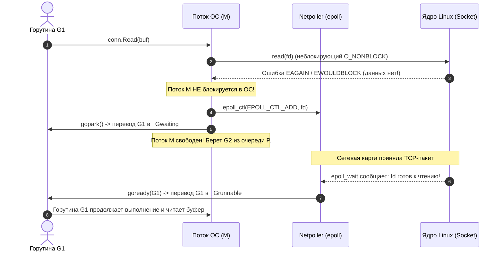
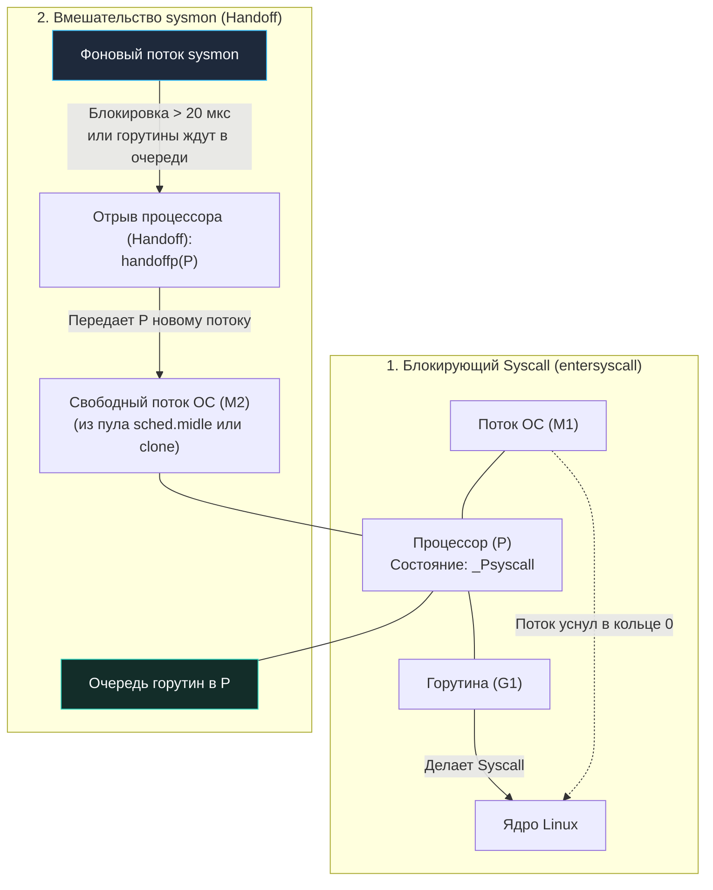

В прошлой статье ([[39. defer, panic и recover под капотом.md]]) мы изучили, как рантайм управляет потоком выполнения внутри самой программы. Но наша программа не существует в вакууме. Любое полезное действие — прочитать файл с SSD, отправить HTTP-запрос, записать строчку в лог или даже получить текущее время — требует прямого обращения к ядру операционной системы. 

Такое взаимодействие называется **Системным вызовом (Syscall)**. 

В классическом многопоточном программировании (например, в C++ или Java на уровне `java.lang.Thread`) системные вызовы тривиальны: один поток операционной системы выполняет одну задачу. Поток делает сисколл, процессор переключается из пространства пользователя (Ring 3) в пространство ядра (Ring 0), ядро ОС усыпляет этот поток, пока контроллер NVMe или сетевой чип не отдадут данные, а затем планировщик ОС будит поток.

Но для архитектуры Go с её M:N планировщиком (миллионы легковесных горутин `G` поверх фиксированного пула потоков ОС `M` и логических процессоров `P`) блокировка потока ОС — это архитектурная катастрофа. Если поток `M` намертво уснет в ядре, логический процессор `P` окажется заблокированным, а все десятки тысяч горутин в его локальной очереди остановятся и перестанут обрабатывать пользовательские запросы!

Как рантайм Go умудряется выполнять миллионы системных вызовов в секунду, обеспечивая минимальные задержки и не замораживая приложение? 

Рантайм делит все системные вызовы на две принципиальные категории: **асинхронные (Fast Path через Netpoller)** и **синхронные (Slow Path через Handoff и sysmon)**.

---

## 1. Fast Path: Асинхронные вызовы и Netpoller

Если вы разрабатываете веб-сервисы, gRPC-микросервисы или распределенные базы данных, 99% ваших системных вызовов — это сетевой ввод-вывод (Network I/O). 

Сеть принципиально асинхронна и непредсказуема. Мы можем ждать ответа от удаленного клиента 100 микросекунд, а можем ждать 60 секунд при медленном соединении (Keep-Alive). Блокировать реальный поток операционной системы на 60 секунд — непозволительная роскошь для высоконагруженного сервера.

Поэтому для работы с сетевыми соединениями Go использует **Неблокирующий системный ввод-вывод (Non-blocking I/O)** в тесной связке со встроенным в ядро механизмом мультиплексирования событий ввода-вывода:
* `epoll` на Linux;
* `kqueue` на macOS и FreeBSD;
* `IOCP` (I/O Completion Ports) на Windows.

В рантайме Go эта мощная подсистема называется **Netpoller** (сетевой поллер).



### Анатомия неблокирующего чтения:
1. При создании сетевого сокета рантайм автоматически переводит файловый дескриптор в неблокирующий режим с помощью флага `O_NONBLOCK`.
2. Когда горутина делает вызов `conn.Read()`, рантайм выполняет инструкцию `SYSCALL` (системный вызов `read`).
3. Если данных в буфере сокета ядра еще нет, ядро Linux не усыпляет поток, а мгновенно возвращает управление с кодом ошибки `EAGAIN` (или `EWOULDBLOCK` — «данных пока нет, попробуйте позже»).
4. Рантайм перехватывает этот статус. Вместо того чтобы блокировать поток `M`, он регистрирует файловый дескриптор сокета в `epoll` через `netpollopen`.
5. Горутина вызывает внутреннюю функцию рантайма `gopark` и переходит в состояние ожидания `_Gwaiting`, отвязываясь от потока `M`.
6. **Поток `M` остается полностью свободным!** Он моментально заглядывает в локальную очередь логического процессора `P`, забирает следующую готовую к выполнению горутину (`G2`) и продолжает работу без единого переключения контекста ОС.

### Кто будит горутину?
Фоновый опрос Netpoller происходит регулярно: его проверяет поток `sysmon`, а также сам планировщик рантайма при поиске работы (`findrunnable`), вызывая функцию `netpoll(delay)`. 

Как только в сокет приходят байты, ядро Linux через механизм прерываний NIC и кольцевой буфер `epoll` сообщает о готовности дескриптора. Netpoller извлекает дескриптор, находит припаркованную горутину, вызывает функцию `goready` и возвращает её в статус `_Grunnable`. Ближайший свободный процессор `P` берет её на исполнение.

---

## 2. Slow Path: Синхронные вызовы и Handoff

Что делать с файловыми операциями на диске (Disk I/O) или вызовами C-библиотек через CGO?

Исторически стандартные интерфейсы POSIX/Linux для работы с регулярными дисковыми файлами (в отличие от сокетов) **не поддерживают неблокирующий режим** через классический `epoll` (события готовности диска всегда возвращаются мгновенно, но сам вызов `read`/`write` блокирует поток в ядре до завершения перемещения головок HDD или чтения ячеек SSD). Лишь относительно недавно появившийся интерфейс ядра Linux `io_uring` решает эту проблему асинхронно, но стандартный файловый ввод-вывод Go (`os.ReadFile`, `os.Open`, `os.Write`) по сей день остается синхронным и блокирующим на уровне ОС.

Когда поток ОС засыпает на дисковом сисколле, в игру вступает фундаментальный механизм планировщика — **Syscall Handoff (Передача процессора)**.

Когда горутина собирается выполнить блокирующий сисколл, компилятор обрамляет его вызовами функций рантайма `entersyscall` и `exitsyscall`:

```go
// Псевдокод системного вызова в стандартной библиотеке
entersyscall()
syscall(SYS_READ, fd, buf, len) // Ассемблерная инструкция SYSCALL (блокирует поток M)
exitsyscall()
```

1. Функция `entersyscall` сохраняет контекст регистров горутины и переводит логический процессор `P` в состояние `_Psyscall`.
2. Поток `M1` выполняет реальный системный вызов ядра Linux и **намертво засыпает в пространстве ядра** (состояние `D` — uninterruptible sleep в `ps/top`).
3. Все остальные горутины, стоявшие в очереди этого `P`, оказываются под угрозой голодания (Starvation).



### Фоновый страж: sysmon

Чтобы спасти горутины, оставшиеся без процессора, рантайм использует специальный фоновый поток — **`sysmon`** (System Monitor).

`sysmon` — это уникальный компонент рантайма Go. Ему вообще не требуется логический процессор `P` для исполнения: он работает непосредственно как чистый поток операционной системы `M`. Он периодически просыпается (с динамическим интервалом от 20 микросекунд до 10 миллисекунд) и выполняет инспекцию состояния всей системы.

Если `sysmon` видит, что процессор `P` находится в состоянии `_Psyscall` дольше допустимого интервала (или если в локальной очереди `P` есть другие ожидающие горутины, а поток `M1` заблокировался), он выполняет операцию **Handoff**:
* Он насильно отрывает `P` от уснувшего потока `M1`.
* Передает `P` свободному потоку `M2` из глобального пула свободных потоков (`sched.midle`).
* Если свободных потоков в пуле нет, рантайм запрашивает у ядра ОС создание нового физического потока через системный вызов `clone` (Linux) или `pthread_create`.
* Поток `M2` мгновенно начинает исполнять оставшиеся горутины из очереди `P`. Задержки приложения спасены!

> [!warning] Ловушка / Gotcha. Рост количества потоков ОС
> По умолчанию рантайм Go может создать до **10 000 потоков ОС** (значение задается константой `maxmcount` и функцией `debug.SetMaxThreads`). Переменная окружения `GOMAXPROCS` жестко ограничивает только количество логических процессоров `P`, но **не ограничивает количество потоков `M`**!
> 
> Если ваше приложение запустит 5 000 параллельных горутин, и каждая из них вызовет долгий блокирующий сисколл (например, чтение с медленного сетевого NFS-диска или тяжелый запрос в базу через CGO-драйвер), `sysmon` произведет 5 000 Handoff-ов, и рантайм создаст 5 000 физических потоков ядра ОС! 
> 
> Это приведет к исчерпанию виртуальной памяти на стеки потоков ОС (по 2–8 МБ на поток), взрывному росту нагрузки на планировщик ядра Linux и потенциальному аварийному завершению приложения: `runtime: program exceeds 10000-thread limit`. 
> Для синхронного ввода-вывода всегда обязательно используйте пулы воркеров (Worker Pools) или семафоры!

---

## 3. Возвращение из Ядра (exitsyscall)

Что происходит, когда контроллер диска закончил передачу данных, и ядро ОС, наконец, разбудило поток `M1`?

Поток `M1` возвращается из системного вызова в пространство пользователя и немедленно вызывает функцию `exitsyscall`. 
Но поток `M1` теперь «гол»: у него больше нет привязанного процессора `P` (его отнял `sysmon` и отдал потоку `M2`). Без контекста `P` поток `M1` не имеет права выполнять Go-код, выделять память через `mcache` или трогать стек горутин!

Алгоритм `exitsyscall` работает по следующей строгой схеме:
1. **Fast Path:** `M1` проверяет, освободился ли его прежний `P`. Если старый `P` свободен, `M1` мгновенно забирает его обратно и продолжает выполнять горутину `G1`.
2. **Idle P:** Если старый `P` занят, `M1` пытается захватить любой свободный логический процессор в системе из списка `sched.pidle`.
3. **Slow Path:** Если все процессоры `P` в системе заняты выполнением других горутин, поток `M1` вынужден смириться. Он переводит горутину `G1` в состояние `_Grunnable` и помещает её в **Глобальную очередь выполнения (Global Run Queue)**, чтобы её подобрал первый освободившийся процессор. 
4. Сам поток `M1` паркуется и отправляется спать в глобальный пул неактивных потоков (`sched.midle`), ожидая следующего Handoff.

---

## 4. Исключение из правил: vDSO (Virtual Dynamic Shared Object)

> [!tip] Собеседование. Почему time.Now() работает так быстро?
> **Вопрос:** Если каждый классический системный вызов требует аппаратного переключения контекста в ядро ОС (перевод CPU в Ring 0, сброс конвейера инструкций, сохранение регистров, занимающий сотни наносекунд), как вызов функции `time.Now()` умудряется выполняться всего за 15–25 наносекунд и вообще не блокирует горутину?
> 
> **Ответ:** Благодаря механизму `vDSO`.

`vDSO` (Virtual Dynamic Shared Object) — это блестящая аппаратная оптимизация современных UNIX-подобных операционных систем (Linux). 

Ядро ОС при старте процесса проецирует (маппит) небольшую страницу физической памяти ядра напрямую в адресное пространство пользовательского процесса (в режиме Read-Only). На этой странице ядро регулярно обновляет глобальные переменные, не требующие привилегированного доступа: текущее системное время, счетчик монотонного времени и параметры таймеров.

```
       Пространство ядра (Ring 0)
       ┌────────────────────────┐
       │   Обновление времени   │
       └───────────┬────────────┘
                   │ Запись без прерываний
                   ▼
┌──────────────────────────────────────────────┐
│  Страница vDSO (Read-Only для User Space)    │
└──────────────────┬───────────────────────────┘
                   │ Прямое чтение RDTSC / L1d
                   ▼
       Пространство пользователя (Ring 3)
       ┌────────────────────────┐
       │     Go: time.Now()     │  <-- 0 переключений контекста CPU!
       └────────────────────────┘
```

Когда рантайм Go выполняет `time.Now()` (через встроенную реализацию в `runtime.nanotime`), он не выполняет инструкцию `SYSCALL`. Он просто читает значение прямо из спроецированной страницы памяти vDSO и задействует аппаратный счетчик тактов процессора `RDTSC` (Read Time-Stamp Counter). 

Переключения контекста процессора в кольцо 0 не происходит вовсе — это обычная операция чтения из кэша L1d, абсолютно бесплатная для планировщика Go!

---

## Итог

1. **Netpoller (epoll / kqueue / IOCP):** Применяется для всех сетевых сокетов. Неблокирующий ввод-вывод (`O_NONBLOCK`). При отсутствии данных горутина паркуется (`gopark`), а поток ОС `M` немедленно берет другую работу. Самый эффективный путь.
2. **Syscall Handoff:** Применяется для синхронных файловых операций (диск) и CGO. Поток `M` засыпает в ядре ОС.
3. **sysmon:** Автономный фоновый поток, спасающий систему от зависания. Если сисколл длится дольше допустимого, он забирает процессор `P` у спящего потока и отдает его другому `M`.
4. **exitsyscall:** При выходе из ядра поток пытается вернуть `P`, а при его отсутствии сдает горутину в глобальную очередь и засыпает.
5. **vDSO:** Оптимизация ядра Linux, позволяющая получать время через `time.Now()` за наносекунды без реального входа в ядро.

Мы увидели, как рантайм Go изолирует блокирующие системные вызовы. Однако в системном программировании нередко приходится вызывать не системные вызовы ядра, а сторонние библиотеки, написанные на языке C (CGO). 

Почему вызов простейшей C-функции стоит в десятки раз дороже обычного вызова функции Go? Как рантайм решает конфликт между фиксированным стеком C и динамическим сегментированным стеком Go?

В следующей статье мы разберем анатомию межъязыкового моста:
[[41. cgo. Как Go взаимодействует с C.md]]