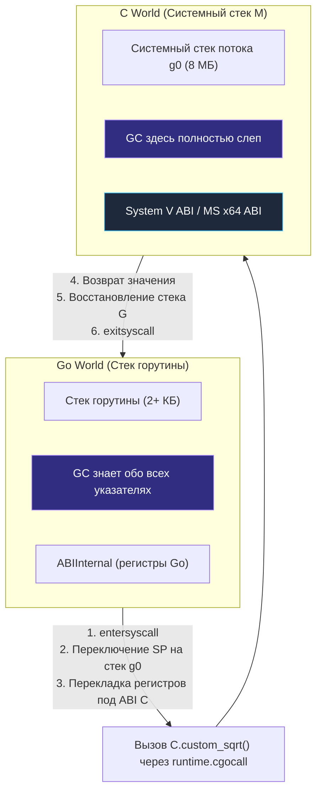

В прошлой статье ([[40. Как runtime обрабатывает системные вызовы.md]]) мы узнали, что рантайм Go панически боится длительной блокировки потоков ОС и применяет агрессивный механизм Handoff (отрыв процессора `P`), если системный вызов затягивается. Мы также упомянули, что вызовы стороннего кода на языке C (через механизм CGO) идут именно по этому «тяжелому» системному пути.

Почему это так важно? 

Язык C — это фундамент современных операционных систем, графических стеков и высокопроизводительных драйверов. Миллионы строк проверенного кода — от криптографического ядра OpenSSL и графических движков OpenCV до встраиваемой базы данных SQLite — написаны на C/C++. Переписывать эти гигантские кодовые базы на чистый Go с нуля — колоссальная инженерная задача, требующая десятилетий труда. Поэтому в инструментарий Go с первых дней встроен механизм **CGO**, позволяющий бесшовно связывать мир Go с миром C.

Но за эту интеграцию приходится платить высокую аппаратную и архитектурную цену. Один из авторов Go, Роб Пайк, посвятил этой проблеме знаменитое эссе с категоричным девизом: *«cgo is not Go»*. 

Давайте разберемся, почему мост между двумя языками стоит так дорого, как рантайм переключает процессорные контексты и стеки и какие опасности подстерегают инженера при передаче указателей через границу двух миров.

---

## 1. Магия синтаксиса: import "C"

С точки зрения синтаксиса использование CGO выглядит как волшебство псевдопакета. Вы объявляете C-заголовки и даже пишете чистый C-код прямо в блочном комментарии непосредственно над специальной директивой `import "C"`.

```go
package main

/*
#include <stdlib.h>
#include <math.h>

double custom_sqrt(double x) {
    return sqrt(x);
}
*/
import "C" // Этот псевдоимпорт активирует препроцессор cgo
import "fmt"

func main() {
    // Вызываем C-функцию как метод псевдопакета C
    val := C.custom_sqrt(16.0)
    fmt.Printf("Корень: %f\n", val)
}
```

Когда вы запускаете команду `go build`, компилятор Go видит импорт `import "C"` и переключает процесс сборки на специальную утилиту — **cgo**.

Утилита `cgo` выполняет глубокую трансформацию исходного кода:
1. Вырезает C-код из комментариев, конструирует временные `.c` и `.h` файлы и отправляет их системному C-компилятору (например, `gcc` или `clang`).
2. Генерирует промежуточные низкоуровневые Go-файлы-обертки (файлы `_cgo_export.c`, `_cgo_gotypes.go`), которые содержат машинный код для преобразования типов данных и вызова функций по соглашениям C (C Calling Convention).
3. Системный компоновщик (Linker) объединяет скомпилированные объектные файлы C и Go в единый исполняемый бинарник.

---

## 2. Разница миров: Стеки и Контекст

Почему нельзя просто выполнить ассемблерную инструкцию `CALL` к адресу скомпилированной C-функции, как это делается для обычных функций внутри Go?

Причина кроется в абсолютной несовместимости двух архитектурных миров.

1. **Несовместимость стеков:** Как мы подробно разбирали в [[11. Стек горутины. Рост и shrink стека.md]], стек горутины динамический. Он стартует всего с 2 КБ и при необходимости копируется в новый расширенный блок памяти.  
   Язык C ничего не знает о сегментированных или копируемых стеках Go. Если C-функция выделит на стеке массив `char buffer[8192]`, она мгновенно выйдет за пределы 2-килобайтного стека горутины и затрет чужие данные в памяти! Языку C требуется стандартный, большой и непрерывный стек операционной системы (обычно от 2 до 8 МБ на поток).
2. **Несовместимость ABI (Application Binary Interface):** Начиная с версии Go 1.17, язык Go использует регистровый ABIInternal (передача аргументов через регистры `RAX`, `RBX`, `RCX`...). Язык C на x86-64 Linux использует стандартный System V AMD64 ABI (передача через `RDI`, `RSI`, `RDX`, `RCX`, `R8`, `R9`). Перед вызовом процессор обязан полностью переложить аргументы из одних регистров в другие.
3. **Сборщик мусора (GC):** Системный код C управляет памятью вручную (`malloc`/`free`). Он ничего не знает о Триколорном алгоритме, барьерах записи Write Barrier и перемещении указателей при росте стека.

Поэтому для вызова любой функции C рантайм Go вынужден выполнять сложнейший **Контекстный переход (Context Switch)**.



### Анатомия вызова (runtime.cgocall):
1. Вызов заворачивается во внутреннюю функцию `runtime.cgocall`.
2. Горутина вызывает `runtime.entersyscall`, переводя логический процессор `P` в состояние `_Psyscall` (подготавливая его к Handoff).
3. Рантайм переключает регистр указателя стека `SP` с маленького стека горутины на большой системный стек (`g0`) текущего потока ОС `M`.
4. Сохраняются регистры, накладывается переходник ABI, и вызывается реальная функция C.
5. После возврата из C-кода рантайм восстанавливает регистры, переключается обратно на стек горутины и вызывает `runtime.exitsyscall`, пытаясь вернуть себе процессор `P`.

Этот сложный протокол перехода занимает около **50-100 наносекунд** процессорного времени на каждый CGO-вызов просто на пересечение границы туда-обратно (даже если сама C-функция делает элементарное сложение). 

Для сравнения, вызов обычной Go-функции занимает около **1-2 наносекунд** (а при инлайнинге — 0 наносекунд!).

---

## 3. Налог на Планировщик (Sysmon Handoff)

Переключение стеков и накладные расходы на регистры — это лишь часть цены. Главная опасность кроется в поведении планировщика.

Для планировщика Go любой CGO-вызов выглядит как «черный ящик». Рантайм Go не может вставить точку проверки прерывания (Preemption check) внутрь стороннего скомпилированного машинного кода C. Если C-функция вызывает блокирующую операцию `sleep(10)` или выполняет тяжелый матричный расчет на 5 секунд, реальный поток операционной системы `M` оказывается полностью захвачен.

Поэтому фоновый поток `sysmon` рассматривает поток, зашедший в CGO, точно так же, как застрявший в системном вызове: он **отрывает процессор `P` (Handoff)** от спящего потока `M` и передает его новому или свободному потоку ОС.

Если ваш сервис в цикле запускает тысячи горутин, и каждая из них делает короткие CGO-вызовы, рантайм начинает непрерывно отрывать процессоры и спавнить новые потоки ядра ОС (эффект **Thread Churn**). Сервер захлебывается в переключениях контекста ядра ОС, а потребление виртуальной памяти на системные стеки улетает в гигабайты.

---

## 4. Память и Указатели: Смертельная зона

Поскольку Сборщик мусора (GC) в Go сканирует кучу и может перемещать стеки горутин, а C-код работает с памятью через прямые физические адреса, передача указателей между Go и C жестко регламентирована сводом строгих правил — **CGO Pointer Passing Rules**.

Нарушение этих правил приводит к аварийному падению программы с фатальной ошибкой `cgo argument has Go pointer to Go pointer` или тихому повреждению памяти (Memory Corruption).

### Правило 1: Можно передавать Go-указатели в C

Вы можете передать указатель на Go-слайс, массив или базовый тип в C-функцию (например, буфер для чтения из сети). На всё время работы вызова CGO рантайм Go гарантирует, что объект в куче не будет удален сборщиком мусора.

Начиная с Go 1.21, появился официальный пакет `runtime.Pinner`, позволяющий программисту явно закреплять («прикалывать» / Pin) объекты Go в памяти:
```go
var pinner runtime.Pinner
pinner.Pin(goSlice)
defer pinner.Unpin()
```

### Правило 2: Запрещено передавать вложенные Go-указатели

Вы **не можете** передать в C структуру или слайс, который содержит внутри себя другой Go-указатель (например, структуру с полем `*string` или срез срезов). 

Почему? C-компилятор может сохранить адрес внутреннего поля, а сборщик мусора Go не умеет отслеживать ссылки, хранящиеся внутри чужих C-структур. Если рантайм обнаружит вложенный указатель при включенном `cgocheck`, он немедленно прервет выполнение с паникой: `cgo argument has Go pointer to Go pointer`.

### Правило 3: C-код не может сохранять Go-указатели

После того как C-функция завершила работу (выполнила инструкцию `return`), она **обязана забыть** все переданные ей Go-указатели. C-код не имеет права сохранять адрес объекта Go в глобальную статическую переменную C для использования в будущем. Как только вызов завершен, сборщик мусора возобновляет контроль над объектом, и сохраненный в C указатель может стать висячим (Dangling Pointer).

### Решение: C.malloc и C.free

Если C-библиотеке требуется долговременное владение буфером памяти, память необходимо аллоцировать вручную в системной куче C:

```go
// Выделяем память в системной куче C через malloc (вне контроля Go GC)
cStr := C.CString("Привет из Go")

// Инженер обязан освободить память вручную, иначе произойдет классический Memory Leak!
defer C.free(unsafe.Pointer(cStr)) 

// Теперь этот указатель можно безопасно передать в глобальное хранилище C:
C.save_string_in_c_global_var(cStr)
```

Функция `C.CString` делает системный вызов `malloc`, копирует туда байты Go-строки и добавляет нулевой терминатор `\0`. Эта память полностью невидима для сборщика мусора Go.

---

## 5. Почему "CGO is not Go"?

Использование CGO лишает вас фундаментальных преимуществ экосистемы Go, ради которых инженеры выбирают этот язык:

1. **Смерть кросс-компиляции:** В чистом Go для кросс-компиляции достаточно одной команды: `GOOS=linux GOARCH=amd64 go build`. При включенном CGO стандартный компилятор бессилен: вам потребуется полностью настроенный C-кросс-тулчейн под целевую платформу (Sysroot, GCC/Clang, системные библиотеки ядра и заголовки `libc`).
2. **Медленная компиляция:** Скорость сборки проектов на Go феноменальна. Но как только появляется CGO, проект начинает компилироваться минутами из-за медленного системного C-компилятора и препроцессора `cgo`.
3. **Утрата статических самодостаточных бинарников:** Чистый бинарник Go не зависит от установленных в ОС библиотек. Бинарник с CGO динамически связывается с системной библиотекой `libc` (например, GNU `glibc`). Если вы скомпилируете бинарник на машине с Ubuntu 24.04 и перенесете его на сервер с более старой версией ОС, он откажется запускаться с ошибкой вида `glibc not found / version GLIBC_2.38 not found`.
4. **Слепота профайлеров:** Стандартные профилировщики `pprof` и встроенный механизм `trace` останавливаются на границе Go. Они не могут заглянуть внутрь C-библиотеки. Если C-код утекает по памяти через `malloc` или застревает в бесконечном цикле, вам придется привлекать внешние отладчики (`gdb`, `lldb`) и утилиты вроде `valgrind`.

> [!tip] Альтернативы CGO в современном бэкенде
> Прежде чем тянуть C-библиотеку через CGO, рассмотрите альтернативы:
> 1. **Чистые Go-порты:** Например, вместо C-библиотеки `mattn/go-sqlite3` используйте чистый Go-порт `modernc.org/sqlite`.
> 2. **WebAssembly / WASI:** С помощью компилятора в Wasm и чистого рантайма `wazero` вы можете запускать C/C++/Rust код внутри процесса Go без использования CGO, без переключения стеков и с сохранением кросс-компиляции!
> 3. **Внешний процесс (IPC):** Запустите C-библиотеку в виде отдельного микросервиса или изолированного демона, общаясь с ним через быстрые локальные сокеты (UNIX Domain Sockets) или Shared Memory.

---

## Итог

1. **CGO** — это мост для вызова библиотек C из Go с помощью кодогенератора `cgo` и внешнего C-компилятора.
2. Стоимость вызова CGO огромна: около **50-100 наносекунд** на смену стека (с динамического стека горутины на системный стек `g0`), согласование регистровых ABI и вызовы `entersyscall/exitsyscall`.
3. CGO-вызовы блокируют поток ОС, заставляя поток `sysmon` отрывать процессор `P` (Handoff), что при интенсивной нагрузке ведет к взрывному росту потоков ядра.
4. Передача памяти через CGO строго ограничена: C-код не имеет права сохранять Go-указатели или принимать вложенные указатели. Долговременные буферы выделяются вручную через `C.CString` и `C.free`.
5. CGO ломает статические бинарники, кросс-компиляцию и встроенное профилирование.

Мы несколько раз упоминали `sysmon` и планировщик, которые пытаются спасти горутины, когда одна из них заблокировалась в сисколле или CGO.

Как именно планировщик решает, кому отдать освободившийся процессор `P`, и как работают блокирующие вызовы на уровне самого планировщика?

В следующей статье мы углубимся в работу планировщика с системными вызовами:
[[42. Планировщик и блокирующие syscalls.md]]