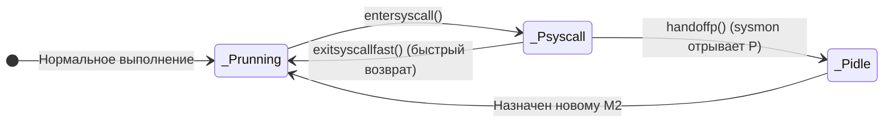
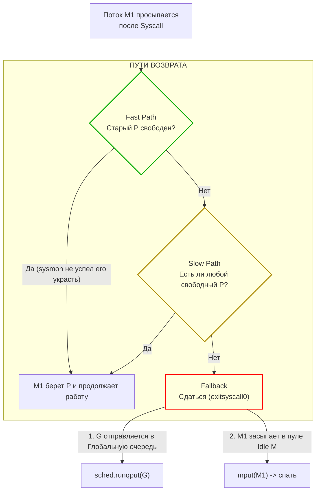

В статье [[40. Как runtime обрабатывает системные вызовы.md]] мы поверхностно коснулись того, как системный монитор `sysmon` отрывает процессор `P` от заблокированного потока `M` (механизм Handoff). А в [[41. cgo. Как Go взаимодействует с C.md]] выяснили, что вызовы C-кода идут именно по этому тяжелому пути синхронных блокировок.

Но для системного инженера и архитектора фраза «отрывает процессор» звучит слишком абстрактно и расплывчато. Планировщик Go — это строгая, математически выверенная конечная машина состояний (State Machine). 

Чтобы научиться диагностировать и устранять скрытые всплески задержек (Latency Spikes P99), нам необходимо опуститься на уровень исходного кода рантайма (`src/runtime/proc.go`) и проследить каждый шаг горутин и потоков при их погружении в ядро операционной системы и возвращении обратно в пространство пользователя.

---

## 1. Погружение во тьму: entersyscall

Когда горутина (G) инициирует синхронный системный вызов (например, `syscall.Read` для локального файла на диске) или пересекает границу CGO, компилятор вызывает функцию `reentersyscall` (или стандартную `entersyscall`).

В этот момент рантайм производит подготовку к потенциально долгой блокировке:
1. **Статус G:** Горутина меняет свой статус с `_Grunning` на `_Gsyscall`.
2. **Отвязка кэша аллокатора:** Горутина сбрасывает прямую связь с локальным кэшем аллокатора `mcache` (так как во время нахождения в пространстве ядра операционной системы нельзя аллоцировать память в куче Go).
3. **Статус P:** Логический процессор `P` меняет статус с `_Prunning` на `_Psyscall`.
4. **Фиксация времени в sysmon:** Процессор `P` сохраняет текущий такт планировщика (`schedtick`) и временную метку, чтобы фоновый монитор мог точно определить продолжительность блокировки.



> **Ключевой нюанс:** На этапе вызова `entersyscall` физический поток операционной системы (`M`) **всё ещё владеет** процессором `P`! Рантайм проявляет инженерный оптимизм: большинство дисковых сисколлов (например, чтение данных, уже прогретых в Page Cache операционной системы) отрабатывают за сотни наносекунд. Немедленно отрывать `P` и будить новый поток ОС было бы расточительством — переключение контекста ядра ОС заняло бы в разы больше времени, чем сам сисколл!

Пометив `P` как `_Psyscall`, поток `M` выполняет ассемблерную инструкцию `SYSCALL` и переходит в ядро Linux.

---

## 2. Кража процессора: Syscall Handoff

Если данные не оказались в оперативной памяти (Page Cache), дисковый контроллер усыпляет поток `M1` в пространстве ядра. Поток спит, а его логический процессор `P` простаивает со статусом `_Psyscall`. 

А ведь в локальной очереди выполнения этого `P` (массив `runq`) могут находиться еще 256 готовых к работе горутин! Каждая наносекунда их простоя — это прямая деградация производительности сервиса.

Раз в $20$ микросекунд (с адаптивным увеличением до $10$ миллисекунд при простое) просыпается фоновый страж — поток **`sysmon`**.
Он итерируется по глобальному массиву всех процессоров (`allp`) и инспектирует их состояние.

Если `sysmon` видит, что процессор находится со статусом `_Psyscall` дольше порогового интервала (или в его локальной очереди есть ждущие горутины), он инициирует процедуру **Handoff (Передача процессора)**:
1. `sysmon` атомарно меняет статус процессора `P` с `_Psyscall` на `_Pidle` (свободен).
2. Вызывает функцию `handoffp(p)`.
3. Рантайм пытается найти свободный поток `M` в глобальном пуле спящих потоков (`sched.midle`). Если свободных потоков нет, рантайм порождает новый физический поток ОС через системный вызов `clone`.
4. Новый поток `M2` забирает освободившийся процессор `P`, переводит его в рабочий статус `_Prunning` и немедленно начинает выполнять горутины из его локальной очереди.

Горутины спасены от голодания. Но что произойдет с первым потоком `M1`, когда ядро ОС разбудит его?

---

## 3. Возвращение из ядра: exitsyscall

Ядро Linux завершило операцию ввода-вывода и вернуло поток `M1` в пространство пользователя.
Поток `M1` готов возобновить выполнение своей горутины (G), но он лишен прав: у него больше нет привязанного процессора `P`. Без `P` поток не имеет права исполнять Go-код, так как ему недоступны локальный кэш памяти `mcache`, стек горутины и планировщик.

Поток вызывает функцию `exitsyscall`. Перед ним открываются три возможных пути:



### 1. Fast Path (Быстрый путь)

Поток `M1` проверяет свой прежний процессор `P`. Если системный вызов завершился молниеносно (например, данные были в кэше), поток `sysmon` просто не успел среагировать и запустить `handoffp`. 

В этом случае прежний `P` всё еще привязан к `M1`. Поток атомарно возвращает статус процессора в `_Prunning`, статус горутины — в `_Grunning`, и немедленно продолжает выполнение с нулевыми накладными расходами!

### 2. Slow Path (Медленный путь)

Если прежний `P` уже был украден и отдан потоку `M2`, поток `M1` опрашивает глобальный список свободных процессоров (`sched.pidle`). 

Если в системе есть хотя бы один незанятый `P` (например, соседний поток только что завершил свои горутины и заснул), `M1` привязывает этот свободный `P` к себе, прикрепляет его `mcache` и продолжает выполнение.

### 3. Fallback (Изгнание в Глобальную очередь)

Худший сценарий: сервер находится под 100% утилизацией процессора, и абсолютно все `P` заняты полезной работой.

Потоку `M1` негде исполнять код. Он вызывает функцию `exitsyscall0`:
1. Отвязывает от себя горутину `G`.
2. Переводит горутину `G` в статус `_Grunnable` (готова к выполнению).
3. Помещает горутину в **Глобальную очередь выполнения (Global Run Queue)** под защитой глобального мьютекса планировщика `sched.lock`.
4. Сам поток `M1` паркуется и отправляется спать в глобальный пул свободных потоков (`sched.midle`).

---

## 4. Mechanical Sympathy: Глобальная очередь и правило 61

Когда наша горутина оказывается изгнана в Глобальную очередь выполнения, возникает прямая угроза **Голодания (Starvation)**.

По умолчанию каждый процессор `P` берет задачи из своей *локальной* очереди (это не требует блокировок мьютексом и удерживает процессорный кэш L1/L2 горячим). Если локальные очереди постоянно пополняются новыми задачами, планировщик рискует никогда не заглянуть в Глобальную очередь.

Чтобы гарантировать справедливость планирования, разработчики рантайма Go внедрили элегантный механизм — **Правило 61 тика**.

Внутри структуры каждого логического процессора `P` ведется целочисленный счетчик запланированных горутин — поле `schedtick`. Алгоритм поиска работы функцией `findrunnable` начинается со строгой проверки:

```go
// src/runtime/proc.go
if _p_.schedtick%61 == 0 && sched.runqsize > 0 {
    lock(&sched.lock)
    gp := globrunqget(_p_, 1) // Забрать горутину из Глобальной очереди!
    unlock(&sched.lock)
    return gp, false, true
}
```

Каждый 61-й такт планировщика процессор **обязан** проигнорировать свою локальную очередь, захватить мьютекс `sched.lock`, заглянуть в Глобальную очередь и забрать оттуда задачу!

**Почему именно 61?**  
61 — это простое число (Prime Number). Выбор простого числа предотвращает гармоническую синхронизацию между ядрами CPU: если в системе работает 8 или 16 процессоров `P`, вероятность того, что несколько процессоров одновременно разделят свой `schedtick` на 61 и одновременно ринутся захватывать глобальный мьютекс `sched.lock`, стремится к нулю. Это исключает аппаратный затор (Lock Contention) на шине памяти.

---

## 5. Thread Exhaustion: Предел потоков

Механизм Handoff обеспечивает феноменальную отзывчивость системы, но несет в себе скрытую угрозу при неграмотном архитектурном проектировании.

Представьте конфигурацию: `GOMAXPROCS = 8` (8 процессоров `P`).  
Разработчик запускает 1 000 горутин, и каждая из них одновременно выполняет синхронный вызов к сетевому диску или обращается к базе данных через CGO-библиотеку:

1. Первые 8 потоков `M` вызывают сисколл и засыпают.
2. `sysmon` видит простой, отрывает 8 процессоров `P` и создает **8 новых потоков ОС**, чтобы их обслужить.
3. Новые 8 потоков берут следующие 8 горутин и тоже блокируются в ядре...
4. `sysmon` снова отрывает `P` и спавнит еще 8 потоков ядра ОС...

В результате количество потоков ОС начинает лавинообразно расти. Каждый системный поток Linux резервирует от 2 до 8 МБ виртуального адресного пространства под свой системный стек. Тысяча потоков сожрет гигабайты памяти только на служебные структуры ядра ОС!

Чтобы уберечь операционную систему от исчерпания ресурсов (Thread Starvation) и ядра от Kernel Panic, рантайм Go устанавливает жесткий защитный барьер: **10 000 потоков ОС на один процесс**.

Если `sysmon` попытается создать 10 001-й поток, рантайм мгновенно аварийно завершит программу:
```
fatal error: thread exhaustion
```

> [!warning] Управление лимитом потоков
> Вы можете скорректировать этот лимит через стандартную библиотеку:
> ```go
> import "runtime/debug"
> 
> // Увеличить лимит потоков ОС (использовать с предельной осторожностью!)
> debug.SetMaxThreads(20000)
> ```
> Однако увеличение `SetMaxThreads` — это почти всегда попытка замаскировать архитектурную ошибку. Правильное решение — ограничение степени параллелизма через Worker Pool (пул воркеров) или семафор с буферизированным каналом (`chan struct{}`), чтобы число одновременно выполняемых блокирующих сисколлов никогда не превышало разумных пределов.

---

## Итог

1. **`entersyscall`:** Горутина переходит в статус `_Gsyscall`, процессор — в `_Psyscall`. Поток `M` временно сохраняет владение `P`, оптимистично надеясь на быстрый возврат из сисколла.
2. **Handoff (`handoffp`):** Если сисколл затягивается, фоновый `sysmon` отрывает `P` и передает его новому или спящему потоку `M2`, сохраняя параллелизм на уровне `GOMAXPROCS`.
3. **`exitsyscall`:** По возвращении из ядра поток пытается вернуть свой `P` (Fast Path) или захватить свободный `sched.pidle` (Slow Path). Если свободных `P` нет, горутина отправляется в Глобальную очередь (`_Grunnable`), а поток `M` засыпает.
4. **Правило 61 тика:** Предотвращает голодание горутин в Глобальной очереди: каждый 61-й шаг процессор забирает работу из общего пула.
5. **Thread Exhaustion:** Лавинообразные блокирующие сисколлы могут исчерпать потоки ОС и привести к крашу с ошибкой `fatal error: thread exhaustion` (лимит 10 000).

Мы подробно рассмотрели ситуации, когда горутины *добровольно* уступают процессор: при системных вызовах (`entersyscall`), парковке на каналах (`gopark`), сетевом вводе-выводе (`Netpoller`) или явном вызове `runtime.Gosched()`. Это фундаментальный принцип кооперативной многозадачности.

Но что произойдет, если программист напишет жадный плотный цикл вычислений `for { }` без единого системного вызова, без вызовов функций и без аллокаций? Зависнет ли всё приложение? Как рантайм Go научился принудительно отбирать процессор у горутины с помощью сигналов ядра ОС?

В следующей статье мы разберем эволюцию механизма вытеснения в Go:
[[43. Preemption. Как Go останавливает горутины.md]]