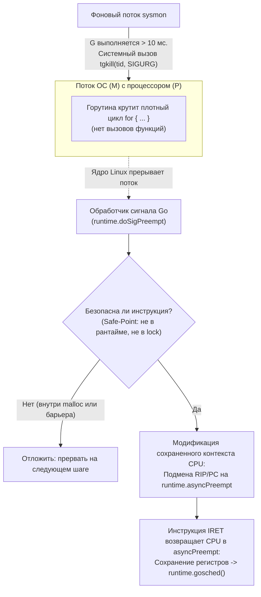

В прошлых статьях мы рассматривали ситуации, когда горутины отдают процессор `P` добровольно (или полудобровольно). Системные вызовы, чтение из сетевого сокета через Netpoller, блокировка на мьютексе или ожидание данных из канала — во всех этих сценариях рантайм заранее знает, что горутина не может продолжать работу, и планировщик выполняет переключение контекста. Это классическая **Кооперативная многозадачность (Cooperative Multitasking)**.

Но что произойдет, если программист случайно или намеренно напишет следующий фрагмент кода:

```go
func main() {
    runtime.GOMAXPROCS(1)
    
    go func() {
        // Фоновая задача
        fmt.Println("Я работаю!") 
    }()

    // Бесконечный плотный цикл без вызовов функций и аллокаций памяти
    for {
        // Чистая математика в регистрах CPU
        i := 0
        i++
    }
}
```

В ранних версиях Go этот код приводил к полной катастрофе. 

Фоновая горутина никогда не напечатала бы текст! Главная горутина монопольно захватывала единственный логический процессор `P` и бесконечно крутилась на ядре CPU, потому что в теле цикла нет ни каналов, ни системных вызовов, ни переключений.

Хуже того: в такой программе **не мог запуститься сборщик мусора (GC)**! Для перехода в фазу разметки или завершения Stop-The-World (STW) рантайму требуется перевести абсолютно *все* горутины в состояние паузы на безопасной точке (Safe Point). Если хотя бы одна горутина бесконечно крутится в цикле, не отдавая процессор, GC будет ждать её вечно. Процесс намертво зависал, а очередь запросов переполнялась до падения по Out Of Memory.

Чтобы язык мог работать в реальных серверных условиях, планировщик обязан уметь отбирать процессор у «жадной» горутины принудительно. Этот фундаментальный механизм называется **Вытеснением (Preemption)**.

---

## Эра 1: Кооперативное вытеснение (до Go 1.14)

Создатели Go изначально стремились избежать классического вытеснения потоков ОС по таймеру (как в планировщике ядра Linux CFS), поскольку обработка аппаратного прерывания таймера на каждый квант времени — относительно тяжелая операция, снижающая общую пропускную способность (Throughput) микро-горутин.

Поэтому в версиях Go от 1.0 до 1.13 действовала хитроумная схема: вытеснение маскировалось под рутинную проверку размера стека.

Как мы помним из статьи про стек горутины, компилятор Go генерирует в прологе (самом начале) практически каждой функции короткую ассемблерную инструкцию проверки:
```asm
CMPQ SP, 16(R14) // Сравнение SP со значением stackguard0
JBE  morestack   // Если SP < stackguard0, прыгаем в выделение памяти
```
Она проверяет, хватает ли горутине свободного места на стеке (`SP < stackguard0`). Если места недостаточно, вызывается ассемблерный трамплин `runtime.morestack` для выделения нового блока памяти.

Разработчики рантайма применили изящный трюк («отравление стека»):
1. Фоновый системный поток `sysmon` сканирует все логические процессоры `P`.
2. Если он видит, что какая-то горутина выполняется непрерывно дольше **10 миллисекунд**, он помечает её как нарушителя.
3. Поток `sysmon` записывает в поле `stackguard0` этой горутины специальное константное служебное значение — маркер `stackPreempt` (равный `0xfffffffffffffade` на 64-битных системах).
4. Когда ничего не подозревающая горутина вызывает **любую следующую функцию**, процессор выполняет стандартную проверку пролога.
5. Увидев огромное значение `stackPreempt`, процессор решает, что стек горутины переполнен, и вызывает `runtime.morestack`.
6. Функция `runtime.morestack` инспектирует адрес и понимает: переполнения нет, это сигнал принудительного вытеснения! Она вызывает `runtime.gosched()`, отвязывает горутину от процессора `P`, переводит её в статус `_Grunnable` и отправляет в Глобальную очередь выполнения. Процессор `P` берет другую задачу.

```mermaid
flowchart LR
    classDef process  fill:#1e293b,stroke:#38bdf8,stroke-width:1px,color:#f8fafc
    classDef success  fill:#064e3b,stroke:#34d399,stroke-width:1px,color:#f8fafc
    classDef error    fill:#7f1d1d,stroke:#f87171,stroke-width:1px,color:#f8fafc
    classDef warning  fill:#78350f,stroke:#fbbf24,stroke-width:1px,color:#f8fafc
    classDef entry    fill:#1e3a5f,stroke:#38bdf8,stroke-width:2px,color:#f8fafc
    classDef aux      fill:#334155,stroke:#64748b,stroke-width:1px,color:#f8fafc
    classDef system   fill:#312e81,stroke:#a78bfa,stroke-width:1px,color:#f8fafc
    classDef data     fill:#132d29,stroke:#2dd4bf,stroke-width:1px,color:#f8fafc
    classDef network  fill:#881337,stroke:#fb7185,stroke-width:1px,color:#f8fafc
    classDef accent   fill:#1e1b4b,stroke:#818cf8,stroke-width:1px,color:#f8fafc
    SYSMON["sysmon видит G > 10 мс"]:::process -->|"Запись stackPreempt в стек"| POISON["g.stackguard0 = 0xfffffffffffffade"]
    POISON --> NEXT_CALL["Горутина вызывает любую функцию foo()"]
    NEXT_CALL --> CHECK{"SP < stackguard0?"}
    CHECK -- "Да (переполнение?)" --> MORE["runtime.morestack()"]
    MORE --> GOSCHED["Распознан сигнал вытеснения:<br>runtime.gosched() -> уход в очередь"]
```



### В чем был фатальный изъян?
Кооперативное вытеснение срабатывало **исключительно при вызове функций**!

Если горутина выполняла тяжелый математический расчет, матричное умножение, криптографический хэш или алгоритм сжатия в цикле `for`, и все вспомогательные функции были встроены компилятором (Inlined), в сгенерированном машинном коде **не было ни одного пролога функции**.

Горутина становилась неуязвимой для планировщика. Паузы Stop-The-World для сборки мусора растягивались на секунды, превращая сервис с низкими задержками в застывшую глыбу.

---

## Эра 2: Асинхронное вытеснение (Go 1.14+)

Проблему бесконечных циклов требовалось решить раз и навсегда. В Go 1.14 инженер Google Остин Клементс (Austin Clements) реализовал полноценное **Некооперативное асинхронное вытеснение (Asynchronous Preemption)** на основе сигналов операционной системы.

Теперь рантайм Go не ждет милости от горутины. Он прерывает исполнение любого пользовательского кода прямо посреди цикла на аппаратном уровне.



### Как работает прерывание (на примере Linux/macOS)

1. **Сигнал `SIGURG`:** Когда поток `sysmon` фиксирует, что горутина непрерывно занимает процессор больше 10 мс, он выполняет системный вызов `tgkill` (на Linux) или `pthread_kill` (на macOS), отправляя сигнал `SIGURG` конкретному потоку ядра ОС (`M`), исполняющему данную горутину.  
   *(Почему разработчики выбрали именно сигнал `SIGURG`? Исторически `SIGURG` предназначен для уведомления о поступлении внеполосных данных по сокету (Out-Of-Band Data). В современных серверных приложениях он практически никогда не используется, что позволяет рантайму Go монопольно задействовать его, не конфликтуя с пользовательскими обработчиками сигналов `SIGUSR1`, `SIGALRM` или `SIGINT`).*
2. **Прерывание ОС:** Ядро Linux перехватывает поток `M`, сохраняет все аппаратные регистры процессора в стек сигнального фрейма (`ucontext_t`) и передает управление встроенному обработчику сигналов рантайма — `runtime.doSigPreempt`.
3. **Безопасные точки (Safe Points):** Рантайм не имеет права вытеснить горутину абсолютно в любой момент. Если процессор в момент прерывания выполнял служебный код аллокатора памяти (`mallocgc`), удерживал внутренний спинлок планировщика, выполнял барьер записи GC или производил манипуляции через `unsafe.Pointer`, прерывание приведет к фатальной порче метаданных. Обработчик проверяет текущий счетчик команд `PC` (Program Counter) по компиляторной карте безопасных точек: если точка небезопасна, сигнал мягко игнорируется до следующей попытки.
4. **Подмена контекста (Context Hijacking):** Если точка безопасна, обработчик сигнала совершает элегантную модификацию сохраненного контекста в стеке ядра: он перезаписывает сохраненный адрес возврата (регистр `RIP` на x86-64 или `PC` на ARM64), подставляя туда адрес внутренней функции `runtime.asyncPreempt`.
5. **Сдача процессора:** Когда ядро завершает обработку сигнала и возвращает управление в пространство пользователя, процессор вместо продолжения пользовательского цикла переходит в `runtime.asyncPreempt`! Эта функция аккуратно сохраняет в стек абсолютно все регистры процессора (включая регистры общего назначения, флаги и векторные регистры SSE/AVX), вызывает `runtime.gosched()` и отправляет горутину в очередь. Процессор `P` мгновенно освобождается для других задач.

**Результат:** Задержки сборщика мусора Stop-The-World стали стабильными и предсказуемыми (доли миллисекунды), а зависание программы из-за «горячих» циклов вычислений ушло в историю.

> [!info] Под капотом. Windows и macOS
> Механизм сигналов POSIX специфичен для UNIX-систем. В операционной системе Windows сигналов в стиле Linux нет. 
> На платформе Windows рантайм Go задействует нативный системный API ядра NT: поток `sysmon` вызывает системную функцию `SuspendThread`, чтобы временно приостановить выполнение целевого потока, считывает и модифицирует структуру контекста процессора (регистр `RIP`) с помощью функций `GetThreadContext` и `SetThreadContext`, подменяя адрес возврата на `asyncPreempt`, после чего размораживает поток вызовом `ResumeThread`. Идеология остается идентичной, несмотря на различия в API ОС.

---

## Mechanical Sympathy: Стоит ли бояться бесконечных циклов?

Появление асинхронного вытеснения освободило разработчиков от необходимости вручную расставлять вызовы `runtime.Gosched()` в теле тяжелых циклов обработки данных.

Однако системный инженер должен учитывать аппаратную цену этого механизма:
**Асинхронное вытеснение — ресурсоемкая системная операция.**
Генерация сигнала ядром ОС, сохранение десятков регистров процессора в `ucontext_t`, инвалидация процессорного конвейера и переключение колец защиты Ring 0 / Ring 3 сжигают тысячи тактов CPU. 

Если ваш сервис выполняет сложные численные расчеты, старайтесь проектировать их так, чтобы горутины естественно и кооперативно освобождали ресурсы (например, читали или писали в буферизированные каналы каждые несколько миллисекунд), не доводя планировщик до необходимости стрелять сигналами `SIGURG`.

---

## Итог

1. **Кооперативное вытеснение (до Go 1.14):** Опиралось на проверку стека в прологах функций (`morestack`). Фоновый `sysmon` подменял `stackguard0` на маркер `stackPreempt`. Механизм был бессилен против плотных циклов без вызовов функций.
2. **Асинхронное вытеснение (Go 1.14+):** Базируется на системных сигналах операционной системы (`SIGURG` на Linux/macOS) и перехвате контекста потока (`SuspendThread` / `SetThreadContext` на Windows).
3. При непрерывной работе горутины $> 10$ мс `sysmon` отправляет целевому потоку сигнал прерывания через `tgkill`.
4. Обработчик сигнала на лету подменяет сохраненный счетчик команд `PC` / `RIP` на адрес ассемблерной функции `runtime.asyncPreempt`.
5. Функция `asyncPreempt` сохраняет состояние регистров и вызывает `runtime.gosched()`, гарантируя предсказуемость времени отклика (Soft Real-Time) и минимальные паузы STW для GC.

Мы завершили огромный фундаментальный блок, посвященный внутреннему устройству рантайма, памяти, планировщика и взаимодействию с операционной системой. Мы видели, как компилятор вставляет вызовы `morestack`, как он оптимизирует `defer` и как он собирает структуру `itab` для интерфейсов.

Но как весь этот колоссальный механизм — наш прикладной код, стандартная библиотека, планировщик и сборщик мусора — упаковывается в единый монолитный исполняемый файл операционной системы? Какую роль в этом играет компилятор и линкер (компоновщик)?

В следующей статье мы разберем анатомию сборки исполняемых бинарников:
[[44. Linker и Build Modes.md]]