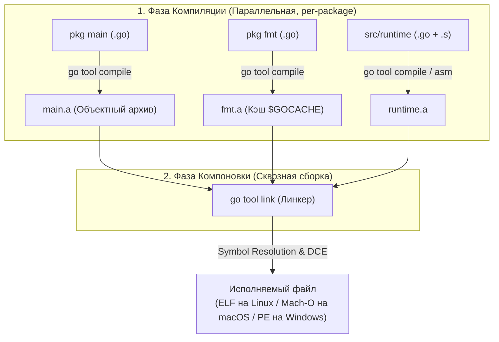
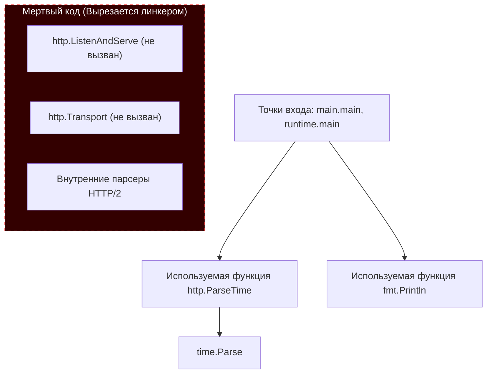

В прошлых статьях мы детально разобрали, как работает рантайм Go: от сборщика мусора и планировщика до асинхронного вытеснения горутин ([[43. Preemption. Как Go останавливает горутины.md]]). Мы изучили, как программа функционирует в оперативной памяти во время исполнения. 

Но как исходный текст в файлах с расширением `.go` превращается в тот самый единственный, монолитный, самодостаточный бинарный файл, который мы просто копируем на сервер через `scp` или пакуем в образ Docker `FROM scratch` и запускаем без установки сторонних зависимостей и виртуальных машин? 

За этот процесс отвечает инструментальная цепочка сборки (Toolchain), ключевыми фигурами в которой выступают **Компилятор (`go tool compile`)** и **Компоновщик (`go tool link`)**. Понимание их взаимодействия позволяет системному инженеру осознанно управлять размером бинарников, внедрять метаданные релизов на этапе сборки и бесшовно интегрировать Go-библиотеки в сторонние экосистемы (C/C++, Python, Rust).

---

## 1. Конвейер сборки: Compile -> Link

Когда вы вводите в терминале команду `go build main.go`, инструмент `go` выполняет роль высокоуровневого оркестратора (Build Driver). Вы можете увидеть полную цепочку скрытых команд, запустив сборку с подробным флагом трассировки:
```bash
go build -x main.go
```

Конвейер сборки строго разделен на два последовательных этапа:



1. **Компилятор (`compile`):** Работает строго изолированно на уровне **отдельных пакетов**. Он компилирует каждый пакет независимо, строит AST-дерево, выполняет оптимизации SSA (Static Single Assignment), Escape Analysis и инлайнинг функций. Результатом работы компилятора является **объектный файл** (архив `.a` для пакетов библиотек или `.o` для `main`). В этом файле адреса внешних функций еще не определены: вызовы функций из других пакетов представлены в виде строковых символьных заглушек (Symbol References).
2. **Компоновщик (`link`):** Это финальный архитектор бинарника. Компилятор ничего не знает о физических адресах других пакетов. Линкер же принимает на вход объектный файл пакета `main`, все скомпилированные зависимости (например, `fmt`, `net/http`), а также **сам скомпилированный рантайм Go** (`src/runtime`), сопоставляет символы, разрешает адреса переходов и собирает монолитный исполняемый файл.

---

## 2. Статическая линковка и жирные бинарники

Философский манифест Go с момента создания в Bell Labs звучал бескомпромиссно: **«Один самодостаточный бинарник для развертывания»**.

В языках вроде C++ или C# программы по умолчанию используют динамическую линковку: исполняемый файл содержит лишь ссылки на системные динамические библиотеки (`.so` в Linux, `.dll` в Windows, `.dylib` в macOS). Если на целевой машине установлена несовместимая версия библиотеки, программа отказывается запускаться (знаменитый «DLL Hell» или несоответствие версий `glibc`).

Go по умолчанию применяет **Статическую линковку (Static Linking)**.

Линкер Go копирует *весь* необходимый машинный код прямо внутрь вашего файла:
* Планировщик горутин G-M-P;
* Сборщик мусора (GC) и аллокатор страниц памяти;
* Сетевой поллер (Netpoller);
* Все используемые функции стандартной библиотеки и сторонних модулей.

**Преимущества:** Абсолютная переносимость («Zero dependencies»). Вы можете скомпилировать бинарник на современной рабочей станции и перенести его на сервер с минималистичным дистрибутивом Alpine Linux или развернуть в пустом контейнере `scratch` — программа запустится без единой установленной библиотеки в ОС (при выключенном CGO).

**Цена вопроса:** Размер бинарника. Даже каноническая программа `Hello World`, выводящая одну строку через `println()`, занимает около 1.5–2 мегабайт, поскольку несет в себе полноценный рантайм, планировщик и GC.

---

## 3. Магия Линкера: Dead Code Elimination (DCE)

Если линкер Go упаковывает стандартную библиотеку и рантайм, почему микросервисы на Go весят 15–30 мегабайт, а не гигабайты?

Здесь на сцену выходит один из ключевых алгоритмов линкера — **Удаление мертвого кода (Dead Code Elimination, DCE)**.

Представьте, что вы импортировали гигантский пакет `net/http`, но вызвали из него всего одну вспомогательную функцию — `http.ParseTime`. Означает ли это, что бинарник включит в себя весь HTTP/2 сервер, TLS-парсеры и код маршрутизации? 

Ни в коем случае. Линкер строит направленный граф достижимости символов (Reachability Graph), начиная с корневых точек входа — функций `main.main` и `runtime.main`. 

Он выполняет алгоритм поиска в глубину, помечая флажком только те функции, глобальные переменные и структуры данных, до которых поток исполнения может добраться физически:



Все функции, константы и структуры, оставшиеся недостижимыми в графе, линкер **физически вырезает из бинарника** (DCE). В итоговый файл попадает только тот код, который реально может быть исполнен.

> [!warning] Ловушка / Gotcha. Рефлексия ломает Dead Code Elimination
> Линкер — инструмент строгого статического анализа. Он видит прямые вызовы функций в графе: `A()` вызывает `B()`.
> Но если в программе используется пакет `reflect` для динамического вызова методов по строковому имени, линкер слепнет. Он не может математически доказать, что метод `HandleRequest` структуры `User` никогда не будет вызван через рефлексию во время работы. 
> Поэтому, если тип участвует в рефлексии или упакован в пустой интерфейс `interface{}` (`any`), линкер вынужден консервативно сохранить в бинарнике **все методы этого типа** и все типы данных, на которые они ссылаются! Неосторожное использование рефлексии может раздуть бинарник в разы.

---

## 4. Mechanical Sympathy: Флаги линкера (ldflags)

Опытные инженеры активно управляют поведением линкера через флаг `-ldflags` при сборке (`go build -ldflags="..."`).

### 1. Уменьшение размера бинарника (`-s -w`)

По умолчанию линкер внедряет в исполняемый файл обширные метаданные:
* **Таблицу символов (`Symbol Table`):** список имен всех функций, глобальных переменных и их адресов в памяти (требуется для команды `nm` и красивых стектрейсов, когда случается `panic`).
* **Отладочную информацию (`DWARF`):** метаданные для отладчиков (сопоставление машинных инструкций с номерами строк исходного кода, типы локальных переменных для отладчика `dlv`).

В production-сборках для Docker-образов эти данные часто избыточны и лишь увеличивают сетевой трафик при скачивании образов:

```bash
# -s отключает внедрение таблицы символов (Symbol Table)
# -w отключает генерацию отладочной информации DWARF
go build -ldflags="-s -w" main.go
```

Флаги `-s -w` уменьшают физический размер бинарного файла на **25–35%** без какого-либо влияния на скорость исполнения кода!  
*(Единственный компромисс: если вызов `panic` прервет программу, в стектрейсе будут выводиться только шестнадцатеричные адреса функций вместо читаемых номеров строк).*

### 2. Внедрение переменных при сборке (`-X`)

Как вшить в скомпилированный бинарник номер версии релиза, Git-хэш коммита или точное время сборки без внешних конфигурационных файлов?

Линкер умеет подменять строковые значения глобальных переменных непосредственно в момент компоновки бинарника:

```go
// main.go
package main

import "fmt"

var Version = "dev"
var BuildCommit = "none"

func main() { 
    fmt.Println("Version:", Version) 
}
```

При сборке в CI/CD пайплайне вы передаете флаг `-X`:
```bash
go build -ldflags="-X 'main.Version=v1.2.3' -X 'main.BuildCommit=a1b2c3d'" main.go
```
Линкер находит символ `main.Version` в секции данных объектного файла и напрямую перезаписывает его содержимое. Программа выведет: `Version: v1.2.3`.

---

## 5. Build Modes: Не только исполняемые файлы

Go позволяет генерировать не только стандартные исполняемые бинарники. Параметр `-buildmode` инструктирует линкер формировать принципиально иные бинарные артефакты.

### A. `-buildmode=pie` (Position Independent Executable)

В стандартном режиме код компилируется в расчете на загрузку по фиксированным базовым виртуальным адресам памяти.

В режиме `pie` линкер создает **позиционно-независимый исполняемый файл** (Position-Independent Executable):
* Машинный код использует относительную адресацию через регистр `RIP` (RIP-relative addressing).
* Это позволяет ядру операционной системы задействовать механизм безопасности **ASLR** (Address Space Layout Randomization) — рандомизацию адресного пространства процесса при каждом запуске. 
* Если злоумышленник попытается эксплуатировать уязвимость переполнения буфера (Buffer Overflow / ROP-цепочки), он не сможет угадать адреса функций в памяти. 
* В большинстве современных дистрибутивов Linux (Ubuntu, Debian, RHEL) режим `pie` является обязательным стандартом безопасности.

### B. `-buildmode=c-shared` и `c-archive`

В статье про CGO ([[41. cgo. Как Go взаимодействует с C.md]]) мы разбирали вызов C-кода из Go. Но вектор интеграции работает и в обратную сторону: вы можете написать высокопроизводительный модуль на Go и использовать его в проектах на C/C++, Python, Rust, Ruby или C#.

Режим `c-shared` заставляет линкер упаковать ваш Go-код в классическую разделяемую динамическую библиотеку:
* `.so` файл на Linux;
* `.dylib` файл на macOS;
* `.dll` файл на Windows;
* А также автоматически сгенерировать заголовочный C-файл `.h` со всеми сигнатурами экспортированных функций!

```go
package main

import "C"

//export MyAdd
func MyAdd(a, b C.int) C.int {
    return a + b
}

func main() {} // Функция main обязательна, но не вызывается напрямую
```

Команда сборки динамической библиотеки:
```bash
go build -buildmode=c-shared -o libmath.so main.go
```

Линкер помещает в `libmath.so` **абсолютно весь рантайм Go**. Любая программа на C или Python может загрузить эту библиотеку через системный вызов `dlopen()` и вызвать функцию `MyAdd`. При первом вызове рантайм Go автоматически инициализируется в отдельном потоке ОС, развернет планировщик, запустит GC и вернет результат в вызывающую программу!

---

## Итог

1. **Компилятор (`compile`)** обрабатывает код изолированно по пакетам, генерируя объектные файлы (`.a` / `.o`) с неразрешенными символами.
2. **Компоновщик (`link`)** выполняет сборку графа зависимостей: склеивает прикладной код, стандартную библиотеку и сам рантайм Go в единый статический бинарник.
3. **Dead Code Elimination (DCE):** Линкер отсекает неиспользуемые функции через анализ графа вызовов от корня `main.main`. Использование рефлексии ограничивает возможности DCE.
4. **Флаги `-ldflags`:** Флаги `-s -w` отсекают таблицы символов и отладку DWARF, экономя до 35% размера бинарника, а `-X` позволяет вшивать переменные сборки (версии, хэши).
5. **Build Modes:** Режим `pie` обеспечивает совместимость с ASLR для безопасности, а `c-shared` позволяет упаковать код на Go в разделяемую библиотеку (`.so`) с встроенным рантаймом для вызова из любых других языков программирования.

Режим `c-shared` делает Go универсальным поставщиком модулей для внешних экосистем. Но что если мы хотим построить расширяемую плагинную архитектуру *внутри самого Go*? Можно ли динамически скомпилировать кусок Go-кода и загрузить его в уже работающий production-сервер без перезапуска?

В следующей статье мы разберем одну из самых противоречивых и сложных тем языка — динамические плагины:
[[45. Plugins, Shared Libraries и ограничения Go.md]]