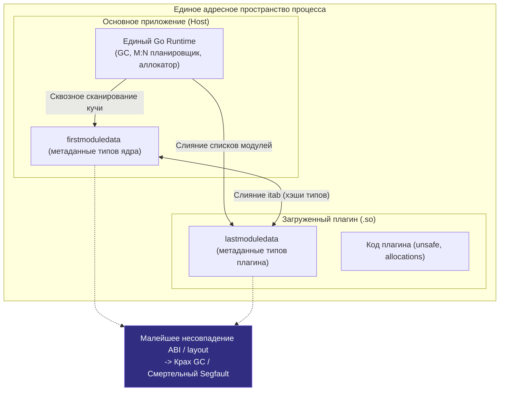
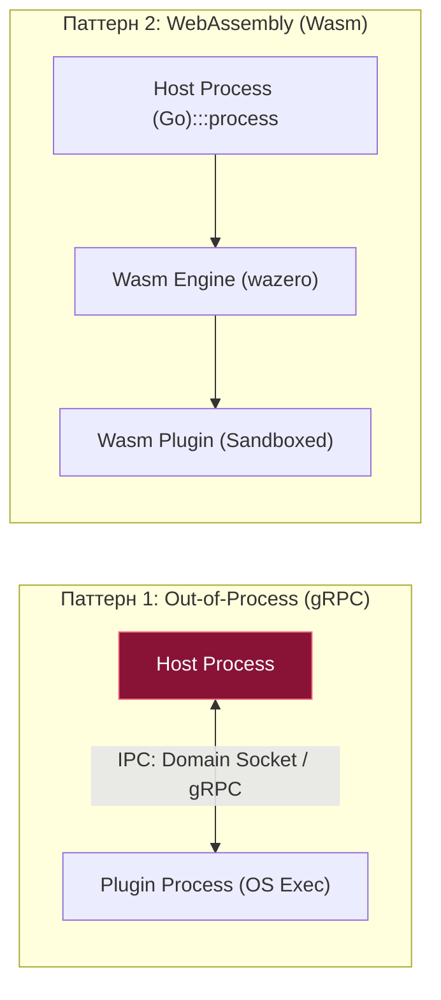

В прошлой статье ([[44. Linker и Build Modes.md]]) мы узнали, что Go умеет собирать динамические библиотеки (`-buildmode=c-shared`), чтобы отдавать свой скомпилированный код в Python, C++, Rust или Ruby. Это работает надежно: монолитный рантайм Go аккуратно прячется внутри файла `.so` и самостоятельно обслуживает ваши экспортированные функции.

Но что, если мы хотим обратного? Что, если мы разрабатываем расширяемую платформу — API-шлюз (API Gateway), систему распределенного мониторинга, брокер сообщений или плагинную архитектуру корпоративного сервиса — и хотим подгружать пользовательскую бизнес-логику «на лету», в рантайме, без перекомпиляции и перезапуска основного ядра?

В классических языках вроде C++ или C# эта задача десятилетиями решается через динамическую загрузку разделяемых библиотек (`dlopen` в UNIX / `LoadLibrary` в Windows). В языке Go для этих целей в релизе 1.8 был представлен пакет `plugin`. 

На бумаге это выглядело как идеальный компонент. На практике же нативный механизм плагинов в Go превратился в **одну из самых проблемных, архитектурно хрупких и наименее рекомендуемых технологий во всей экосистеме языка**.

Давайте разберемся, как устроены плагины под капотом, почему рантайм Go выдвигает драконовские требования к их компиляции и как опытные инженеры реализуют по-настоящему надежные плагинные системы в продакшене.

---

## 1. Иллюзия простоты: пакет plugin

В версии Go 1.8 инженеры добавили режим компоновщика `-buildmode=plugin`.

### Как это выглядит в теории:
Вы создаете независимый файл пакета `main`, но вместо точки входа `func main()` объявляете обычные экспортируемые функции или структуры:

```go
// plugin.go
package main

import "fmt"

// Экспортируемая функция плагина
func Hello(name string) {
    fmt.Printf("Привет, %s! Я загружен из плагина.\n", name)
}
```

Компилируете этот код со специальным флагом сборки:
```bash
go build -buildmode=plugin -o myplugin.so plugin.go
```

А в основном серверном приложении динамически подгружаете получившийся артефакт в память:

```go
// main.go
package main

import (
    "fmt"
    "plugin"
)

func main() {
    // 1. Открываем .so файл (под капотом вызывается системный вызов dlopen)
    p, err := plugin.Open("myplugin.so")
    if err != nil {
        panic(err)
    }
    
    // 2. Ищем символ (функцию или переменную) по строковому имени
    sym, err := p.Lookup("Hello")
    if err != nil {
        panic(err)
    }
    
    // 3. Делаем Type Assertion (приводим пустой интерфейс к сигнатуре функции)
    helloFunc, ok := sym.(func(string))
    if !ok {
        panic("неверная сигнатура функции")
    }
    
    // 4. Вызываем код плагина!
    helloFunc("Gopher")
}
```

Код выглядит лаконично и привлекательно. Типы данных проверяются в рантайме (через дескрипторы `eface/iface`, которые мы подробно изучали в [[35. iface и eface. Как устроены интерфейсы.md]]).

Но как только вы попытаетесь развернуть эту архитектуру в реальной распределенной инфраструктуре, вы столкнетесь с непреодолимой стеной фундаментальных ограничений.

---

## 2. Жестокая реальность: Почему плагины не работают

Нативная плагинная система Go накладывает столь жесткие ограничения, что их поддержка в реальных инженерных командах превращается в кошмар сопровождения:

### Ограничение 1: Отсутствие кроссплатформенности

Пакет `plugin` работает **только на Linux, FreeBSD и macOS**. 

Официальной поддержки Windows нет и, по заявлениям команды Go, никогда не появится. Операционная система Windows имеет принципиально иную модель загрузки DLL, не позволяющую безопасно объединять сегменты данных рантайма Go так, как это делает динамический линковщик `ld.so` через `dlopen`.

### Ограничение 2: Ад версий зависимостей

Основное приложение (хост) и подгружаемый плагин **обязаны быть скомпилированы с абсолютно идентичными версиями всех общих зависимостей**.

Если ваше ядро использует модуль `github.com/google/uuid` версии `v1.2.0`, а разработчик плагина импортировал `github.com/google/uuid` версии `v1.3.0`, вызов `plugin.Open()` завершится фатальной ошибкой:
```
plugin was built with a different version of package github.com/google/uuid
```
Вам придется вручную или через строгие CI-пайплайны синхронизировать абсолютно все транзитивные зависимости в файлах `go.mod` между десятками независимых репозиториев плагинов!

### Ограничение 3: Идентичность компилятора и флагов

Вы не можете скомпилировать ядро компилятором Go 1.21.0, а плагин собрать компилятором Go 1.21.1. Версии инструментария обязаны совпадать с точностью до конкретного патч-релиза.

Более того, флаги сборки (например, теги компиляции `-tags`, флаги оптимизации, параметры CGO и переменная `GOPATH`) должны быть строго идентичными. Малейшее расхождение делает плагин бинарно несовместимым с хостом.

### Ограничение 4: Отсутствие выгрузки (Memory Leak)

В стандартном пакете `plugin` есть метод `Open()`, но **физически отсутствуют функции `Close()` или `Unload()`**.

Если вы однажды загрузили файл `myplugin.so`, он останется в адресном пространстве процесса навсегда. 

Вы не можете реализовать концепцию горячей перезагрузки (Hot Reloading), периодически скачивая обновленные `.so` файлы: каждый новый плагин будет аллоцировать новые участки виртуальной памяти, которые невозможно освободить. Приложение неизбежно упадет по Out of Memory (OOM).

---

## 3. Под капотом: Почему рантайм такой параноик?

Почему авторы Go отказываются сделать механизм плагинов более гибким? Ответ кроется в глубинной архитектуре сборщика мусора (GC), рантайма и системы типов языка.



1. **Единый GC на весь процесс:** Go не умеет изолировать сборщики мусора. При загрузке `.so` рантайм вынужден «слить» глобальные списки модулей (`firstmoduledata` и `lastmoduledata`). Сборщик мусора начинает непрерывно сканировать секции глобальных переменных (`.data`, `.bss`) плагина в поисках живых указателей. Если плагин собран с другими флагами или версией компилятора, внутренний `layout` (выравнивание структур и смещения полей) может отличаться. Сборщик мусора разыменует невалидный указатель и немедленно уронит весь сервис с Segmentation Fault!
2. **Слияние таблиц `itab`:** Если в хосте объявлен интерфейс `Logger`, а в плагине тип `MyLogger` реализует этот интерфейс, рантайму нужно динамически сгенерировать `itab`. Для этого хэши типов и строковые сигнатуры в таблицах символов должны совпадать побитово.
3. **Невозможность выгрузки (`Unload`):** Чтобы безопасно выгрузить разделяемую библиотеку через `dlclose`, рантайм должен математически доказать, что в огромной управляемой куче Go не осталось **ни одного указателя**, ссылающегося на типы или память плагина, и ни одна горутина не выполняет код из его сегмента инструкций `.text`. В конкурентной среде со сборщиком мусора такая проверка практически нереализуема без остановки всего мира (STW) на секунды.
4. **Build ID:** Чтобы защитить процесс от фатальной порчи памяти, компоновщик внедряет в каждый бинарный пакет уникальный криптографический хэш — **Build ID**. При вызове `plugin.Open()` рантайм параноидально сверяет хэши абсолютно всех зависимостей. Если хотя бы один хэш отличается — загрузка немедленно блокируется.

---

## 4. Mechanical Sympathy: Как делать плагины правильно?

Senior-инженеры давно усвоили урок: нативные `.so` плагины в Go применимы только в изолированных монорепозиториях под строгим управлением Linux-контейнеров.

Для создания надежных, расширяемых и отказоустойчивых плагинных систем в современном бэкенде используются три альтернативных архитектурных паттерна:



### Паттерн 1: Out-of-Process Plugins (gRPC / RPC)

Это признанный золотой стандарт в индустрии, созданный компанией HashiCorp (архитектура Terraform, Vault, Consul, Packer). Решение оформлено в виде открытой библиотеки **`hashicorp/go-plugin`**.

**Как это устроено:**
1. Плагин представляет собой обычный, полностью независимый исполняемый бинарник (`os.Exec`).
2. Основное приложение запускает плагин как дочерний процесс операционной системы.
3. Взаимодействие происходит по протоколу `gRPC` или `net/rpc` через быстрые локальные сокеты (или `stdin/stdout`).

**Преимущества:**
* **Абсолютная отказоустойчивость:** Если плагин упадет с `panic` или вызовет аппаратный `SIGSEGV`, основной сервер продолжит работу.
* **Изоляция окружения:** Плагин может быть собран на любой версии Go или даже написан на Python, C++ или Rust.
* **Честный Hot Reload:** Дочерний процесс можно в любой момент перезапустить, обновить или убить без утечек памяти хоста.

### Паттерн 2: WebAssembly (Wasm)

Современный флагманский подход для сценариев, где важна минимальная задержка. Плагин компилируется в байт-код формата `.wasm`. 

Внутри Go-приложения запускается легковесный интерпретатор Wasm, например, библиотека **`tetratelabs/wazero`** (чистая реализация Wasm-рантайма на Go, не требующая CGO!).

**Преимущества:**
* Код выполняется внутри адресного пространства Go (намного быстрее межпроцессного gRPC).
* Абсолютная безопасность («песочница» / Sandbox): Wasm-плагин физически изолирован от памяти Go, не имеет прямого доступа к сокетам, файловой системе и системным вызовам (если хост явно не предоставит к ним доступ через интерфейс WASI).

### Паттерн 3: Встраиваемые скриптовые языки

Если плагины предназначены для динамического изменения правил маршрутизации или валидации бизнес-логики, отличным решением является встраивание скриптовых движков:
* **Lua:** библиотека `yuin/gopher-lua` (высокопроизводительный интерпретатор Lua 5.1 на чистом Go).
* **JavaScript:** библиотека `dop251/goja` (полноценный движок ECMAScript 5.1/6 на Go).
* **Выражения (Expressions):** библиотека `antonmedv/expr` для безопасной и сверхбыстрой компиляции математических и логических предикатов.

---

## Итог

1. **`buildmode=plugin`** — попытка внедрить в Go классические динамические библиотеки (`.so`) с доступом через вызовы `plugin.Open()` и `Lookup()`.
2. Архитектурные ограничения делают нативные плагины непрактичными: отсутствие поддержки Windows, жесткая привязка к версиям зависимостей и компилятора, невозможность выгрузки (`Unload`) из памяти.
3. Рантайм Go вынужден проверять Build ID всех пакетов, чтобы защитить сборщик мусора и таблицы `itab` от разрушения при несовпадении раскладки структур в памяти.
4. В продакшене для плагинных систем используют надежные альтернативы: **Out-of-Process плагины через gRPC (`hashicorp/go-plugin`)** или **песочницы WebAssembly (`tetratelabs/wazero`)**.

Мы детально разобрались с процессом компиляции, сборки и динамической загрузки кода. До сих пор мы анализировали код исходя из предположения, что он выполняется изолированно. Но в реальной многоядерной системе сотни горутин непрерывно обращаются к общим переменным памяти. Ошибка в синхронизации приводит к **Состоянию Гонки (Data Race)** — опаснейшему дефекту, приводящему к повреждению данных в памяти.

Для обнаружения таких ошибок в Go встроен мощнейший диагностический инструмент — Race Detector.

В следующей статье мы разберем, как устроен детектор гонок на уровне процессорных инструкций:
[[46. Race Detector под капотом.md]]