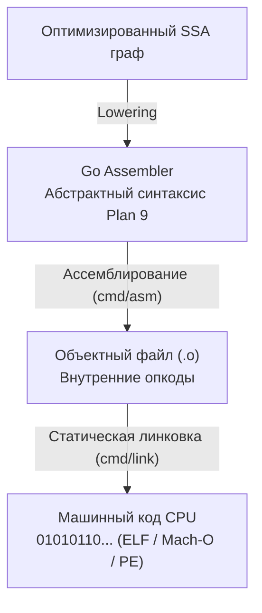

В предыдущей лекции [[4. SSA в Go. Как компилятор оптимизирует код]] мы подошли к фазе Lowering, когда универсальный математический граф SSA опускается на уровень физического кремния. Конечным продуктом этого этапа компиляции становится код на **Go Assembler**.

Для инженера, стремящегося к сеньор-грейду и выше, умение бегло читать ассемблерный выхлоп компилятора — это фундаментальный профессиональный навык. Это единственный способ со стопроцентной объективностью доказать: сработал ли инлайнинг функции, устранил ли компилятор проверки выхода за границы срезов (BCE), спас ли Escape Analysis переменную от аллокации в куче и не наплодил ли оптимизатор скрытых задержек в критическом горячем цикле программы (**hot path**).

---

## Иллюзия нативного ассемблера

Первое, что обескураживает программистов, пришедших из C/C++ и привыкших к классическому ассемблеру Intel или AT&T — ассемблерный код Go выглядит принципиально иначе.

Ассемблер Go — это **псевдо-ассемблер**. Он унаследовал свой минималистичный и строгий синтаксис из операционной системы Plan 9, которую в Bell Labs создавали отцы Unix и Go — Кен Томпсон, Роб Пайк и Деннис Ритчи. Компилятор Go `cmd/compile` не формирует сразу текстовый машинный код под конкретный чипсет x86-64 или ARM64. Вместо этого он генерирует промежуточную абстрактную ассемблерную модель, которую затем ассемблер `cmd/asm` и линковщик `cmd/link` преобразуют в физические опкоды (opcodes) целевого процессора.



Такая элегантная двухуровневая архитектура дала компилятору Go феноменальную портируемость: разработчикам языка не пришлось переписывать заново текстовый парсер и кодогенератор под каждую новую процессорную микроархитектуру (x86, ARM64, RISC-V, MIPS, WebAssembly).

---

## Четыре всадника рантайма: Псевдо-регистры

Для достижения аппаратной независимости Go Assembler вводит четыре **псевдо-регистра**. В физическом кремнии вашего процессора таких регистров нет; это виртуальные концепции компилятора, которые линковщик транслирует в физические аппаратные регистры (`RSP`, `RBP`, `RIP`, `RAX` и др.) в зависимости от целевой платформы.

Понимание этих четырех регистров критически необходимо для чтения дампов стека горутин:

1. `SB` **(Static Base):** Указатель на начало глобального виртуального адресного пространства программы. Используется для адресации глобальных переменных, таблиц типов и вызовов функций. Любой вызов функции в Go ассемблере выглядит как обращение к символу со смещением относительно `SB`, например `CALL pkg.MyFunc(SB)`.
2. `FP` **(Frame Pointer):** Указатель на аргументы текущей функции. Используется компилятором для безопасного обращения к входящим параметрам и возвращаемым значениям функции, когда они передаются через память стека.
3. `SP` **(Stack Pointer):** Указатель на локальный стек текущей функции. Используется для доступа к локальным переменным, размещенным во фрейме.
4. `PC` **(Program Counter):** Программный счетчик (аналог регистра `RIP` в x86-64), указывающий на адрес следующей исполняемой инструкции. В прикладном коде почти никогда не модифицируется вручную.

> [!warning] Ловушка / Gotcha: Два совершенно разных регистра SP
> 
> В ассемблерном коде Go сосуществуют два принципиально разных регистра с именем `SP`, что часто сбивает с толку даже опытных инженеров:
> 
> 1. **Псевдо-регистр `SP` (виртуальный):** Записывается **с именем переменной** в качестве префикса, например `localvar-8(SP)`. Он адресует локальную переменную относительно фиксированной базы кадра функции.
> 2. **Аппаратный регистр `SP` (физический):** Записывается **без текстового имени**, только со смещением, например `-8(SP)`. Это прямой доступ к аппаратному регистру процессора `RSP` (вершине физического стека).
> 
> Различать их можно только по наличию символьного идентификатора перед скобками!

---

## Синтаксис и суффиксы инструкций

В отличие от синтаксиса Intel (`ОПЕРАЦИЯ ПРИЕМНИК, ИСТОЧНИК`), ассемблер Plan 9 следует правилу порядка AT&T: `ОПЕРАЦИЯ ИСТОЧНИК, ПРИЕМНИК`.

Размер операндов задается строгим буквенным суффиксом в названии инструкции:
* `MOVB` (Byte) — 8 бит (1 байт);
* `MOVW` (Word) — 16 бит (2 байта);
* `MOVL` (Long) — 32 бита (4 байта);
* `MOVQ` (Quadword) — 64 бита (8 байт).

Пример: инструкция `MOVQ $10, AX` буквально означает: «записать 64-битную константу 10 в аппаратный регистр `AX`». Знак доллара `$` всегда обозначает непосредственное числовое значение (литерал).

---

## Анатомия ассемблерной функции

Рассмотрим простейшую функцию сложения двух чисел и исследуем ее ассемблерный листинг. Для этого выполним команду дизассемблирования:

```bash
go tool compile -S main.go
```

```go
// main.go
package main

func Add(a, b int) int {
	return a + b
}
```

Выхлоп компилятора (упрощенный для наглядности):

```asm
TEXT "".Add(SB), NOSPLIT|ABIInternal, $0-24
    FUNCDATA $0, gclocals·g2BeySu+wFnoycgXfElmcg==(SB)
    FUNCDATA $1, gclocals·g2BeySu+wFnoycgXfElmcg==(SB)
    MOVQ "".a+8(SP), AX
    MOVQ "".b+16(SP), CX
    ADDQ CX, AX
    MOVQ AX, "".~r2+24(SP)
    RET
```

Разберем заглавную директиву по частям: `TEXT "".Add(SB), NOSPLIT|ABIInternal, $0-24`

1. `TEXT`: Ассемблерная директива, объявляющая новую функцию как исполняемый сегмент памяти (Text segment).
2. `"".Add(SB)`: Полное квалифицированное имя функции. Пустые кавычки `""` заменяются компилятором на имя текущего пакета (`main`). Метка `(SB)` указывает, что адрес функции привязан к глобальной базе `Static Base`.
3. `NOSPLIT`: Флаг оптимизации рантайма. Он приказывает компилятору: *«Не вставляй пролог проверки переполнения стека (stack check)»*. Это допустимо только для сверхмалых функций, фрейм которых гарантированно помещается в защитную зону стека горутины, что экономит несколько драгоценных тактов процессора на вызове (подробнее см. [[11. Стек горутины. Рост и shrink стека]]).
4. `ABIInternal`: Флаг, сообщающий, какая конвенция вызовов используется функцией (современный регистровый ABI).
5. `$0-24`: Фрейм-дескриптор функции:
   - `$0` — размер локального стекового фрейма для внутренних переменных в байтах (у нашей функции нет локальных переменных, поэтому 0);
   - `24` — суммарный размер аргументов и возвращаемых значений: аргумент `a` (8 байт int) + аргумент `b` (8 байт int) + возвращаемый результат `int` (8 байт) = 24 байта.

Последующие строки демонстрируют логику работы инструкций:
- `MOVQ "".a+8(SP), AX` — загрузка первого аргумента `a` из памяти стека в регистр `AX`;
- `MOVQ "".b+16(SP), CX` — загрузка второго аргумента `b` в регистр `CX`;
- `ADDQ CX, AX` — сложение содержимого регистров `CX` и `AX` с сохранением суммы в `AX`;
- `MOVQ AX, "".~r2+24(SP)` — сохранение результата из регистра `AX` в область возвращаемого значения в памяти;
- `RET` — возврат управления вызывающей функции.

> [!info] Под капотом: FUNCDATA и gclocals
> 
> Директивы `FUNCDATA` и `PCDATA` (компилятор щедро генерирует их в бинарнике) — это служебная метаинформация для **Сборщика мусора (Garbage Collector)**.  
> Ассемблер строит битовые карты указателей (`gclocals`). Он сообщает GC: в каких регистрах и ячейках стека на каждом шаге лежат реальные указатели на объекты в куче, а в каких — простые скаляры (`int`, `float`). Когда наступает фаза трассировки GC, сборщик читает таблицы `FUNCDATA`, точно зная, по каким адресам нужно идти, исключая ложное сканирование обычных чисел.

---

## Mechanical Sympathy. Стоит ли писать на Asm вручную?

В исходном коде стандартной библиотеки Go (пакеты `crypto`, `math/bits`, `runtime`, `sync/atomic`) вы обнаружите тысячи строк рукописного ассемблера в файлах с расширением `.s`. Это делается ради инструкций, недоступных компилятору напрямую: аппаратного ускорения шифрования AES-NI, векторных вычислений AVX-512 или тонких атомарных барьеров памяти.

Однако писать бизнес-логику или прикладные сервисы на чистом ассемблере в 99.9% случаев **категорически противопоказано**.

> [!tip] Собеседование: Почему ручной ассемблер делает код МЕДЛЕННЕЕ?
> 
> На техническом интервью уровня Staff/Principal часто звучит вопрос:  
> *«Разработчик переписал критическую функцию с Go на ручной ассемблер. Количество инструкций уменьшилось вдвое, но общий бенчмарк программы показал деградацию производительности на 15–20%. В чем причина?»*
> 
> **Ответ:** Потеря **Inlining (встраивания)**.  
> Компилятор Go в силу архитектуры **не умеет инлайнить** функции, написанные на внешнем ассемблере (`.s`).  
> Если вы перепишете маленькую функцию на asm, каждый ее вызов превратится в честный физический вызов: создание стекового кадра, сохранение регистров, сброс конвейера инструкций процессора и переключение контекста. Накладные расходы на саму конвенцию вызова перекроют любую микрооптимизацию внутри функции. Код на чистом Go, будучи встроенным компилятором (inlined), отработает несравнимо быстрее!

---

## Итог

1. Ассемблер Go — это платформонезависимый псевдо-ассемблер, унаследованный из лаборатории Bell Labs и ОС Plan 9, использующий синтаксис AT&T (источник, затем приемник).
2. Он опирается на 4 виртуальных псевдо-регистра (`SB`, `FP`, `SP`, `PC`), позволяющих компилятору и линковщику абстрагироваться от деталей аппаратных платформ.
3. Анализ ассемблера (`go tool compile -S`) — ключевой инструмент для подтверждения инлайнинга, анализа побега переменных и проверки устранения проверок границ срезов (BCE).
4. Ручные ассемблерные вставки запрещают компилятору инлайнить функции и усложняют построение карт указателей для GC.

В приведенном выше примере ассемблерной функции аргументы передавались через стековую память (`SP`), что исторически использовалось в Go. Однако начиная с Go 1.17 произошла тектоническая революция: переход на **регистровую конвенцию вызовов ABIInternal**.

В следующей лекции мы детально разберем: [[6. ABIInternal и ABI0. Как Go вызывает функции]].