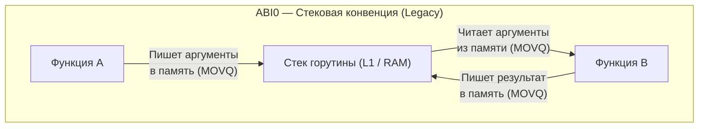
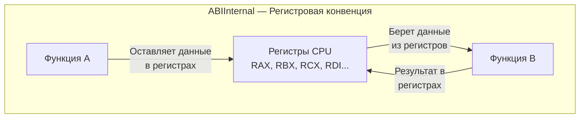
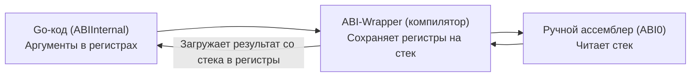

В завершении предыдущей лекции [[5. Go assembler и внутренний ассемблерный синтаксис]] мы обратили внимание на характерную деталь: сгенерированный ассемблерный код считывал входящие аргументы функции прямо из оперативной памяти, используя относительные смещения стекового указателя `SP`.

Для системного программиста на C или Rust это выглядело архитектурным анахронизмом: зачем тратить машинные циклы на обращение к стековой памяти, когда кристалл современного процессора оснащен набором сверхбыстрых аппаратных регистров?

Долгие годы именно это являлось главным скрытым узким местом в производительности рантайма Go. Однако с выходом релиза Go 1.17 произошла тектоническая эволюция, которая мгновенно и абсолютно бесплатно ускорила все существующие Go-приложения в мире в среднем на 5–12% без изменения единой строчки прикладного кода. Это фундаментальное улучшение заключалось в отказе от устаревшей стековой конвенции и переходе на регистровый бинарный интерфейс — **ABIInternal**.

---

## Что такое ABI?

Если высокоуровневый API (Application Programming Interface) определяет, *какие* функции, типы и методы доступны программисту на уровне исходного кода, то **ABI (Application Binary Interface)** задает строгий контракт взаимодействия на уровне машинных инструкций и кремния.

Центральным ядром ABI является **Конвенция вызовов (Calling Convention)**. Она дает однозначные ответы на аппаратные вопросы:
1. Куда вызывающая функция (`caller`) обязана поместить аргументы — во фрейм стека в памяти или в конкретные физические регистры процессора?
2. Где вызываемая функция (`callee`) должна ожидать эти аргументы?
3. В каких регистрах или областях памяти размещаются множественные возвращаемые значения?
4. Кто отвечает за очистку стекового кадра и сохранение регистров общего назначения (caller-saved vs callee-saved)?

---

## ABI0. Наследие Plan 9 (До Go 1.17)

С момента своего рождения в 2009 году и вплоть до версии Go 1.16 включительно язык использовал архитектурную конвенцию, которая сегодня официально именуется **ABI0**.

Главный принцип ABI0 был предельно консервативен: **все аргументы и все возвращаемые значения передаются исключительно через оперативную память (стек горутины)**.

Когда функция `A` вызывала функцию `B`, разворачивался следующий сценарий:
1. Функция `A` выделяла дополнительное место в своем стековом кадре;
2. Инструкциями `MOVQ` функция `A` копировала значения всех аргументов из регистров в память стека;
3. Выполнялась процессорная инструкция `CALL B`;
4. Функция `B` считывала аргументы обратно из памяти стека в свои рабочие регистры;
5. Выполнив вычисления, функция `B` записывала возвращаемый результат обратно в стековую память функции `A`;
6. По инструкции `RET` управление возвращалось в `A`, и `A` читала результат из своего стека.

### Mechanical Sympathy. Почему ABI0 — это медленно?

Вспомним физику кремния и иерархию задержек доступа к памяти:
- Чтение значения из регистра CPU занимает **0–1 такт**;
- Чтение из кэша L1 занимает **~3–4 такта**;
- Доступ к оперативной памяти (DRAM) требует **100–300 тактов**.

Даже с учетом того, что вершины стеков активных горутин почти всегда прогреты и удерживаются в процессорном кэше L1, стековая конвенция ABI0 заставляла CPU совершать колоссальный объем бессмысленной пересылки данных: `Регистр -> L1-кэш -> Регистр`. Это порождало лишний трафик шины памяти, раздувало размер бинарного кода инструкциями `MOV` и сковывало параллелизм выполнения инструкций на конвейере CPU (**Instruction-Level Parallelism**).

---

## ABIInternal. Революция регистров (Go 1.17+)

Начиная с Go 1.17, компилятор перешел на регистровую конвенцию вызовов — **ABIInternal**.

Ее философия проста и бескомпромиссна: при вызове функции компилятор передает аргументы и забирает возвращаемые результаты **напрямую через физические аппаратные регистры процессора**, минуя оперативную память.

Для архитектуры `amd64` (x86-64) спецификация ABIInternal зарезервировала жестко определенный пул регистров:
* **9 целочисленных регистров:** `RAX`, `RBX`, `RCX`, `RDI`, `RSI`, `R8`, `R9`, `R10`, `R11`;
* **15 регистров для чисел с плавающей точкой:** `X0` – `X14`.

В рамках ABIInternal тривиальная функция `Add(a, b int)` больше ни на такт не прикасается к стековой памяти. Аргумент `a` передается в регистре `RAX`, аргумент `b` — в `RBX`. Функция выполняет единственную инструкцию `ADDQ RBX, RAX` и оставляет сумму в `RAX`. Вызов функции превращается в мгновенную переброску данных внутри вычислительного ядра.

> [!tip] Собеседование: Что произойдет, если аргументов больше 9?
> 
> **Вопрос:** Если функция принимает 10 целочисленных аргументов типа `int`, как они будут переданы в рантайме Go при использовании ABIInternal?
> 
> **Ответ:** Произойдет частичное вытеснение на стек — **Spill to Stack**.  
> Первые 9 аргументов будут размещены в аппаратных регистрах `RAX`–`R11`. Для десятого аргумента физических регистров в выделенном пуле не останется. Компилятор автоматически сгенерирует код с фолбэком (fallback) к стековой передаче: десятый аргумент будет записан во фрейм стека вызывающей функции.
> 
> Именно поэтому линтеры (такие как `golangci-lint` с правилом `funlen` / `gocyclo`) и стандарты чистого кода не рекомендуют создавать функции с десятком параметров. Это не просто вопрос читаемости (Code Smell), но и строгий фактор производительности: вызовы функций с небольшим числом параметров обслуживаются процессором на порядок быстрее.

---

## Структуры, интерфейсы и слайсы в ABIInternal

Как регистровая конвенция обходится со сложными типами данных? В Go любая составная структура при передаче по значению «уплощается» (**flattening / unpack**). Компилятор декомпозирует структуру на примитивные поля и распределяет каждое поле по свободным регистрам:

* **String** (см. [[34. Внутреннее устройство string]]) состоит из двух 8-байтных полей (указатель `Data` и длина `Len`). Строка занимает **2 регистра** (например, `RAX` и `RBX`).
* **Slice** (см. [[29. Внутреннее устройство slice]]) состоит из трех полей (указатель `Data`, длина `Len` и вместимость `Cap`). Срез занимает **3 регистра** (`RAX`, `RBX`, `RCX`).
* **Interface** (см. [[35. Интерфейсы под капотом. eface и iface]]) состоит из двух указателей (метаданные типа `_type` или `itab` и указатель на данные `data`). Интерфейс занимает **2 регистра**.

> [!warning] Ловушка / Gotcha: Разворачивание огромных структур
> 
> Если вы передаете в функцию по значению структуру, содержащую 5 полей типа `int64`, компилятор разложит ее и мгновенно займет 5 регистров из 9 доступных. Если полей будет 10 — произойдет исчерпание пула и немедленный сброс остатка структуры в память (Spill to Stack).
> 
> Передача массивных структур по указателю (`*Struct`) всегда требует ровно один регистр (под 64-битный адрес памяти), оставляя остальные регистры свободными для других аргументов. Однако здесь вступает в силу баланс: передача указателя может спровоцировать Escape Analysis переместить структуру со стека в кучу. О том, как соблюдать этот баланс на практике, мы говорим в лекции [[19. Escape Analysis на практике. Как писать меньше аллокаций]].

---

## Почему оставили два ABI?

Возникает логичный вопрос: почему инженеры Go назвали конвенцию `ABIInternal`, сохранили старый `ABI0` и не удалили стековый механизм навсегда?

Ответ кроется в **строгой обратной совместимости с рукописным ассемблерным кодом**.

В экосистеме Go существуют тысячи сторонних пакетов и фундаментальных библиотек (криптография, математические вычисления, сжатие данных), содержащих файлы `.s` на ассемблере. Весь этот код создавался десятилетиями в жестком расчете на конвенцию ABI0 (ожидая аргументы строго на стеке). Прямое изменение конвенции разрушило бы всю мировую инфраструктуру Go.

Для решения этой дилеммы команда Go внедрила прозрачный механизм **ABI-wrapper'ов** (адаптеров):

1. Весь скомпилированный код на Go по умолчанию использует сверхбыстрый `ABIInternal`.
2. Если Go-код вызывает рукописную функцию на ассемблере, компилятор на лету подставляет невидимый переходник (ABI wrapper).
3. Этот адаптер выгружает аргументы из аппаратных регистров на стек горутины, имитируя окружение ABI0, передает управление ассемблерному коду, а при выходе забирает результат со стека и возвращает его в регистры.

Таким образом, наследие старого кода сохраняет работоспособность, а весь чистый код на Go исполняется на предельной скорости кремния.

---

## Итог

1. **Конвенция вызовов (Calling Convention)** регламентирует правила передачи аргументов и возврата значений на физическом уровне процессора.
2. **ABI0** — историческая конвенция Go, основанная на наследии Plan 9, передававшая данные исключительно через оперативную память стека, что вызывало избыточный трафик кэша L1.
3. **ABIInternal** (начиная с Go 1.17) — современный регистровый стандарт, задействующий до 9 целочисленных регистров (`RAX`–`R11`) и 15 регистров плавающей точки (`X0`–`X14`) на x86-64, устраняющий лишние операции с памятью.
4. Передача слишком длинного списка аргументов или тяжелых структур по значению приводит к вытеснению параметров на стек (**Spill to Stack**).
5. Механизм **ABI-wrapper'ов** обеспечивает идеальную совместимость между быстрым современным Go-кодом и легаси-библиотеками с рукописным ассемблером ABI0.

Теперь мы досконально понимаем, как компилятор транслирует абстрактные алгоритмы в машинный код с аппаратной конвенцией вызовов. Этот код вместе со средой рантайма линковщик упаковывает в единый монолитный файл.

Что именно скрывается внутри скомпилированного исполняемого файла Go и почему даже простейшая программа «Hello World» весит несколько мегабайт?  
Ответ ждет нас в следующей лекции: [[7. Устройство бинарника Go]].