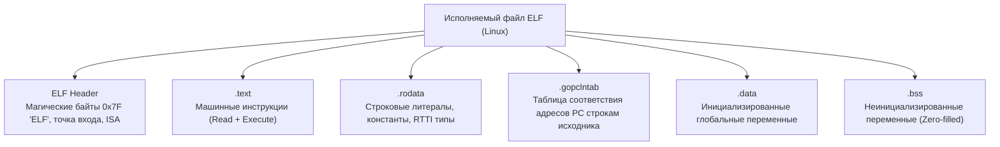

В предыдущих лекциях мы детально проследили весь путь, который проходит исходный код: от лексического потока токенов до оптимизированного графа SSA и машинных инструкций с регистровым ABI. На финальном этапе сборки эстафету принимает **Линковщик (Linker, `cmd/link`)**.

Его фундаментальная задача — собрать воедино разрозненные объектные файлы (`.o`), прикладной код программиста, скомпилированные зависимости сторонних библиотек и монолитный код самого рантайма Go, а затем сшить их в строго структурированный исполняемый файл.

Разработчики, приходящие в Go из C, C++ или Rust, нередко испытывают неподдельное удивление: простейший HTTP-сервер на Go после сборки весит от 10 до 20 Мегабайт, тогда как аналогичный микросервис на C укладывается в скромные сотни килобайт. Чтобы понять, откуда берется этот объем, оправдан ли он и как физическая структура бинарника взаимодействует с подсистемой виртуальной памяти ядра Linux, препарируем анатомию скомпилированного файла.

---

## Философия статической линковки (Fat Binaries)

Главная причина ощутимого размера Go-программ кроется в фундаментальном архитектурном выборе создателей языка: **тотальная статическая линковка по умолчанию**.

В традиционной экосистеме C и C++ компилятор по умолчанию опирается на динамическую линковку. Программа практически не содержит в себе кода стандартной библиотеки (например, реализации системных вызовов, `printf` или аллокатора `malloc`). Вместо этого исполняемый файл содержит лишь символические ссылки на внешние динамические библиотеки (`libc.so` в Linux или `msvcrt.dll` в Windows), которые уже предустановлены в операционной системе. При запуске системный загрузчик ядра (`ld.so`) находит эти библиотеки на диске и динамически отображает их в адресное пространство процесса.

Создатели Go сознательно отвергли эту модель во имя инженерной надежности и простоты развертывания («Zero Dependency Deployment»). Исполняемый файл Go — это самодостаточная экспедиция, несущая с собой все необходимое оборудование.

Линковщик физически упаковывает внутрь каждого файла:
1. **Ваш скомпилированный код** со всеми оптимизациями;
2. **Весь рантайм Go:** планировщик горутин (G-M-P), сборщик мусора (GC), менеджер виртуальной памяти, системные таймеры и сетевой поллер (`netpoller`);
3. **Используемые части стандартной библиотеки:** сетевой стек `net/http` тянет за собой реализацию TLS 1.3, криптографические алгоритмы, парсеры протоколов, пакеты `sync`, `reflect` и контексты.

> [!warning] Ловушка / Gotcha: CGO и скрытая зависимость от libc
> 
> Популярный постулат *«Go всегда создает 100% статические бинарники»* верен ровно до тех пор, пока вы не подключите CGO или определенные системные пакеты (например, системный DNS-резолвер в пакете `net`).  
> По умолчанию при сборке на macOS или при наличии директивы `import "C"` линковщик генерирует динамически слинкованный бинарник, зависящий от конкретной версии системной `glibc`. Если скопировать такой файл в минималистичный Docker-контейнер Alpine Linux (где вместо `glibc` используется `musl libc`), операционная система выдаст обманчивую ошибку: `standard_init_linux.go: exec user process caused: no such file or directory`.
> 
> Чтобы гарантированно получить чистый, полностью автономный статический бинарник (Static ELF), сборку необходимо выполнять с жестким отключением CGO:  
> `CGO_ENABLED=0 go build -a -o myapp .`  
> Все тонкости взаимодействия с C-кодом мы разберем в лекции [[41. cgo. Как Go взаимодействует с C]].

---

## Анатомия Go ELF бинарника

В контексте Linux исполняемый файл Go представляет собой стандартный бинарник формата **ELF (Executable and Linkable Format)**. Если исследовать его структуру системной утилитой `readelf -S myapp`, мы увидим четкое секционное деление:

Разберем назначение ключевых секций, определяющих специфику рантайма Go.

### 1. Секция .text (Машинный код)

Здесь находятся физические машинные инструкции процессора, полученные после фазы Lowering (см. [[5. Go assembler и внутренний ассемблерный синтаксис]]).  
При старте процесса ядро операционной системы отображает секцию `.text` в виртуальную память с флагами **Read + Execute** (`PROT_READ | PROT_EXEC`). Запись в эту область аппаратно заблокирована блоком MMU процессора, что исключает возможность случайной или злонамеренной модификации исполняемого кода в рантайме. В этой секции сосредоточены как ваши бизнес-функции, так и функции рантайма (`runtime.main`, `runtime.mstart`, `runtime.mallocgc`).

### 2. Секция .rodata (Read-Only Data)

Секция данных только для чтения (`PROT_READ`):
* Все жестко закодированные строковые литералы (все ваши хардкодные строки вида `"hello world"`);
* Числовые константы, таблицы хэшей и коэффициенты криптографических алгоритмов;
* **Таблицы RTTI (Run-Time Type Information):** исчерпывающие метаданные обо всех типах, структурах, методах и интерфейсах, зарегистрированных в программе. Именно на эти структуры опирается пакет `reflect` при исследовании типов на лету (см. [[37. Reflect под капотом]]).

### 3. Секретный соус: .gopclntab (Program Counter Line Table)

Секция `.gopclntab` — самая тяжеловесная и специфичная секция исполняемого файла Go. В зависимости от объема кода она может занимать **от 15% до 25%** общего объема бинарника!

Название расшифровывается как **Program Counter Line Table**. По своей природе это колоссальная сжатая поисковая таблица, которая сопоставляет каждый физический адрес машинной инструкции (Program Counter, `PC`) с:
1. Именем файла исходного кода на диске (`user_service.go`);
2. Номером строки в исходном коде;
3. Именем вызываемой функции;
4. Точной информацией о границах стекового кадра и битовой картой указателей для сборщика мусора.

Возникает резонный вопрос: почему C++ или Rust выносят подобную информацию в отдельные файлы отладочных символов (`.dSYM`, `.pdb` или DWARF), а Go намертво вшивает ее в релизный бинарник?

> [!tip] Собеседование: Зачем рантайму секция .gopclntab?
> 
> **Вопрос:** Почему Go не вырезает отладочную таблицу `.gopclntab` из релизного бинарника даже при сборке с максимальными флагами оптимизации?
> 
> **Ответ:** Без секции `.gopclntab` рантайм Go теряет способность функционировать:
> 1. **Обработка паник (Stack Unwinding):** При возникновении паники или аварийном падении рантайм обязан раскрутить цепочку вызовов и сформировать детальный стек-трейс с точными именами функций, именами файлов и номерами строк. Без `.gopclntab` разработчик получил бы лишь бесполезный список сырых шестнадцатеричных адресов памяти.
> 2. **Точный сборщик мусора (Precise GC):** Сборщику мусора необходимо на каждом шаге знать, какие ячейки стека хранят живые указатели на кучу, а какие — обычные скаляры. Эта информация извлекается именно из таблиц соответствия `PC`.
> 3. **Профилирование (pprof / trace):** Встроенный сэмплер CPU-профилировщика преобразует адреса исполняемых инструкций в понятные flame-графы на основе секции `.gopclntab`.

### 4. Секции .data и .bss

* **`.data` (Инициализированные данные):** Содержит глобальные переменные пакетов, которым в коде присвоены явные ненулевые значения (например, `var ConfigPath = "/etc/config"`). Эта секция физически хранится в бинарнике и при старте копируется операционной системой в оперативную память с правами Read-Write.
* **`.bss` (Block Started by Symbol):** Инженерный шедевр создателей ранних операционных систем. Сюда попадают глобальные переменные, инициализированные нулем по умолчанию (например, `var RequestCount int64`). В самом бинарном файле на диске эта секция занимает ровно **0 байт**. Файл содержит лишь метаинформацию: *«При старте выдели в адресном пространстве процесса N страниц памяти и заполни их нулями»*.

---

## Mechanical Sympathy. Уменьшение размера бинарника

В облачной микросервисной архитектуре (Kubernetes, AWS ECS) размер бинарника напрямую определяет размер Docker-образа. При резких всплесках нагрузки (автомасштабирование Horizontal Pod Autoscaler) время скачивания образа (`image pull time`) из удаленного реестра критически влияет на время поднятия новых реплик и SLA системы.

Как инженер может безопасно уменьшить габариты Go-бинарника?

### Шаг 1: Удаление DWARF и таблицы символов

По умолчанию линковщик Go встраивает в исполняемый файл стандартную отладочную информацию в формате **DWARF**, необходимую для пошаговых интерактивных отладчиков (Delve, GDB). В боевом окружении Kubernetes подключение отладчиком к живому поду происходит крайне редко, а вот размер бинарника раздувается почти на треть.

Мы можем передать флаги линковщику через команду `go build`:
`go build -ldflags="-s -w" main.go`

* `-s`: вырезает стандартную таблицу символов (Symbol table);
* `-w`: полностью отключает генерацию отладочной информации DWARF.

Эта процедура абсолютно безопасна для production-окружения: размер бинарника сокращается на **25–35%**, при этом секция `.gopclntab` остается нетронутой! Ваши паники по-прежнему будут печатать понятный стек-трейс с номерами строк, а сборщик мусора и `pprof` продолжат функционировать в штатном режиме.

### Шаг 2: Упаковщики (UPX) — Зло для бэкенда

В погоне за сжатием файлов инженеры иногда прибегают к бинарным компрессорам вроде UPX (`upx --brute myapp`), которые сжимают исполняемый файл еще в 3–4 раза.

**Однако для высоконагруженного серверного бэкенда использование UPX является грубой ошибкой!**

> [!warning] Ловушка / Gotcha: Разрушение Page Sharing упаковщиком UPX
> 
> Когда ядро Linux запускает стандартный несжатый ELF-бинарник, оно применяет фундаментальный механизм разделения страниц памяти — **Page Sharing**.  
> Если на одном физическом сервере (ноде Kubernetes) запущено 20 одинаковых подов вашего сервиса, ядро загрузит секцию `.text` (15 МБ) в физическую оперативную память (RAM) **ровно один раз**. Все 20 процессов будут разделять одни и те же физические страницы памяти только для чтения.
> 
> Бинарник, обработанный UPX, представляет собой зашифрованный/сжатый контейнер со встроенным микро-распаковщиком. При старте процесс распаковывает весь свой машинный код прямо в оперативную память (в приватную анонимную память процесса):
> 1. **Холодный старт (Cold Start):** Процесс тратит сотни миллисекунд процессорного времени на декомпрессию кода при каждом запуске.
> 2. **Утечка оперативной памяти:** Ядро ОС не может распознать распакованный код как разделяемый исполняемый файл на диске. Механизм Page Sharing полностью ломается. Вместо 15 МБ на 20 подов нода потратит $20 \times 15 = 300\text{ МБ}$ ценной физической памяти!

---

## Инструментарий архитектора

Для глубокого инспектирования бинарных файлов платформа Go предоставляет великолепный встроенный инструментарий:

1. **`go tool nm <binary>`** — выводит полную таблицу символов бинарника с указанием их адресов, размеров в байтах и принадлежности к секциям (`T` — Text, `R` — Rodata, `D` — Data, `B` — BSS). Это незаменимый инструмент для поиска «раздутых» глобальных структур или забытых импортов.
2. **`go tool objdump -s "main.main" <binary>`** — выполняет дизассемблирование конкретного метода из готового бинарника, выводя чистый машинный код с сопоставлением номеров строк исходного кода.
3. **`go version -m <binary>`** — считывает специальную служебную секцию `go.buildinfo` и выводит точную версию компилятора Go, флаги сборки, переменные окружения и полный список всех зависимостей модулей (`go.mod`) с их хэшами. Это важнейший инструмент аудита безопасности для проверки бинарника на уязвимости (CVE) без наличия исходников.

---

## Итог

1. Исполняемые файлы Go собираются по принципу **Fat Binary**: они включают в себя весь прикладной код, зависимости стандартной библиотеки и среду рантайма (планировщик, сборщик мусора, netpoller), обеспечивая надежный автономный запуск.
2. Секция `.gopclntab` занимает значительный объем файла, но жизненно необходима для раскрутки стека при паниках, точной работы GC и сэмплирования `pprof`.
3. Оптимальный и безопасный способ оптимизации размера файла в продакшене — флаги линковщика `-ldflags="-s -w"`.
4. Использование бинарных пакеров (UPX) разрушает системный механизм **Page Sharing** в операционной системе, увеличивая потребление физической RAM в контейнеризированных кластерах.

Мы досконально изучили весь цикл рождения бинарного файла: от разбора синтаксиса компилятором до структуры секций ELF на диске. Главной полезной нагрузкой каждого скомпилированного файла является встроенная среда исполнения — **Go Runtime**.

В следующем блоке мы переходим к исследованию самого сердца этой среды.  
В следующей лекции мы разберем: [[8. Go runtime. Главные компоненты рантайма]].