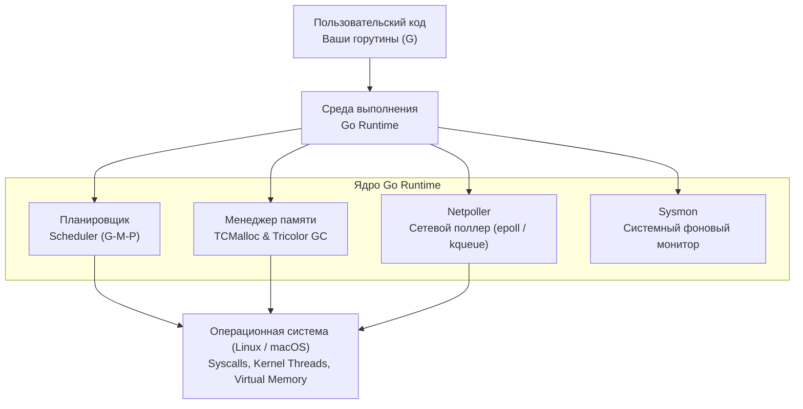

В предыдущей лекции [[7. Устройство бинарника Go]] мы препарировали скомпилированный исполняемый файл и обнаружили, что значительную его часть занимает машинный код, который прикладной разработчик никогда не писал вручную. Это и есть **Go Runtime** (среда выполнения языка Go).

Разработчики из мира Java или C# привыкли к тяжеловесным виртуальным машинам (JVM, CLR), которые интерпретируют байт-код, управляют потоками операционной системы и компилируют горячие участки на лету с помощью JIT. С противоположной стороны спектра инженеры на C или Rust привыкли к работе почти на чистом кремнии: там «рантайм» сводится к тонкой прослойке стандартной библиотеки (`libc`), а за аллокацию памяти, синхронизацию и системные потоки целиком отвечает сам программист или ядро ОС.

Язык Go выбрал уникальный, прагматичный **«Срединный путь»**. Компилятор Go генерирует честный, оптимизированный машинный код под конкретный процессор (AOT), но при этом в каждый исполняемый файл статически вшивается компактная и сверхэффективная «микро-операционная система в пространстве пользователя». Эта внутренняя система берет на себя наиболее трудоемкие инфраструктурные задачи: кооперативное и асинхронное планирование легковесных потоков, неблокирующий сетевой ввод-вывод и конкурентное управление памятью.

Разберем общую архитектуру рантайма Go и четыре его ключевых столпа, чтобы понимать, кому мы доверяем жизненный цикл наших высоконагруженных сервисов.

---

## Общая архитектура Runtime

Исходный код рантайма сосредоточен непосредственно в стандартной библиотеке (пакет `runtime`). Это сотни тысяч строк высокооптимизированного кода на Go и ассемблере. Если взглянуть на устройство рантайма с архитектурной высоты птичьего полета, мы увидим четыре базовые подсистемы, тесно интегрированные между собой и с ядром ОС:



Рассмотрим каждую из этих фундаментальных подсистем. На данном вводном этапе мы формируем системное понимание концепций, а в последующих лекциях блока детально разберем структуры данных и исходный код каждой из них.

---

## 1. Планировщик (Scheduler)

В классических серверных архитектурах (например, в PHP с Apache `prefork` или традиционных серверах Java до появления виртуальных потоков Project Loom) каждый клиентский запрос обрабатывался отдельным системным потоком ядра (**OS Thread**). Это модель конкурентности `1 к 1`.

Проблема заключается в физических ограничениях операционной системы. Поток ядра — тяжелый объект:
- Размер стека по умолчанию в Linux составляет от 1 до 8 МБ;
- Переключение контекста между потоками ядра (**Context Switch**) требует системного вызова, сброса конвейера CPU, очистки TLB и инвалидации кэшей данных L1–L3.

При попытке создать 10 000 – 50 000 одновременных потоков ядра сервер неизбежно гибнет от деградации памяти и накладных расходов на планирование в ядре Linux.

Планировщик Go решает эту проблему через модель мультиплексирования **`M к N`**: он распределяет миллионы легковесных пользовательских горутин (**M**) поверх небольшого фиксированного числа тяжелых потоков операционной системы (**N**).

В основе планировщика лежит знаменитая модель **G-M-P**:
* **G (Goroutine):** Легковесный поток в пространстве пользователя. Имеет собственный динамический стек, стартующий всего с **2 КБ**, регистры и состояние выполнения.
* **M (Machine):** Поток операционной системы (OS thread). Физическая рабочая лошадка, исполняющая инструкции на ядре CPU.
* **P (Processor):** Логический процессор (абстрактный контекст исполнения). Их количество жестко фиксируется переменной `GOMAXPROCS` (по умолчанию равно числу логических ядер процессора).

Именно структура `P` хранит локальную очередь готовых горутин (`G`) и распределяет их между потоками `M`, используя алгоритм кражи работы (**work stealing**). Благодаря этой модели Go способен одновременно удерживать миллионы активных соединений на стандартном сервере с 8–16 ГБ оперативной памяти.  
*(Детальный разбор: [[9. Scheduler Go. G, M, P и work stealing]])*

---

## 2. Менеджер памяти (Allocator + GC)

Если в C/C++ управление памятью, предотвращение фрагментации кучи и устранение утечек лежат на плечах разработчика, то в Go рантайм полностью автоматизирует жизненный цикл памяти через две спаренные системы:

### Аллокатор (TCMalloc-архитектура)
Аллокатор Go построен по принципам архитектуры **TCMalloc** (Thread-Caching Malloc), разработанной в Google. Его главная миссия — **аллоцировать память без использования глобальных блокировок (Mutex)** в высококонкурентной среде.

Для этого рантайм формирует многоуровневую пирамиду кэшей:
- `mcache` — локальный безакцептный кэш, привязанный к конкретному логическому процессору `P`;
- `mcentral` — централизованный репозиторий блоков фиксированных классов размеров (size classes);
- `mheap` — глобальная куча, запрашивающая виртуальные страницы памяти у ядра ОС.

Когда горутине требуется выделить объект в куче, она обращается к локальному `mcache` своего процессора `P` и мгновенно получает указатель за пару десятков тактов CPU без блокировок и без системных вызовов к ядру.  
*(Детальный разбор: [[21. Аллокатор памяти Go. mcache, mcentral, mheap]])*

### Сборщик мусора (Garbage Collector)
В Go реализован **Concurrent Mark and Sweep GC** (конкурентный сборщик на основе трехцветной разметки — Tricolor Abstraction).

В отличие от классических поколенческих GC в Java, ориентированных на пропускную способность (throughput) ценой многосекундных пауз Stop-The-World, сборщик Go бескомпромиссно оптимизирован под **минимальное время отклика (Low Latency)**. Сборка мусора выполняется параллельно с бизнес-кодом горутин, а паузы полной остановки мира (STW) в современном Go измеряются долями миллисекунды (обычно менее 100 микросекунд).  
*(Детальный разбор: [[24. Сборщик мусора Go. Общая архитектура]])*

---

## 3. Netpoller (Сетевой поллер)

Для системного сетевого программирования Netpoller — один из наиболее выдающихся компонентов платформы.

В коде на Go сетевой обмен выглядит абсолютно линейно и синхронно:

```go
data := make([]byte, 1024)
// Горутина логически блокируется здесь до прибытия данных по сети
n, err := conn.Read(data) 
```

Программисту кажется, что он вызвал стандартный блокирующий ввод-вывод. Однако если бы поток ядра ОС `M` действительно заблокировался в ожидании сетевого пакета, миллион параллельных соединений потребовал бы миллиона тяжелых потоков Linux, что вызвало бы моментальный крах системы.

### Mechanical Sympathy: Архитектура Netpoller
Рантайм незаметно для разработчика перехватывает вызов `conn.Read()` и выполняет низкоуровневую трансформацию:
1. Переводит системный сокет в неблокирующий режим (**non-blocking IO**, флаг `O_NONBLOCK`);
2. Регистрирует файловый дескриптор сокета в системном селекторе ядра операционной системы — `epoll` в Linux, `kqueue` в macOS/BSD или `IOCP` в Windows;
3. «Усыпляет» текущую горутину (`G`), переводит ее в статус ожидания ввода-вывода (`_Gwaiting`) и отвязывает от потока `M`;
4. Освободившийся поток ОС `M` немедленно берет следующую готовую горутину из очереди `P` и продолжает исполнять полезную работу.

Когда физический пакет поступает на сетевую карту и ядро ОС генерирует событие, сетевой поллер Go пробуждается, находит ассоциированную горутину, возвращает ее в статус готовности (`_Grunnable`) и помещает в очередь на исполнение.

Для инженера код остается предельно простым и императивным, а под капотом рантайм прозрачно разворачивает масштабируемый асинхронный event-driven цикл, распределенный по всем ядрам сервера.

---

## 4. Sysmon (Системный монитор)

**`sysmon`** (System Monitor) — это невидимый супервизор рантайма Go.

Это единственный поток в процессе, который функционирует **без привязки к логическому процессору (без P)**. Он порождается на отдельном выделенном потоке ядра операционной системы (`M`) еще во время ассемблерного бутстрапа и работает в непрерывном фоновом цикле с динамическим интервалом сна (от 20 микросекунд до 10 миллисекунд).

Обязанности `sysmon` имеют решающее значение для стабильности сервиса:
1. **Вытеснение зависших горутин (Preemption):** Если горутина непрерывно занимает процессор в плотном цикле `for` более **10 миллисекунд**, `sysmon` принудительно прерывает ее (посылая сигнал ядра `SIGURG` соответствующему потоку `M`), обеспечивая кооперативную справедливость шедулинга.
2. **Возврат страниц памяти ядру ОС (Scavenger):** Если после завершения циклов GC в куче `mheap` накапливается неиспользуемая память, `sysmon` постепенно сообщает ядру Linux через системный вызов `madvise(MADV_DONTNEED)`, что эти страницы физической RAM можно забрать, спасая приложение от системного OOM Killer.
3. **Отрыв процессоров при блокирующих системных вызовах:** Если горутина совершает настоящий блокирующий системный вызов (например, синхронная запись на диск через `fsync`), `sysmon` видит блокировку потока `M`, отрывает от него логический процессор `P` и передает его другому, свежему потоку ядра (`handoffp`), чтобы очередь задач не простаивала.

> [!tip] Собеседование: Что делает рантайм Go, а что нет?
> 
> **Вопрос:** Является ли Go Runtime полноценной виртуальной машиной по аналогии с Java Virtual Machine (JVM)?
> 
> **Ответ:** Категорически нет.  
> В отличие от JVM или CLR, рантайм Go:
> - **Не интерпретирует** байт-код;
> - **Не выполняет JIT-компиляцию** в оперативной памяти;
> - Весь код программы компилируется в нативные инструкции процессора заранее (AOT).
> 
> Рантайм Go — это, по сути, статически слинкованная библиотека (набор функций на Go и ассемблере), которая инициализируется перед вашей функцией `main` и прозрачно управляет ресурсами (память, сеть, потоки), перехватывая ваши вызовы.

> [!warning] Ловушка / Gotcha: Накладные расходы (Overhead) рантайма
> 
> Встроенная «микро-ОС» Go не бесплатна с инженерной точки зрения:
> 1. **Размер бинарника:** Наличие рантайма и стандартных пакетов обуславливает минимальный размер файла даже для программы `Hello World` около 1.5–2 МБ.
> 2. **Базовое потребление оперативной памяти:** Поддержание внутренних структур рантайма (стеки системных горутин, карты `mspan`, метаданные GC, очереди `runq`) требует от 10 до 20 МБ оперативной памяти сразу после запуска пустого процесса. Это ничтожно мало для серверного бэкенда, но делает Go неподходящим инструментом для жестких встраиваемых систем (микроконтроллеров с килобайтами RAM, где доминируют C, Rust или специализированный урезанный компилятор TinyGo).

---

## Итог

1. **Go Runtime** — это автономная среда исполнения, статически слинкованная с каждым исполняемым файлом, избавляющая программиста от ручного управления памятью, потоками и асинхронными коллбеками.
2. **Планировщик (Scheduler)** мультиплексирует миллионы горутин на ограниченный пул потоков ядра по модели `M к N`, используя абстракцию `P`.
3. **Менеджер памяти (Allocator + GC)** опирается на безакцептные локальные кэши TCMalloc и обеспечивает конкурентную сборку мусора с субмиллисекундными паузами STW.
4. **Netpoller** превращает блокирующий сетевой код в высокопроизводительный неблокирующий ввод-вывод через `epoll/kqueue`.
5. **Sysmon** — системный монитор, работающий без привязки к `P`, управляющий прерыванием горутин (preemption) и возвратом памяти ядру через `madvise`.

Получив панорамный обзор внутренних систем рантайма, мы готовы детально исследовать его самый прославленный механизм — шедулер Go.

В следующей лекции мы разберем: [[9. Scheduler Go. G, M, P и work stealing]].