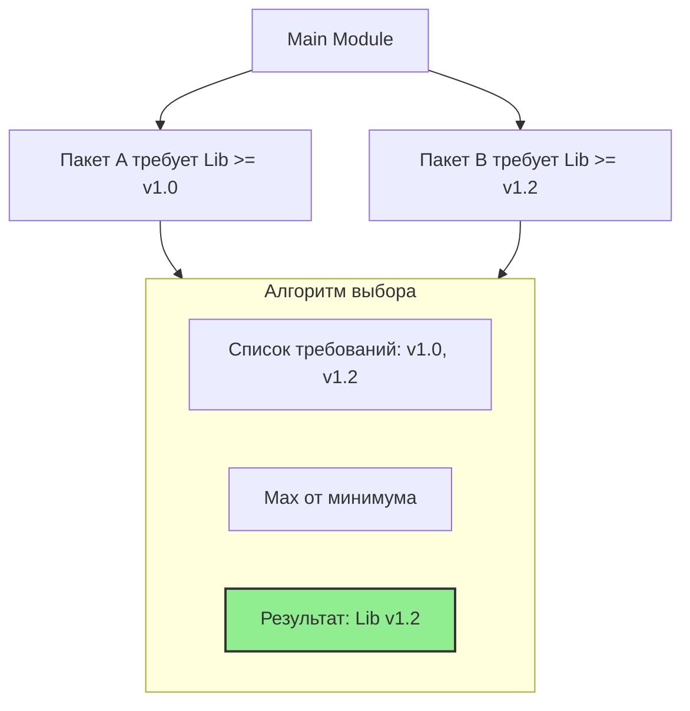

## Эра модулей: Прощай, GOPATH

До появления модулей (экспериментально в Go 1.11, официально и по умолчанию в 1.13) управление зависимостями в Go было самой острой и болезненной темой в сообществе. Все проекты в обязательном порядке должны были располагаться внутри одной глобальной директории `$GOPATH/src`. Хотите запустить два проекта, использующие разные несовместимые версии одной и той же библиотеки? Приходилось прибегать к ухищрениям: переписывать пути в `Vendor directories` или использовать внешние утилиты вроде `dep` и `glide`, которые были неуклюжими костылями над отсутствием нативной поддержки версионирования в компиляторе.

С приходом архитектуры **Go Modules** (спроектированной Рассом Коксом) каждый проект стал полностью изолированной, самодостаточной единицей. Модуль может располагаться в любой директории файловой системы (даже вне `$GOPATH`), он явно декларирует свои зависимости, минимальные версии и гарантирует бит-в-бит воспроизводимость сборки на любой машине мира.

---

## Файл `go.mod`: Манифест проекта

Файл `go.mod` — это сердце модуля. Он выполняет двойную роль: служит глобальным идентификатором проекта и строгим манифестом его прямых и транзитивных зависимостей.

```go
module github.com/myuser/myproject // Имя модуля (путь импорта)

go 1.22 // Версия Go, используемая для компиляции

require (
    github.com/gin-gonic/gin v1.9.1 // Прямая зависимость
    golang.org/x/text v0.14.0 // Прямая зависимость
)

require (
    github.com/some/indirect v1.0.0 // indirect // Транзитивная зависимость
)
```

### Ключевые поля:
1.  **`module`**: Определяет путь импорта корневого пакета. Все внутренние `import` внутри вашего проекта строятся строго относительно этого пути (например, `github.com/myuser/myproject/internal/service`).
2.  **`go`**: Указывает минимальную требуемую версию Go. Начиная с Go 1.21, директива `go` задает не просто информационную строчку, а включает строгую семантику совместимости рантайма и стандартной библиотеки (`GODEBUG`), а тулчейн при необходимости автоматически докачивает нужную версию компилятора (`GOTOOLCHAIN=auto`).
3.  **`require`**: Список зависимостей с точными версиями SemVer.
    *   Без пометки `// indirect` — прямые зависимости (пакеты, которые непосредственно импортируются в вашем `.go` коде).
    *   С пометкой `// indirect` — транзитивные зависимости (библиотеки, которые требуются вашим прямым зависимостям, либо модули, чьи собственные файлы `go.mod` еще не были обновлены до актуального стандарта).

> [!warning] Ловушка / Gotcha
> Если вы удалите строку `import` из исходного кода, зависимость не исчезнет из `go.mod` автоматически. Компилятор не удаляет зависимости на лету, чтобы не производить неявных мутаций файловой системы. Для приведения манифеста в порядок всегда используйте:
> ```bash
> go mod tidy
> ```
> Эта команда сверяет дерево исходников с графом зависимостей: скачивает недостающие пакеты, удаляет неиспользуемые и синхронизирует `go.mod` и `go.sum`.

---

## Файл `go.sum`: Криптографический реестр

Многие разработчики ошибочно считают `go.sum` аналогом файлов блокировок (`package-lock.json` в npm или `Cargo.lock` в Rust). Это концептуальное заблуждение.

`go.sum` — это **криптографический реестр контрольных сумм** (SHA-256) всех версий модулей, которые когда-либо загружались или участвовали в вычислении графа зависимостей проекта.

```text
github.com/gin-gonic/gin v1.9.1 h1:4idEAncQnU5cB7BeOkPtxjfCSye0AAm1O0RDIiNA18g=
github.com/gin-gonic/gin v1.9.1/go.mod h1:hPrL7YrpYksX/tHE9xW0A6c2nPpnI96LsKgCYW5flxQ=
```

Префикс `h1:` обозначает алгоритм Hash-1: SHA-256 хэш полного дерева файлов распакованного zip-архива модуля.

Зачем нужны две строки на каждый модуль?
1.  **Строка без `/go.mod`** — контрольная сумма полного архива с исходным кодом модуля.
2.  **Строка с `/go.mod`** — контрольная сумма только самого файла `go.mod` этой зависимости (позволяет валидировать граф версий еще до скачивания тяжелых архивов с кодом).

### Зачем это нужно? (Security)

Представьте, что мейнтейнер популярной библиотеки решил удалить тег `v1.2.3` на GitHub, переписать историю коммитов и заново запушить тег `v1.2.3` с вредоносным кодом (Supply Chain Attack). В экосистемах без жестких контрольных сумм (как это порой случалось при вызове `npm install`) повторный билд молча подтянет отравленный архив.

Go проверяет скачанный архив против контрольной суммы из `go.sum`. Если хэш не совпадает хотя бы на один бит, `go build` немедленно завершится с фатальной ошибкой безопасности. Более того, глобальная служба `sum.golang.org` (GOSUMDB) ведет публичный распределенный журнал прозрачности (Certificate Transparency log), исключая возможность подмены кода даже при компрометации локального прокси.

> [!info] Под капотом
> `go.sum` не является lockfile в традиционном понимании, потому что lockfile фиксирует единый снимок версий, а `go.sum` может хранить хэши нескольких версий одной библиотеки (например, если в разных ветках репозитория использовались разные версии). Он накапливает записи и очищается только при явном выполнении `go mod tidy`.

---

## Minimal Version Selection (MVS)

Алгоритм выбора версий в Go принципиально отличается от большинства пакетных менеджеров в IT-индустрии. Большинство менеджеров пакетов решают задачу NP-полноты через SAT-солверы, пытаясь жадно выбрать **максимально свежую** версию. Расс Кокс доказал, что такой подход ведет к хрупкости сборок и постоянным непреднамеренным поломкам.

Go использует алгоритм **Minimal Version Selection (MVS)**: он выбирает **минимальную достаточную версию**, удовлетворяющую всем декларированным требованиям графа.

Пример:
*   Пакет A требует `lib v1.0.0`.
*   Пакет B требует `lib v1.2.0`.
*   Система сборки выберет `lib v1.2.0` (минимальная версия, удовлетворяющая требованиям обоих пакетов). Даже если автор библиотеки уже выпустил версию `v1.9.0`, Go никогда не установит её автоматически.



> [!tip] Собеседование
> **Вопрос:** Почему Go использует Minimal Version Selection, а не "latest"?
> **Ответ:** Это делает сборку на 100% детерминированной, стабильной и воспроизводимой во времени. Если завтра сторонний автор опубликует `lib v1.9.0` с тонким багом, ваш CI не сломается, потому что проект останется на проверенной `v1.2.0`. Обновление версий происходит строго осознанно и явно по команде инженера (`go get -u`), следуя главному правилу Bell Labs: явное всегда лучше неявного.

---

## Команды работы с модулями

*   `go mod init`: Инициализирует новый модуль в текущем каталоге, создавая каркас `go.mod`.
*   `go mod tidy`: Главная команда гигиены проекта. Находит недостающие зависимости, скачивает их, удаляет неиспользуемые и обновляет контрольные суммы. Запускайте её перед каждым коммитом.
*   `go mod verify`: Проверяет локальные файлы в `$GOMODCACHE` на предмет совпадения с криптографическими суммами в `go.sum`, защищая от локальной модификации зависимостей на диске.
*   `go mod download`: Скачивает зависимости в кэш без сборки бинарников (ключевой паттерн для кэширования слоев в `Dockerfile`).
*   `go mod vendor`: Создает локальный каталог `vendor/` с физическими копиями исходного кода всех зависимостей. Применяется для сборки в закрытых (air-gapped) защищенных контурах без доступа к внешней сети.

---

## Итог

1.  **`go.mod`** — это декларативный манифест архитектуры проекта: кто мы и какие библиотеки нам требуются.
2.  **`go.sum`** — это криптографический журнал целостности: математическая гарантия защиты от атак на цепочку поставок.
3.  **MVS (Minimal Version Selection)** гарантирует стабильность и повторяемость сборок, исключая неожиданные сайд-эффекты от чужих обновлений.
4.  Оба файла — и `go.mod`, и `go.sum` — обязаны коммититься в систему контроля версий Git.

Теперь, когда мы понимаем структуру модулей, возникает вопрос: как правильно нумеровать версии, чтобы система MVS и Go понимали их корректно? В следующей статье мы углубимся в семантическое версионирование: [[13. Versioning. SemVer и совместимость.md]].