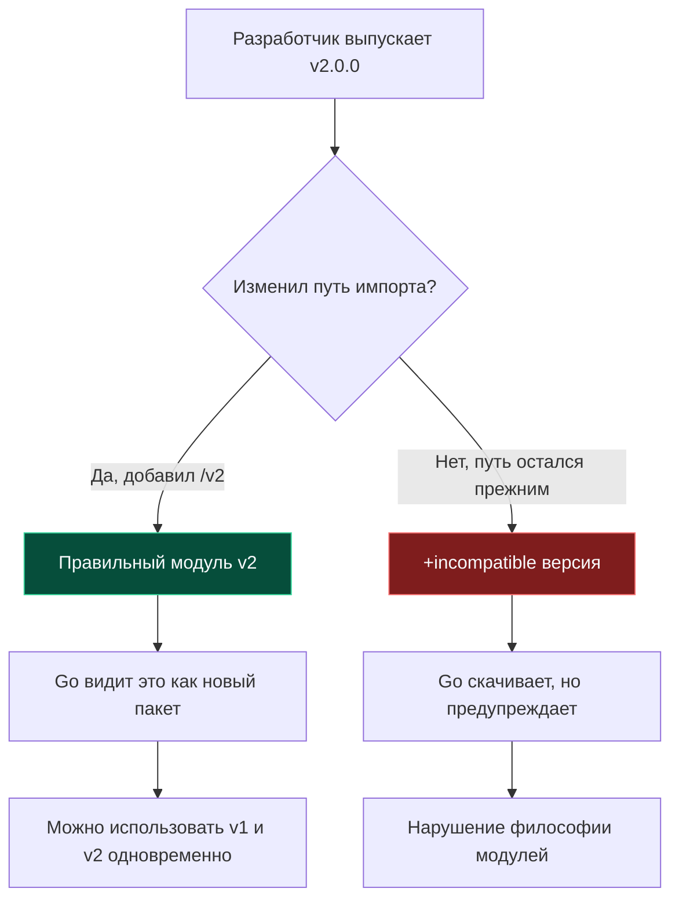

## SemVer в мире Go: Искусство не ломать совместимость

В компьютерных науках управление версиями всегда балансировало между стремлением к инновациям и паническим страхом все сломать. В Bell Labs мы старались проектировать интерфейсы настолько фундаментально, чтобы их не приходилось менять вовсе: системные вызовы `read`, `write` и `open` функционируют в точности так же, как и полвека назад. Но в прикладной разработке сторонние библиотеки непрерывно эволюционируют.

Система модулей Go опирается на **Semantic Versioning (SemVer)** — международный стандарт кодирования версий в формате `vMAJOR.MINOR.PATCH` (например, `v1.2.3`). Однако в отличие от большинства других языков, где SemVer остается лишь джентльменским соглашением разработчиков, Go возвел семантическое версионирование в ранг жестких математических правил самого компилятора.

---

## Семантика версий

Стандарт SemVer определяет три компонента версии:

1.  **PATCH (v1.2.3 -> v1.2.4)**: Исправление ошибок и дефектов реализации. Публичный API остается на 100% неизменным. Обратная совместимость гарантируется. Go без колебаний выбирает более свежий patch-релиз в рамках алгоритма MVS.
2.  **MINOR (v1.2.3 -> v1.3.0)**: Добавление новой функциональности без нарушения существующего контракта. Все старые функции продолжают работать с теми же аргументами. Обратная совместимость API гарантируется.
3.  **MAJOR (v1.x.x -> v2.0.0)**: Слом обратной совместимости: изменение сигнатур методов, удаление типов, переработка семантики. В Go это событие трактуется особенно строго.

---

## Правило "Major Version в Import Path"

В большинстве языков программирования вы можете обновить библиотеку с v1 до v2, просто изменив строчку с цифрой в конфигурационном файле. В Go это архитектурно невозможно, если только автор библиотеки не соблюдает **Import Versioning Principle**.

Расс Кокс сформулировал фундаментальный закон: *"Если пакет ломает обратную совместимость, это больше не тот же самый пакет. Это другой пакет с другим именем."*

**Правило:** Если major-версия модуля равна 2 или выше, она **обязана** присутствовать в пути импорта:

*   `github.com/user/lib` — это модуль v0 или v1.
*   `github.com/user/lib/v2` — это модуль v2.
*   `github.com/user/lib/v3` — это модуль v3.



Это правило решает классическую проблему **Diamond Dependency Problem** («алмазная зависимость»). Если библиотека A зависит от `lib/v1`, а библиотека B перешла на `lib/v2`, Go спокойно слинкует обе версии в один бинарник! Их символы не конфликтуют в таблице линкера, потому что для рантайма это два абсолютно разных пакета с разными путями импорта.

> [!warning] Ловушка / Gotcha
> Если вы используете библиотеку `github.com/foo/bar` версии v1.0.0, и автор выпускает v2.0.0, но **не меняет** путь импорта в `go.mod` на `github.com/foo/bar/v2`, то при попытке обновления Go добавит суффикс `+incompatible`:
> ```text
> require github.com/foo/bar v2.0.0+incompatible
> ```
> Это означает, что библиотека v2 не поддерживает Go Modules должным образом. Использовать такие зависимости не рекомендуется, так как Go не может гарантировать корректность графа зависимостей (вы можете случайно импортировать два пакета с одинаковым путем, но разным поведением).

---

## Версия v0: Зона хаоса

Версии, начинающиеся с `v0.x.x`, считаются нестабильными пре-релизами (*Initial Development*). Спецификация SemVer прямо освобождает их от любых гарантий совместимости.

*   Go разрешает любые ломающие изменения API между `v0.1.0` и `v0.2.0` без смены пути импорта.
*   Для публичных библиотек, предназначенных для широкого использования в сообществе, застревать на `v0` годами — антипаттерн. Как только API стабилизировался, выпускайте `v1.0.0`.
*   Для закрытых корпоративных монорепозиториев и внутренних микросервисов `v0` — вполне допустимая норма на ранних стадиях прототипирования.

---

## Pseudo-versions: Версии без тегов

Что происходит, когда вам нужно подключить зависимость из коммита, на который автор еще не повесил Git-тег (например, свежий фикс из ветки `main`)?

Go автоматически генерирует **Pseudo-version** — синтетический номер версии, вычисляемый из даты коммита и его хэша:

Формат: `vx.y.z-yyyymmddhhmmss-abcdefabcdef`.

Пример из `go.mod`:
```text
require github.com/user/lib v0.0.0-20231110153415-123456789abc
```

*   `v0.0.0` — базовая версия (означает, что тегов старше этого коммита нет).
*   `20231110153415` — точное время коммита в UTC (позволяет алгоритму сортировать псевдоверсии хронологически).
*   `123456789abc` — первые 12 символов хэша коммита Git.

> [!info] Под капотом
> При разрешении зависимостей алгоритм MVS (Minimal Version Selection) сравнивает эти строки лексикографически. Благодаря дате и хешу в строке, Go может однозначно определить, какой коммит "новее". Если вы хотите зафиксировать конкретное состояние репозитория без тегов, `go get` сам сгенерирует такую строку.

---

## `go.mod` и директива `go 1.22`

В начале `go.mod` есть строка `go 1.22`. Это не просто рекомендация. Начиная с Go 1.21, эта директива работает как **ограничение версии языка**.

*   Если ваш модуль требует `go 1.22`, а вы пытаетесь собрать его компилятором Go 1.21, сборка упадет с ошибкой (если только не включен флаг автоматического скачивания компилятора `GOTOOLCHAIN=auto`).
*   Это включает поведение языка. Например, изменения в семантике циклов (`for` loop semantics), произошедшие в Go 1.22, будут работать только если в `go.mod` указана эта версия. Если там указано `go 1.21`, компилятор сохранит старое поведение для обратной совместимости вашего кода.

> [!tip] Вопрос с собеседования: Алмазная зависимость (Diamond Dependency) в Go
> **Вопрос:** Как Go разрешает конфликт, если сервис зависит от пакета A (которому нужен `logger v1.5`) и пакета B (которому нужен `logger v2.1`)?
> **Ответ:** Благодаря правилу Major Version in Import Path, для компилятора Go `logger` и `logger/v2` — это два абсолютно разных пакета с уникальными путями импорта. Оба пакета будут успешно скомпилированы и слинкованы в итоговый бинарник, не конфликтуя друг с другом. В других языках (Java, Python) это привело бы к фатальному конфликту классов или случайной подмене версий. Если же обе зависимости запрашивают мажорную версию `v1` (например, `v1.2` и `v1.5`), алгоритм MVS выберет максимальную из них (`v1.5`), гарантируя совместимость по контракту SemVer.

---

## Итог

1.  **SemVer** — это фундамент управления зависимостями в Go, жестко контролируемый компилятором.
2.  **v2+** обязаны менять путь импорта (`/v2`), иначе они помечаются как `+incompatible`.
3.  **v0** не дает гарантий совместимости и допускает любые правки API.
4.  **Pseudo-versions** позволяют детерминированно фиксировать нетегированные коммиты, сохраняя 100% воспроизводимость сборки.
5.  Директива `go` в `go.mod` управляет поведением компилятора и семантикой языка.

Понимание версионирования критически важно, но что делать, если зависимость ведет себя неправильно, или нужно временно подменить её локальной версией? В следующей статье мы разберем инструменты "хирургического вмешательства" в граф зависимостей: [[14. Dependency management. replace, exclude.md]].