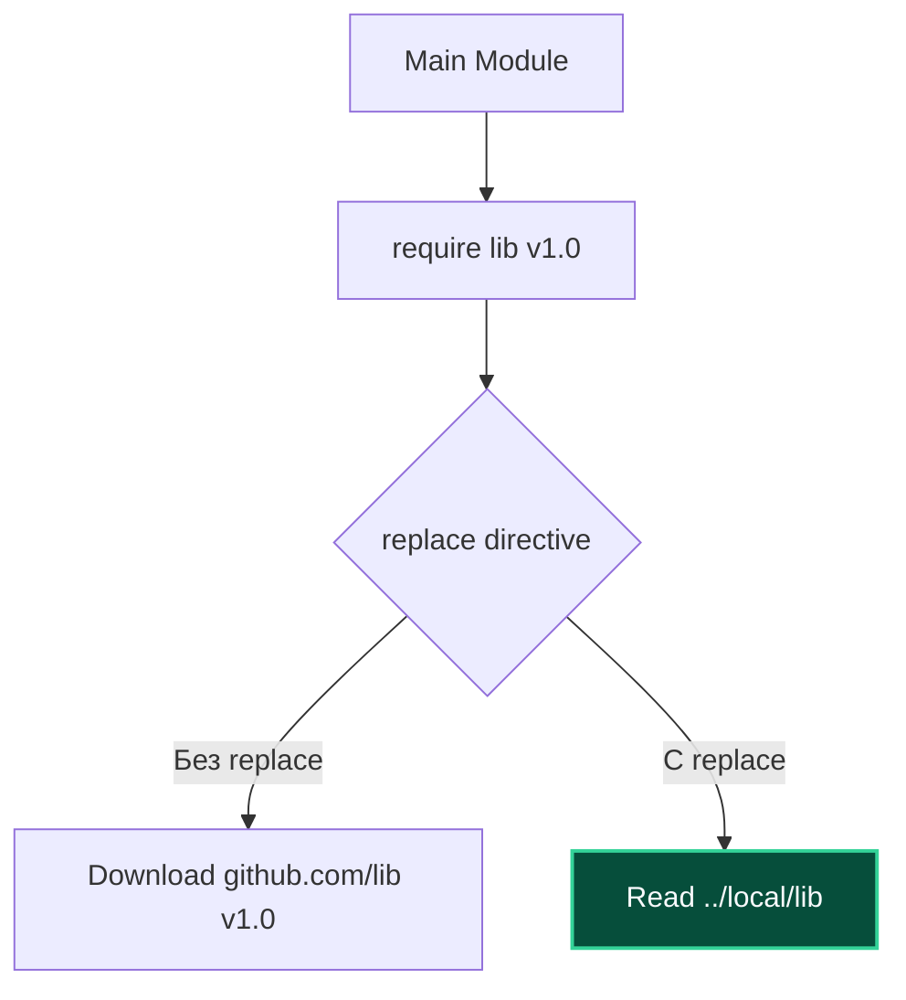

## Инструменты ручного управления графом зависимостей

В идеальном академическом мире команда `go mod tidy` всегда безупречно разрешает все зависимости, а авторы сторонних библиотек никогда не допускают багов и не ломают контракты. Но в реальном мире промышленной разработки закон Мёрфи работает безотказно: критическая уязвимость в чужой библиотеке обнаруживается в пятницу вечером перед релизом, мейнтейнер репозитория ушел в отпуск, а ваш продакшн-сервис обязан функционировать без сбоев.

Для таких ситуаций создатели Go предусмотрели инструменты точечного "хирургического вмешательства" в граф зависимостей. Директивы `replace` и `exclude` в файле `go.mod` позволяют инженеру временно или постоянно переопределить решения алгоритма MVS (Minimal Version Selection), перенаправить пути пакетов на собственные форки или исключить сбойные версии.

---

## Директива `replace`: Перенаправление

Директива `replace` заставляет Go подставить другой путь или версию вместо объявленной в блоке `require`. Это работает прозрачно на уровне дерева исходников: код затягивается из нового источника, но во всех файлах вашего проекта пути `import` остаются прежними, избавляя вас от необходимости массового рефакторинга.

### 1. Исправление бага в сторонней библиотеке (Forking)
Вы используете библиотеку `github.com/old/lib v1.2.3`, но в ней обнаружен критический race condition. Автор не принимает pull request, а ждать неделями вы не можете. Вы делаете форк репозитория в свой аккаунт, исправляете дефект и объявляете в `go.mod`:

```go
module myproject

go 1.22

require github.com/old/lib v1.2.3

// Перенаправляем на ваш форк на GitHub
replace github.com/old/lib => github.com/myname/lib v1.2.4-fix
```

### 2. Локальная разработка (Monorepo / WIP)
Вы разрабатываете два взаимосвязанных модуля одновременно: микросервис `api` и общую библиотеку `db`. Вы хотите проверить изменения в `db` локально, не пуша промежуточные коммиты в удаленный Git-репозиторий:

```go
// Указываем Go искать модуль в директории выше
replace github.com/myorg/db => ../db
```

Это заставляет Go читать исходный код прямо с диска, минуя сетевое скачивание и кэш `$GOMODCACHE`.



> [!warning] Ловушка / Gotcha
> **Никогда не коммитьте `replace` с локальными путями (`../`) в основную ветку.**
> В вашем CI-пайплайне и на машинах коллег каталога `../db` не существует по указанному относительному пути, и сборка с треском упадет. Локальный `replace` был историческим костылем. В современном Go (начиная с Go 1.18) для таких сценариев существует специализированный механизм **Workspaces (`go.work`)**, который мы подробно разберем в статье [[17. Workspaces. go work.md]].

---

## Директива `exclude`: Исключение версий

Директива `exclude` приказывает алгоритму MVS: "Сделай вид, что эта конкретная версия библиотеки не существует в природе". Это необходимо, если автор выпустил релиз с фатальной регрессией или критической уязвимостью CVE, но из-за правил SemVer алгоритм упорно пытается его выбрать.

```go
// Запрещаем использование сломанной версии
exclude github.com/broken/lib v1.5.0
```

Если ваш проект (или любая транзитивная зависимость) запрашивает `github.com/broken/lib v1.5.0`, Go исключит её из рассмотрения и выберет следующую подходящую версию (например, `v1.5.1` или откатится к совместимой `v1.4.0`).

### Сценарий использования
Представьте, что библиотека `A` требует `Lib >= v1.0`, а самая свежая версия — `v1.5.0`. Но в `v1.5.0` есть уязвимость. Вы можете:
1.  Поднять требование в `A` до `v1.5.1` (если она есть).
2.  Или запретить `v1.5.0` через `exclude`. Тогда MVS выберет `v1.4.0` (если она совместима) или `v1.5.1`.

---

## Директива `retract` (Современный подход)

В Go 1.16 появилась директива `retract` — это цивилизованный "белый флаг" от самих авторов библиотек. Если вы как разработчик пакета случайно выпустили битую сборку или скомпрометировали секреты, удалять тег в Git категорически нельзя (это сломает `go.sum` у тысяч пользователей). Вместо этого в следующий релиз добавляется блок `retract`:

```go
// В go.mod библиотеки
retract v1.5.0 // Серьезный баг, отзываем версию
```

Когда вы запускаете `go list -m -u` или `go get`, Go видит пометку `retract` и автоматически игнорирует такую версию, предупреждая вас. Это более здоровый способ борьбы с плохими релизами, чем `exclude` в вашем `go.mod`.

> [!info] Под капотом
> Директивы `replace` и `exclude` обрабатываются на этапе **построения графа модулей** (MVS build list). Это происходит до компиляции.
> *   `exclude` просто вычеркивает узел из списка кандидатов.
> *   `replace` подменяет узел: метаданные (путь, версия) заменяются, но интерфейс модуля (экспортируемые имена) должен остаться совместимым, иначе компилятор выдаст ошибку несовпадения типов.
> 
> **Критический архитектурный инвариант:** Директивы `replace` и `exclude` действуют **только в главном модуле (main module)** текущей сборки! Если вы разрабатываете библиотеку и пропишете `replace` в её `go.mod`, Go проигнорирует его, как только ваша библиотека будет импортирована сторонним сервисом. Это защищает глобальный граф зависимостей от хаоса неконтролируемых переопределений.

---

## Практика и безопасность

Использование `replace` для подмены зависимостей (особенно системных или криптографических) — это всегда повышенный риск. Вы берете на себя полную ответственность за код, который исполняется в вашем приложении.

В продакшене `replace` часто используется для:
1.  **Vendoring**: Когда код зависимостей копируется в проект (редко сейчас).
2.  **Private proxies**: Перенаправление на внутренний прокси для частных библиотек (хотя это лучше делается через `.netrc` или `GOPRIVATE`).

> [!tip] Вопрос с собеседования: Почему `replace` в зависимостях игнорируется?
> **Вопрос:** Почему компилятор Go игнорирует директивы `replace` и `exclude` в файлах `go.mod` сторонних библиотек, которые вы подключаете через `require`?
> **Ответ:** Это фундаментальный принцип изоляции и суверенитета главного модуля. Если бы библиотеки могли переопределять чужие зависимости через `replace`, возник бы неразрешимый хаос: библиотека A перенаправила бы пакет `log` на свой форк, а библиотека B — на другой. Конечный разработчик потерял бы контроль над собственным бинарником. Поэтому только корневой модуль (`main module`), собирающий приложение, обладает эксклюзивным правом решать, какие пакеты заменять, а какие исключать.

---

## Итог

1.  **`replace`** — мощный инструмент для форков и локальной разработки, но опасен в продакшене из-за путей файловой системы.
2.  **`exclude`** — способ запретить использование конкретной версии зависимости.
3.  **`retract`** — механизм для авторов библиотек, позволяющий "отозвать" сломанную версию.
4.  Используйте эти инструменты как временные меры, пока не будет обновлена зависимость или исправлен апстрим.

Мы научились управлять версиями и форками. Но что делать, если ваша компания использует приватные репозитории, и вы не хотите "светить" их в публичные прокси? В следующей статье мы разберем настройку доступа к приватным модулям: [[15. Private modules и proxy.md]].